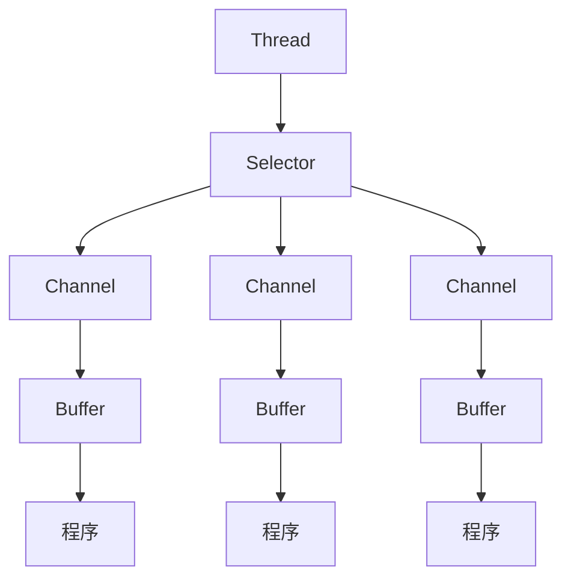
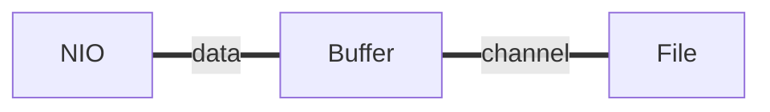
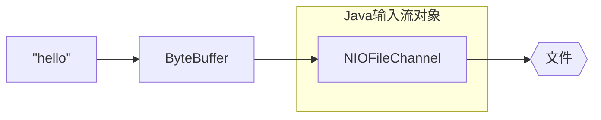
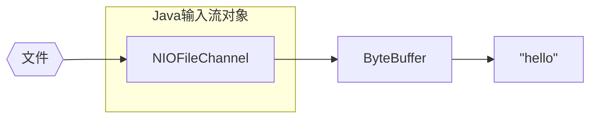
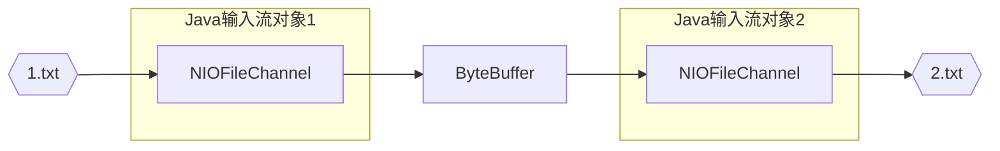
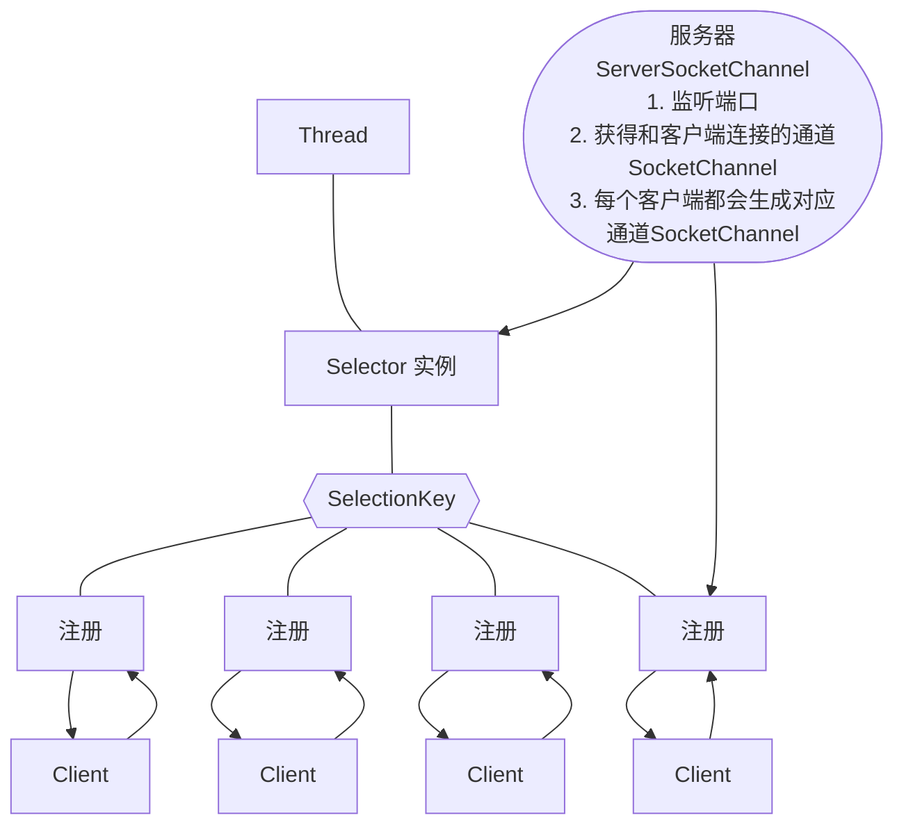

[toc]

# NIO

> 课程链接：<https://www.bilibili.com/video/BV1DJ411m7NR>

## 基本介绍

### 三大核心

- Selector
- Channel
- Buffer

### 关系图



### 关系描述

1. 每个 Channel 都对应一个 Buffer
2. Selector 对应一个线程，一个线程对应多个 Channel(连接)
3. 该图反应了有 3 个 Channel 注册到了该 Selector
4. 程序切换到哪个 Channel，是由事件决定的，Event 是一个很重要的概念
5. Selector 会根据不同的事件，在各个通道上切换
6. Buffer 就是一个内存块，底层是一个数组
7. 数据的读取和写入是通过 Buffer，与 BIO 不同，BIO 是直接用流，BIO 要么是输入流，要么是输出流，不能双向。NIO 是可读可写的，但需要 `filp` 方法进行切换
8. Channel 是双向的，可以反应底层操作系统的情况。Linux 底层 OS 的通道就是双向的。 

## 缓冲区 Buffer

### 基本介绍

本质上是一个可以读写数据的内存块，可以理解为一个==容器对象==，提供了一组方法，可以更轻松地使用内存块，内置了一些机制，能够跟踪和记录缓冲区的状态变化情况。Channel 提供从网络、文件读取数据的渠道，但读写的数据必须经由 Buffer。



### Buffer 类及其子类

#### Buffer 类的属性

4 个属性提供关于其包含的数据元素的信息

| 属性     | 描述                                         |
| -------- | -------------------------------------------- |
| capacity | 容量                                         |
| limit    | 缓冲区当前终点，不能对超过极限的数据进行操作 | 
| position | 位置，下一个要被读写的数据的索引             |
| mark     | 标记                                         |

#### 子类

> 没有 Boolean 类型的 Buffer

- ByteBuffer
- IntBuffer
- FloatBuffer
- DoubleBuffer
- ......

### Buffer 操作

```java
package com.example.chatnetty.nio;
import java.nio.IntBuffer;

public class BasicBuffer {
    // 举例说明 buffer 的使用
    public static void main(String[] args) {
        // 创建 buffer，可以放 5 个 int 类型的数据
        IntBuffer intBuffer = IntBuffer.allocate(5);

        // 向 buffer 中存放数据
        for (int i = 0; i < intBuffer.capacity(); i++) {
            intBuffer.put(i);
        }

        // 从 buffer 中取出数据
        // 将 buffer 进行读写切换
        intBuffer.flip();
        while (intBuffer.hasRemaining()) {
            System.out.println(intBuffer.get());
        }
    }
}
```
## Channel 通道

### 基本介绍

-  类似于流，但有所区别
    - 通道可以同时进行读写，流只能“半双工”
    - 通道可以实现异步读写数据
    - 通道可以从缓冲区读数据，也可以写数据到缓冲

- BIO 是单向的，只能进行读取操作
- Channel 在 NIO 中是一个接口 
- 常用的 Channel 的实现
    - FileChannel 用于文件的读写
    - DatagramChannel 用于 UDP 数据读写
    - ServerSocketChannel, SocketChannel 用于 TCP 数据读写

### 样例

#### 文件通道

写入



```java
package com.example.chatnetty.nio;

import java.io.FileOutputStream;
import java.io.IOException;
import java.nio.ByteBuffer;
import java.nio.channels.FileChannel;

public class NIOFileChannel01 {
    public static void main(String[] args) throws IOException {
        String hello = "hello";

        // 创建一个文件输出流
        FileOutputStream fos = new FileOutputStream("01.txt");

        // 通过 fos 获取对应的 FileChannel
        // 其真实类型为 FileChannelImpl
        FileChannel channel = fos.getChannel();

        // 创建一个缓冲区 ByteBuffer
        ByteBuffer byteBuffer = ByteBuffer.allocate(1024);

        // 将 hello 写入缓冲区
        byteBuffer.put(hello.getBytes());

        // 对 buffer 进行 flip 操作
        byteBuffer.flip();

        // 将 buffer 中的数据写入到 channel 中
        channel.write(byteBuffer);

        // 关闭 channel
        channel.close();

        // 关闭 fos
        fos.close();
    }
}
```

读取



```java
package com.example.chatnetty.nio;  
  
import java.io.File;  
import java.io.FileInputStream;  
import java.io.FileNotFoundException;  
import java.io.IOException;  
import java.nio.ByteBuffer;  
import java.nio.channels.FileChannel;  
  
public class NIOFileChannel02 {  
    public static void main(String[] args) throws IOException {  
        // 创建文件输入流  
 File file = new File("01.txt");  
        FileInputStream fis = new FileInputStream(file);  
  
        // 通过 fis 获取 FileChannel FileChannel channel = fis.getChannel();  
  
        // 创建字节缓冲区  
 ByteBuffer byteBuffer = ByteBuffer.allocate((int) file.length());  
  
        // 将通道的数据读取到缓冲区  
 channel.read(byteBuffer);  
  
        // 将缓冲区的数据转换为字符串  
 String str = new String(byteBuffer.array());  
        System.out.println(str);  
  
        // 关闭通道  
 channel.close();  
  
        // 关闭文件输入流  
 fis.close();  
    }  
}
```

拷贝



```java
package com.example.chatnetty.nio;

import java.io.FileInputStream;
import java.io.FileNotFoundException;
import java.io.FileOutputStream;
import java.io.IOException;
import java.nio.ByteBuffer;
import java.nio.channels.FileChannel;

public class NIOFileChannel03 {
    public static void main(String[] args) throws IOException {
        // 创建一个文件输入流
        FileInputStream fis = new FileInputStream("01.txt");
        FileChannel channel01 = fis.getChannel();

        // 创建一个文件输出流
        FileOutputStream fos = new FileOutputStream("02.txt");
        FileChannel channel02 = fos.getChannel();

        // 创建一个字节缓冲
        ByteBuffer buffer = ByteBuffer.allocate(1024);

        while (true) {
            // 清空缓冲区
            buffer.clear();
            // 将文件内容读取到缓冲中
            int read = channel01.read(buffer);
            if (read == -1) {
                break;
            }
            // 将缓冲中的数据写入到文件中
            buffer.flip();
            channel02.write(buffer);
        }

        // 关闭资源
        channel01.close();
        channel02.close();
        fis.close();
        fos.close();
    }
}
```

```java
package com.example.chatnetty.nio;

import java.io.*;
import java.nio.channels.FileChannel;

public class NIOFileChannel04 {
    public static void main(String[] args) throws IOException {
        // 创建文件流
        FileInputStream fis = new FileInputStream("01.txt");
        FileOutputStream fos = new FileOutputStream("03.txt");

        // 获取各个流对应的 channel
        FileChannel fc01 = fis.getChannel();
        FileChannel fc02 = fos.getChannel();

        // 使用 TransformFrom 拷贝
        fc02.transferFrom(fc01, 0, fc01.size());

        // 关闭流
        fc01.close();
        fc02.close();
        fis.close();
        fos.close();
    }
}

```

#### 注意事项和细节

- ByteBuffer 支持类型化的 put 和 get，放入什么类型，就需要以什么类型取出，否则有可能发生异常，或者数据出现错误
- 可以将一个普通 Buffer 转为只读 Buffer
- NIO 提供 MappedByteBuffer，可以让文件直接在内存中进行修改，而如何同步到文件由 NIO 完成
- NIO 还支持通过多个 Buffer 完成读写操作
    - Scattering 将数据写入到 buffer 时，可以采用 buffer 数组，依次写入（分散）
    - Gathering 将数据从 buffer 读取时，可以采用 buffer 数组，依次读取

```java
package com.example.chatnetty.nio;

import java.io.IOException;
import java.net.InetSocketAddress;
import java.nio.ByteBuffer;
import java.nio.channels.ServerSocketChannel;
import java.nio.channels.SocketChannel;
import java.util.Arrays;

public class ScatteringAndGatheringTest {
    public static void main(String[] args) throws IOException {
        // 使用 ServerSocketChannel 和 SocketChannel
        ServerSocketChannel serverSocketChannel = ServerSocketChannel.open();

        // 创建 SocketAddress
        InetSocketAddress inetSocketAddress = new InetSocketAddress(7777);

        // 绑定端口到 socket，并启动
        serverSocketChannel.socket().bind(inetSocketAddress);

        // 创建 buffer 数组
        ByteBuffer[] byteBuffers = new ByteBuffer[2];
        byteBuffers[0] = ByteBuffer.allocate(5);
        byteBuffers[1] = ByteBuffer.allocate(3);

        // 等待客户端连接
        SocketChannel socketChannel = serverSocketChannel.accept();

        int messageLength = 8;
        // 循环读入数据
        while (true) {
            // 清空所有 buffer
            for (ByteBuffer byteBuffer : byteBuffers) {
                byteBuffer.clear();
            }

            int byteRead = 0;
            while (byteRead < messageLength) {
                long l = socketChannel.read(byteBuffers);
                byteRead += l;  // 累计已读取的字节数
                System.out.println("byteRead = " + byteRead);
                // 使用流打印，查看当前这个 buffer 的 position 和 limit
                Arrays.stream(byteBuffers).map(buffer -> "position = "
                                + buffer.position() + " limit = " + buffer.limit())
                        .forEach(System.out::println);
            }
            // 将所有的 buffer 进行 flip
            Arrays.asList(byteBuffers).forEach(ByteBuffer::flip);

            // 将数据读出显示到客户端
            long byteWrite = 0;
            while (byteWrite < messageLength) {
                long l = socketChannel.write(byteBuffers);
                byteWrite += l;
                System.out.println("byteWrite = " + byteWrite);
            }
            // 将所有的 buffer 进行 clear
            Arrays.asList(byteBuffers).forEach(ByteBuffer::clear);
            System.out.println("byteRead = " + byteRead + " byteWrite = " + byteWrite +
                    " messageLength = " + messageLength);
        }
    }
}
```

## NIO 传统模式编程

### 阻塞模式

在没有数据可读时，包括数据复制过程中，线程必须阻塞，不会占用 CPU，但线程相当于闲置。此处服务器有两处会造成阻塞。

```java
public class Server {
    public static void main(String[] args) {

        ByteBuffer buffer = ByteBuffer.allocate(64);

        // 1、创建服务器  
        ServerSocketChannel serverSocketChannel = ServerSocketChannel.open();

        // 2、绑定端口
        serverSocketChannel.bind(new java.net.InetSocketAddress(8080));

        // 3、连接集合
        List<SocketChannel> socketChannels = new ArrayList<>();

        while (true) {
            // 4、建立客户端连接，SocketChannel 用来与客户端连接
            // accept 默认是阻塞的，阻塞意味着线程暂停运行
            log.debug("connecting...");
            SocketChannel socketChannel = serverSocketChannel.accept();  // 😴
            log.debug("connected");
            socketChannels.add(socketChannel);
  
            // 5、接收客户端发送的数据  
            for (SocketChannel sc : socketChannels) {
                sc.read(buffer);   // 😴
                buffer.flip();
                System.out.println(new String(buffer.array()));  
                buffer.clear();
            }
        }
    }
}
```

### 非阻塞模式

- 在某个 Channel 没有可读事件时，线程不必阻塞，它可以去处理其他有可读事件的 Channel
- 数据复制过程中，线程实际还是阻塞的

注意：这种非阻塞方式容易导致线程空转，CPU 利用率一直很高，因此几乎不怎么用

```java
package com.example.netty.nio;

import java.io.IOException;
import java.nio.ByteBuffer;
import java.nio.channels.ServerSocketChannel;
import java.nio.channels.SocketChannel;
import java.util.ArrayList;
import java.util.List;

public class Server {
    public static void main(String[] args) throws IOException {
        // 使用 nio 来理解阻塞模式，单线程处理
        ByteBuffer buffer = ByteBuffer.allocate(16);

        // 1、创建服务器
        ServerSocketChannel serverSocketChannel = ServerSocketChannel.open();

        // 设置非阻塞模式
        serverSocketChannel.configureBlocking(false);  // '1

        // 2、绑定端口
        serverSocketChannel.bind(new java.net.InetSocketAddress(8080));

        // 3、连接集合
        List<SocketChannel> socketChannels = new ArrayList<>();
        while (true) {
            // 4、建立客户端连接，SocketChannel 用来与客户端连接
            // accept 默认是阻塞的，阻塞意味着线程暂停运行
            SocketChannel socketChannel = serverSocketChannel.accept();  
            // 在添加"非阻塞 '1"配置后，accept 成为非阻塞，线程还会继续运行
            // 但是如果没有建立连接，那么 accept 会返回 null
            // 然而这种非阻塞状态会导致这个线程空转，因此需要判断连接是否为空
            if (socketChannel != null) {
                System.out.println("有客户端连接");
                socketChannel.configureBlocking(false);  // 设置为非阻塞 '2
                socketChannels.add(socketChannel);
            }
            // 5、接收客户端发送的数据
            for (SocketChannel sc : socketChannels) {
                int read = sc.read(buffer);// read 默认是阻塞的，阻塞意味着线程暂停运行
                // 由于 '2，设置为非阻塞'，read 成为非阻塞，线程还会继续运行
                if (read > 0) {
                    // 切换为读模式
                    buffer.flip();
                    System.out.println(new String(buffer.array()));
                    // 切换为写模式
                    buffer.clear();
                }
            }
        }
    }
}
```

## Selector 选择器

### 基本介绍

- 用非阻塞的 IO 方式，可以使用一个线程，处理多个客户端连接
- Selector 能够检测多个注册的通道上是否有事件发生（多个 Channel 以事件的方式可以注册到同一个 Selector），如果由事件发生，便获取事件然后针对每个事件进行相应处理
- 只有在连接真正由读写时间发生时，才会进行读写，大大减少了系统的开销，并且不必为每个连接都创建一个线程，不用维护多个线程
- 避免了多线程之间的上下文切换导致的开销

### 注意事项

- NIO 中的 ServerSocketChannel 功能类似 ServerSocket，SocketChanel 功能类似 Socket
- Selector 相关方法
    - open() 得到一个选择器对象
    - select() 阻塞
    - int select(Long timeout) 阻塞一点时间，在超时后返回，对应 SelectionKey 加入到内部集合中并返回
    - Set\<SelectionKey\> selectedKeys() 从内部稽核中得到所有的 SelectionKey
    - wakeup() 唤醒
    - selectNow() 不阻塞，立刻返回

### 分析图



1. 当客户端连接时，会通过 ServerSocketChannel 得到 SocketChannel
2. 将 SocketChannel 注册到 Selector 上，`register(Selector sel, int ops)`，一个 Selector 上可以注册多个 SocketChannel
3. 注册后返回 SelectionKey，会和该 Selector 关联（集合）
4. Selector 进行监听，`select` 方法返回有事件发生的通道的个数
5. 进而得到各个有事件发生的 SelectionKey
6. 再通过 SelectionKey 反向获取 SocketChannel，方法 `channel()`
7. 通过得到的 channel，完成业务处理

### 代码实例

#### 服务器端（读客户端）

```java
package com.example.netty.nioselector;

import com.example.netty.bytebuffer.TestByteBufferExam;

import java.io.IOException;
import java.nio.ByteBuffer;
import java.nio.channels.*;
import java.util.Iterator;

public class Server {
    public static void main(String[] args) throws IOException {
        // 1. 创建 Selector，管理各个 channel
        Selector selector = Selector.open();

        ServerSocketChannel serverSocketChannel = ServerSocketChannel.open();
        serverSocketChannel.configureBlocking(false);

        // 2. 建立 channel 与 selector 的关联（注册），返回 SelectionKey，即为事件发生时，通过它可以知道是哪个 channel 发生的事件
        SelectionKey sscKey = serverSocketChannel.register(selector, 0, null);
        // key 只关注 accept 事件
        sscKey.interestOps(SelectionKey.OP_ACCEPT);

        // 3. 绑定端口
        serverSocketChannel.bind(new java.net.InetSocketAddress(8080));
        while (true) {
            // 4. 当有事件发生时，调用 selector.select()，返回已经就绪的 key 数量
            // 没有事件发生时，线程是阻塞的，不会造成 CPU 资源浪费；有事件时，线程会恢复运行
            // select 在事件未处理时，不会阻塞，事件发生后要么处理，要么取消，不能置之不理
            selector.select();

            // 5. 处理事件，获取到所有「可用的」key，即所有发生的事件，返回的是一个集合
            // 此处的事件包含所有的事件类型，因此需要在循环中进行区分
            Iterator<SelectionKey> keyIterator = selector.selectedKeys().iterator();  
            // 针对集合的遍历，需要使用「迭代器」遍历，而不是「增强遍历器」
            while (keyIterator.hasNext()) {
                SelectionKey key = keyIterator.next();
                System.out.println("Event: " + key);

                // 删除已经处理过的 key，否则仍然会在集合中处理
                // 而如果 channel 已经建立起来，则不会再次触发 accept 事件
                // 因此 sc 会是一个 null 值，因为 sc 在上一步已经被 accept 了
                keyIterator.remove();

                // 6. 区分事件类型
                if (key.isAcceptable()) {
                    // 7. 获取到「连接」的 channel
                    ServerSocketChannel channel = (ServerSocketChannel) key.channel();
                    SocketChannel sc = channel.accept();
                    sc.configureBlocking(false);
                    ByteBuffer buffer = ByteBuffer.allocate(16);  // attachment
                    // 将 sc 绑定到 selector 上，设置为读事件，并且将 buffer 作为附件关联到 scKey 上
                    SelectionKey scKey = sc.register(selector, SelectionKey.OP_READ, buffer);
                    scKey.interestOps(SelectionKey.OP_READ);  // 注册「读」事件
                    System.out.println("Accepted: " + sc);
                } else if (key.isReadable()) {
                    // 8. 获取到「读」的 channel
                    try {
                        // 拿到触发事件的 channel
                        SocketChannel channel = (SocketChannel) key.channel();  
                        // 获取附件，即 ByteBuffer
                        ByteBuffer buffer = (ByteBuffer) key.attachment();
                        int read = channel.read(buffer);
                        if (read != -1) {
                            TestByteBufferExam.split(buffer);  // 按照预定的方式进行切分
                            // 针对缓冲区空间不足的改进，当缓冲区满的时候，会出现以下的情况
                            if (buffer.position() == buffer.limit()) {
                                // 创建一个新的 buffer，大小为原来 buffer 的两倍
                                ByteBuffer newBuffer = ByteBuffer.allocate(buffer.capacity() * 2);
                                // 将原来的 buffer 的数据拷贝到新的 buffer 中
                                buffer.flip();
                                newBuffer.put(buffer);
                                // 重新关联新的 buffer
                                key.attach(newBuffer);
                                // 如果下次缓冲区依然不够，会继续扩容
                            }
                        } else {  // 异常或断开连接
                            key.cancel();
                        }
                    } catch (IOException e) {
                        // 客户端关闭时会触发一次 read 事件
                        /**
                         * 注意：mac 中这里不会抛出异常，read 能够正常运行，但是 read 后的结果是 -1
                         * 可以获取 read 的值，判断是否为 -1，如果是 -1，则说明客户端关闭了连接
                         * 此时应该关闭 channel，并且从集合中删除 key
                         *
                         * 同时，正常断开的 read 返回值也是 -1，此时应该关闭 channel，并且从集合中删除 key
                         */
                        e.printStackTrace();
                        key.cancel();  // 客户端断开，需要将 key 注销（从 selectedKeys 中真正删除）
                    }
                }
                // 如果不对事件进行处理，需要使用 cancel 方法取消事件
                // key.cancel();
            }
        }
    }
}
```

#### 服务器（写客户端）


#### 客户端

```java
package com.example.netty.nio;

import java.io.IOException;
import java.nio.channels.SocketChannel;

public class Client {
    public static void main(String[] args) throws IOException {
        SocketChannel socketChannel = SocketChannel.open();
        socketChannel.connect(new java.net.InetSocketAddress("localhost", 8080));
        System.out.println("客户端启动成功，等待中……");
        socketChannel.close();  // 此处可 debug
    }
}
```

## NIO 样例：聊天室

### 服务端

```java
package com.example.chatnetty.nio.groupchat;

import java.nio.ByteBuffer;
import java.nio.channels.*;
import java.util.Iterator;

public class GroupChatServer {
    // 定义属性
    private Selector selector;
    private ServerSocketChannel listenChannel;
    private static final int PORT = 6667;

    // 构造方法，初始化工作
    public GroupChatServer() {
        try {
            // 创建选择器
            selector = Selector.open();
            // 创建监听通道
            listenChannel = ServerSocketChannel.open();
            // 绑定端口
            listenChannel.socket().bind(new java.net.InetSocketAddress(PORT));
            // 设置为非阻塞模式
            listenChannel.configureBlocking(false);
            // 注册监听通道到选择器
            listenChannel.register(selector, SelectionKey.OP_ACCEPT);
        } catch (Exception e) {
            e.printStackTrace();
        }
    }

    // 监听
    public void listen() {
        try {
            // 循环处理
            while (true) {
                // 获取选择器中的事件
                int selectNum = selector.select();
                if (selectNum > 0) {
                    // 有事件处理，遍历得到的 selectionKey
                    Iterator<SelectionKey> keyIterator = selector.selectedKeys().iterator();
                    while (keyIterator.hasNext()) {
                        // 取出一个selectionKey
                        SelectionKey key = keyIterator.next();
                        // 监听到 accept 事件
                        if (key.isAcceptable()) {
                            // 获取到监听通道
                            SocketChannel socketChannel = listenChannel.accept();
                            // 设置为非阻塞模式
                            socketChannel.configureBlocking(false);
                            // 将 socketChannel 注册到 selector 中
                            socketChannel.register(selector, SelectionKey.OP_READ);
                            // 给出提示
                            System.out.println("客户端连接：" + socketChannel.getRemoteAddress());
                        }
                        if (key.isReadable()) {
                            // 通道发生 READ 事件，即通道是可读的状态
                            // 处理读操作
                            readData(key);
                        }
                        // 当前 key 删除
                        keyIterator.remove();
                    }
                } else {
                    System.out.println("等待...");
                }
            }
        } catch (Exception e) {
            e.printStackTrace();
        }
    }

    // 读取客户端消息
    private void readData(SelectionKey key) {
        // 定义一个 SocketChannel
        SocketChannel channel = null;
        try {
            // 取到关联的 SocketChannel
            channel = (SocketChannel) key.channel();
            // 创建 ByteBuffer
            ByteBuffer buffer = ByteBuffer.allocate(1024);
            // 读取数据
            int readNum = channel.read(buffer);
            if (readNum > 0) {
                // 读取到数据，转换为字符串
                String msg = new String(buffer.array(), 0, readNum);
                System.out.println("收到消息：" + msg);
                // 向其他客户端转发消息（去掉自己）
                sendMsg(msg, channel);
            }
        } catch (Exception e) {
            try {
                assert channel != null;
                System.out.println(channel.getRemoteAddress() + "断开连接");
                // 取消注册
                key.cancel();
                // 关闭通道
                channel.close();
            } catch (Exception e1) {
                e1.printStackTrace();
            }
        }
    }

    // 转发消息给其他通道
    private void sendMsg(String msg, SocketChannel selfChannel) {
        // 服务器转发消息给其他客户端
        try {
            // 循环遍历通道，发送消息
            for (SelectionKey key : selector.keys()) {
                // 取出关联的通道
                Channel channel = key.channel();
                // 如果不是自己，发送消息
                if (channel instanceof SocketChannel && channel != selfChannel) {
                    SocketChannel socketChannel = (SocketChannel) channel;
                    // 创建 ByteBuffer
                    ByteBuffer buffer = ByteBuffer.wrap(msg.getBytes());
                    // 发送消息
                    socketChannel.write(buffer);
                }
            }
        } catch (Exception e) {
            e.printStackTrace();
        }
    }

    public static void main(String[] args) {
        // 创建服务器对象
        GroupChatServer groupChatServer = new GroupChatServer();
        groupChatServer.listen();
    }
}
```

### 客户端

```java
package com.example.chatnetty.nio.groupchat;

import java.io.IOException;
import java.nio.ByteBuffer;
import java.nio.channels.SelectableChannel;
import java.nio.channels.SelectionKey;
import java.nio.channels.Selector;
import java.nio.channels.SocketChannel;
import java.util.Iterator;
import java.util.Scanner;

public class GroupChatClient {
    private final String HOST = "127.0.0.1";
    private final int PORT = 6667;
    private Selector selector;
    private SocketChannel socketChannel;
    private String username;

    public static void main(String[] args) {
        // 启动客户端
        GroupChatClient client = new GroupChatClient();
        // 启动一个线程
        new Thread(() -> {
            while (true) {
                client.readMsg();
                try {
                    Thread.currentThread().sleep(3000);
                } catch (InterruptedException e) {
                    e.printStackTrace();
                }
            }
        }).start();
        // 发送数据给服务端
        Scanner scanner = new Scanner(System.in);
        while (scanner.hasNextLine()) {
            String s = scanner.nextLine();
            client.sendMsg(s);
        }
    }

    // 构造器
    public GroupChatClient() {
        try {
            selector = Selector.open();
            // 连接服务器
            socketChannel = SocketChannel.open(new java.net.InetSocketAddress(HOST, PORT));
            // 设置为非阻塞
            socketChannel.configureBlocking(false);
            // 注册到selector
            socketChannel.register(selector, SelectionKey.OP_READ);
            // 获取用户名
            username = socketChannel.getLocalAddress().toString().substring(1);
            System.out.println(username + "创建成功");
        } catch (IOException e) {
            e.printStackTrace();
        }
    }

    // 向服务器发送消息
    public void sendMsg(String msg) {
        msg = username + ": " + msg;
        try {
            socketChannel.write(ByteBuffer.wrap(msg.getBytes()));
        } catch (IOException e) {
            e.printStackTrace();
        }
    }

    // 读取从服务器回复的消息
    public void readMsg() {
        try {
            int readChannel = selector.select();
            if (readChannel > 0) {
                // 有可用的通道
                Iterator<SelectionKey> keyIterator = selector.selectedKeys().iterator();
                while (keyIterator.hasNext()) {
                    SelectionKey key = keyIterator.next();
                    if (key.isReadable()) {
                        // 得到相关的通道
                        SocketChannel channel = (SocketChannel) key.channel();
                        // 创建缓冲区
                        ByteBuffer buffer = ByteBuffer.allocate(1024);
                        // 读取数据
                        int readBytes = channel.read(buffer);
                        if (readBytes > 0) {
                            // 将缓冲区数据转换为字符串
                            String msg = new String(buffer.array(), 0, readBytes);
                            System.out.println(msg.trim());
                        }
                    }
                    keyIterator.remove();
                }
            } else {
//                System.out.println("没有可用的通道");
            }
        } catch (IOException e) {
            e.printStackTrace();
        }
    }
}
```

## 关于 ByteBuffer 的说明

- 每个 Channel 都需要记录可能被切分的消息，因为 ByteBuffer 不能被多个 channel 共同使用，因此需要为每个 channel 维护一个独立的 ByteBuffer（具体体现在 `key.attach(buffer)`）
- ByteBuffer 不能太大，当连接数量为海量的话，需要的内存非常庞大。因此需要设计大小可变的 ByteBuffer（netty 的 ByteBuf）
    - 先分配较小的 buffer，如果发现大小不够，再进行扩容，这样保证了数据的连续性，但是涉及到数据的拷贝
    - 用多个 buffer 组成的数组构成 buffer，避免了频繁的拷贝，但是不保证数据的连续性
