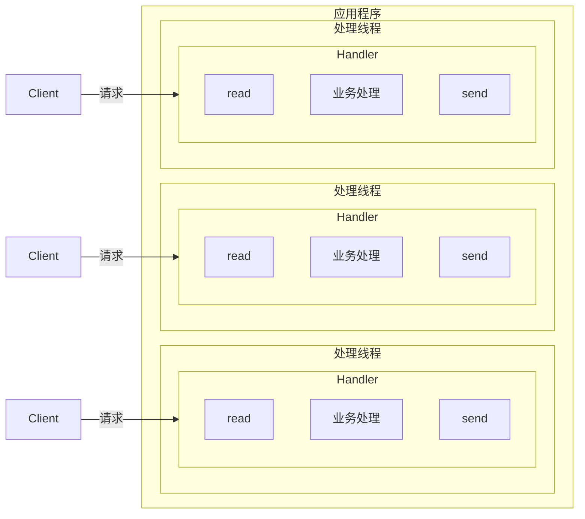
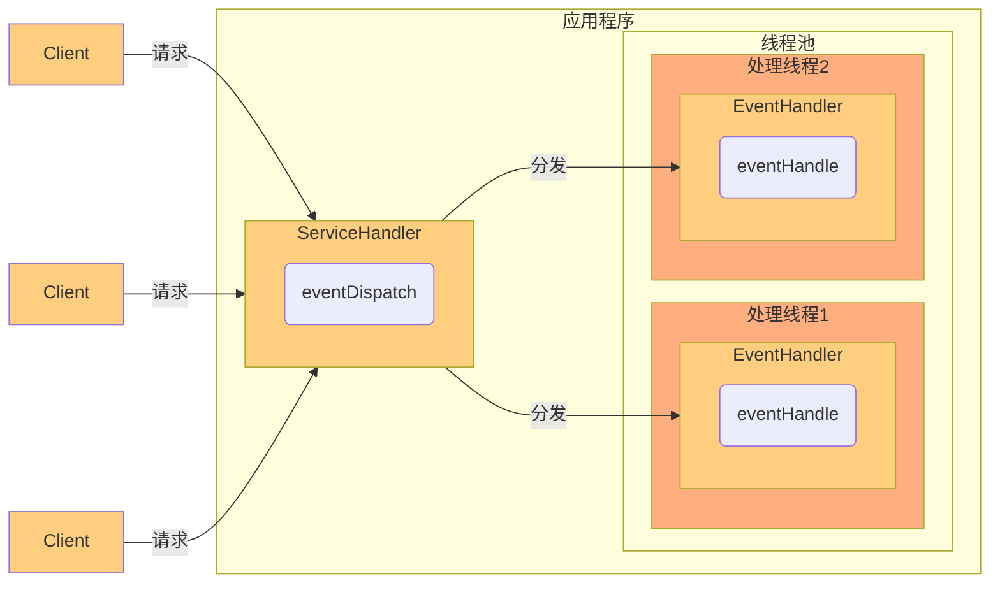
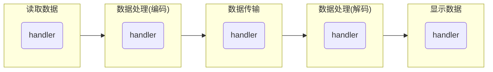
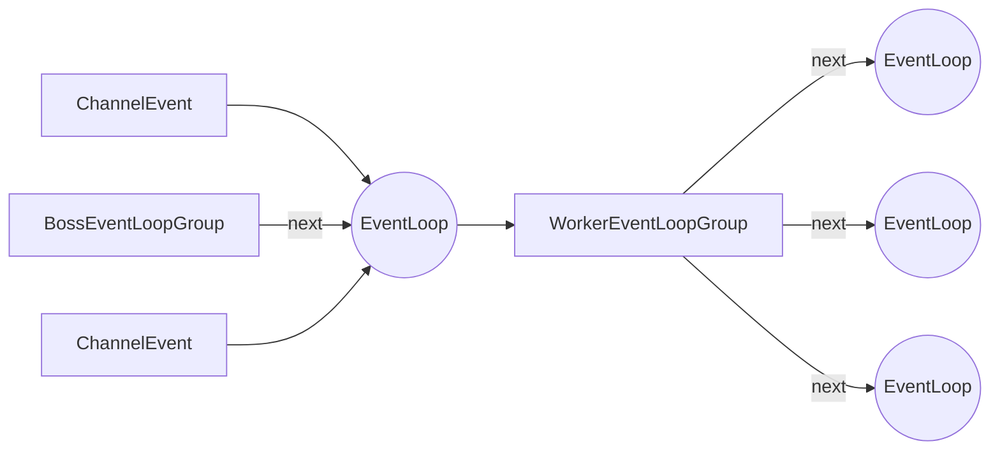

[toc]

# Netty

## 传统阻塞 IO 模型



### 模型特点

1. 采用阻塞 IO 模式获取输入的数据
2. 每个连接需要独立的线程完成数据的输入，业务处理，数据返回

### 问题

1. 当并发量很大，会创建大量线程，占用大量的系统资源
2. 连接创建后，如果当前线程暂时没有数据可读，该线程会阻塞在 `read` 操作上，造成线程资源的浪费

## Reactor 模式

### 怎对传统阻塞 IO 模式缺点的解决方案

1. 基于 IO 复用模型：多个连接公用一个阻塞对象，应用程序只需要在一个阻塞对象等待，无需阻塞等待所有链接。当某个连接有新的数据可以处理时，操作系统通知应用程序，线程从阻塞状态返回，开始进行业务处理。
    - Reactor
        - 反应器模式
        - 分发者模式
        - 通知者模式
    - IO 复用结合线程池，就是 Reactor 模式基本设计思想
        - Reactor 模式通过一个或多个输入同时传递给服务处理器的模式（基于事件驱动）
        - 服务器端程序处理传入的多个请求，并将它们同步分派到相应的处理线程，因此 Reactor 模式也叫 Dispatch 模式，即分发者模式
        - Reactor 模式使用了 IO 复用监听事件，收到事件后，分发给某个线程（进程），这点就是网络服务高并发处理的关键
2. 基于线程池复用线程资源：不必再为每个连接创建线程，将连接完成后的业务处理任务分配给线程进行处理，一个线程可以处理多个连接的业务



#### Reactor 模式中核心组成

1. Reactor 在一个单独的线程中运行，负责监听和分发时间，分发给适当的处理程序来堆 IO 事件做出反应。就像电话接线员。
2. Handlers 处理程序执行 IO 事件要完成的实际事件，类似于客户想要与之交谈的公司的实际官员。Reactor 通过调度适当的处理程序来响应 IO 事件，处理程序执行非阻塞操作。

#### 模式分类

- 单 Reactor 单线程
    - Select 是前面 IO 复用模型介绍的标准网络编程 API，可以实现应用程序通过一个阻塞对象监听多路连接请求
    - Reactor 对象通过 select 监控客户端请求事件，收到事件后，通过 dispatch 进行分发
    - 如果是建立连接，请求事件，则由 Acceptor 通过 accept 处理连接请求，然后创建一个 Handler 对象，处理连接完成后的后续业务处理
    - 如果不是建立连接事件，则 Reactor 会分发调用连接对应的 handler 来响应
    - Handler 会完成 read → 业务处理 → send 的完整业务处理流程
    - NIO 就是一个案例

![[src/netty-01.svg]]

- 单 Reactor 多线程
    - Reactor 对象通过 select 监控客户端请求事件，收到事件后通过 dispatch 进行分发
    - 如果建立连接请求，则由 Acceptor 通过 accept 处理链接请求，然后创建一个 Handler 对象处理完成连接后的各种事件
    - 如果不是连接请求，则由 Reactor 分发调用连接对应的 handler 来处理
    - handler 只负责响应事件，不做具体的业务处理，通过 read 读取数据后，会分发给后面的 worker 线程池的某个线程处理业务
    - Worker 线程池会分配一个独立的线程，完成真正的业务，同时把结果返回给 handler
    - handler 收到响应后，通过 send 将结果返回给 client
    - 优缺点
        - [x] 可以充分利用多核 CPU 的处理能力
        - [ ] 多线程数据共享和访问比较复杂，单一 reactor 处理所有事件的监听和响应，在单线程运行在高并发场景容易出现性能瓶颈

![[src/netty-02.svg]]


- 主从 Reactor 多线程
    - Reactor 主线程 MainReactor 对象通过 select 监听连接时间，收到事件后，通过 Acceptor 处理连接事件
    - 当 Acceptor 处理连接事件后，MainReactor 将连接分配给 SubReactor
    - SubReactor 将连接加入到连接队列进行监听，并创建 handler 进行各种事件处理
    - 当有新事件发生时，SubReactor 就会调用对应 handler 处理
    - handler 通过 read 读取数据，分发给后面的 worker 线程处理
    - worker 线程池分配独立的 worker 线程进行业务处理，并返回结果
    - handler收到响应结果后，再通过 send 将结果返回 client
    - MainReactor 可以关联多个 SubReactor

![[src/netty-03.svg]]

## Netty 模型

### 原理示意图

#### 简单版

1. BossGroup 线程维护 Selector，只关注 accept
2. 当接收到 accept 事件，获取到对应的 SocketChannel，封装成 NIOSocketChannel 并注册到 Worker 线程（事件循环），并进行维护
3. 当 Worker 线程监听到 selector 中通道发生自己感兴趣的事件后，就进行处理（由 handler），注意 handler 已经加入到通道中

![[src/netty-sim.svg]]

#### 进阶版

![[src/netty-pro.svg]]

#### 详细版

![[src/netty-pro-plus.svg]]

1. Netty 抽象出两组线程池，BossGroup 专门负责接收客户端的连接，WorkerGroup 专门负责网络的读写
2. BossGroup 和 WorkerGroup 类型都是 NioEventLoopGroup
3. NioEventLoop 相当于一个事件循环组，这个组包含多个事件循环，每个事件循环是一个 NioEventLoop
4. NioEventLoop 表示一个不断星环的执行处理任务的线程，每个 NioEventLoop 都有一个 Selector，用于监听绑定再其上的 socket 的网络通讯
5. NioEventLoopGroup 可以由多个线程，即可以含有多个 NioEventLoop
6. 每个 Boss 下的 NioEventLoop 执行步骤有 3 步
    1. 轮询 accept 事件
    2. 处理 accept 事件，与 client 建立连接，生成 NioSocketChannel，并将其注册到某个 Worker 下的某个 NioEventLoop 上的 Selector
    3. 处理任务队列的任务，即 runAllTasks
7. 每个 Worker 下的 NioEventLoop 循环执行的步骤
    1. 轮询 read/write 事件
    2. 处理 I/O 事件，即 read/write 事件，在对应 NioSocketChannel 处理
    3. 处理任务队列的任务，即 runAllTasks
8. 每个 Worker 下的 NioEventLoop 处理业务时会使用 pipeline(管道)，pipeline 中包含了 channel，即通过 pipeline 可以获取到对应的通道，管道中维护了很多的处理器

## 程序实例

### 程序结构

```text
NettyClient
NettyClientHandler
NettyServer
NettyServerHandler
```

### 源码

#### NettyServer

```java
package com.example.netty.netty.simple;

import io.netty.bootstrap.ServerBootstrap;
import io.netty.channel.ChannelFuture;
import io.netty.channel.ChannelInitializer;
import io.netty.channel.ChannelOption;
import io.netty.channel.EventLoopGroup;
import io.netty.channel.nio.NioEventLoopGroup;
import io.netty.channel.socket.SocketChannel;
import io.netty.channel.socket.nio.NioServerSocketChannel;

public class NettyServer {
    public static void main(String[] args) throws InterruptedException {
        // 创建 BossGroup 和 WorkerGroup
        // BossGroup 只处理连接请求，WorkerGroup 处理真正的和客户端的业务处理
        // 两个都是无限循环
        // bossGroup 和 workerGroup 含有的子线程（NioEventLoop）个数默认为实际 CPU 核数 * 2
        EventLoopGroup bossGroup = new NioEventLoopGroup();
        EventLoopGroup workerGroup = new NioEventLoopGroup();

        try{// 创建服务器端启动对象，配置启动参数
            ServerBootstrap bootstrap = new ServerBootstrap();

            // 使用链式编程进行设置
            bootstrap.group(bossGroup, workerGroup)  // 设置两个线程组
                    .channel(NioServerSocketChannel.class)  // 设置服务器通道实现为 NioServerSocketChannel
                    .option(ChannelOption.SO_BACKLOG, 128)  // 设置线程队列等待连接个数
                    .childOption(ChannelOption.SO_KEEPALIVE, true)  // 设置保持活动连接状态
                    .childHandler(new ChannelInitializer<SocketChannel>() {  // 创建一个通道测试对象，对应的是 workerHandler；而 handler 对应的是 bossGroup
                        // 给 pipeline 设置处理器
                        @Override
                        protected void initChannel(SocketChannel ch) throws Exception {
                            ch.pipeline().addLast(new NettyServerHandler()); // 向管道内添加处理器
                        }
                    });  // 给 WorkerGroup 的 EventLoop 对应的管道设置处理器
            System.out.println("服务器启动成功，等待客户端连接...");
            // 绑定端口，同步等待成功，生成一个 ChannelFuture 对象（启动服务器，并绑定端口）
            ChannelFuture channelFuture = bootstrap.bind(6668).sync();
            // 等待服务器【监听端口关闭】，通过 ChannelFuture 的 sync() 方法同步等待
            channelFuture.channel().closeFuture().sync();
        } finally {
            // 优雅退出，释放线程池资源
            bossGroup.shutdownGracefully();
            workerGroup.shutdownGracefully();
        }
    }
}
```

#### NettyServerHandler

```java
package com.example.netty.netty.simple;

import io.netty.buffer.ByteBuf;
import io.netty.buffer.Unpooled;
import io.netty.channel.ChannelHandlerContext;
import io.netty.channel.ChannelInboundHandlerAdapter;
import io.netty.util.CharsetUtil;


/**
 * 自定义一个 Handler 需要继续 netty 规定好的某个 HandlerAdapter
 * 这时我们自定义一个 Handler，才能成为一个 Handler
 */
public class NettyServerHandler extends ChannelInboundHandlerAdapter {

    /**
     * 读取数据
     * @param ctx 上下文对象，含有管道 pipeline，通道 channel，地址等信息
     * @param msg 客户端发送的数据，默认是 Object
     * @throws Exception
     */
    @Override
    public void channelRead(ChannelHandlerContext ctx, Object msg) throws Exception {
        System.out.println("server ctx=" + ctx);
        // 将 msg 转为 ByteBuf，注意这是 netty 的 ByteBuf，不是 nio 的 ByteBuffer
        ByteBuf buf = (ByteBuf) msg;
        System.out.println("server received: " + buf.toString(CharsetUtil.UTF_8));
        System.out.println("client address: " + ctx.channel().remoteAddress());

        // 如果有一个非常耗时的业务，会考虑对它异步执行，将它提交到该 channel 对应的 NioEventLoop 的 taskQueue 中
//        ctx.channel().eventLoop().execute(new Runnable() {
//            @Override
//            public void run() {
//                try {
//                    Thread.sleep(10 * 1000);
//                    ctx.writeAndFlush(Unpooled.copiedBuffer("较为复杂的业务发生", CharsetUtil.UTF_8));
//                } catch (InterruptedException e) {
//                    System.out.println("发生异常 " + e.getMessage());
//                }
//            }
//        });

        // 用户自定义定时任务，提交到 scheduleTaskQueue 中
        ctx.channel().eventLoop().schedule(new Runnable() {
            @Override
            public void run() {
                ctx.writeAndFlush(Unpooled.copiedBuffer("自定义定时任务", CharsetUtil.UTF_8));
            }
        }, 5, TimeUnit.SECONDS);
    }

    /**
     * 数据读取完毕
     * @param ctx
     * @throws Exception
     */
    @Override
    public void channelReadComplete(ChannelHandlerContext ctx) throws Exception {
        // 将数据写入到缓冲并刷新
        // 一般需要堆发送的数据进行编码
        ctx.writeAndFlush(Unpooled.copiedBuffer("hello, 客户端", CharsetUtil.UTF_8));
    }

    /**
     * 异常处理，一半需要关闭通道
     * @param ctx
     * @param cause
     * @throws Exception
     */
    @Override
    public void exceptionCaught(ChannelHandlerContext ctx, Throwable cause) throws Exception {
        cause.printStackTrace();
        ctx.close();
    }
}
```

#### NettyClient

```java
package com.example.netty.netty.simple;

import io.netty.bootstrap.Bootstrap;
import io.netty.channel.ChannelFuture;
import io.netty.channel.ChannelInitializer;
import io.netty.channel.EventLoopGroup;
import io.netty.channel.nio.NioEventLoopGroup;
import io.netty.channel.socket.SocketChannel;
import io.netty.channel.socket.nio.NioSocketChannel;

public class NettyClient {
    public static void main(String[] args) throws InterruptedException {
        // 客户端需要一个时间循环组
        EventLoopGroup group = new NioEventLoopGroup();

        try{// 创建一个客户端启动对象，注意客户端使用的是 BootStrap 而不是 ServerBootStrap
            Bootstrap bootstrap = new Bootstrap();

            // 设置相关参数
            bootstrap.group(group)  // 设置线程组
                    .channel(NioSocketChannel.class)  // 设置客户端通道的实现类（利用反射处理）
                    .handler(new ChannelInitializer<SocketChannel>() {
                        @Override
                        protected void initChannel(SocketChannel ch) throws Exception {
                            ch.pipeline().addLast(new NettyClientHandler());  // 加入自己的处理器
                        }
                    });
            System.out.println("客户端启动");
            // 启动客户端去连接服务器端
            // 关于 ChannelFuture 要分析，涉及到异步的概念
            ChannelFuture channelFuture = bootstrap.connect("localhost", 6668).sync();
            // 给关闭通道进行监听
            channelFuture.channel().closeFuture().sync();
        } finally {
            // 关闭线程组
            group.shutdownGracefully();
        }
    }
}
```

#### NettyClientHandler

```java
package com.example.netty.netty.simple;

import io.netty.buffer.ByteBuf;
import io.netty.buffer.Unpooled;
import io.netty.channel.ChannelHandlerContext;
import io.netty.channel.ChannelInboundHandlerAdapter;
import io.netty.util.CharsetUtil;

public class NettyClientHandler extends ChannelInboundHandlerAdapter {
    /**
     * 当通道就绪就会触发该方法
     * @param ctx
     * @throws Exception
     */
    @Override
    public void channelActive(io.netty.channel.ChannelHandlerContext ctx) throws Exception {
        System.out.println("client channelActive: " + ctx);
        ctx.writeAndFlush(Unpooled.copiedBuffer("hello, 服务器", CharsetUtil.UTF_8));
    }

    /**
     * 当通道有读取事件时会触发该方法
     * @param ctx
     * @param msg
     * @throws Exception
     */
    @Override
    public void channelRead(ChannelHandlerContext ctx, Object msg) throws Exception {
        ByteBuf buf = (ByteBuf) msg;
        System.out.println("服务器回复的消息: " + buf.toString(CharsetUtil.UTF_8));
        System.out.println("服务器地址: "+ctx.channel().remoteAddress());
    }

    @Override
    public void exceptionCaught(ChannelHandlerContext ctx, Throwable cause) throws Exception {
        cause.printStackTrace();
        ctx.close();
    }
}
```

#### 任务队列中的 Task 有 3 中典型使用场景

1. 用户程序自定义的普通任务

```java
ctx.channel().eventLoop().execute(new Runnable() {
    @Override
    public void run() {
        try {
            Thread.sleep(10 * 1000);
            ctx.writeAndFlush(Unpooled.copiedBuffer("较为复杂的业务发生", CharsetUtil.UTF_8));
        } catch (InterruptedException e) {
            System.out.println("发生异常 " + e.getMessage());
        }
    }
});
```

2. 用户自定义定时任务

```java
ctx.channel().eventLoop().schedule(new Runnable() {  
    @Override  
    public void run() {  
        ctx.writeAndFlush(Unpooled.copiedBuffer("自定义定时任务", CharsetUtil.UTF_8));  
    }  
}, 5, TimeUnit.SECONDS);
```

3. 非当前 Reactor 线程调用 Channel 的各种方法

例如在推送系统的业务线程里面，根据用户的表示，找到对应的 Channel 引用，然后调用 write 方法向该用户推送消息，就会进入到这种场景。最终的 write 会提交到任务队列中后被异步处理。


## 异步模型

### 基本介绍

1. 异步的概念和同步相对，当一个异步过程调用发出后，调用者不能立即得到结果。实际处理这个调用的组件在完成后，通过状态、通知和回调来通知调用者
2. Netty 中的 I/O 操作是异步的，包括 bind, write, connect 等操作会简单的返回一个 ChannelFuture
3. 调用者并不能立即获得结果，而是通过 Future-Listener 机制，用户可以方便的主动获取或者通过通知机制获得 I/O 操作结果
4. Netty 的异步模型是建立在 future 和callback 之上的。callback 就是回调。Future 的核心思想是：假设一个方法 func，计算过程可能非常耗时，等待 func 返回显然不合适。那么可以在调用 func 的时候，立刻返回一个 Future，后续可以通过 Future 去监控方法 func 的处理过程（即 Future-Listener 机制）

#### Future 说明

1. 表示异步的执行结果，可以通过它提供给方法来检测执行是否完成，比如检索计算等等
2. ChannelFuture 是一个接口 `public interface ChannelFuture extends Future<Void>`，可以添加监听器，当监听的事件发生时，就会通知到监听器

#### 链式操作



在 handler 处理中，可以使用 callback 或者 future 实现异步

#### Future-Listener 机制

1. 当 Future 对象刚刚创建的时候，处于非完成状态，调用之可以通过返回的 ChannelFuture 来获取操作执行的状态，注册监听函数来执行完成后的操作
2. 常见的操作如下
    - 通过 isDone 方法来判断当前操作是否完成
    - 通过 isSuccess 方法来判断自己完成的操作是否和成功
    - 通过 getCause 方法获取已完成的操作失败的原因
    - 通过 isCancelled 方法来判断已完成的当前操作是否被取消
    - 通过 addListener 方法来注册监听器，当操作已完成 (isDone 方法返回完成)，将会通知指定的监听器；如果 Future 对象已完成，则通知指定的监听器
3. 绑定端口是异步操作，当绑定操作处理完，将会调用相应的监听器处理逻辑

```java
serverBootstrap.bind(port).addListener(new ChannelFutureListener() {
    @Override
    public void operationComplete(ChannelFuture future) throws Exception {
        if (future.isSuccess()) {
            System.out.println("端口监听成功");
        } else {
            System.out.println("端口监听失败");
        }
    }
});
```

相比传统阻塞 I/O，执行 I/O 操作会被阻塞住，知道操作完成；异步处理的好处是不会造成线程阻塞，线程在 I/O 操作期间可以执行别的程序，在高并发情形下会更稳定，有更高的吞吐量

## Netty 核心模块组件

### Bootstrap ServerBootstrap

1. Bootstrap 的意思是引导，一个 Netty 应用通常由一个 Bootstrap 开始，主要作用是配置整个 Netty 程序，串联各个组件，Netty 中 Bootstrap 类是客户端程序的启动引导类，ServerBootstrap 是服务器启动引导类
2. 常见方法

```java
// 用于服务器端，用来设置两个 EventLoopGroup
public ServerBootstrap group(EventLoopGroup parentGroup, EventLoopGroup childGroup);
// 用于客户端，用来设置一个 EventLoopGroup
public B group(EventLoopGroup group);
// 用来设置一个服务端的通道实现
public B channel(Class<? extends C> channelClass);
// 用来给 ServerChannel 添加配置
public <T> B option(ChannelOption<T> option, T value);
// 用来给接收到的通道添加配置
public <T> ServerBootstrap childOption(ChannelOption<T> option, T value);
// 用来设置业务处理类（自定义 handler）
public ServerBootstrap childHandler(ChannelHandler channelHandler);
// 用于服务器，用来设置占用的端口号
public ChannelFuture bind(int inetPort);
// 用于客户端，用来连接服务端
public ChannelFuture connect(String inetHost, int inetPort);
```

### Future ChannelFuture

1. Netty 中所有 I/O 操作都是异步的，不能立刻得知消息是否被正确处理，但是可以过一会等它执行完成或者直接注册一个监听，当操作执行成功或失败时监听会自动触发注册的监听事件
2. 常见的方法
    1. `Channel channel()` 返回当前正在进行 I/O 操作的通道
    2. `ChannelFuture sync()` ~~等待异步操作执行完成~~阻塞等待 future 的结果

### Channel

1. Netty 网络通信组件，能够用于执行网络的 I/O 操作
2. 通过 Channel 可获得当前网络连接的通道的状态
3. 通过 Channel 可获得网络连接的配置参数（例如接收缓冲区的大小）
4. Channel 提供异步的网络 I/O 操作（如建立连接，读写，绑定端口），异步调用意味着任何 I/O 调用都将立即返回，并且不保证在调用结束时所请求的 I/O 操作已经完成
5. 调用立即返回一个 ChannelFuture 实例，通过注册监听器到 ChannelFuture 上，可以在 I/O 操作成功、失败或取消时回调通知调用方
6. 支持关联 I/O 操作与对应的处理程序
7. 不同协议、不同阻塞类型的连接都有不同的 Channel 类型与之对应，常用的 Channel 类型（Channel 类型与协议有关）
    1. NioSocketChannel 异步的客户端 TCP Socket 连接
    2. NioServerSocketChannel 异步的服务器端 TCP Socket 连接
    3. NioDatagramChannel 异步的 UDP 连接
    4. NioSctpChannel 异步的客户端 Sctp 连接
    5. NioSctpServerChannel 异步的 Sctp 服务器端连接，这些通道涵盖了 UDP 和 TCP 网络 I/O 以及文件 I/O

### Selector

1. Netty 基于 Selector 对象实现 I/O 多路复用，通过 Selector 一个线程可以监听多个连接的 Channel 事件
2. 当向一个 Selector 中注册 Channel 后，Selector 内部的机制就可以自动不断地查询这些注册的 Channel 是否有已经就绪的 I/O 事件（例如可读、可写、网络连接完成等），这样程序就可以很简单的使用一个线程高效的管理多个 Channel

### ChannelHandler

1. ChannelHandler 是一个接口，处理 I/O 事件或拦截 I/O 操作，并将其转发到其 ChannelPipeline（业务处理链）中的下一个处理程序
2. ChannelHandler 本身并没有提供很多方法，因为这个接口有许多的方法需要实现，方便使用期间，可以继承它的子类
3. ChannelHandler 及其实现类

### Pipeline ChannelPipeline

1. ChannelPipeline 是 Handler 的一个集合，它负责处理和拦截 inBound 或者 outBound 的事件和操作，相当于贯穿于 Netty 的链。也可以这样理解：ChannelPipeline 是保存 ChannelHandler(其实是 ChannelHandlerContext) 的 List，用于处理或拦截 Channel 的入站事件和出站操作
2. ChannelPipeline 实现了一种高级形式的拦截过滤器模式，使用户可以完全控制事件的处理方式，以及 Channel 中各个 ChannelHandler 如何相互交互
3. 在 Netty 中每个Channel 都有且仅有一个 ChannelPipeline 与之对应
    - 一个 Channel 包含了一个 ChannelPipeline，而 ChannelPipeline 中又维护了一个由 ==ChannelHandlerContext 组成的双向链表==，每个 ChannelHandlerContext 中又关联着一个 ChannelHandler
    - 入站事件和出站事件在一个双向链表中，入站时间会从链表往后传递到最后一个入站的 handler，出站事件会从链表 tail 往前传递到最前一个出站的 handler，两种类型的 handler 互不干扰


### ChannelHandlerContext

1. 保存 Channel 相关的所有上下文信息，同时关联一个 ChannelHandler 对象
2. 即 ChannelHandlerContext 中包含一个具体的事件处理器 ChannelHandler，同时 ChannelHandlerContext 中也绑定了对应的 pipeline 和 Channel 的信息，方便对 ChannelHandler 进行调用
3. 常用方法

```java
// 关闭通道
ChannelFuture close();
// 刷新
ChannelOutBoundInvoker flush();
// 将数据写到 ChannelPipeline 中当前 ChannelHandler 的下一个 ChannelHandler 开始处理（出站）
ChannelFuture writeAndFlush(Object msg);
```

### ChannelOption

1. Netty 在常见 Channel 实例后，一般都需要设置 ChannelOption 参数
2. 参数如下

    ```java
    // 对应 TCP/IP 协议 listen 函数中的 backlog 参数，用来初始化服务器可连接队列大小。服务端处理客户端连接请求是顺序处理的，所以同一时间只能处理一个客户链接，多个客户端来的时候，服务端将不能处理，客户端连接请求放在队列中等待处理
    ChannelOption.SO_BACKLOG;
    // 一直保持连接活动状态
    ChannelOption.SO_KEEPALIVE;
    ```

### EventLoopGroup 和其实现类 NioEventLoopGroup

1. EventLoopGroup 是一组 EventLoop 的抽象，Netty 为了更好的利用多核 CPU 资源，一般会有多个 EventLoop 同时工作，每个 EventLoop 维护者一个 Selector 实例
2. EventLoopGroup 提供 next 接口，可以从组里面按照一定的规则获取其中一个 EventLoop 来处理任务。在 Netty 服务端编程中，一般提供两个： BossGroup 和 WorkerGroup 
3. 通常一个服务器端口即一个 ServerSocketChannel 对应一个 Selector 和一个 EventLoop 线程。BossEventLoop 负责接收客户端的连接并将 SocketChannel 交给 WorkerEventLoopGroup 来进行 I/O 处理
    1. BossEventLoopGroup 通常是一个单线程的 EventLoop，EventLoop 维护着一个注册了 ServerSocketChannel 的 Selector 实例，BossEventLoop 不断轮询 Selector 将连接事件分离出来
    2. 通常是 OP_ACCEPT 事件，然后将接收到的 SocketChannel 交给 WorkerEventLoopGroup
    3. WorkerEventLoopGroup 会由 next 选择其中一个 EventLoop 来将这个 SocketChannel 注册到其维护的 Selector 并对其后续的 I/O 事件进行处理




### Unpooled 类

1. Netty 提供一个专门用来操作缓冲区的工具类
2. 常用方法，通过给定的数据和字符编码返回一个 ByteBuf 对象
    ```java
    public static ButeBuf copiedBuffer(CharSequence string, Charset charset);
    ```
3. 属性
    1. `readerIndex` 读指针
    2. `writerIndex` 写指针
    3. `capacity` 缓冲区的大小

