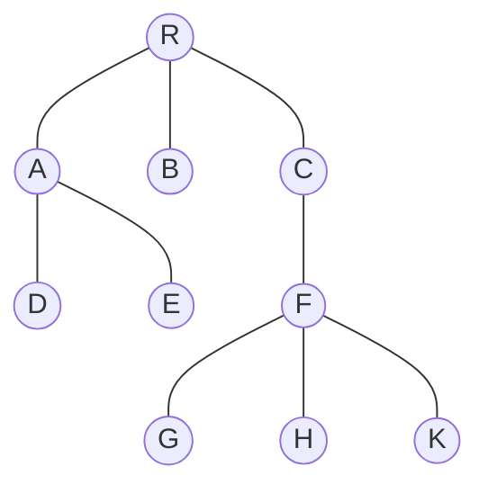

# 第 5 章 树与二叉树

## 5.1. 树的基本概念

### 5.1.1. 定义

$n$ 个节点的有限集，当 $n=0$ 时，称为空树

- 有且仅有一个特定的称为 **根** 的节点
- 当 $n>1$ 时，其余节点可分为 $m$ 个互不相较的有限集，每个有限集又是一棵树，称为根的子树

### 5.1.2. 基本术语

- 父节点、兄弟节点、子节点
- 一个节点孩子的个数称为该节点的度，树中节点的最大度数称为树的度
- 度大于 0 的节点为分支节点，度为 0 的节点为叶子节点
- 树的深度 = max\{左子树的深度, 右子树的深度\} + 1
- 有序树和无序树：树中各子树从左到右是有次序的，不能交换，称为有序树
- 路径长度：树中两个节点之间的路径的边的个数
- 森林：$m$ 棵互不相交的树的集合

### 5.1.3. 树的性质

- 树中节点数等于所有节点的度数之和加一
- 度为 $m$ 的树中第 $i$ 层上至多有 $m^{i-1}$ 个节点
- 高度为 $h$ 的 $m$ 叉树至多有 $1 + m + m^2 + \cdots + m^{k-1} = (m^h - 1) / (m-1)$ 个节点
- 具有 $n$ 个节点的 $m$ 叉树的最小高度为 $\left \lceil \log _m (n(m-1)+1) \right \rceil$

## 5.2. 二叉树

### 5.2.1. 定义和特性

#### 1. 定义

最多只有两棵子树，次序不能颠倒。

#### 2. 特殊的二叉树

- 满二叉树
	- 高度为 $h$，则节点数为 $2^h -1$
- 完全二叉树
	- 每个节点都能和高度相等的满二叉树中的节点对应（只允许缺最下层的靠右的叶子节点）
	- 若 $i \leqslant \lfloor n/2 \rfloor$，则 $i$ 为分支节点，否则为叶子节点
	- 若有度为 1 的节点，则只可能有一个，且它只有左孩子，没有右孩子
	- 按层次排序，若编号为 $i$ 为叶子或只有左孩子，那么编号大于 $i$ 的都是叶子节点
	- 若 $n$ 为奇数，则每个分支节点都有左右孩子
	- 若 $n$ 为偶数，则编号最大的分支节点只有左孩子
- 二叉排序树
	- 左子树上所有节点的关键字均小于根节点的关键字
	- 右子树上所有节点的关键字均大于根节点的关键字
- 平衡二叉树
	- 树上任意一节点的左右子树深度之差不超过 1

#### 3. 性质

- 非空二叉树上的叶子节点数等于度为 2 的节点数加 1，即 $n_0=n_2+1$
- 非空二叉树上第 $k$ 层上至多有 $2^{k-1}$ 个节点
- 高度为 $h$ 的二叉树至多有 $2^h-1$ 个节点
- 对==完全二叉树==按从上到下，从左到右的顺序依次编号为 $1,2,\cdots,n$ 则有
	- 当 $i>1$ 时，节点 $i$ 的父节点编号为 $\lfloor i/2 \rfloor$
	- 当 $2i \leqslant n$ 时，节点 $i$ 的左孩子编号为 $2i$
	- 当 $2i+1 \leqslant n$ 时，节点 $i$ 的右孩子编号为 $2i+1$
	- 节点 $i$ 所在层次为 $\lfloor \log_2 i \rfloor+1$
- 具有 $n$ 个节点的完全二叉树高度为 $\lceil \log_2 (n+1) \rceil$

### 5.2.2. 存储方式

- 数组方式——堆
- 链表方式——树状链表

## 5.3. 二叉树的遍历和线索二叉树

### 5.3.1. 遍历

#### 1. 先序遍历

```cpp
// 递归
void PreOrder(Node* root) {
	if (root != NULL) {
		visit(root);
		PreOrder(root->lchild);
		PreOrder(root->rchild);
	}
}

// 非递归
void PreOrder2(Node* root) {
	std::stack<Node*> s;
	Node* p = root;
	while (p || !s.is_empty()) {
		if (p) {
			visit(p);
			s.push(p);
			p = p->lchild;
		} else {
			p = s.top();
			s.pop();
			p = p->rchild;
		}
	}
}
```

#### 2. 中序遍历

```cpp
// 递归
void InOrder(Node* root) {
	if (root != NULL) {
		InOrder(root->lchild);
		visit(root);
		InOrder(root->rchild);
	}
}

// 非递归
void InOrder2(Node* root) {
	std::stack<Node*> s;
	Node* p = root;
	while (p || !s.is_empty()) {
		if (p) {
			s.push(p);
			p = p->lchild;
		} else {
			p = s.top();
			s.pop();
			visit(p);
			p = p->rchild;
		}
	}
}
```

#### 3. 后续遍历

```cpp
void PostOrder(Node* root) {
	if (root != NULL) {
		PostOrder(root->lchild);
		PostOrder(root->rchild);
		visit(root);
	}
}
```

#### 4. 层次遍历

```cpp
void LevelOrder(Node* root) {
	std::list<Node*> v;
	v.push_back(root);
	while (!v.empty()) {
		Node* p = v[0];
		v.erase(0, 1);
		visit(p);
		if (p->lchild)
			v.push_back(p->lchild);
		if (p->rchild)
			v.push_back(p->rchild);
	}
}
```

### 5.3.2. 线索二叉树

#### 1. 基本概念

遍历二叉树是以一定的规则将二叉树中的结点排列成一个线性序列，从而得到几种遍历序列，使得该序列中的每个结点（第一个和最后一个结点除外）都有一个直接前驱和直接后继。

传统二叉树职能体现一种父子关系，不能直接的到节点在遍历中的前驱或后继。在 $n$ 个节点的二叉树中，有 $n+1$ 个空指针，可以将他们利用起来。

规定：若无左子树，令 1child指向其前驱结点；若无右子树，令 rchild指向其后继结点。如表所示，还需增加两个标志域标识指针域是指向左（右）孩子还是指向前驱（后继)。

| `lchild` | `ltag` | data | `rtag` | `rchild` | 
| -------- | ------ | ---- | ------ | -------- |

- `ltag`
	- 0 —— `lchild` 指向左孩子
	- 1 —— `lchild` 指向前驱
- `rtag`
	- 0 —— `rchild` 指向右孩子
	- 1 —— `rchild` 指向后继

```cpp
struct ThreadNode {
	int data;
	ThreadNode* lchild, * rchild;
	int ltag, rtag;
};
```

#### 2. 中序线索二叉树的构造

二叉树的线索化是将二叉链表中的空指针改为指向前驱或后继的线索。而前驱或后继的信息只有在遍历时才能得到，因此线索化实质就是遍历一次二叉树。

```cpp
void InThread(ThreadNode* p, ThreadNode* pre) {
	if (p != NULL) {
		InThread(p->lchild, pre);  // 递归，线索化左子树
		if (p->lchild == NULL) {   // 左子树为空，建立前驱线索
			p->lchild = pre;
			p->ltag = 1;
		}
		if (pre != NULL && pre->rchild == NULL) {
			pre->rchild = p;       // 建立前驱节点的后继线索
			pre->rtag = 1;
		}
		pre = p;                   // 标记当前节点称为刚刚访问过的节点
		InThread(p->rchild, pre);  // 递归，线索化右子树
	}
}

void CreateInThread(ThreadNode* t) {
	ThreadNode* pre = NULL;
	if (t != NULL) {               // 非空二叉树，线索化
		InThread(t, pre);          // 线索化
		pre->rchild = NULL;        // 处理遍历的最后一个节点
		pre->rtag = 1;
	}
}
```

#### 3. 中序线索二叉树的遍历

```cpp
ThreadNode* FirstNode(ThreadNode* p) {
	while (p->ltag == 0) p = p->lchild;
	return p;
}

ThreadNode* NextNode(ThreadNode* p) {
	if (p->rtag == 0) return FirstNode(p->rchild);
	else return p->rchild;
}

void InOrder(Thread* root) {
	for (ThreadNode* p = FirstNode(root); p != NULL; p = NextNode(p))
		visit(p);
}
```

#### 4. 先序线索二叉树与后续线索二叉树

![[public/data-structure/thread.excalidraw.png]]

## 5.4. 树、森林

### 5.4.1. 树的存储结构



#### 1. 双亲表示法

|     | data | parent |
|:---:|:----:|:------:|
|  0  |  R   |   -1   |
|  1  |  A   |   0    |
|  2  |  B   |   0    |
|  3  |  C   |   0    | 
|  4  |  D   |   1    |
|  5  |  E   |   1    |
|  6  |  F   |   3    |
|  7  |  G   |   6    |
|  8  |  H   |   6    |
|  9  |  K   |   6    |

#### 2. 孩子表示法

![[public/data-structure/child.excalidraw.png]]

#### 3. 孩子兄弟表示法

> 使用这种方法，可以将多叉树转化为等价的二叉树

```cpp
struct CSNode {
	int data;
	CSNode* firstChild, * nextsibing;
};
```

![[public/data-structure/child-sibling.excalidraw.png]]

## 5.5. 树与二叉树的应用

### 5.5.1. 哈夫曼树和哈夫曼编码

#### 1. 定义

带权路径长度

$$
\begin{aligned}
\text{WPL} = \sum_{i=1}^n w_i l_i
\end{aligned}
$$

带权路径长度最小的二叉树称为哈夫曼树，也称最优二叉树。

#### 2. 构造

给定 $n$ 个权值分别为 $w_1,w_2,\cdots,w_n$ 的节点，构造方法如下

- 将这 $n$ 个节点分别作为 $n$ 棵仅含一个节点的二叉树，构成森林 $F$
- 构造一个新节点，从 $F$ 中选出两棵根节点权值最小的树作为新节点的左右子树，并且将新节点的权值置为左右子树上根节点的权值之和。
- 从 $F$ 中删除刚才选出的两棵树，同时将新得到的树加入 $F$ 中
- 重复 (2)(3) 两步，直至 $F$ 中只有一棵树为止

特点

- 权值越小的节点到根节点的路径长度越大
- 节点总数为 $2n-1$
- 每次选择 2 棵树作为新节点的孩子，因此哈夫曼树中不存在度为 1 的节点

#### 3. 哈夫曼编码

左路径为 0，右路径为 1，可以将每个数据进行编码。当然，编码不唯一。对编码后的数据进行解码时，各个编码的长度不同，但是这些编码没有公共前缀，可以沿着哈夫曼树的编码路径走到叶子节点。

### 5.5.2. 并查集

支持以下 3 种操作

- `Initial(S)` 将集合 `S` 中每个元素都初始化为只有一个单元素的子集合
- `Union(S, Root1, Root2)` 把集合 `S` 中的子集合 `Root2` 并入 `Root1`。要求 `Root1` 和 `Root2` 不相交
- `Find(S, x)` 查找集合 `S` 中单元素 `x` 所在的子集合，并返回该子集合的根节点

```cpp
#define SIZE 100
int UFSets[SIZE];

void Initial(int S[]) {
	for (int i = 0; i < SIZE; i++) S[i] = -1;
}

int Find(int S[], int x) {
	while (S[x] >= 0) 
		x = S[x];
	return x;
}

void Union(int S[], int Root1, int Root2) {
	S[Root2] = Root1;
}
```


