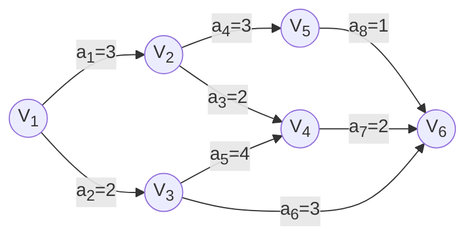

# 第 6 章 图

## 6.1. 图的基本概念

### 6.1.1. 定义

#### 9. 度

无向图中，顶点 $v$ 的度是指依附在顶点 $v$ 的边的条数，记为 $\text{TD}(v)$。对于具有 $n$ 个顶点、$e$ 条边的无向图，$\Sigma_{i=1}^n \text{TD}(v_i)=2e$，即无向图的全部顶点的度的和等于边数的 2 倍，因为每条边和两个顶点关联。

有向图中，顶点 $v$ 的度分为入度和出度，入度记为 $\text{ID}(v)$，出度记为 $\text{OD}(v)$，顶点 $v$ 的度等于入度和出度之和，即 $\text{TD}(v)=\text{ID}(v)+\text{OD}(v)$。对于具有 $n$ 个顶点、$e$ 条边的有向图，$\Sigma_{i=1}^n \text{ID}(v)=\Sigma_{i=1}^n \text{OD}(v)=e$.

#### 12. 路径、路径长度和回路

路径上边的数目称为路径的长度。

若一个图有 $n$ 个顶点，并且有大于 $n-1$ 条边，那么它一定有环。

## 6.2. 图的存储及操作

### 6.2.1. 邻接矩阵法

不带权

$$
A[i][j] = 
\begin{cases}
1, & (v_i, v_j) \text{ or } <v_i, v_j> \text{ in } E(G) \\
0, & (v_i, v_j) \text{ or } <v_i, v_j> \text{ not in } E(G) \\
\end{cases}

$$

带权


$$
A[i][j] = 
\begin{cases}
w_{ij}, & (v_i, v_j) \text{ or } <v_i, v_j> \text{ in } E(G) \\
0 \text{ or } \infty, & (v_i, v_j) \text{ or } <v_i, v_j> \text{ not in } E(G) \\
\end{cases}

$$

```cpp
#define MaxVertexNum 100
typedef char VertexType;
typedef int EdgeType;
struct MGraph {
	VertexType Vex[MaxVertexNum];
	EdgeType Edge[MaxVertexNum][MaxVertexNum];
	int vexnum, arcnum;
};
```

- 无向图的邻接矩阵存储可以只用三角存储
- 稠密图适合用邻接矩阵存储表示
- 设图 $G$ 的邻接矩阵为 $A$，$A^n$ 的元素 $A^n[i][j]$ 等于由 $i$ 到 $j$ 的长度为 $n$ 的路径数目。

### 6.2.2. 邻接表法

当图为稀疏图时，使用邻接矩阵浪费了大量的空间，邻接表结合了顺序存储和脸是存储方法，减少了浪费。

顶点表节点

| 顶点域 |  边表指针  |
|:------:|:----------:|
| `data` | `firstarc` | 

边表指针

| 邻接点域 |  指针域   |
|:--------:|:---------:|
| `adjvex` | `nextarc` |

```cpp
#define MaxVertexNum 100
typedef int WeightType;
typedef char VertexType;
struct ArcNode {
	int adjvex;
	ArcNode* next;
	// WeightType w;
};
struct VNode {
	VertexType data;
	ArcNode* first;
};
struct ALGraph {
	VNode vertices[MaxVertexNum];
	int vexnum, arcnum;
};
```

需要的存储空间为 $O(|V|+2|E|)$

### 6.2.5. 图的基本操作

- `Adjacent(G, x, y)` 是否存在边 $(x,y)$
- `Neighbors(G,x)` 列出 $G$ 中与节点 $x$ 邻接的边
- `InsertVertex(G, x)` 插入顶点 $x$
- `DeleteVertex(G, x)` 删除顶点 $x$
- `AddEdge(G, x, y)` 若边 $(x,y)$ 不存在，则加边
- `RemoveEdge(G, x, y)` 若边 $(x,y)$ 存在，则删除边
- `FirstNeighbor(G, x)` 求 $G$ 中顶点 $x$ 的第一个邻接点，若有则返回顶点号，不存在则返回 $-1$
- `NextNeighbor(G, x, y)` 假设 $G$ 中顶点 $y$ 是顶点 $x$ 的一个邻接点，返回除 $y$ 外顶点 $x$ 的下一个邻接点的顶点号，若 $y$ 是最后一个，则返回 $-1$
- `GetEdgeValue(G, x, y)` 获取边 $(x,y)$ 的权值
- `SetEdgeValue(G, x, y, v)` 设置边 $(x,y)$ 的权值

## 6.3. 图的遍历

### 6.3.1. 广度优先搜索 BFS

```ts
function BFS(g: Graph, v: number, visited: boolean[], queue: number[]) {
	visit(g, v)
	visited[v] = true
	queue.push(v)
	while (queue.length) {
		v = queue.shift()
		for (let w = FirstNeighbor(g, v); w >= 0; w = NextNeighbor(g, v, w))
			if (!visited[w]) {
				visit(g, w)
				visited[w] = true
				queue.push(w)
			}
	}
}
function BFSTraverse(g: Graph) {
	const visited = Array(MaxVertexNum).fill(false)
	const queue: number[] = []
	for (let i = 0; i < g.vexnum; i++)  // <--
		if (!visited[i])
			BFS(g, i, visited, queue)
}
```

#### 2. BFS 求单元最短路径问题

非带权图中，求 $u$ 到 $v$ 的最短路径。如果没有通路，$d(u,v)=\infty$

```ts
function BFSMinDistance(g: Graph, u: number) {
	const d = Array(g.vexnum).fill(Infinity)
	const visited = Array(g.vexnum).fill(false)
	const queue: number[] = []
	visited[u] = true
	d[u] = 0
	queue.push(u)
	while (queue.length) {
		u = queue.shift()
		for (let w = FirstNeighbor(g, u); w >= 0; w = NextNeighbor(g, u, w))
			if (!visited) {
				visited[w] = true
				d[w] = d[u] + 1
			}
	}
	return d
}
```

### 6.3.2. 深度优先搜索

```ts
function DFS(g: Graph, v: number, visited: boolean[], queue: number[]) {
	visit(v)
	visited[v] = true
	for (let w = FirstNeighbor(g, v); w >= 0; w = NextNeighbor(g, v, w))
		if (!visited[w])
			DFS(g, w, visited, queue)
}
function DFSTraverse(g: Graph) {
	const visited = Array(g.vexnum).fill(false)
	const queue: number[] = []
	for (let v = 0; v < g.vexnum; v++)  // <--
		DFS(g, v, visited, queue)
}
```

### 6.3.3. 图的遍历和图的连通性

当箭头指向的 `for` 循环只执行一次时，说明图是连通的

## 6.4. 图的应用

### 6.4.1. 最小生成树

一个连通图的生成树包含图的所有顶点，并且只含尽可能少的边。加一条边就存在环，去除一条边就不连通。

最小生成树的性质

- 最小生成树不唯一。当图的各边权值互不相等，最小生成树唯一
- 最小生成树的边的权值之和总是唯一的
- 最小生成树的边数为顶点数减一

#### 1. Prim 算法

初始从途中任取一点加入树 $T$，此时树中只含有一个顶点，之后选择一个与当前 $T$ 中顶点集合距离最近的顶点，并将该顶点和相应的边加入 $T$，每次操作后 $T$ 中的顶点数和边数都加一，直至图中所有顶点都并入了 $T$，此时就是最小生成树。

```ts
function Prim(g: Graph, t: Graph) {
	const { V, E } = g
	const { V: U, E: Et } = t
	U = [w]
	while (U.length !== V.length) {  // 树中不含所有顶点
		const e = MinEdge(u, v)  // (u, v) 是使 u ∈ U 且 v ∈ (V-U) 且权值最小的边
		Et.push(e)
		U.push(v)
	}
}
```

时间复杂度 $O(|V|^2)$，不依赖于 $|E|$，适用于求解边稠密的最小生成树。

#### 2. Kruskal 算法

初始时为只有 $n$ 个顶点而无边的非连通图 $T=\{Y，\{\}\}$，每个顶点自成一个连通分量，然后按照==边的权值由小到大的顺序==，不断选取当前未被选取过且权值最小的边，若该边依附的顶点落在 $T$ 中不同的连通分量上，则将此边加入 $T$，否则合弃此边而选择下一条权值最小的边。以此类推，直至，中所有顶点都在一个连通分量上。

```ts
function Kruskal(g: Graph, t: Graph) {
	const { V, E } = g
	let { V: U, E: Et } = t
	U = [...V]
	let nums = n  // 连通分量数
	const sortedEdges = E.sort((a, b) => b.w - a.w)
	while (nums > 1) {
		const { u, v, e } = minEdge(sortedEdges)
		if (/* u 和 v 属于 T 中不同的连通分量 */) {
			Et.push(e)
			nums--
		}
	}
}
```

### 6.4.2. 最短路径

#### 1. Dijkstra 算法求单元最短路径问题

Dijkstra 算法设置一个集合 $S$ 记录已求得的最短路径的顶点，初始时把源点 $v_0$ 放入 $S$，集合 $S$ 每并入一个新顶点 $v_i$，都要修改源点 $v_0$ 到集合 $V-S$ 中顶点当前的最短路径长度值。

构造过程中设置了两个辅助数组

- `dist[]` 记录从源点 $v_0$ 到其他各顶点当前的最短路径长度。初态：若 $v_0 \to v_i$ 有弧，则 `dist[i]` 为弧上的权值；否则为 $\infty$
- `path[i]` 表示从原点到顶点 $i$ 之间的最短路径的前驱节点。在算法结束时，可根据其值追溯到源点 $v_0$ 到顶点 $v_i$ 的最短路径

1. 初始化：集合 $S$ 初始化为 $\{0\}$，`dist[i] = arcs[0][i]`
2. 从顶点集合 $V-S$ 中选出 $v_j$，满足 $dist[j] = \min\{dist[i] \mid v_i \in V-S\}$，$v_j$ 就是当前求得的一条从 $v_0$ 出发的最短路径的终点，令 $S = S \cup \{j\}$
3. 修改 $v_0$ 出发到集合 $V-S$ 上任意顶点 $v_k$ 可达的最短路径长度：若 `dist[j] + arcs[j][k] < dist[k]`，则更新 `dist[k] = dist[k] = dist[j] + arcs[j][k]`
4. 重复 (2)(3) 共 $n-1$ 次，直到所有的顶点都包含在 $S$ 中

![[public/data-structure/dijkstra-example.excalidraw.png]]

#### 2. Floyd 算法求各顶点之间最短路径问题

求所有顶点之间的最短路径问题描述如下：已知一个各边权值均大于 0 的带权有向图，对任意两个顶点 $v_i \ne v_j$，要求求出 $v_i$ 和 $v_j$ 之间的最短路径和最短路径长度。

递推产生一个 $n$ 阶方正序列 $A^{(-1)}, A^{(0)}, \cdots, A^{(k}),\cdots,A^{(n)}$，其中 $A^{(k)}[i][j]$ 表示 $v_i \to v_j$  的路径长度，$k$ 表示绕行第 $k$ 个顶点的运算步骤。

$$
\begin{aligned}
A^{(-1)}[i][j] & = \text{arcs} [i][j] \\
A^{(k)}[i][j] & = \min \left\{ A^{(k-1)}[i][j], A^{(k-1)}[i][k] + A^{(k-1)} [k][j] \right\}
\end{aligned}
$$

时间复杂度为 $O(|V|^3)$

### 6.4.4. 拓扑序列

#### 1. AOV 网

若用 DAG 图表示一个工程，其顶点表示活动，用有向边 $<V_i, V_j>$ 表示活动 $V_i$ 必须先于活动 $V_j$ 进行的这样一种关系，则将这种有向图称为顶点表示活动的网络，记为 AOV 网。

#### 2. 拓扑排序

- 每个顶点只出现一次
- 若顶点 $A$ 在序列中排在顶点 $B$ 的前面，则图中不存在 $B \to A$ 的路径

```ts
function topoSort(g: Graph) {
	const queue: number[] = []
	const res: number[] = []
	for (let i = 0; i < g.vexnum; i++)
		if (indegree[i] === 0)
			queue.push(i)
	while (queue.length) {
		let i = queue.shift()
		res.push(i)
		for (let p = g.vertices[i].firstarc; p; p = p.nextarc) {
			let v = p.adjvex
			indegree[v]--
			if (indegree[v] === 0)
				queue.push(v)
		}
	}
	if (res.length < g.vexnum)  // 排序失败，有向图中有环
		return false
	else
		return res
}
```

### 6.4.5. 关键路径

在带权有向图中，以顶点表示事件，以有向边表示活动，以边上的权值表示完成该活动的开销（如完成活动所需的时间)，称之为用边表示活动的网络，简称 AOE 网。

AOE 网和 AOV 网都是有向无环图，不同之处在于它们的边和顶点所代表的含义是不同的，AOE 网中的边有权值：而 AOV 网中的边无权值，仅表示顶点之间的前后关系。

AOE 网具有以下两个性质

- 只有在某顶点所代表的事件发生后，从该顶点出发的各有向边所代表的活动才能开始
- 只有在进入某顶点的各有向边所代表的活动都已结束时，该顶点所代表的事件才能发生

在 AOE 网中仅有一个入度为 0 的顶点，称为开始顶点；网中也仅存在一个出度为 0 的顶点，称为结束顶点。

从源点到汇点的所有路径中，具有==最大路径长度的路径==称为==关键路径==，而把关键路径上的活动称为==关键活动==。关键活动影响了整个工程的时间。

#### 1. 事件的最早发生时间

$$
\begin{aligned}
ve(\text{start}) & = 0 \\
ve(k) & = \max\{ve(j) + \text{Weight}(v_j, v_k)\}
\end{aligned}
$$

$v_k$ 为 $v_j$ 的任意后继，Weight 表示权值

#### 2. 事件的最迟发生时间

$$
\begin{aligned}
ve(\text{end}) & = vl(\text{end}) \\
vl(k) & = \min \{ vl(j) - \text{Weight}(v_k,v_j) \}
\end{aligned}
$$

$v_k$ 为 $v_j$ 的任意前驱，Weight 表示权值

#### 3. 活动的最早开始时间

它是指该活动弧的起点所表示的事件的最早发生时间。若边 $<v_k,v_j>$ 表示活动 $a_i$，则有 $e(i)=ve(k)$

#### 4. 活动的最迟开始时间

它是指该活动弧的终点所表示事件的最迟发生时间与该活动所需时间之差。若边 $<v_k,v_j>$ 表示活动 $a_i$，则有 $l(i) = vl(j) - \text{Weight}(v_k, v_j)$

#### 5. 一个活动的最迟开始时间和其最早开始时间的差额

$$
d(i) = l(i) - e(i)
$$




|         | $v_1$ | $v_2$ | $v_3$ | $v_4$ | $v_5$ | $v_6$ |   方法   |
|:-------:|:-----:|:-----:|:-----:|:-----:|:-----:|:-----:|:--------:|
| $ve(i)$ |   0   |   3   |   2   |   6   |   6   |   8   | 从左到右 |
| $vl(i)$ |   0   |   4   |   2   |   6   |   7   |   8   | 从右到左 |


|             | $a_1$ | $a_2$ | $a_3$ | $a_4$ | $a_5$ | $a_6$ | $a_7$ | $a_8$ |
|:-----------:|:-----:|:-----:|:-----:|:-----:|:-----:|:-----:|:-----:|:-----:|
| $e(i)$      | 0     | 0     | 3     | 3     | 2     | 2     | 6     | 6     |
| $l(i)$      | 1     | 0     | 4     | 4     | 2     | 5     | 6     | 7     |
| $l(i)-e(i)$ | 1     | 0     | 1     | 1     | 0     | 3     | 0     | 1      |

根据 $l(i) - e(i) = 0$ 的关键活动，关键路径 $v_1 \to v_3 \to v_4 \to v_6$


