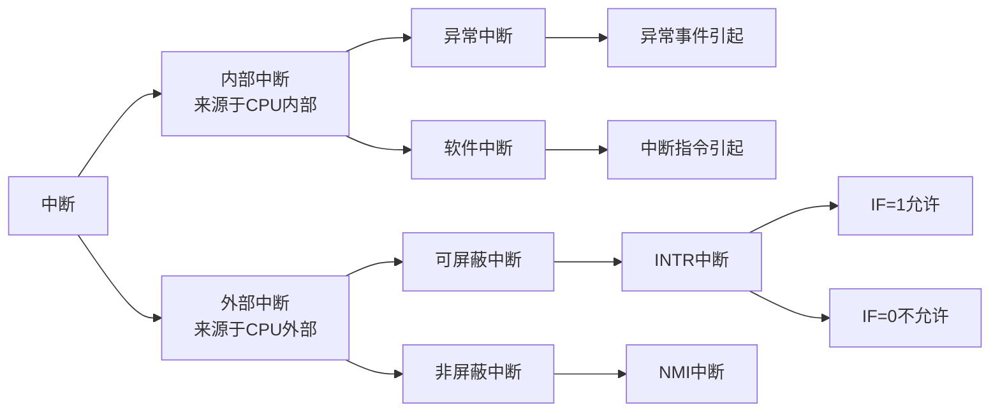

[toc]

# 第 7 章 输入输出

## 1. 概述

### 1.1. 概念

- 计算机通过外围设备同外部世界==通信或交换数据==，称为输入输出。
- 将外围设备和计算机连接起来实现数据传送的控制电路称为外设接口电路（或 I/O 接口电路），简称外设接口（或 I/O 接口）。
- ==外围设备==和==外设接口==以及==相应的软件==组成输入输出系统，实现输入输出功能。

![[public/wj8086/07/io25.png]]

### 1.2. I/O 系统演变过程

#### 1.2.1. 早期

以 CPU 为核心，CPU 与 I/O 系统分散连接，I/O 系统与 CPU 是一种==串行工作==的方式。

早期 I/O 的控制方式叫做程序==查询方式==

![[public/wj8086/07/io01.svg]]

#### 1.2.2. 接口模块和 DMA 阶段

CPU 和 I/O 并行工作，通过总线连接

##### 中断方式

只有 ==I/O 设备准备就绪并向 CPU 发出中断请求==，这个时候才予以响应。

##### DMA 方式

==主存==和==高速 I/O 设备==之间有一条==直接数据通路==，当主存和高速 I/O 设备之间进行信息交互时，无需调用中断服务程序。

![[public/wj8086/07/io02.svg]]

#### 1.2.3. 具有 I/O 通道结构的阶段（具有 I/O 处理机的阶段）

在系统中设有通道控制部件，每个通道都==挂有若干外设==，主机在执行 I/O 命令时，只需要==启动有关通道==，通道==执行对应的通道程序==，从而完成 I/O 操作。

![[public/wj8086/07/io03.svg]]

### 1.3. I/O 系统的基本组成

#### 1.3.1. I/O 软件

驱动程序、用户程序、管理程序、升级补丁等

通常采用 ==I/O 指令和通道指令==实现 ==CPU 和 I/O 设备的信息交换==

##### I/O 指令

I/O 指令属于 ==CPU 指令的一部分==，所以需要通过==操作码部分==进行识别


| 操作码   | 命令码     | 设备码         |
| -------- | ---------- | -------------- |
| I/O 指令 | 进行何操作 | 对哪个设备操作 | 

##### 通道指令

指出数据的首地址、传送字数和操作命令

通道指令是==通道自身的指令==，因为放置在主存当中所以需要知道==指令存放的首地址==，CPU执行启动I/O设备的指令后==由**通道**代替 CPU 对 I/O 设备进行管理==

#### 1.3.2. I/O 硬件

![[public/wj8086/07/io04.svg]]

外部设备、设备控制器和 I/O 接口、I/O 总线等

- ==**设备控制器**和机、电、光、磁等机械部分==共同构成了外部设备。
- 设备控制器对机械部分发出对应的电信号对相应的设备进行控制。
- I/O 接口作为外部设备和主机之间==信息交互的交接部分==。

### 1.4. I/O 接口

#### 1.4.1. 需要解决的问题

- 速度匹配：数据的缓冲与暂存
- 信号的驱动能力：信号驱动
- 信号形式和电平的匹配：信号类型的转换
- 信息格式：信号格式的转换
- 时序匹配（定时关系）：时钟发生器
- 总线隔离：三态门

#### 1.4.2. I/O 接口电路中应该具有的设备

- **输入输出数据锁存器和缓冲器**，用以解决 ==CPU 与外设之间速度不匹配矛盾==，起隔离和缓冲作用
- **控制命令和状态寄存器**，存放 CPU 对外设的==控制命令和外设状态信息==
- **地址译码器**，选择接口电路中不同端口（寄存器）
- **读写控制逻辑**
- **中断控制逻辑**

#### 1.4.3. I/O 接口的基本结构

![[public/wj8086/07/io05.svg]]

##### 内部接口

内部接口与系统总线相连，实质上是与内存、CPU 相连。数据的传输方式==只能是并行传输==

##### 外部接口

==外部接口通过接口电路与外设相连接==，外部接口的数据传输可能是串行方式也可能是并行的，因此 ==I/O 接口需具有串/并转换功能==

![[public/wj8086/07/io06.svg]]

### 1.5. I/O 端口的寻址方式

计算机系统中包含各类不同功能的接口电路，每个接口中==包含一个或多个端口==

#### 1.5.1. 寻址方式

- 先找到端口所在的==接口电路芯片==→**片选**
- 再在该芯片上找==具体访问的端口==→**片内寻址**
- 如果接口中==仅有一个端口==，则找到接口即找到端口
- 如果接口中==有多个端口==，则找到接口后再找端口

![[public/wj8086/07/io07.svg]]

#### 1.5.2. 寻址能力

- 寻址内存：1 MB（20位地址码）
- 寻址端口：64 KB（16 位地址码）

#### 1.5.3. 寻址方式

##### 存储器对应输入/输出方式

> 与内存==统一编址==

把 I/O 端口作为==存储器的一个单元==来对待，每一个外设端口==占有存储器的一个地址==，用统一的==访存指令==访问 I/O 端口，又称==**存储器映射方式**==。

从外部设备输入一个数据，作为一次==存储器读==的操作；而向外部设备输出一个数据，则作为一次==存储器写==的操作。

需要靠==不同的地址码==来区分内存和 I/O 设备，I/O 地址要求==相对固定在地址的某部分==。

![[public/wj8086/07/io08.svg]]

优点

- CPU 对外设的操作==可使用全部的存储器操作指令==，故指令多，使用方便。例如，可以对外设中的数据进行算术和逻辑运算（存于外设的寄存器中），或是进行循环或移位等
- 内存和外设的==地址分布图是同一个==
- 不需要专门的输入/输出指令以区分是存储器还是 I/O 操作的控制信号

缺点

- 外设占用了存储器地址，使内存容量变小
- 访问 I/O 端口和访问内存一样，由于访问内存时的地址长，指令的机器码也长，执行时间会增加

##### 端口寻址的输入输出方式（==独立编址==）

I/O 端口地址与存储器地址==无关==，CPU 有==专门的 I/O 指令==，用地址来区分不同的外设，又称 ==I/O 映射方式==。

但要注意实际上是以==端口（Port）==作为地址的单元，因为一个外设不仅有数据寄存器还有状态寄存器和控制命令寄存器，它们各需要一个端口才能加以区分，故一个外设往往==需要数个端口地址==。CPU 用地址来选择外设。

![[public/wj8086/07/io09.svg]]

   
- 端口寻址方式需要通过==控制线==来区分是==寻址内存还是外设==，对应 8086 采用 $IO/\overline{M}$ 信号状态区分；
- I/O 寻址状态时==高位地址线 $A_{16}\sim A_{19}$ 默认为零==即处于无效状态，采用 $A_0\sim A_{15}$ 进行寻址；
- 可寻址的 I/O 端口数为 ==64K（65536）个==，I/O的地址范围为：0000 ～FFFFH（理论情况，实际不会使用这么多，例如 IBM PC只使用1024个 I/O 地址，对应地址范围为：000 ～ 3FFH）。

优点

- 端口寻址的输入/输出方式下==输入/输出指令==与==存储器指令==有明显的区别，程序的编制清晰，便于理解；

缺点

- 输入/输出指令少，一般==只能对端口进行传送操作==，尤其需要 CPU 提供存储器读/写、I/O 设备读/写两组控制信号，增加了控制的复杂性。

###### I/O 地址译码 确定端口地址

- 参加译码的信号
    - $\overline{IOR},\overline{IOW}$, 高位地址信号
- 端口读/写的产生条件
    - $IO/\overline{M}=1$
    - $\overline{RD}=0\Rightarrow\overline{IOR}=0$, `IN` 指令使之有效
    - $\overline{WR}=0\Rightarrow\overline{IOW}=0$, `OUT` 指令使之有效

- 当接口只有==一个端口==时：
    - 无片内地址，==全部地址信号均为高位地址==（可全部参与译码），译码输出直接选择该端口；
- 当接口有==多个端口==时：
    - 16 位地址线的高位参与译码，用来==决定接口的基地址==，而低位用于确定要访问哪一个端口。
    - 由于端口资源丰富，端口地址译码常==采用部分译码方式==以减少控制线的数量。

### 1.6. CPU 与 I/O 之间传送的信息

### 1.6.1. 数据信息

- 数字量：二进制形式表示的数或以 ASCII 表示的数或字符；
- 模拟量：传感器采集到的非电量转换为电量并放大得到模拟电压或电流；
- 开关量：两个状态的量用来例如开关的合与断。

### 1.6.2. 控制信息

- 控制输入输出设备启动与停止

### 1.6.3. 状态信息

- 输入时判定设备是否准备好（Ready）；
- 输出时，判断输出设备是否有空（Empty）；
- 若输出设备正在输出，以忙（Busy）指示。

### 1.7. CPU 的输入输出时序

由于 I/O 接口电路的==工作速度较慢==，往往需要==插入等待状态==。

所有基本 I/O 操作往往需要等待时间，所以需要基本 I/O 操作五个时钟周期：T1、T2、T3、Tw 和 T4

![[public/wj8086/07/io26.png]]

### 1.8. I/O 接口的分类

#### 1.8.1. 按数据传送方式

- 并行接口：一个字节或一个字所有位同时传送
- 串行接口：一位一位地传送

```ad-caution
这里的数据传送方式指的是外设和接口一侧的传送方式，在主机和接口一侧，数据总是并行传送的。接口要完成数据格式转换。
```

![[public/wj8086/07/io27.png]]

#### 1.8.2. 按主机访问I/O设备的控制方式

- 程序查询接口：在传送前必须查询一下外设的状态，当外设准备就绪再传送，若未准备好，则 CPU 等待；
- 中断接口：当外设已做好与 CPU 进行交互的准备，此时外设向 CPU 发出==中断请求==，CPU 暂停当前工作转而去取外设进行信息交互；
- DMA 接口：I/O 设备与内存之间直接进行信息交互而==不通过 CPU==。

#### 1.8.3. 按功能选择的灵活性

- 可编程接口：接口的功能和操作方式是可以通过编程来进行改变的；
- 不可编程接口：不可以通过程序来改变对应接口的功能；

通过地址信号线选中对应的芯片接口后，由于==接口芯片中各硬件单元不是固定使用==的，可以由用户通过编程的手段进行选择，即通过==计算机命令==来选择==不同的通道==和==不同的电路功能==就称为编程控制。而可以完成这一功能，实现编程控制的接口就是可编程接口。

#### 1.8.4. 按传输信息的方向

- 输入接口
    - 需要对数据有控制能力：三态门
- 输出接口
    - 需要对数据具有锁存能力：锁存器


## 2. CPU与外设数据传送的方式

### 2.1. 无条件传送方式

- 要求外部设备总是处于准备好状态；
- 优点：软件及接口硬件简单
- 缺点：只适用于简单外设，适应范围较窄
- 应用：LED 数码管、按键或按钮等

通常采用的方法是==将 I/O 指令插入到程序中==，当程序执行到该 I/O 指令时，==外设必定已经为传送数据做好准备==，于是在此指令时间内完成数据传送任务

![[public/wj8086/07/io28.png]]


###### $\overline{IORC}$ 为低电平，$A_0$ 为高电平，与门的输出为高电平，那么对应与门的输入应该是多少？

A9~A0=1011110001=2F1H=接口电路地址

```nasm
MOV DX, 2F1H
IN AL, DX
```

###### $\overline{IOWC}$ 为低电平，$A_0$ 为低电平，或门的输出为高电平，那么对应或门的输入应该是多少？假设这个时候 LED 灯亮或者灯灭的状态字为 01010101B 即 LED7、LED5、LED3、LED1 灯亮，将对应的状态字表示为 LEDST

A9~A0=1011110000=2F0H=接口电路地址

```nasm
MOV AL, LEDST
MOV DX, 2F0H
OUT DX, AL
```

### 2.2. 查询传送方式

- 特点
    - 仅当条件满足时才能进行数据传送；
    - 每==满足一次条件==只能==进行一次信息交换==。
- 适用场合
    - 外设并不总是准备好；
    - 对传送速率和效率要求不高。
- 工作条件
    - 外设应提供==设备状态信息==；
    - 接口应具备==状态端口==。
- 优点
    - 软硬件简单；
- 缺点
    - CPU 效率低，数据传送的实时性差，速度较慢。

#### 2.2.1. 查询式输入

![[public/wj8086/07/io10.svg]]

![[public/wj8086/07/io29.png]]

- 读入的==数据是 8 位或 16 位==；
- 读入的==状态信息往往是 1 位==的，所以不同外设的状态信息可以使用同一个端口，只要使用其中的不同位就可以了。

| 数据端口 8 位 | D7  | D6  | D5  | D4  | D3  | D2  | D1  | D0  | 
| ------------- | --- | --- | --- | --- | --- | --- | --- | --- |
| 状态端口 1 位 | D7  | XX  | XX  | XX  | XX  | XX  | XX  | XX   |

```nasm
POLL: IN    AL, STATUS_PORT ; 从状态端口输入状态信息
      TEST  AL, 80H         ; 检查READY是否为1
      JE    POLL       		; 未READY，循环
      IN    AL, DATA_PORT  	; READY，从数据端口输入数据
      MOV   [BX], AL        ; 存入[BX]
```

#### 2.2.2. 查询式输出

![[public/wj8086/07/io11.svg]]

![[public/wj8086/07/io30.png]]

- 输出的数据是8位；
- 状态信息是1位的。

| 数据端口 8 位 | D7  | D6  | D5  | D4  | D3  | D2  | D1  | D0  | 
| ------------- | --- | --- | --- | --- | --- | --- | --- | --- |
| 状态端口 1 位 | D7  | XX  | XX  | XX  | XX  | XX  | XX  | XX   |

```nasm
POLL:  IN   AL, STATUS_PORT	; 从状态端口输入状态信息
       TEST AL, 80H		    ; 检查BUSY位
       JNE  POLL			; BUSY则循环等待
       MOV  AL, STORE		; 否则，从缓冲区取数据
       OUT  DATA_PORT, AL	; 从数据端口输出
```

#### 2.2.3. 采用查询方式的数据采集系统

![[public/wj8086/07/io31.png]]

```nasm
START:  MOV  DL, 0F8H       ; 设置启动A/D转换的信号11111000
        LEA   DI, DSTOR     ; 存放输入数据缓冲区的地址偏移量→DI
AGAIN:  MOV	AL, DL
        AND	 AL, 0EFH       ; 使D4=0
        OUT   [4], AL       ; 停止A/D转换
	    CALL  DELAY         ; 等待停止A/D操作的完成
	    MOV	 AL, DL
        OUT	[4], AL	        ; 启动A/D，且选择模拟量A0
POLL:   IN	AL, [2]	        ; 输入状态信息
        SHR	AL, 1
        JNC   POLL	        ; 若未READY，程序循环等待 CF为0进行等待
        IN     AL, [3]	    ; 否则，输入数据
        STOSB	            ; 存至内存
        INC    DL	        ; 修改多路开关控制信号，指向下一个模拟量
        JNE     AGAIN       ; 8个模拟量未输入完，循环
      	…                  ; 输入完，执行别的程序段
```

![[public/wj8086/07/io12.svg]]

### 2.3. 中断传送方式

> 该部分会在 8259A 中详细阐述

在程序中安排好在某时刻启动外设，CPU 继续执行其主程序，外设完成数据传送准备后，向 CPU 发出==“中断请求”信号==，在 CPU 可以响应中断条件下，==主程序被“中断”==，转去执行==“中断服务程序”==，在“中断服务程序”中完成 CPU 与外设之间数据传送，==完成后仍返回主程序==，从断点处继续执行。==在**一定程度上**实现了主机和外设的并行工作==。

- 优点
    - CPU 效率高，实时性好，速度快。
- 缺点
    - 程序编制相对较为复杂。

![[public/wj8086/07/io32.png]]

##### 上述三种 I/O 方式的共性
- 信息的传送均需通过CPU。
- 软件
    - 外设和内存之前的数据传送是通过 CPU 执行程序来完成的。
- 硬件
    - I/O 接口和存储器的读写控制信号、地址信号都是由 CPU 发出的。
- 缺点
    - 程序的执行速度限定了传送的最大速度。

### 2.4. 直接数据通道传送方式（DMA）

#### 2.4.1. 特点

- CPU 掌握总线控制权
    - I/O 过程由 CPU 控制
    - 地址信号、控制信号均由 CPU 产生
    - 对于高速外部设备效率较低
- DMA 控制器控制信号线和总线
    - 外设==直接与存储器==进行数据交换，CPU 不再担当数据传输的中介者；
    - CPU ==只启动而不干预==这一传送过程，整个传送过程==由硬件完成==而不需软件介入，在 DMA 传送方式中，对这一数据传送过程进行控制的硬件称为 DMA 控制器（DMAC）。
    - 数据传送由 ==DMA 硬件来控制==，数据直接在内存和外设之间交换，可以达到很高的传输速率；==控制复杂==，硬件成本相对较高。

![[public/wj8086/07/io13.svg]]

![[public/wj8086/07/io14.svg]]

![[public/wj8086/07/io15.svg]]

#### 2.4.2. DMAC需要实现的功能

- 能接收外设的请求，==向 CPU 发出 DMA 请求信号==。
- 当 CPU 发出 DMA 响应信号之后，接管对总线的控制，进入 DMA 方式。
- 能寻址存储器，即能==输出地址信息和修改地址==。
- 能向存储器和外设发出相应的读/写控制信号。
- 能控制传送的字节数，==判断 DMA 传送是否结束==。
- 在 DMA 传送结束以后，能结束 DMA 请求信号，==释放总线==，使 CPU 恢复正常工作。

![[public/wj8086/07/io33.png]]

#### 2.4.3. DMA 传送方式

##### 单字节方式

每次 DMA 都==只传送一个字节数据==，每传送完一个字节的数据之后，都撤除 DMA 请求信号，释放总线。

##### 字节（字符）组方式

每次 DMA 都==传送一个数据块==，==规定长度的==数据块传送完之后，撤除 DMA 请求信号，释放总线。

### 2.5. 简单的 I/O 接口芯片

在外设接口电路中，经常需要对传输过程中的信息进行==放大、隔离和锁存==，能实现上述功能的接口芯片最简单的就是

- 缓冲器
- 数据收发器
- 锁存器

#### 锁存器 74LS373

一种 8D 锁存器，具有三态驱动输出

![[public/wj8086/07/io34.png]]

    
|  使能G   | 输出允许OE# | 输入D | 输出Q |
|:--------:|:-----------:|:-----:|:-----:|
|    H     |      L      |   L   |   L   |
|    H     |      L      |   H   |   H   |
| 从H到L后 |      L      |   X   |  Q0   |
|    X     |      H      |   X   |   Z   |

## 3. 中断系统

### 3.1. 基本概念

#### 3.1.1. 描述

- 处理器在执行程序时，被==内部或外部的事件打断==，转去执行==一段特殊的服务程序==；服务结束后，返回原来的断点，==继续执行原来的程序==，这个过程称为中断。
- 概念中的事件，即==引起中断的原因==，或者说能发出中断请求的来源，被称为中断源。
- CPU 转去执行的一段特殊的服务程序就是==中断服务程序==。

![[public/wj8086/07/io16.svg]]

#### 3.1.2. 引入中断的原因

- 提高对外设请求的响应==实时性==；
- ==提高 CPU 的利用率==，即避免了 CPU 不断检测外设状态的过程。

![[public/wj8086/07/io17.svg]]

#### 3.1.3. 中断类型

根据中断请求的来源，中断可以分为



### 3.2. 中断系统的功能

#### 3.2.1. 功能

- 实现中断及返回
- 能实现优先权排队
- 高级中断源能中断低级的中断处理

![[public/wj8086/07/io18.svg]]

实现中断及返回

- 保存断点（下条指令的地址）
- 各寄存器数据
- 标志位状态
- 关中断（清除中断请求触发器）

#### 3.2.2. 简单的中断情况

##### 设置中断请求触发器

每一个中断源，要能发出中断请求信号，且这个信号能**保持**着，==直至 CPU 响应这个中断后==，才可清除中断请求

![[public/wj8086/07/io35.png]]

##### 设置中断屏蔽寄存器

在实际系统中，往往有==多个中断源==。为了增加控制的灵活性，在每一个外设的接口电路中，增加了一个==中断屏蔽触发器==，只有当此触发器为“1”时，外设的中断请求才能被送至 CPU

ppt 17课 p31

##### 中断是开放的

在 CPU 内部有一个==中断允许触发器==。只有当其为“1”时（即中断开放时），CPU 才能响应中断；若其为“0”（即中断是关闭的），即使 INTR 线上有中断请求，CPU 也不响应；

这个触发器的状态可由 `STI` 和 `CLI` 指令来改变。当 CPU 复位时，中断允许触发器为“0”，即关中断，所以必须要用 `STI` 指令来开中断。当中断响应后，==CPU 就自动关中断==，所以在中断服务程序中必须要用 `STI` 指令来开中断

##### 中断明确条件

CPU 在==现行指令结束后==响应中断，即运行到指令的==最后一个机器周期的最后一个T==状态时，CPU 才采样 INTR 线；

若发现有中断请求，则把内部的中断锁存器置“1”，然后下一个机器周期（总线周期）==不进入取指周期，而进入中断周期==。

##### CPU 对中断的响应

###### 关中断

8086 在 CPU ==响应中断后==，在发出中断响应信号 $\overline{INTA}$ 的同时，内部自动地实现关中断，不再处理其它中断请求

###### 保留断点

CPU 响应中断，封锁 IP+1，且把 ==IP 和 CS== 推入堆栈保留，以备中断处理完毕后，==能返回主程序的正确位置==

###### 保护现场

为了使中断处理程序不影响主程序的运行，故要把断点处的==有关寄存器==的内容和==标志位的状态==，推入==堆栈==保护起来。

8086 是由==软件==（即在中断服务程序中）把这些寄存器的内容推入（利用PUSH指令）堆栈的。

###### 给出中断入口 转入相应的中断服务程序

8086 由==中断源==提供的==中断向量==形成==中断入口地址==（即中断服务程序的起始地址）

###### 恢复现场

把所保存的各个内部寄存器的内容和标志位的状态，==从堆栈弹出==（利用 `POP` 指令），送回 CPU 中的原来位置。这个操作在 8086 中也是由服务程序来完成的。

###### 开中断与返回

在中断服务程序的最后，要==开中断==（以便CPU能响应新的中断请求）；

安排一条==中断返回指令==，将堆栈内保存的 ==IP 和 CS 值==弹出，运行被恢复到主程序。


##### 中断优先权

当有多个中断源同时请求时，CPU 就要识别出是==哪些中断源有中断请求==，辨别和比较它们的优先权（Priority），先响应优先权==级别最高==的中断申请。

另外，当 CPU 正在处理中断时，也要==能响应更高级的中断申请==，而==暂时屏蔽同级或较低级==的中断请求。

```ad-note
title: 判定方法

- 软件方法：通过==查询软件==以确认有哪些外设申请中断，并判定他们的优先权；
- 硬件方法：采用==硬件编码器和比较器的优先权==排队电路构成，编码电路==为每个中断进行编号==，比较电路负责比较编号的大小，编号的大小对应优先权的高低
```

###### 软件查询方法

软件查询是用==程序查询==接在中断线上的每一个外设。查询程序==依次读出每一个外设的中断状态位==，通过测试该状态位来==判断对应的外设是否发出过中断请求==，若是，则转到相应的中断服务程序。

![[public/wj8086/07/io19.svg]]

软件查询方式中，==询问的次序即为优先级的次序==，不需要有判断和确定优先级的硬件排队电路。其缺点是中断源较多的情况下，由询问到转至相应的中断服务程序入口的时间较长

```c
void interrupt() {
    if (device_a) {
        process(int_a); iret;
    } else if (device_b) {
        process(int_b); iret;
    } else if (device_c) {
        process(int_c); iret;
    } else { ... }
}
```

###### 硬件查询方法

硬件查询确定优先级是通过硬件电路来确定中断优先级。

链式中断优先权排队电路设计的基本思想是：将所有的设备连成一条链，==最靠近 CPU 的设备优先级别最高，离 CPU 越远的设备优先级别越低==。

链式中断优先权排队==电路较为简单、易实现==，但缺点是链不能太长，否则链尾设备可能总得不到服务。

![[public/wj8086/07/io36.png]]

### 3.3. 8086 的中断方式

![[public/wj8086/07/io20.svg]]

8086 规定这些中断的==优先权次序==为：内部中断、NMI、INTR，优先权最低的是单步执行。

#### 3.3.1. 外部中断

##### 可屏蔽中断

CPU 是否响应在这条线上出现的中断请求取决于标志位IF的状态，若 IF=1，则 CPU 响应 INTR 请求；若 IF=0，则 CPU 不响应对应中断请求。

IF位的状态，可以用指令 `STI` 为其置位（开中断）；可以用指令 `CLI` 来进行复位（关中断）；

注意：在系统复位以后，标志位 IF=0；另外任一中断被响应之后，IF=0。所以必须在一定时候用 `STI` 指令来开放中断

##### 非屏蔽中断

#### 3.3.2. 内部中断

##### 指令中断

INT n

##### 异常中断

溢出中断 4
断点中断 3
单步中断 1
 除数为零 0

##### 中断类型号

为了更好的区分不同的中断源，8086/8088 CPU 为每个中断源分配了一个中断类型号，中断类型号的范围为 0 到 255（00F ～ FFH）；

根据中断类型号的不同，整个系统可以处理 256 种不同的中断。这些中断类型，部分是==专用中断、硬件中断、基本外设的 I/O 驱动程序和 BIOS 中调用的有关程序及 DOS 操作系统==使用，用户可以调用其中的 20H～27H 号中断， 40H～FFH 号中断可以由用户程序安排使用。

##### 中断向量

中断服务程序的入口地址，即 `段基址CS:偏移址IP`，每个占 4 字节。

##### 中断向量表

把系统中==所有的中断向量==按照一定的规律排列成一个表，这个表就称为中断向量表；

8086/8088 系统规定在==内存的最低 1K 字节==（0 段的 0000H～03FFH）建立中断向量表，按中断类型号顺序存放 256 个中断向量


| 地址 |  值   |    注解    |
| ----:|:-----:|:----------:|
| 3FEH | CS255 |  用户中断  |
| 3FCH | IP255 | 向量号255  |
|  ... |  ...  |    ...     |
|  0AH |  CS2  | 非屏蔽中断 |
|  08H |  IP2  |  向量号2   |
|  06H |  CS1  |  单步中断  |
|  04H |  IP1  |  向量号1   |
|  02H |  CS0  | 除法错中断 |
|  00H |  IP0  |  向量号0   |

###### 例：8号中断的中断向量CS8：IP8，存放在存储器的什么位置？

0000+8×4=20H，其中 0000H 表示中断向量表的偏移地址；

8×4 表示 8 号中断的中断向量存放在存储器的 20H 开始的连续 4 个字节内。

给定中断类型号n，其对应的中断向量保存在`[4n+3][4n+2]:[4n+1][4n]`

每个中断类型号对应一个中断服务程序，8086 系统中中断类型号是==固定不变的==；每个中断类型号对应的中断向量是==可以修改==的（专用向量除外）；中断系统中有相当部分的中断源是没有定义的，即中断源空着，等待分配。

###### 设置中断向量表

- 系统设置
    - 系统加电时，存放在系统 ROM 中的 ==BIOS 负责设置 BIOS 定义的中断向量表==。
    - 启动操作系统 DOS 时，==DOS 程序负责设置 DOS 定义的中断向量表==。
- 用户设置
    - 用户自定义某个中断时，用户负责设置自定义类型号的中断向量表：==直接写入法和系统功能调用法==。

####### 直接写入法

直接将中断类型号N对应的中断向量写入中断向量表，设定中断服务程序的标号为 INT-N

```nasm
MOV   AX, 0
MOV   DS, AX	         ; DS段寄存器为0
MOV   BX, N*4			 ; 中断类型号N
MOV   AX, OFFSET INT-N	 ; 中断程序入口标号INT-N
MOV   DS:[BX], AX		 ; 设置中断向量的IP值
MOV   AX, SEG INT-N
MOV   DS:[BX+2], AX		 ; 设置中断向量的CS值
```

####### 系统功能调用法

用 DOS 功能调用 25H 号子功能设置中断向量表入口参数：

- 中断类型号：AL
- 中断程序入口段地址：DS
- 中断服务入口偏移地址：DX

```nasm
PUSH DS
MOV  AX, SEG INT-N
MOV  DS, AX			    ; DS=中断向量的CS值
MOV  DX, OFFSET INT-N	; DX=中断向量的IP值
MOV  AL, N			    ; AL=中断类型号N
MOV  AH, 25H			; AH=子功能号25H
INT  21H                ; 系统功能调用
POP  DS
```

#### 3.3.3. 中断响应过程

##### 外部中断

- CPU 在==当前指令周期的最后一个 T 状态==采样中断请求输入信号。
    - 如果有==可屏蔽==，且 CPU 处于==开中断状态==（IF 标志为 1），则 CPU 转入两个连续的中断响应周期，在第二个中断响应周期的 $T_4$ 状态前沿，采样数据线获取由外设输入的中断类型码；
    - 若采样到==非屏蔽==中断请求，则 CPU 不经过上述的两个中断响应周期，而在内部自动产生中断类型码 2。

![[public/wj8086/07/io37.png]]

##### 软件中断

对于软件中断，中断类型码自动形成

| 中断功能 | 中断类型码 |
|:--------:|:----------:|
|  被零除  |     0      |
|   单步   |     1      |
|   断点   |     3      |
|   溢出   |     4      |

对于 INT n 指令，中断类型码即为指令中给定的 n

###### 中断优先级

软件中断 > NMI > INTR > 单步中断

![[public/wj8086/07/io38.png]]

###### 8086在取得中断类型码之后的处理顺序

- 将==中断类型码乘 4==，作为中断向量表的指针；
- 把 CPU 的标志寄存器入栈，保护各个标志位，此操作类似于 `PUSHF` 指令；
- 复制追踪标志 TF 的状态，接着==清除 IF 和 TF 标志==，屏蔽新的 INTR 中断和单步中断；
- ==保存主程序中的断点==，即把主程序断点处的 IP 和 CS 值推入堆栈保护，先推入 CS 值，再推入 IP 值；
- 从中断向量表中==取中断服务程序的入口地址==，分别送至 CS 和 IP 中，先取 CS 值；
- 按新地址执行中断服务程序。

## 4. 8259A

### 4.1. 介绍

#### 4.1.1. 描述

Intel 8259 中断控制器是集合==中断源识别、中断屏蔽、中断优先权排队、中断类型号提供==等功能的，专用于微机系统 INTR 类中断管理的大规模集成电路芯片

#### 4.1.2. 主要功能

- 中断源管理：单片 8259 可管理 ==8 级中断==，最多可扩展管理 64 级，主从式的中断管理
- 中断类型号：当 8259 中断响应时，可提供相应的中断类型号，中断类型号可以是由用户设定的 8 个连续类型号。
- 中断屏蔽管理：8259 对任何一级中断源可屏蔽/允许
- 中断优先管理： 8259 可选择多种中断优先权排队模式。
- 8259可以通过编程设定各种工作方式

#### 4.1.3. 引脚

- 与CPU总线的连接
    - 地址总线：$\overline{CS}$， $A_0$（选择内部不同寄存器）
    - 数据总线：$D_7\sim D_0$
    - 控制总线：$\overline{WR}$ ，$\overline{RD}$
- 中断请求/允许信号
    - INT，$\overline{INTA}$（发出中断请求/接收中断响应）
    - 外设请求信号：$IR0\sim IR7$。
- 电路扩展
    - $CAS0\sim CAS2$，级联时对从片选择，最多 8 片；无扩展时悬空
    - $\overline{SP}/\overline{EN}$ ，从设备编程/缓冲器允许的双功能。
        - 当其为输入时，8259A 处于非缓冲方式，执行编程SP控制，主片接高电平（SP=1），从片接低电平（SP=0）。
        - 当其为输出时，8259A 处于缓冲器方式下，该信号用来控制双向总线驱动器的启动（EN）端，执行EN功能，控制总线信号的收发方向。

![[public/wj8086/07/io39.png]]

![[public/wj8086/07/io40.png]]

#### 4.1.4. 内部结构

- 与CPU总线
    - 数据总线缓冲
    - 读/写控制逻辑
- 中断过程管理接口
    - 中断请求寄存器IRR
    - 中断屏蔽寄存器IMR
    - 中断服务寄存器ISR
- 中断工作方式管理接口
    - 初始化命令寄存器组
    - 操作命令寄存器组
- 中断级联扩展
    - 级联缓冲器/比较器

![[public/wj8086/07/io22.svg]]

==IRR、IMR、ISR、PR 和控制逻辑== 5 个部分是实现中断优先级管理的核心部件。

1. 数据总线缓冲器：是 ==8 位三态双向缓冲器==，通常和 CPU 系统总线中的 D7～D0 相连接，在读写逻辑的控制下实现 CPU 与 8259A 之间的信息交换。
2. 读写电路：根据 CPU 送来的==读写信号和地址信息==，通过数据总线缓冲器完成 CPU 对 8259A 的所有写操作和读操作。
    - 8259A 只有两个 I/O 端口地址，由 CS 和 A0 输入的地址信息决定，一般 ==CS== 应连接到 I/O 地址译码器的输出端，而 ==A0== 端通常是和地址总线 A0 或 A1 相连接。
3. 级联缓冲器/比较器：为实现多片 8259A 的==级联应用==而设计。在级联应用中只有一片 8259A 为主片，其他均为从片，但最多不能超过 9 片（包括主片）。

各从片 8259A 的 INT 将与主片 8259A 的 IRx 相连接，而它们的 3 个级联信号 CAS0～2 将分别与主片相连接。

主 8259A 在第一个 $\overline{INTA}$ 响应周期内通过 CAS0～2 送出 3 位识别码，与此识别码相符的从 8259A 将在第二个 $\overline{INTA}$ 响应周期内释放中断类型码到数据总线，使 CPU 进入相应的中断处理程序。

![[public/wj8086/07/io24.svg]]

#### 4.1.5 8259A 的工作方式

##### 完全嵌套方式

- 一种按==固定的优先级==来管理中断的方式。
- 8259A 的 IR0，IR1,…,IR7 共 8 个中断源的中断优先级队列中，固定为 ==IR0 的优先级最高， IR1 次之，IR7 最低==。
- 如果 8259A 初始化未对中断优先级管理方式编程，则 8259A 就自动进入此方式。
- ==级联工作方式下==固定的优先级为特殊全嵌套方式。
- 特殊全嵌套方式下可以实现同级中断申请打断当前中断申请。这里的同级是相对于主片而言的。

##### 自动循环方式

- 一个中断请求的中断服务结束后，中断优先级==降为最低==，中断队列中其余中断源优先级相应作循环变化。

##### 特殊循环方式

- 可通过在主程序或中断服务程序中发出特殊循环方式操作命令来==指定某个中断源的优先级为最低级==，而其余中断源的优先级也随之循环变化

##### 特殊屏蔽方式

- 某些中断应用场合希望一个中断服务程序能==动态地改变==中断系统的优先级结构。
    - 例如，在执行中断服务程序某一部分中要求==禁止较低优先级==中断请求，但在执行中断服务程序另一部分又允许较低优先级中断请求；
- 在中断服务程序中用中断屏蔽命令屏蔽正在服务的中断优先级，同时使中断服务寄存器中对应当前中断优先级的位==自动清 0==，不仅屏蔽了当前正在处理的本级中断，还真正开放了其他较低优先级的中断请求。

##### 查询排序方式

- 用==软件查询方法==来响应与 8259A 相连接的 8 级中断请求；
- 这种方式下 8259A 的 ==INT 引脚可以不连接在 CPU 上==，CPU 先用操作命令字发送查询命令到 8259A，再用输入指令==读取 IRR 寄存器==的状态，并识别当前有无中断请求及优先级最高的中断请求。

##### EOI 命令方式（非自动中断结束方式）

- 普通 EOI：自动清除ISR中所有已置位的位中==优先级最高==的那一位，适用于完全嵌套方式的中断结束。
- 特殊 EOI：带有用于指定ISR中相应位复位的 3 位编码信息，可以作为任何中断优先级管理方式的中断结束命令。

##### AEOI命令方式（自动中断结束方式）

- 在第二个 $\overline{INTA}$ 响应信号的后沿由8259A自动执行普通 EOI 操作，复位 ISR 中已置位的中断优先级最高的位（不适用于嵌套方式）。

### 4.2. 8259A 的编程

#### 4.2.1. 初始化编程

- 8259 工作之前，必须设置 2～4 个字节的==初始化命令字 ICW==，使 8259 处于初始化工作方式状态。
- 8259 共有 4 个初始化命令字 ==ICW1～ICW4==。

##### ICW1

中断请求信号，单片和级联的选择

- A0 : ICW1 初始化命令写入==偶地址==，A0 应该为0
- D4 : ICW1 的特征标志位，置 1
- D3 : IRx 输入触发方式选择（1 为高电平，0 为上升沿）
- D1 : 单片 1/级联 0 选择
- D0 : ICW4 选择

| A0  |     | D7  | D6  | D5  | D4  |  D3  | D2  |  D1  | D0  |
|:---:|:---:|:---:|:---:|:---:|:---:|:----:|:---:|:----:|:---:|
|  0  |     |  X  |  X  |  X  |  1  | LTIM |  X  | SNGL | IC4 |

##### ICW2

设置 8259A 对应的中断类型码

- A0 : ICW2 初始化命令写入==奇地址==，A0 应该为1
- T7~T3 : 由程序设定的中断类型码的高五位内容
- D2 到 D0 由用户编程时写入，基于 IR0~IR7 的引脚序号自动形成，初始化的时候无需设值

| A0  |     | D7  | D6  | D5  | D4  | D3  | D2  | D1  | D0  |
|:---:|:---:|:---:|:---:|:---:|:---:|:---:|:---:|:---:|:---:|
|  1  |     | T7  | T6  | T5  | T4  | T3  |  X  |  X  |  X  |

##### ICW3

主/从片初始化命令

- ICW3 初始化命令写入==奇地址==，A0 应该为 1
- Sx = 1 表示 Irx 端有从片 8259，0 表示无

###### 主片

| A0  |     | D7  | D6  | D5  | D4  | D3  | D2  | D1  | D0  |
|:---:|:---:|:---:|:---:|:---:|:---:|:---:|:---:|:---:|:---:|
|  1  |     | S7  | S6  | S5  | S4  | S3  | S2  | S1  | S0  |

###### 从片

ID2~ID0 表明从片的输出 INT 连接在主片的哪一个输入引脚（3-8 译码）

| A0  |     | D7  | D6  | D5  | D4  | D3  | D2  | D1  | D0  |
|:---:|:---:|:---:|:---:|:---:|:---:|:---:|:---:|:---:|:---:|
|  1  |     |  X  |  X  |  X  |  X  |  X  | ID2 | ID1 | ID0 |

##### ICW4

设定 8259A 在级联方式下的优先级管理方式、主／从状态、自动中断结束方式以及SP／EN引脚的功能等

| A0  |     | D7  | D6  | D5  |  D4  | D3  | D2  |  D1  | D0  |
|:---:|:---:|:---:|:---:|:---:|:----:|:---:|:---:|:----:|:---:|
|  1  |     |  0  |  0  |  0  | SFNM | BUF | M/S | AEOI | uPM |

![[public/wj8086/07/io41.png]]


#### 4.2.2. 操作编程

- 8259 初始化设置之后，可以根据需要==设置相关操作命令字 OCW==，实现 8259 的相关操作。
- 8259 共有 3 个操作命令字 OCW1～OCW3。

##### OCWI

设置中断源的屏蔽状态，即对 8259A 内的中断屏蔽寄存器 IMR 中的各位进行动态地置 1 或复 0 操作选择

- OCW1 初始化命令写入奇地址，A0 应该为 1
- Mx = 1，表示 IRx 被屏蔽

| A0  |     | D7  | D6  | D5  | D4  | D3  | D2  | D1  | D0  |
|:---:|:---:|:---:|:---:|:---:|:---:|:---:|:---:|:---:|:---:|
|  1  |     | M7  | M6  | M5  | M4  | M3  | M2  | M1  | M0  |

##### OCW2

设置中断结束方式和修改中断优先级管理方式

- OCW2 初始化命令写入偶地址，A0 应该为 0


| A0  |     | D7  | D6  | D5  | D4  | D3  | D2  | D1  | D0  |
|:---:|:---:|:---:|:---:|:---:|:---:|:---:|:---:|:---:|:---:|
|  0  |     |  R  | SL  | EOI |  0  |  0  | L2  | L1  | L0  |

##### OCW3

设置==特殊屏蔽方式和查询方式==，并控制 8259A 内部的 ==IRR 、ISR 寄存器状态字的读出==

| A0  |     | D7  |  D6  | D5  | D4  | D3  | D2  | D1  | D0  |
|:---:|:---:|:---:|:----:|:---:|:---:|:---:|:---:|:---:|:---:|
|  0  |     |  X  | ESMM | SMM |  0  |  1  |  P  | RR  | RIS |

![[public/wj8086/07/io42.png]]

#### 4.2.3. 编程举例

##### 系统分配给 8259A 的 I/O 端口地址为 20H 和 21H，8259A 采用上升沿触发方式、缓冲方式，中断结束方式采用 EOI 命令方式，中断优先级管理方式采用完全嵌套方式。
```nasm
; (1)8259A的初始化程序段
MOV AL, 13H         ；写入ICW1，上升沿触发，单片8259A，IC4=1
OUT 20H, AL 
MOV AL, 08H         ;写入ICW2，中断类型码高5位为00001B
OUT 21H, AL
MOV AL, 09H         ;写入ICW4，采用完全嵌套方式、缓冲方式和非自动中断结束
OUT 21H, AL
; (2)采用中断结束命令程序段
MOV AL, 20H         ;写入OCW2，向8259A发出普通EOI命令
OUT 20H, AL
; (3)将中断服务程序入口地址填入中断向量表的程序段
MOV AX, 0
MOV ES, AX
MOV DI, "向量地址"  ;对应过程名的中断向量在表内的偏移量
MOV AX, OFFSET "过程名"
CLD
STOSW
MOV AX, SEG "过程名"
STOSW
```


