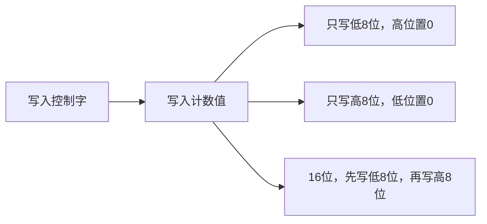

%%[toc]%%

# 第 8 章 8253 定时器 计数器

## 1. 可编程定时器/计数器 8253

### 1.1. 问题的提出

#### 1.1.1. 定时器的本质——计数

定时可以看作==对时间基准的计数==，将任意一个==固定周期==作为时间标准进行累积就能获得一定时间

#### 1.1.2. 定时器/计数器

- 定时器本质上是通过对周期性信号的计数实现的
- 计数器只是对输入信号累计，通过加 1 或减 1 实现
- 定时/计数电路的输入信号是脉冲信号
    - 计数器
        - 计数器接口的输入信号：非周期的脉冲信号
        - 计数器接口的输出信号：脉冲计数值
    - 定时器
        - 定时器接口的输入信号：周期性时钟
        - 定时器接口的输出信号：按输入周期产生一个定时输出

### 1.2. 8253 的主要功能

- 有 3 个**独立**的 ==16 位计数器==。
- 每个计数器都可以按照==二进制或 BCD 码==进行计数。
- 每个计数器的计数速率可高达 2 MHz。
- 每个计数器有 ==6 种工作方式==，可由程序设置和改变。
- 所有的输入输出引脚电平都与 TTL 电平兼容（单电源+5V）。

### 1.3. 8253 的内部结构

![[微机原理/src/08/Pasted image 20220110220746.png]]

#### 1.3.1. 数据总线缓冲器

CPU 用输入输出指令对 8253 进行==读写的所有信息==：
- CPU 初始化编程时写入 8253 的==控制字==；
- CPU 向某一计数器==写入==的计数值；
- CPU 从某一计数器==读取==的计数值。

#### 1.3.2. 读/写逻辑

8253内部操作的控制部分：
- $\overline{CS}$ 片选控制
- $\overline{RD}$ 和 $\overline{WR}$ 读写控制
- $A_0$ 和 $A_1$ 端口选择

| A1  | A0  | 端口         |
| --- | --- | ------------ |
| 0   | 0   | 计数器0      |
| 0   | 1   | 计数器1      |
| 1   | 0   | 计数器2      |
| 1   | 1   | 控制字寄存器 | 

#### 1.3.3. 控制字寄存器

控制字寄存器，在==初始化==时由 CPU 写入控制字==决定计数器的工作方式==。
控制字寄存器只能写入不能读出。

#### 1.3.4. 计数器

- 3 个计数器中都包括 4 个寄存器：
    - 计数==初值==寄存器 CR；
    - 减法计数寄存器 CE，一个有效脉冲，CE 值减一
    - 计数输出寄存器 OL，随 CE 变化；CPU 发出所存命令时，锁存当前计数值
    - 控制寄存器(6位)
- 每个计数器都 3 条信号线：
    - 计数输入 CLK；
    - 输出信号 OUT；
    - 选通输入（门控输入）GATE；

![[微机原理/src/08/Pasted image 20220110221813.png]]

### 1.4. 引线

- 与CPU的连接线：
    - $D_0\sim D_7$ 双向三态与数据总线连接；
    - $A_0$ 与 $A_1$ 地址线，片内寻址；
    - $\overline{CS}$ 片选信号线；
- $\overline{RD}$ 与 $\overline{RD}$ ,读写控制
    - 与外部设备的连线：
    - CLK 引脚可输入周期或随机的脉冲信号；
    - GATE 启动或禁止计数；
    - OUT 引脚，输出信号端，可以是方波，脉冲电平等

![[微机原理/src/08/Pasted image 20220110231944.png]]

### 1.5. 8253 控制字

|     D7 | D6   |    D5 | D4   |   D3 | D2  | D1  |  D0  |
| ------:|:---- | -----:|:---- | ----:|:---:|:--- |:----:|
|    SC1 | SC0  |   RL1 | RL0  |   M2 | M1  | M0  |  BCD  |
| 计数器 | 选择 | 读/写 | 格式 | 工作 | 方  | 式  | 数制 |

- SC
    - 00 计数器 0
    - 01 计数器 1
    - 10 计数器 1
    - 11 非法
- RL
    - 00 锁存
    - 01 低八位
    - 10 高八位
    - 11 十六位
- M
    - 000 方式 0
    - 001 方式 1
    - x10 方式 2
    - x11 方式 3
    - 100 方式 4
    - 101 方式 5
- BCD
    - 0 二进制
    - 1 BCD 计数

### 1.6. 计数方式

#### 方式 0：计数结束中断方式

```wavedrom
{signal:[
    {name: "WR#", wave: "14.1.3.1.......", node:"...a...c", data:["CW=10","LSB=4"],phase:0.5},
    {name: "CLK", wave: "n.............", node:".......d..."},
    {name:"GATE", wave: "1............."},
    {name: "count",wave: "0......6543654", data:["4","3","2","1","0","FF","FE"],node:".......e.."},
    {name: "OUT", wave: "1..0.......1..", node:"...b..."}
],
edge: [
    "a-~>b","c-~>d 一个脉冲后计数值从CR传入CE","d->e"
]}
```

计数器==只计一遍==。当计数到 0 时，并不恢复计数值，不开始重新计数，且==输出保持为高==。只有在写入另一个计数值时，OUT 变低，开始新的计数。

8253在 $\overline{WR}$ 信号的上升沿将计数值写入 CR，并在下一个 CLK 脉冲开始计数，即如果计数初值为N，在 N+1 个 CLK 脉冲之后输出信号 OUT 变为高电平；

计数过程==由 GATE 控制暂停==，当 GATE=0 时，计数暂停，当 GATE 变高之后继续计数；

8253 在计数过程可以改变计数值，如果是 8 位计数，在写入新的计数值之后开始重新计数；如果是 16 位，则写第一个字节后计数暂停，第二个字节后按新的计数值计数；

8253 内部没有中断控制电路，可以用 OUT 信号作为中断请求信号。

```ad-example
若 8253 的地址为 `04H~07H`，要使计数器 1 工作在方式 0，仅用 8 位二进制计数，计数值为 128，初始化程序

~~~nasm
MOV AL, 50H   ; 控制字 01 01 000 0
OUT 07H, AL   ; 输至控制字寄存器
MOV AL, 80H   ; 计数值 128
OUT 05H, AL   ; 输至计数器 1
~~~
```

#### 方式 1：可编程单稳态触发方式

- 由==门控信号 GATE 上升沿触发==计数；
- 开始==计数之后 OUT 变为低电平==；
- 计数执行单元 CE 为零时，OUT 端变为==高电平==。

```wavedrom
{signal:[
    {name: "WR#", wave: "14.1.3.1......", node:"...a...c", data:["CW=12","LSB=4"],phase:0.5},
    {name: "CLK", wave: "n.............", node:".......d..."},
    {name:"GATE", wave: "1.....01......"},
    {name: "count",wave:"0......6543654", data:["4","3","2","1","0","FF","FE"],node:".......e.."},
    {name: "OUT", wave: "x..1...0...1..", node:"...b..."}
],
edge: [
    "a-~>b","c-~>d 一个脉冲后计数值从CR传入CE","d->e GATE上升沿触发"
]}
```

写入控制字后，OUT 输出为高电平。==写入计数初值 N 后，计数器并不开始计数==，而要等到 ==GATE 上升沿后的下一个 CLK 输入脉冲的下降沿==，计数初值装入减 1 计数寄存器，同时 OUT 端变为低电平，计数才开始。计数结束时，OUT 输出变高，从而产生一个==宽度为 N 个 CLK 周期的负脉冲==

方式 1 中 GATE 信号有两个方面的作用：

- 在计数结束后，若再来一个 GATE 信号上升沿，则下一个时钟周期的下降沿又==从初值开始==计数，而==不需要重新写入初值==，即门控信号可重新触发计数
- 在计数过程中，若来一个 GATE 信号的上升沿，也在下一个时钟下降沿==从初值起重新计数==，即终止原来的计数过程，开始新的一轮计数

#### 方式 2：频率发生器方式（分频器）

- 写入控制字 CW 之后，OUT 端变为高电平；
- 下一个 $\overline{WR}$ 信号的==上升沿==写入计数初值，若 GATE 为高电平则在之后的第一个时钟==下降沿==开始减一计数；
- 计数减至 1 之后 OUT 端变为低电平并维持 1 个时钟周期，计数器值变为 0 之后 OUT 端==重新变为高电平开始下一轮的计数==。

```wavedrom
{signal:[
    {name: "WR#", wave: "14.1.3.1..........", node:"...a...c", data:["CW=14","LSB=4"],phase:0.5},
    {name: "CLK", wave: "n.................", node:".......d...f...h"},
    {name:"GATE", wave: "1................."},
    {name: "count",wave: "0......65436543654", data:["4","3","2","1","4/0","3","2","1","4/0","3","2"],node:".......e...g...i"},
    {name: "OUT", wave: "xxx1......01..01..", node:"...b..."}
],
edge: [
    "a-~>b","c-~>d 一个脉冲后计数值从CR传入CE","d->e","f->g 重新装数","h->i 重新装数"
]}
```

```wavedrom
{signal:[
    {name: "WR#", wave: "14.1.3.1......3.1...", node:"...a...c........j", data:["CW=14","LSB=4","LSB=3"],phase:0.5},
    {name: "CLK", wave: "n...................", node:".......d....f...h"},
    {name:"GATE", wave: "1........0..1......."},
    {name: "count",wave: "0......654..65435435", data:["4","3","2","4/0","3","2","1","3/0","2","1","3/0"],node:".......e....g...i"},
    {name: "OUT", wave: "xxx1...........01.01", node:"...b..."}
],
edge: [
    "a-~>b","c-~>d 一个脉冲后计数值从CR传入CE","d->e","f->g 重新装数","h->i 重新装数","j-~h"
]}
```

- CR 内容能==自动地、重复地==装入到 CE 中，OUT 端上就能连续地输出周期性分频信号 (1/N)；
- 改变==计数初值==，即可获得不同速率的 OUT 输出信号；
- 负脉冲宽度均为==一个CLK脉冲==的周期；
- 既可软件启动，又可硬件启动。

#### 方式 3：方波发生器

- 写入控制字 CW 之后，OUT 端变为高电平；
- 下一个 $\overline{WR}$ 信号的上升沿写入计数初值，若 GATE 为高电平则在之后的第一个时钟下降沿开始减一计数；
- 若为==偶数==则计数减至 N/2 之后 OUT 端变为低电平继续计数；计数减至 0 时 OUT 端回复高电平，并重新载入初值计数（完全对称方波）；
- 若为==奇数==则计数减至 (N+1)/2 之后 OUT 端变为低电平继续计数；计数减至 0 时 OUT 端回复高电平，并重新载入初值计数（近似对称方波）。


```wavedrom
{signal:[
    {name: "WR#", wave: "14.1.3.1..........", node:"...a...c", data:["CW=16","LSB=4"],phase:0.5},
    {name: "CLK", wave: "n.................", node:".......d...f...h"},
    {name:"GATE", wave: "1................."},
    {name: "count",wave: "0......65436543654", data:["4","3","2","1","4/0","3","2","1","4/0","3","2"],node:".......e...g...i"},
    {name: "OUT", wave: "xxx1.....0.1.0.1.0", node:"...b..."}
],
edge: [
    "a-~>b","c-~>d 一个脉冲后计数值从CR传入CE","d->e","f->g 重新装数","h->i 重新装数"
]}
```

GATE =0 终止计数，当计数过程中有新的 LSB 传入时不影响当前计数，在当前计数周期结束后使用新的计数值。

```wavedrom
{signal:[
    {name: "WR#", wave: "14.1.3.1......3.1.", node:"...a...c........j", data:["CW=16","LSB=4","LSB=5"],phase:0.5},
    {name: "CLK", wave: "n.................", node:".......d....f...h"},
    {name:"GATE", wave: "1........0..1....."},
    {name: "count",wave: "0......654..654365", data:["4","3","2","4/0","3","2","1","5/0","4","3"],node:".......e....g...i"},
    {name: "OUT", wave: "xxx1..........0.1.", node:"...b..."}
],
edge: [
    "a-~>b","c-~>d 一个脉冲后计数值从CR传入CE","d->e","f->g 重新装数","h->i 重新装数","j-~h"
]}
```

方式3的特点
- CR 内容能==自动地、重复地==装入到 CE 中；
- 改变==计数初值==，即可获得不同速率的 OUT 输出信号；
- 主要应用作为方波发生器和波特率发生器；
- 既可软件启动，又可硬件启动。

#### 方式 4：软件触发选通方式

- 写入控制字 CW 之后，OUT 端变为高电平；
- 下一个 $\overline{WR}$ 信号的上升沿写入计数初值，若 GATE 为高电平则在之后的第一个时钟下降沿开始减一计数；
- ==计数为 0 时==，OUT 输出低电平，持续一个 CLK 脉冲周期之后恢复高电平；
- 重新输入计数初值之后再开始重新计数。

```wavedrom
{signal:[
    {name: "WR#", wave: "14.1.3.1....3.1.......", node:"...a...c......j", data:["CW=18","LSB=4","LSB=3"],phase:0.5},
    {name: "CLK", wave: "n.....................", node:".......d......h"},
    {name:"GATE", wave: "1...............01...."},
    {name: "count",wave:"0......654320.54054320", data:["4","3","2","1","0","3","2","3","2","1","0"],node:".......e......i"},
    {name: "OUT", wave: "xxx1.......01.......01", node:"...b..."}
],
edge: [
    "a-~>b","c-~>d 一个脉冲后计数值从CR传入CE","d->e","h->i 重新装数","j-~>h"
]}
```

- 与方式0主要区别是OUT端输出的==波形不同==。其次是计数期间的输出极性相反，方式0是低电平输出，方式4是高电平输出。
- 计数值==N仅一次有效==，继续计数需要新的计数值。
- 软件触发，==采用计数值装入计数寄存器来触发==。
- 计数过程中如果有新的计数值写入，在下一个CLK下降沿==采用新的计数值==开始计数。

#### 方式 5：硬件触发选通方式

- 写入控制字CW之后，OUT端变为高电平；
- 下一个 $\overline{WR}$ 信号的==上升沿==写入计数初值，此时不立即计数；
- GATE信号上升沿触发计数，开始减一计数；
- 计数为 0 时，OUT 输出低电平，持续一个 CLK 脉冲周期之后恢复高电平；
- 重新出现 GATE 上升沿脉冲再开始重新计数。


```wavedrom
{signal:[
    {name: "WR#", wave: "14.1.3.1....3.1.......", node:"...a...c......j", data:["CW=18","LSB=4","LSB=3"],phase:0.5},
    {name: "CLK", wave: "n.....................", node:".......d......h"},
    {name:"GATE", wave: "1.....01.....01.01...."},
    {name: "count",wave:"0......654320.54054320", data:["4","3","2","1","0","3","2","3","2","1","0"],node:".......e......i"},
    {name: "OUT", wave: "xxx1.......01.......01", node:"...b..."}
],
edge: [
    "a-~>b","c-~>d 一个脉冲后计数值从CR传入CE","d->e GATE上升沿","h->i GATE上升沿","j-~>h"
]}
```

方式 5 的特点

- 硬件触发，采用 ==GATE 上升沿触发==。
- GATE==上升沿==任何时候都会==触发一个新的计数==。
- 计数过程中如果有新的计数值写入，不影响当前计数，在下一个GATE上升沿==采用新的计数值==开始计数

|            |  方式0   |   方式1    |        方式2         |        方式3         |  方式4   |   方式5    |
|:----------:|:--------:|:----------:|:--------------------:|:--------------------:|:--------:|:----------:|
|  方式功能  | 事件计数 |   单脉冲   |      频率发生器      |      方波发生器      | 软件触发 |  硬件触发  |
|  启动方式  | 写入初值 | GATE上升沿 | 写入初值或GATE上升沿 | 写入初值或GATE上升沿 | 写入初值 | GATE上升沿 |
|  中止计数  |  GATE=0  |     -      |        GATE=0        |        GATE=0        |  GATE=0  |     -      |
| 写入新初值 | 立即有效 | 下一轮有效 |      下一轮有效      |      下一轮有效      | 立即有效 | 下一轮有效 |
| 计数值使用 | 一次有效 |  自动重装  |       自动重装       |       自动重装       | 一次有效 |  自动重装  |

### 1.7. 工作方式的异同

#### 共同点

- 每一种工作方式不仅与计数初值有关, 而且==受CLK信号和GATE信号控制==。CLK信号确定计数减1速率, GATE信号==允许/禁止==计数，或者启动计数。 
- 写计数初值之后, 并不马上开始计数, ==只有检测到GATE信号有效, 经过一个CLK周期, 把计数初值送到减1计数器==, 才开始做减1操作。
- OUT端随着工作方式的不同和当前计数状态的不同, 一定有电平输出变化。OUT的输出波形在写控制字之前为未定态, 在写了控制字之后到计数之前为计数初态, 再之后有计数态、暂停态、结束态等。
- 对于给定的工作方式, 门控信号GATE的触发条件是有具体规定的, 或电平触发, 或边沿触发, 或两者均可。

#### 不同点

##### 0 & 4

软件触发（写入计数初值）启动计数, 无自动重装计数值功能。

| 方式 | 区别                                                                                     |
| ---- | ---------------------------------------------------------------------------------------- |
| 0    | 在计数过程中输出低电平, 计数结束时**变为高电平**, 并一直保持                             | 
| 4    | 在计数过程中输出为高电平, 计数结束时输出一个宽度为一个TCLK的**负脉冲**, 以后又保持高电平 |

##### 1 & 5

硬件触发（GATE上升沿）启动计数

| 方式 | 区别                                                   |
| ---- | ------------------------------------------------------ |
| 1    | 在计数过程中输出一个宽度为计数初值乘以TCLK的单相负脉冲 |
| 5    | 在计数结束后输出一个宽度为一个TCLK的负脉冲             | 

##### 2 & 3

具有自动重装计数值的能力, 是频率发生器(分频器)

| 方式 | 区别                                |
| ---- | ----------------------------------- |
| 2    | 输出占空比为 (n-1):1 的矩形波信号   |
| 3    | 输出占空比为 (n/2):(n/2) 的方波信号 | 


### 1.8. 8253 编程

#### 1.8.1. 流程



#### 1.8.2. 端口地址

假设端口地址为 `0F8H~0FBH`，则计数器 0，计数器 1，计数器 2，控制端口分别为 `0F8H`, `0F9H`, `0FAH`, `0FBH`


