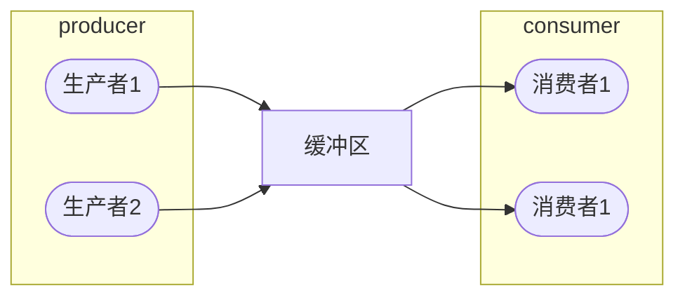

[toc]

# 3.2. 互斥与同步案例

## 1.  生产者消费者问题

系统中有一组生产者进程和一组消费者进程，生产者进程每次生产一个产品放入缓冲区，消费者进程每次从缓冲区中取出一个产品并使用。

生产者、消费者共享一个初始为空、大小为 $n$ 的缓冲区。

只有==缓冲区没满==时，生产者才能将产品放入缓冲区，否则等待。
只有==缓冲区不空==时，消费者才能取出产品，否则等待。

缓冲区是临界资源，各进程必须==互斥地访问==。

信号量机制可以实现互斥、同步、对一类系统资源的申请和释放


```c
semaphore mutex = 1;  // 互斥信号量，实现对缓冲区的互斥访问
semaphore empty = n;  // 同步信号量，表示空闲缓冲区的数量
semaphore full = 0;   // 同步信号量，表示产品的数量，即非空缓冲区的数量

process producer () {
	while (1) {
		// 生产一个产品;
		P(empty);  // 消耗一个空闲缓冲区
		P(mutex);  // 进入区
		// 把产品放到缓冲区;
		V(mutex);  // 退出区 
		V(full);   // 增加一个产品
	}
}

process consumer () {
	while (1) {
		P(full);   // 消耗一个产品
		P(mutex);  // 进入区
		// 从缓冲区取出一个产品;
		V(mutex);  // 退出区
		V(empty);  // 增加一个空闲缓冲区
		// 使用产品;
	}
}
```

==实现互斥的 P 操作一定要在实现同步的 P 操作之后。==

## 2. 多生产者和多消费者问题

$m$ 个生产者和 $n$ 个消费者共享 $k$ 件产品缓冲区

```c
item B[k];  // k 个共享空间
semaphore empty = k, full = 0;  // 缓冲区空闲数和填充数
semaphore mutex = 1;  // 互斥信号
int in = 0, out = 0;  // 放入和取出缓冲区指针
process producer_i() {
	while (1) {
		produce(new_item);
		P(empty);
		P(mutex);
		B[in] <- new_item;
		in = (in + 1) % k;  // 移动到下一个空间
		V(mutex);
		V(full);
	}
}
process consumer_j() {
	while (1) {
		P(full);
		P(mutex);
		x <- B[out];
		out = (out + 1) % k;  // 移动到下一个空间
		V(mutex);
		V(empty);
		consume(x);
	}
}
```

## 3. 吸烟者问题（单生产者多消费者）

假设一个系统有三个吸烟者和一个供应者。第一个拥有烟草，第二个拥有纸，第三个拥有胶水。供应者进程无限的提供三种材料，每次将两种材料放到桌上。拥有剩下那种材料的吸烟者会拿材料并卷烟抽掉。完成后会给供应者发出完成信号，供应者会准备另外两种材料。

同步关系中前 V 后 P

![[public/os/2-3-02.png]]

```c
semaphore offer1 = 0;
semaphore offer2 = 0;
semaphore offer3 = 0;
semaphore space = 1;
int i = 0;
provider () {
	while (1) {
		P(space);
		switch (i) {
			case 0: 
				将组合一放在桌上; 
				V(offer1); break;
			case 1: 
				将组合二放在桌上; 
				V(offer2); break;
			case 2: 
				将组合三放在桌上; 
				V(offer3); break;
		}
		i = (i + 1) % 3;
	}
}
smokerX () {
	while (1) {
		P(offerX);
		从桌子上拿走材料，卷烟，抽掉;
		V(space);
	}
}
```

## 4. 读者写者问题

### 4.1. 问题描述

在存储空间或最经典的**数据库**的读写中，当有读者对共享资源进行访问时，**其他读者也可进行访问**，但写者无法对其进行修改。另一方面，当有写者正在进行写操作时，其他读者写者**均不能访问该资源**。

### 4.2. 问题解决

#### 4.2.1. 方案 1

该方案能够达到==在有读者在访问时，阻塞写者；当有写者在写入时，阻塞其他进程==。但是如果不断地有读者进入进程，写者就会饥饿。该方案被称为“读者优先”。

```c
int readcount = 0;
semaphore writerblock = 1, mutex = 1;
process reader_i() {
	P(mutex);  // 对读者数量进行加锁
	readcount++;
	if (readcount == 1)  // 如果当前进入的是第一个读者，那么就阻塞后面的写者
		P(writerblock);
	V(mutex);  // 对读者数量解锁
	/* 读文件 */
	P(mutex);
	readcount--;
	if (readcount == 0)  // 如果是最后一个退出的读者，则唤醒被阻塞的写者
		V(writerblock);
	V(mutex);
}
process writer_j() {
	P(writerblock);
	/* 写文件 */
	V(writerblock);
}
```

#### 4.2.2. 方案 2

针对上述写者饥饿的问题，在此处给出一个解决方案。即：==当有一个写者到来时，会将晚于这个写者的读者挡住。==

```c
int readcount = 0;
semaphore writerblock = 1, readerblock = 1, mutex = 1;
process reader_i() {
	P(readerblock);  // 带有被阻塞限制的访问共享资源
	P(mutex);  // 对读者数量加锁
	readcount++;
	if (readcount == 1)  // 如果当前进入的是第一个读者，那么就阻塞后面的写者
		P(writerblock);
	V(mutex);  // 对读者数量解锁
	V(readerblock);
	/* 读文件 */
	P(mutex);
	readcount--;
	if (readcount == 0)  // 如果是最后一个退出的读者，则唤醒被阻塞的写者
		V(writerblock);
	V(mutex);
}
process writer_j() {
	P(readerblock);  // 阻塞后来的读者
	P(writerblock);
	/* 写文件 */
	V(writerblock);
	V(readerblock);  // 唤醒后来的读者
}
```

## 5. 睡眠理发师问题

### 5.1. 问题描述

理发店有一名理发师，一把理发椅和 n 把供等候的椅子。当空闲时，理发师会躺在椅子上睡觉。有顾客来时，会将理发师唤醒。当有顾客正在理发时，新的顾客来了，会在坐在等候椅上等待。如果没有等候椅，则刚刚新来的顾客离开。

### 5.2. 问题解决

对于顾客来说，他们需要抢占的资源为“等候椅”。当有空闲的椅子时，就能在此等待，并唤醒理发师。而对于理发师，首先判断是否有顾客，若没有则睡眠；若有，则会在处理完当前顾客后继续处理下一个顾客。

```c
int waiting = 0, chairs = N;  // 等待者人数，椅子数
semaphore customers = 0, barbers = 0, mutex = 1;
process barbers() {
	while (1) {
		P(customers);   // 判断是否有顾客，没有则理发师睡眠
		P(mutex);		// 若有顾客，则进入临界区
		waiting--;		// 等候者数量-1
		V(barbers); 	// 理发师准备为顾客理发
		V(mutex);		// 退出临界区
		cutHair();		// 理发师正在理发
	}
}
process customer_i() {
	P(mutex);			// 进入临界区
	if (waiting < chairs) {  // 判断是否有空椅子
		waiting++;		// 等待者数量+1
		V(customers);	// 唤醒理发师
		V(mutex);		// 退出临界区
		P(barbers);		// 理发师忙，顾客等待
		getHairCut();	// 否则，顾客理发
	} else {
		V(mutex);		// 没有椅子，顾客离开
	}
}
```

## 6. 五位哲学家就餐问题

### 6.1. 问题描述

五名哲学家坐在圆桌上就餐，食物供应充足，但每个人左右各只有一支筷子，即总共只有五支筷子。

### 6.2. 问题分析

每个人可以先拿起一侧的筷子，再拿起另一侧的筷子，然后再就餐。但与此同时也出现了问题，即当所有人同时拿起左手的筷子，如果不退避，则会造成死锁。因此，可以让一部分人先拿起右边的筷子，这样就打破了环路。

```c
semaphore stick[5] ={1, 1, 1, 1, 1};
process philosopher(int i) {
	while (1) {
		think();  // 思考
		if (i % 2 == 0) {
			P(stick[i]);
			P(stick[(i + 1) % 5]);
		} else {
			P(stick[(i + 1) % 5]);
			P(stick[i]);
		}
		eat();
		V(stick[i]);
		V(stick[(i + 1) % 5]);
	}
}
```

## 7. 独木桥问题

### 独木桥问题 1

东西向汽车驶过独木桥，为保证交通安全，只要桥上无车，则允许一方的汽车过桥。等待全部过完后才允许另一方的汽车过桥。请用信号量和 PV 操作写出汽车过独木桥问题的同步算法。

```c
semaphore a_mutex = 1, b_mutex = 1;
semaphore a_count_mutex = 1, b_count_mutex = 1;
int a_count = 0, b_count = 0;
void A_side()
{
	P(a_count_mutex);  // a_count 互斥上锁
	a_count_mutex++;
	if (a_count_mutex == 1)  // A 侧有车来
		P(b_mutex);  // 抢桥
	V(a_count_mutex);  // a_count 解锁
	// cross the bridge
	P(a_count_mutex);  // a_count 互斥上锁
	a_count_mutex--;
	if (a_count_mutex == 0)  // A 侧没有车了
		V(b_mutex);  // 释放桥资源
	V(a_count_mutex);
}
void B_side()
{
	P(b_count_mutex);  // b_count 互斥上锁
	b_count_mutex++;
	if (b_count_mutex == 1)  // B 侧有车来
		P(a_mutex);  // 抢桥
	V(b_count_mutex);  // b_count 解锁
	// cross the bridge
	P(b_count_mutex);  // b_count 互斥上锁
	b_count_mutex--;
	if (b_count_mutex == 0)  // B 侧没有车了
		V(a_mutex);  // 释放桥资源
	V(b_count_mutex);
}
```

### 独木桥问题 2

在独木桥问题 1 中，限制桥面上==最多可以有 k 辆汽车通过==，使用信号量和 PV 操作写出汽车过独木桥问题的同步算法。

```c
semaphore a_mutex = 1, b_mutex = 1;
semaphore a_count_mutex = 1, b_count_mutex = 1;
int a_count = 0, b_count = 0;
void A_side()
{
	P(a_count_mutex);  // a_count 互斥上锁
	a_count_mutex++;
	if (a_count_mutex == 1)  // A 侧有车来
		P(b_mutex);  // 抢桥
	if (a_count_mutex == k)  // 达到 k 辆车
		P(a_mutex);  // 不让 A 侧车上桥
	V(a_count_mutex);  // a_count 解锁
	// cross the bridge
	P(a_count_mutex);  // a_count 互斥上锁
	a_count_mutex--;
	if (a_count_mutex < k)  // 少于 k 辆车
		V(a_mutex);  // A 侧车恢复上桥 ? 会不会造成 a_mutex 大于 1 ?
	if (a_count_mutex == 0)  // A 侧没有车
		V(b_mutex);  // 释放桥资源
	V(a_count_mutex);
}
void B_side()
{
	P(b_count_mutex);  // b_count 互斥上锁
	b_count_mutex++;
	if (b_count_mutex == 1)  // B 侧有车来
		P(a_mutex);  // 抢桥
	if (b_count_mutex == k)  // 达到 k 辆车
		P(b_mutex);  // 不让 B 侧车上桥
	V(b_count_mutex);  // b_count 解锁
	// cross the bridge
	P(b_count_mutex);  // b_count 互斥上锁
	b_count_mutex--;
	if (b_count_mutex < k)  // 少于 k 辆车
		V(b_mutex);  // B 侧车恢复上桥
	if (b_count_mutex == 0)  // B 侧没有车
		V(a_mutex);  // 释放桥资源
	V(b_count_mutex);
}
```

### 独木桥问题 3

在独木桥问题 1 中，要求保证东西方向交替通过一辆汽车。使用信号量和 PV 操作写出汽车过独木桥问题的同步算法。

```c
semaphore mutex = 1;
void A_side()
{
	P(mutex);
	// cross the bridge
	V(mutex);
}
void B_side()
{
	P(mutex);
	// cross the bridge
	V(mutex);
}
```

### 独木桥问题 4

在独木桥问题 1 中，要求各方向的汽车串行过桥。但当另一方提出过桥请求时，应能阻止对方尚未上桥的后继车辆，待桥面上的车过完桥后，另一方的汽车开始过桥。使用信号量和 PV 操作写出汽车过独木桥问题的同步算法。

```c
semaphore a_mutex = 1, b_mutex = 1;
semaphore a_count_mutex = 1, b_count_mutex = 1;
int a_count = 0, b_count = 0;
void A_side()
{
	P(b_mutex);  // 禁止 B 上桥 ??
	P(a_count_mutex);  // a_count 互斥上锁
	a_count_mutex++;
	if (a_count_mutex == 1)  // A 侧有车来
		P(b_mutex);  // 抢桥
	V(a_count_mutex);  // a_count 解锁
	V(b_mutex);  // 恢复 B 上桥 ??
	// cross the bridge
	P(a_count_mutex);  // a_count 互斥上锁
	a_count_mutex--;
	if (a_count_mutex == 0)  // A 侧没有车了
		V(b_mutex);  // 释放桥资源
	V(a_count_mutex);
}
void B_side()
{
	P(a_mutex);  // 禁止 A 上桥 ??
	P(b_count_mutex);  // b_count 互斥上锁
	b_count_mutex++;
	if (b_count_mutex == 1)  // B 侧有车来
		P(a_mutex);  // 抢桥
	V(b_count_mutex);  // b_count 解锁
	V(a_mutex);  // 恢复 A 上桥 ??
	// cross the bridge
	P(b_count_mutex);  // b_count 互斥上锁
	b_count_mutex--;
	if (b_count_mutex == 0)  // B 侧没有车了
		V(a_mutex);  // 释放桥资源
	V(b_count_mutex);
}
```

### 安全岛

现有一个如下图所示的小巷，除安全岛可容 2 人暂时停身外，仅能容 1 人通过。若A、B 两头都允许行人进和出，使用信号量与 PV 操作设计一个算法让两头的行人顺利通过小巷。


```text
           [   ]
A============S============B
           [   ]
```

```c
semaphore space = 2;
semaphore mutex_a_s = 1, mutex_b_s = 1;
semaphore mutex_a = 1, mutex_b = 1;
void A_side()
{
	P(space);
	P(mutex_a_s);
	P(mutex_a);
	// 走 A-S
	V(mutex_a);
	V(mutex_a_s);
	
	P(mutex_b_s);
	V(space);
	// 走 S-B
	V(mutex_b_s);
}
void B_side()
{
	P(space);
	P(mutex_b_s);
	P(mutex_b);
	// 走 B-S
	V(mutex_b);
	V(mutex_b_s);
	
	P(mutex_a_s);
	V(space);
	// 走 S-A
	V(mutex_a_s);
}
```

## 8. 苹果橘子问题

桌子上有一只盘子，每次只能放一个水果。有人想放苹果，有人想放橘子，有人想拿苹果，拿橘子等。



![[public/os/2-3-01.png]]

```c
semaphore mutex = 1;
semaphore apple = 0;
semaphore orange = 0;
semaphore plate = 1;
dad () {         	
  	while (1) {		
    	// 准备一个苹果;	        
		P(plate);
		P(mutex);
		// 把苹果放入盘子;
		V(mutex);
		V(apple);
  	}
}
mom () {
  	while (1) {
		// 准备一个橘子;
		P(plate);
		P(mutex);
		// 把橘子放入盘子;
		V(mutex);
		V(orange);
  	}
}
daughter () {
	while (1) {
		P(apple);
		P(mutex);
		// 从盘中取出苹果;
		V(mutex);
		V(apple);
		// 吃掉苹果;
	}
}
son () {
	while (1) {
		P(orange);
		P(mutex);
		// 从盘中取出橘子;
		V(mutex);
		V(orange);
		// 吃掉橘子;
	}
}
```

```ad-caution
如果去除互斥信号量 mutex，在盘子空间为 1 的情况中，不会有影响；但如果盘子空间大于 1 时，生产者有可能会同时对 plate 进行访问（只要 plate > 0 即可访问），违背了==互斥访问==的原则，==数据有可能会被覆盖==。
```

## 9. 图书馆就坐


```cpp
semaphore seat = 100, mutex = 1;
void enter()
{
    P(seat);
    P(mutex);
    // 写座位表
    V(mutex);
    // 阅览...
    P(mutex);
    // 注销座位表
    V(mutex);
    V(seat);
}
```
