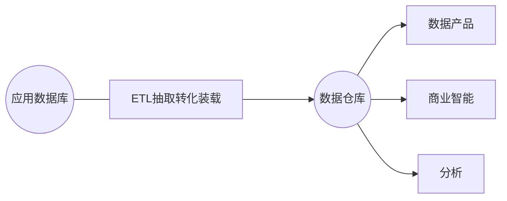
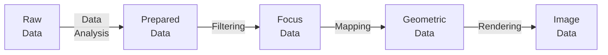

# 数据可视化复习

## 1. 绪论

### 什么是可视化

可视化是通过把数据转化为图形，通过灵活的人机交互，充分利用人的认知能力结合机器的计算能力，提供对复杂数据的分析。

### 什么是虚实融合，扩展现实XR，元宇宙

#### 元宇宙和数字孪生

- 数字孪生本身概念非常清晰，==就是现实世界在网络空间中的真实反馈==，本意是通过==网络空间的模拟、仿真==等还原真实世界并影响现实生活，是“要对地 球负责的”，不会存在类似“神话”“游戏”等==完全想象的元素==
- 与数字孪生相比，现在火爆的元宇宙 (metaverse) 概念其实并不太清晰
- 从人类诞生以来，就存在两个空间。一个是我们生活的==现实空间==，一个是从神话传说、小说、电影到如今的游戏、VR游戏等人类想象延伸出的==虚拟空间==。前者在网络空间中的映射用数字孪生就足以概括，而目前的元宇宙似乎更偏向于后者
- 数字孪生，就是要利用==虚实融合==的技术，用迭代、进化的方式对从工厂、园区到城市的==物理空间==进行全面观测，洞察其发展态势，进而科学分析、预测、决策，实现以==虚拟网络==的管控来提升实体的运行效率

### 可视化的分类

#### 科学可视化

科学数据可视化 Scientific data visualization

#### 信息可视化

- 信息可视化则侧重于抽象数据集，如非结构化文本或者高维空间当中的点
- 高维数据分析与可视化
- 文本数据可视化
- 交互设计

#### 可视分析

### 可视化的作用

- 记录信息
- 分析推理
    - 可视操纵 visual steering 使用数据流更加清晰地控制整个流程以及更加直观地对了解参数空间中参数的修改带来的影响。
- 证实假设
- 交流思想

### 可视化的目标

- 信
- 达
- 雅

## 2. 视觉感知与视觉通道

### 视觉感知

- 感知是指客观事物通过人的==感觉器官==在人脑中形成的直接反映
- 视觉感知就是客观事物通过人的==视觉==在人脑中形成的直接反映

### 认知

- 认知心理学将==认知过程==看成由信息的获取、分析、归纳、解码、储存、概念形成、提取和使用等一系列阶段组成的按一定程序进行的信息加工系统
- 科学领域中，认知是包含注意力、记忆、产生和理解语言、解决问题，以及进行决策的==心理过程==的组合

### 视觉通道

#### 类型

空间、标记、位置、尺寸、颜色、亮度、饱和度、色调、配色方案、透明度、方向、形状、纹理、动画

#### 基色

- 光学：红绿蓝（RGB）
    - 常用 32 位颜色表示，一共可以表示 $2^{24}$ 种颜色，也称 24 位色
    - 加色法系统
- 颜料：青、品红、黄、黑（CMYK）
    - 颜料的三原色：青、品红、黄，使用 CMY 方便印刷颜色调配
    - 减色法系统

### 颜色空间

#### RGB 颜色空间

可被显示器表达的颜色，感知上不均匀

#### HSL、HSV 颜色空间

- 色调 Hue、饱和度 Saturation、亮度 Lightness / 明度 Value

#### Lab 颜色空间

让颜色在感知上均匀分布，主要是亮度感知

L 用来近似人类对亮度的感知，a, b用来近似“红/绿”和“黄/蓝”通道

## 3. 数据基础

### 数据属性

- 数据对象的特征或特性
- 别名
    - 特征
    - 维度
    - 变量
- 属性集合：属性向量
    - eg. 燃油使用率，发动机类型，传动类型，排量，手动自动，供应商等，分析其相互之间的关系，来发现近年来汽车生产销售的趋势或规律

### 属性类型

- 类别型属性
    - 常规数据
        - 点 Point
        - 线 Line
        - 面 Area
- 有序型属性
- 数值型属性
- 离散型和连续型

### 数据特征

#### 基本统计描述

- 数据的宏观表达
- “探索式数据分析”的基础

- 均值 $\overline{x}={1 \over N}\sum_{i=1}^N x_i$
- 中位数
- 方差 $\sigma^2={1\over N}\sum_{i=1}^N (x_i-\overline{x})^2$

#### 数据对象之间的关系：相似度和相异度

- 数据间关系的度量
- 经常在统计和数据挖掘中使用

#### 类别型数据距离计算

- 不匹配率（对应位置不相登的属性个数）：$d(i, j)={p-m\over p}$
- （二值类别型数据）Jaccard 系数（二进制串间的距离）：$d(i,j)={r+s\over q+r+s}$

#### 数值型属性间的距离：明科夫斯基距离系

- 欧式距离 
  $$d_{Euc}=\sqrt{\sum_{i=1}^d |P_i-Q_i|^2}$$
- 曼哈顿距离
  $$d_{CB}=\sum_{i=1}^d |P_i-Q_i|$$
- 明科夫斯基距离
  $$d_{Mk}=\sqrt[p]{\sum_{i=1}^d |P_i-Q_i|^p}$$

#### 数据的不确定性

- 分类不确定性
    - 存在不确定性
    - 属性不确定性
- 来源
    - 本身误差
    - 精度转换
    - 特定应用需求
    - 缺失值
    - 数据集成

### 数据预处理

#### 标准信息系统架构

#### ETL 内部过程

- 数据清理
- 数据整合

### 数据质量

对目标用途的符合度高

- 精确性 Accuracy
- 完整性 Completeness
- 一致性 Consistency
- 适时性 Timelineness
- 可信性 Believability
- 可解释性 Interpretability

#### 数据可视化质量

数据墨水比 = 图表中数据的墨水量 / 总墨水量 = 图表中用于数据信息显示的必要墨水比例

### 数据清洗

检测和清除数据中的错误和不一致，以提高数据质量

#### 数据错误类型及处理方法

- 缺失值
    - 常量代替
    - 属性平均值
    - 回归
    - 人工填充
- 噪声值
    - 回归分析
    - 离群点分析

### 数据存储

#### 发展历程

- 基于文件
- 数据库 & DBMS
- 数据仓库

### 数据分析

#### 探索式数据分析

- 分类
    - 原始数据绘图 NetCDF
        - 柱状图、饼图、等值线图、直方图、走势图、散点图、热力图
    - 简单统计值标绘
        - 一维盒须图
    - 多视图协调关联

#### 数据挖掘

##### 方法

- 统计方法（回归分析；参数估计）
    - 统计学习方法（概率模型；贝叶斯网络）
- 机器学习（决策树；神经网络）
- 计算方法（K-means, K-最近邻）

##### 可视数据挖掘

用户参与数据挖掘过程

一些任务很难用自动方法实现，例如: 

- 聚类结果的评价与可视反馈
- 检测数据集中的异常点

## 4. 数据可视化基础

### 可视化流程模型

#### 流水线模型

![[public/data-vi/image_1.svg]]

### 可视化编码

#### Bertin 提出的视觉变量

通道、位置、尺寸、灰阶值、纹理、色彩、方向、形状

#### 标记和视觉通道

- 标记
    - 图形元素：点、线、面
- 通道
    - 位置、大小、形状、方向、色调、饱和度、亮度…
    - 颜色
        - 灰度值可被认为是有序的，还可用于编码数值类型
        - 色调 Hue 通常被认为是无序的，可用于编码不同维度的值

#### 表现力

- 精确性
- 可辨性
- 可分离性
- 视觉突出

### 数据变换

- 目的
    - 数据更易被感知
    - 提供更多的可视化设计选择

- 线性变换
- 对数变换
- 可自定义变换函数

#### 归一化

- 目的
    - 根据分布映射数据
    - 颜色 / 尺寸 / 坐标位置编码
- 归一化区间
    - $[-1,1]$
    - $[0,1]$

#### 曲线拟合

- 目的
    - 展示数据趋势
- 不同的拟合方式
    - 线性回归 $\underset{\vec{x} }{\min} \sum_{i=1}^{n}(y_m-y_i)^2$
    - PLSR 偏最小二乘拟合，三合一：回归、PCA、相关性分析
    - LOESS 局部多项式回归拟合

#### 降维

- 主成分分析 (Principal Components Analysis，PCA)
- 多尺度标记 (Multidimensional Scaling，MDS)
- 自组织映射 (Self-Organizing Map，SOM)
- 等距特征映射 (Isometric Feature Mapping，Isomap: 流形学习)

#### ISOMAP

ISOMAP (Isometric Feature Mapping) 是流行学习的一种，用于非线性数据降维，是一种无监督算法

## 5. 时空数据可视化

### 空间数据

#### 数据拓扑

##### 结构化网络

- 笛卡尔方式
- 规格化/统一
- 线性方式
- 曲线方式

##### 非结构化网络

- 有限元素
- 四面体
- 六面体
- 其他

特点

- 材料点方法
- 平滑粒子流体力学

### 标量数据可视化

#### 一维数据

- 对土层钻探时到得的土层深度
- 沿某个经度上的气压数值  
- 燃烧炉沿炉壁测量得到的温度分布

#### 二维数据

- 方法  
    - 颜色映射法
    - 等值线提取法
    - 高度映射法  
    - 标记法

##### 颜色映射法

- 步骤
    - 建立颜色映射表
    - 将标量的数据转换为颜色表的索引值
    - ColorBrewer
- 颜色映射（color mapping）——==传递函数==设计

##### 等值线映射法

同一曲线上的每一点代表的数值相同

##### 高度映射法

通常用于编码测量到的数据

#### 三维数据体绘制

- 方法
    - 等值面绘制
    - 直接体绘制

##### 等值面绘制

- 图像空间方法
- 数据空间方法
- 传递函数设计

基于几何体采样

- 等值面提取算法
    - Marching Cube
    - 将三维体数据分割成小的体素（立方体）
    - 通过判断体素的八个顶点的值来判断它是否在等值面同一侧
    - 8 个顶点，共有 $2^8=256$ 种情况
    - 消除等价情况
        - 15 种模式
        - 93 中可能的连接方式
        - 除去对称和相同的连接方式，共有 34 种连接方式

Marching Cubes 算法抽取得到网格，计算网格的同时，计算出法线后加入 Phong 光照模型

##### 直接体绘制

直接计算最终可视化里的每一个像素

光线投射体绘制算法 Ray casting

- 对于图像平面上的每一像素，从视点投射出一穿过该像素的视线，该视线穿过体数据空间，算法直接利用该视线上的采样值合成该像素的亮度
- 体光照模型
    - 只吸收、只发射、吸收+发射、散射+阴影、多重散射
    - Phong 模型要求法向量——梯度矢量
- 局部体光照模型
    - 反映物体的局部形状
    - 容易实现
    - 不考虑全局光照效果
- 体分类
    - 决定吸收的值 (不透明度 $\alpha$) 和发射的部分 (颜色 RGB)

- 传递函数
    - 是决定体绘制质量的最关键因素之一
    - 目的
        - 决定体素对最后图像的贡献大小
        - 决定体素的材料性质和外观
    - 原则
        - 重要的特征和用户感兴趣的区域赋以==高的不透明度值==
        - 使不重要或当前不感兴趣的区域==透明==或==很小的不透明度值==
    - 通过不同的传递函数设计，可以强调==同一体数据==的==不同部分==
- 体重采样
    - 最简单的方法：最近邻域插值
    - 最常用的方法：三线性插值

##### 传递函数

以数据为中心的方法:可见性，计算每类物质的可见性，为不同的控制点自动设置不透明度值 (分布密度大的物质更透明，反之更不透明)

### 多变量数据可视化

- 采用纹理
- 采用不同的视觉通道和融合

### 空间向量数据可视化

#### 向量场可视化

- 数据：向量方向、大小
- 可视化目标
    - 展示场的导向趋势信息
    - 表达场中的模式

#### 方法

- 基于标量场映射可视化
- 基于几何的方法  
- 基于纹理的方法  
- 基于拓扑分析的方法

#### 向量场的空间和时间维度

- 空间维度
    - 2D 平面流
    - 2.5D 曲面上的流、边界流
    - 3D 三维空间上的流
- 时间维度
    - 定常流（静态或一个时间步长）
    - 非定常流（时变、瞬态）

#### 基于标量场映射的方法

- 向量的模、某个分量、分量的函数、另一个变量等

#### 基于几何的方法

- 标记法
    - 线条、箭头、方向标识符（三角图符）等
    - 优点：实现简单、直观、灵活
    - 缺点：可视混乱、无法解释数据的内在连续性、难以表达特征结构如涡流等
- 矢量线、面
    - 流线、迹线、脉线
- 粒子

#### 基于积分曲线的方法

- 流线 (streamline)，迹线 (pathline)，时间线 (timeline)，脉线 (streakline)
- 流带 (ribbons)
- 流管和气泡
- 流面 (stream surfaces)
- 流体 (stream volumnes)

##### 流线 Streamline

对静态流场或时变流场的某个时刻, ==从某一点开始的一条连续曲线==，其上任一点的==切线方向==均与向量场在该点的方向一致

$$
{\mathrm{d} x(s) \over \mathrm{d} s}=u(x(s), \tau)\quad \text{or} \quad x(0) = x_0
$$

- $s$ 为流线轨迹参数
- $\tau$ 为某个时间点的流场

流线的变种：流管、流带

##### 迹线 Pathline

对时变流场来说，==从某一点释放一个粒子==在各个时刻形成的一条曲线，其上任一点的切线方向均与该时刻向量场在该点的方向一致

$$
{\mathrm{d} x(t) \over \mathrm{d} t} = u(x(t), t) \quad \text{or} \quad x(0)=x_0
$$

- $t$ 为时间参数

##### 脉线 Streakline

在时变流场的==某点==, ==持续释放粒子==，在某个时刻，这些粒子形成的轨迹线 (烟囱的烟)

$$
{\mathrm{d} x(t) \over \mathrm{d} t} = u(x(t), t),x(\tau)=x_0
$$

- $x_0$ 为释放粒子的位置，$0 \leqslant \tau \leqslant T$，$T$ 是释放粒子的时间段

##### 时线

脉线的一个扩展，从一条起始轨迹或一个起始区域上的不同位置生成一系列脉线

![[public/data-vi/image_2.png]]

- 对于稳定向量场，流线、迹线、脉线相同
- 非稳定场，迹线、脉线不同

##### 种子点放置策略

- 覆盖性
- 均匀性
- 连续性

流线的简化：使用指定的度量标准进行流线删除或聚类

#### 基于纹理的方法

##### 点噪音

随机排列一些圆点，按照局部流场方向对圆点变形，将变形后的圆点用滤波器扩散到纹理中

##### 线积分卷积

将矢量场与白噪声进行卷积

### 空间张量数据可视化

#### 张量场可视化

- 每个数据点的值为 $n$ 维矩阵
- 描述数据在数据点邻域上如何变化

##### 标量指数法

##### 图标法

- 张量椭球
    - 三个轴对应三个特征值、特征向量
- 长方体和圆柱
- 超二次图元

##### 纤维追踪法

另一角度查看扩张张量成像数据

- 超流线
    - 主特征向量生成流线
- 线积分卷积
- 拓扑结构分析法

## 6. 多源异构数据可视化

### 什么是多源异构数据

- 多源：文本、视频、音频
- 异构：结构化、非结构化

### 多媒体可视化

- 文本数据可视化
    - 纯文本新闻报道
    - 微博、Twitter、Facebook
- 音频数据可视化
- 图像数据可视化
- 视频数据可视化

#### 文本

- 词云Wordle案例及其使用
- 文本数据之社交媒体数据可视化
    - 微博
    - Twitter  
    - Facebook数据
- 社交媒体数据可视化中的研究问题
    - 不同类型的新闻热点事件的传播模式的挖掘
    - 哪些微博大V在某个事件传播时起到了关键作用?
    - 哪个时间点介入事件传播最有利于事件往积极方向发展?

### 敏捷可视化构建

- 前面讲到的Wordle词云可视化  
- Interaction + (无需编程基础)  
- D3可视化库 (需简单JS功底)  
- Python可视化库Matplotlib、Seaborn、ggplot、Bokeh、pygal、Plotly

## 8. 层次和网络数据可视化

### 层次数据

- 着重表现个体之间的隶属关系
    - 社会、自然界中的从属关系
        - 机构的组织结构
        - 物种关系
    - 信息的组织形式
        - 文件列表
    - 逻辑承接关系
        - 决策树

#### 表达：图结构

- 图 $G$ 由一个顶点(或节点)集合 $V$ 和一个边集合 $E$ 组成 $G=\{V,E\}$
- 每条边 $e_{xy}=(x,y)$ 连接图 $G$ 的两个顶点 $x, y$

#### 展现方式

- 节点链接法：结构清晰
    - 节点链接树
    - 双曲树
    - 三维树
- 空间填充法：空间利用率高
    - 树图
    - Voronoi 树图
- 混合型

##### 节点链接法

- 正交布局
    - 聚类树
    - 缩进图
        - 快速易于实现
        - 可以使用纯文本
        - 浏览大数据时需要很多滚动操作
        - 容易失去上下文
    - 冰柱图
        - 常用于聚类分析
- 径向布局（辐射型）
    - 径向布局图
        - 三维树
            - 三维空间来扩展可用显示空间
            - 三维动画降低认知成本
            - 难以对付很大的树
            - 三维交互仍是挑战
    - 双曲树
- 自由布局

##### 空间填充法

- 树图
    - ![[public/data-vi/image_3.png]]

类别数据的层次

- 类别数据本身没有层次关系  
- 类别的层次安排对结果影响很大
- 把类别对数据的影响程度作为层次

利用树图的几个原则

- 层次数据  
- 层次之间的关系比较清晰、容易理解
- 每个子系统有一个统一的数字化度量
- 最好允许用户控制树图中元素的展示粒度

### 网络数据的可视化

#### 图的显示

- 节点链接式显示  
    - 分层显示/Sugiyama
    - 力导向布局
    - 多维尺度分析(Multi-Dimensional Scaling, MDS) 布局
- 相邻矩阵
    - 完全规避边的交叉，非常适用于密集的图
    - 视觉伸缩性强  
    - 能展示图的模式  
    - 可视化结果比较抽象
    - 难以跟踪出路径
- 基于属性的显示

### 图的简化

#### 拓扑简化

- 减少数据量
    - 减少点
        - 聚类
    - 减少边
        - 最小生成树

- 主要的问题
    - 数据的丢失
- 需要结合其他方法来提供全面的数据
    - 缩放

### 交互

- 视角相关的交互
    - 平移、缩放、旋转
- 图元素的交互
    - 选择、高亮、删除、移动
- 图结构的交互
    - (局部)重排序、重布局
    - 上下文+焦点
    - 展开与隐藏图的细节: Roll-up && Drill-down

## 9. 沉浸式可视化于三维体感交互

### VR / AR 体数据可视化

背景——传统科学可视化方法

随着科学可视化技术的发展，由计算机断层技术(CT)、核磁共振(MRI)得到的二维切片数据通过体绘制，重构人体的器官组织以及病变部位，从而提高医疗诊断和治疗的精确度和科学性。

- 从现实中取材:基于虚拟现实融合的真实感绘制
- MARVisT:个人移动终端上使用AR进行Glyph Vis.

### 沉浸式可视化系统

- BOOM: Binocular Omni Orientation Monitor(双目全向观察器)
- FishTank VR(鱼缸)  
    - 显示器
    - 立体眼镜
    - 头部追踪器(head-tracker)
- Surround-Screen Display(环屏显示环境) 
    - 每个墙面配置了一个120 HZ的投影设备
    - 沉浸式宇宙数据模拟
    - 3-D MRI数据可视化
    - 气候数据探索 
- Responsive Workbench(响应工作台)
    - 立体眼镜、投影设备、头部追踪设备、二维交互工作台
- HMD: Head Mounted Display(头戴式显示器，头显)
    - 大部分是手柄式交互与三维手势隔空交互

### Leap Montion 三维体感可视化

- 医学脑成像弥散张量成像DTI数据可视化
    - 水分子在相同组织中各向同性  
        - 大脑白质纤维的 3D 结构
    - 水分子在不同组织中各向异性
        - 沿神经纤维束的方向弥散
        - 很少垂直于神经纤维束方向弥散
    - 临床应用
        - 引导医疗人员进行大脑手术
    - CS架构，Box查询白质、灰质区

## VR AR MR

### Virtual Reality 虚拟现实

VR places the user ==in another location entirely==. Whether that location is computer-generated or captured by video, it ==entirely occludes the user's natural surroundings==.

VR设备皆为佩戴类（例如VR眼镜）可以让你看到360度无死角的虚拟环境，让你彷佛置身于另一个地方，或者是一个视频、一个游戏里面。

### Augmented Reality 增强现实

In augmented reality—like Google Glass or the Yelp app's Monocle feature on mobile devices—the visible natural world is ==overlaid== with ==a layer of digital content==.

AR设备可以是佩戴类（例如Google Glass）或者非佩戴类（例如有镜头的手机和平板）。

佩戴类AR设备可以让文字或者模型投影在你的眼前。这些投影不能与环境做出互动。

而非佩戴类AR设备可以透过镜头简单识别指定图片（或者二维码），并把它变成动画的也属于AR。常见的例子包括拿着平板看书中图案变成动画。然而AR并不能分辨场景和物件，不会知道怪物在桌子边上，再走两步就会掉下来。在它眼中一切只是背景。

### Mixed Reality 混合现实

In technologies like Magic Leap's, virtual objects are integrated into—and responsive to—the natural world. A virtual ball under your desk, for example, would be blocked from view

混合，顾名思义就是把AR的概念和VR混合。首先，MR设备绝大部分为佩戴类。

简单的MR设备可以识别场景，把一个模型放在房间的中间，那么无论你走到哪去看，模型还是在相同的位置。更进一步的MR中，模型再不是叠加在现实视角以上，而是**与环境互动**，甚至会**像实物一样，可以被其他实物掩盖**。如果你把模型放在门后，把门关上就会把模型挡住。目前的MR设备还没有后者的能力，所以说MR还要很多进步空间。

一般MR都具备AR的功能。

而无论VR、AR、MR都只是五官中关于 ==视角==（眼）的概念，并没有对于触感等其他感官感受分类。

### XR: Extend Reality 扩展现实

总括了AR、MR和VR
