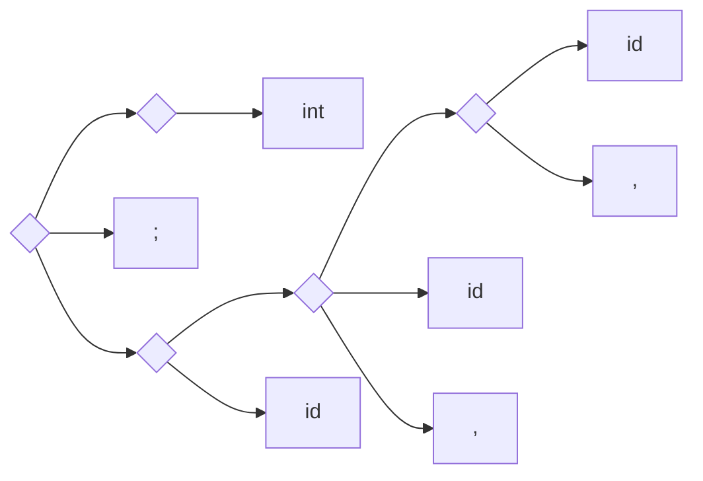

# 第一章 引论

## 1.1. 程序设计语言与编译

### 1. 程序设计语言

- 高级语言
- 汇编语言（机器语言的抽象）
- 机器语言

### 2. 程序设计语言的转换

- 翻译
    - 把某种语言源程序在==不改变语义==的条件下，转换成另一种语言程序
- 编译
    - 专指由高级语言转换为低级语言
    - 编译的转换过程
        - 两阶段转换：编译 → 运行
        - 三个阶段的转换：编译 → 汇编 → 运行
- 解释
    - 接收某高级语言的一个语句输入，进行解释并控制计算机执行，马上得到这句执行结果，然后再接受下一句
    - 不产生目标程序，一边解释一边执行

## 1.2. 编译程序概述 编译程序的工作

### 1. 词法分析

- 任务
    - 输入源程序，对构成源程序的字符串进行扫描和分解，识别出一个个单词
    - 单词
        - 高级语言中有实在意义的最小语法单位
- 词法分析按照词法规则，识别出正确的单词，转换成统一规格
    - 转换
        - 对基本字、运算符、界限符的转换
        - 标识符的转换
        - 常数的转换
        - 转换完成后的格式：（类号，类码）
    - 描述词法规则的有小工具是==正规式==和==有限自动机==

### 2. 语法分析（判断功能）

- 任务
    - 由单词组成短语、子句、语句、过程、程序，构造语法分析树
- 语法规则
    - 语言的规则，又称文法；规定单词如何构成短语、语句、过程和程序
- 语法规则的表示
    - BNF: $A::=B|C$ 或 $A\rightarrow B|C$ 读作“定义为”
- 语法分析的方法
    - 推导 derive 和归约 reduce
    > 推导
    >> 最右推导，最左归约
    >
    > 归约
    >> 最左推导，最右归约

$$
\begin{aligned}
<D>&::=<T>\,<IDS>;\\
<T>&::=\mathbf{int|real|char|bool}\\
<IDS>&::=\mathbf{id}|<IDS>,\mathbf{id}
\end{aligned}
$$

```c
int a, b, c;
```




### 3. 语义分析和中间代码生成

- 收集标识符的属性信息
    - 种属
    - 类型
    - 存储位置、长度
    - 值
    - 作用域
    - 参数和返回值信息
- 语义检查

### 4. 优化

- 为改进代码所进行的等价程序变换，使其运行的更快一些、占用空间更少一些，或者二者兼顾。

### 5. 目标代码生成

- 目标代码生成以源程序的中间表示形式作为输入，并把它映射到目标语言。
- 目标代码生成的 一个重要任务是为程序中使用的变量，合理分配计算器。


