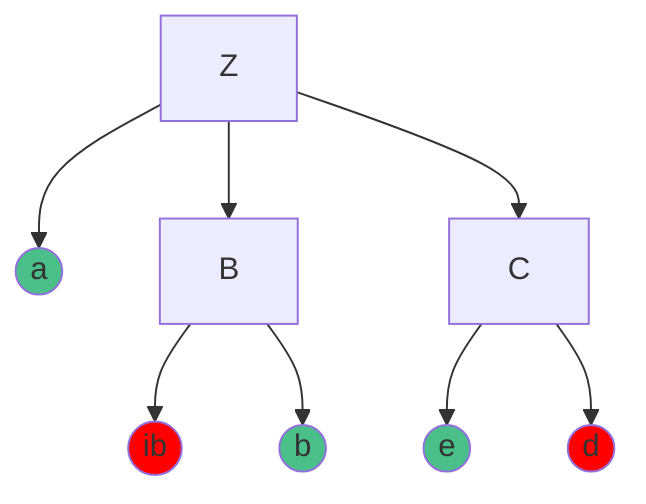

# 第 4 章 自顶向下的语法分析

## 4.1. 语法分析器的功能

以词法分析器生成的==单词符号序列==作为输入，在分析过程中验证这个==单词符号序列==是否是==该程序设计语言的文法的一个句子==。

自顶向下的语法分析是从==顶部==（树根）来构建语法分析树，即构造一个==最左推导==，面对当前输入的单词符号和当前被替换的非终结符，选择这个非终结符的某个产生式规则进行替换。

## 4.2. 不确定的自顶向下的分析方法

对给定的单词符号串 w，从文法的开始符号出发， 试图构造一个最左推导，或自顶向下的为 w 建立一棵语法分析树。 若成功地为 w 构造一个相应的推导序列或一棵语法分析树，则 w 为相应文法的合法句子。这种分析过程本质上是一种==穷举==，试探过程是反复使用不同规则，寻求匹配输入串的过程。

**例 4.1** 设有文法 $G[Z]$

$$
\begin{aligned}
Z&\to aBC\\
B&\to ib\mid b\\
C&\to ed\mid e
\end{aligned}
$$

若输入的符号串为 $w=abe$，是否合法？



构造语法树可以得知，该符号串合法。

## 4.3. LL(1) 分析方法

### 4.3.1. 回溯的判别条件与 LL(1) 文法

**定义 4.1** 设 $G[Z]=\{V_\mathrm{N}, V_\mathrm{T}, P, Z\},\alpha\in(V_\mathrm{N}\cup V_\mathrm{T})^\ast$，符号串 $\alpha$ 的首符号集合定义为

$$
\mathrm{First}(\alpha)=\{a\mid \alpha\overset{\ast}{\Rightarrow}a\cdots,a\in V_\mathrm{T}\}
$$

若 $\alpha\overset{\ast}{\Rightarrow}\varepsilon$，则规定 $\varepsilon\in\mathrm{First}(\alpha)$。也就是说，$\mathrm{First}(\alpha)$ 是从 $\alpha$ 可推导出的==所有首终结符==或==可能的 $\varepsilon$==

> 例如 $a$ 为终结符，$\alpha$ 经过若干步推导后得到了 $aXXX$，那么 $a\in\mathrm{First}(\alpha)$ 

**定义 4.2** 设 $G[Z]=\{V_\mathrm{N}, V_\mathrm{T}, P, Z\},A\in V_\mathrm{N}$，非终结符 $A$ 的后继符号的集合的定义为

$$
\mathrm{Follow}(A)=\{a\mid Z\overset{\ast}{\Rightarrow}\cdots Aa\cdots,a\in V_{\mathrm{T}}\}
$$

若 $Z\overset{\ast}{\Rightarrow}\cdots A$，则规定 $\#\in\mathrm{Follow}(A)$。也就是说，$\mathrm{Follow}(A)$ 是文法 $G$ 的所有句型中==紧跟在 $A$ 之后出现的终结符==或==输入串的结束符 $\#$==

> 例如 $a$ 为终结符，$Z$ 经过若干步推导后可以得到 $\cdots A\cdots$，那么==紧跟在 $A$ 之后的**终结符**==就属于 $\mathrm{Follow}(A)$

**定理 4.1** 对一个上下文无关文法 $G[Z]$，对某个产生式规则

$$
A\to \alpha_1\mid \alpha_2\mid \cdots\mid \alpha_n
$$

若存在 $a\in V_\mathrm{T}$，使得 ==$a\in\mathrm{First}(\alpha_i)\cap\mathrm{First}(\alpha_j),(1\leqslant i,j\leqslant n,i\ne j)$== 或 ==$a\in\mathrm{First}(\alpha_i)\cap\mathrm{Follow}(A),(1\leqslant i\leqslant n,A\overset{\ast}{\Rightarrow}\varepsilon)$== 或 ==$\alpha_i\overset{\ast}{\Rightarrow}\varepsilon$ 且 $\alpha_j\overset{\ast}{\Rightarrow}\varepsilon,(1\leqslant i,j\leqslant n,i\ne j)$==，则对应于文法 $G$ 的自顶向下分析需要回溯。

**LL(1) 文法** 若一个文法 $G[Z]$ 满足以下条件，则称为 LL(1) 文法

1. 文法不含左递归，即不含 $Z\to Za$ 类似的形式
2. 对某个非终结符 $A$，若其对应的产生式规则为 $A\to \alpha_1\mid \alpha_2\mid \cdots\mid \alpha_n$，则 $\mathrm{First}(\alpha_i)\cap\mathrm{First}(\alpha_j)=\varnothing$，$1\leqslant i,j\leqslant n,i\ne j$
3. 对文法中每一个非终结符 $A$，若 $A\overset{\ast}{\Rightarrow}\varepsilon$，则 $\mathrm{First}(\alpha_i)\cap\mathrm{Follow}(A)=\varnothing$，$1\leqslant i\leqslant n$

**例** 对于文法 $Z\to Za\mid b$，求 2 中的集合

$$
\begin{aligned}
\alpha_1&=Za\\
\alpha_2&=b\\
\text{First}(Za)&=\{b\}\\
\text{First}(b)&=\{b\}\\
\text{First}(Za)\cap\text{First}(b)&=\{b\}\ne\varnothing
\end{aligned}
$$

**例** 对于文法 $Z\to Za\mid\varepsilon$，求 3 中的集合

$$
\begin{aligned}
\text{First}(Za)&=\{a,\#\}\\
\text{Follow}(Z)&=\{a\}\\
\text{First}(Za)\cap\text{Follow}(Z)&=\{a\}\ne\varnothing
\end{aligned}
$$

> 空串 $\varepsilon$ 不可能属于 $\text{Follow}$ 集

### 4.3.2. 左递归文法的改造

具有左递归文法的自顶向下分析需要回溯，只有遇到错误时才能回溯，因此可能会造成无穷循环。消除左递归需要进行两方面的讨论

#### 1. 消除直接左递归

若某个文法的非终结符 $A$ 的产生式规则是直接左递归：$A\to A\alpha\mid\beta$，其中 $\alpha,\beta\in(V_N\cup V_T)^\ast$。若 $\beta$ 不以 $A$ 打头，可以改写为：

$$
\begin{aligned}
A&\to \beta A^\prime\\
A^\prime&\to\alpha A^\prime\mid\varepsilon
\end{aligned}
$$

式中， $A^\prime$ 是新增的非终结符号。

一般地，若 $A$ 的全部产生式规则为

$$
A\to A\alpha_1\mid A\alpha_2\mid\cdots\mid A\alpha_m\mid\beta_1\mid\beta_2\mid\cdots\mid\beta_n
$$

式中，$\beta_i$ 不以 $A$ 开头，且 $\alpha_i\ne\varepsilon$，则可改写为

$$
\begin{aligned}
A&\to\beta_1 A^\prime\mid\beta_2 A^\prime\mid\cdots\mid\beta_n A^\prime\\
A^\prime&\to\alpha_1 A^\prime\mid\alpha_2 A^\prime\mid\cdots\mid\alpha_m A^\prime\mid\varepsilon
\end{aligned}
$$

TODO: 加一些例子

#### 2. 消除间接左递归

> 要求文法中不存在环路，即不存在 $A\overset{+}{\Rightarrow}A$，同时要求文法无 $\varepsilon\text{-}$ 产生式规则

消除间接左递归的步骤

1. 将文法 $G$ 的非终结符号按任意一种顺序排列成 $A_1,A_2,\cdots,A_n$
2. 依次对各个非终结符号的产生式进行左递归的消除（相当于选择排序）
    ```cpp
    for (j = 1; j <= n; j++) {
        for (k = 1; k <= j - 1; k++) {
            // 把每个形如 Aj -> Ak α 的规则改成
            //   Aj -> δ1α | δ2α | ... | δmα
            // 其中，Ak -> δ1 | δ2 | ... | δm 是关于当前 Ak 的产生式规则
            // 消除关于产生式规则 Aj 的直接左递归
        }
    }
    ```
3. 进一步化简消除左递归之后的新文法，即删除多余的产生式规则

**例** 设有文法 $G[S]$

$$
\begin{aligned}
S&\to Sa\mid Tbc\mid Td\\
T&\to Se\mid gh
\end{aligned}
$$

1. 将非终结符号排序为 $S,T$
2. 消除 $S$ 左递归，有
    $$
    \begin{aligned}
    S&\to(Tbc\mid Td)S_1\\
    S_1&\to aS_1\mid\varepsilon
    \end{aligned}
    $$
3. 对 $T\to Se$ 将 $S$ 展开代入得
    $$T\to(Tbc\mid Td)S_1e\mid gh=T(bc\mid d)S_1e\mid gh$$
    即 $$
    \begin{aligned}
    T&\to ghT_1\\
    T_1&\to(bc\mid d)S_1eT_1\mid\varepsilon
    \end{aligned}
    $$

### 4.3.3. 回溯的消除

定理 4.1 给出了回溯的原因，即在文法中某个非终结符号有多个候选产生式规则可用，对应于左递归文法的自顶向下分析法一定是回溯的。因此，消除回溯需要对文法进行改造，改造的主要方法：

1. 提取左因子。若有 $A\to\alpha\beta_1\mid\alpha\beta_2\mid\cdots\mid\alpha\beta_n\mid\gamma$，则可替换为 $A\to\alpha A^\prime\mid\gamma, A^\prime\to\beta_1\mid\beta_2\mid\cdots\mid\beta_n$
2. 消除左递归

## 4.4. 构造递归下降分析法

在对一个文法进行改造并消除回溯后，就可以构造一个不带回溯的自顶向下分析程序了，该分析程序由一组递归函数或过程组成，每个函数或过程对应文法的一个非终结符。这样的分析程序称为递归向下分析器。每个函数或过程的功能是识别由该非终结符所表示的语法成分。

构造递归下降分析程序时，每个函数名是相应的非终结符，函数体则根据产生式规则右部符号串的结构编写，其基本思路：

1. 当遇到终结符 $a$ 时，编写语句
    ```python
    if symbol == 'a':
        symbol = getSymbol()
    ```
2. 当遇到非终结符 $A$ 时，则编写语句调用 $A()$
3. 当遇到 $A\to\varepsilon$ 产生式规则时，编写语句
    ```python
    if symbol not in Follow(A):
        raise Error
    ```
4. 当某个非终结符有多个候选产生式规则时
    1. 情况 1
        ```python
        if symbol in First(αi):
            A -> αi
        ```
    2. 情况 2
        ```python
        if symbol in Follow(A) and αi=*=>ε:
            A -> αi
        ```