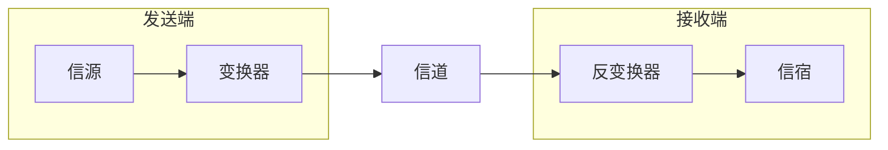

# 第 2 章 物理层

## 2.1. 通信基础

### 2.1.1. 基本概念

#### 1. 数据、信号、码元

- 通信的目的是传送信息。
- 数据是指传送信息的实体。
- 信号是数据的电气或电磁表现。

数据和信号都可用“模拟的”或“数字的”来修饰

- 连续变化的数据或信号称为模拟数据（==模拟信号==）
- 取值仅允许为有限的几个离散数值的数据或信号称为数字数据（==数字信号==）

数据的传输方式可分为串行传输和并行传输。

- 串行： 1 比特 1 比特按照时间顺序传输（远距离常用串行传输）
- 并行：若干比特通过多条通信信道同时传输

码元是指用一个固定时长的波形（数字脉冲）表示一位 $k$ 进制数字，代表不同离散数字的基本波形，是数字通信中数字信号的计量单位，这里时长的信号称为 $k$ 进展码元，该时长称为码元宽度

#### 2. 信源 信宿 信道

数据通信是指数字计算机或其他数字终端之间的通信。一个数据通信系统主要划分为==信源、信道、信宿==三个部分。

- 信源是产生和发送数据的源头
- 信宿是接收数据的终点
- 信道是信号的传输媒介



> 如图为一个单向通信系统的模型，实际的通信系统大多为双向的。

- 信道按传输信号的形式不同，可分为传送模拟信号的==模拟信道==和传送数字信号的==数字信道==两类
- 信道按传输介质的不同可分为有线信道和无线信道

信道上传送的信号有基带信号和宽带信号之分。

- 基带信号将数字 0 和 1 直接用两种不同的电压表示，然后传到数字信道上传输（==基带传输==）
- 宽带信号将基带信号进行==调制==后形成频分复用模拟信号，然后送到模拟信道上传输（==频带传输/宽带传输==）

通信双方信息交互方式看，分为三种基本方式

- 单向通信。只有一个方向的通信而没有反向的交互，仅需要一条信道。
- 半双工通信。通信的双方都可以发送或接收消息，但任何一方都不能同时发送和接收信息，此时需要两条信道。
- 全双工通信。通信双方可以同时发送和接收消息，需要两条信道。

#### 3. 速率 波特 带宽

速率也称数据率，指数据传输速率，表示单位时间内传输的数据量。可以用码元传输速率和信息传输速率表示。

- 码元传输速率（波特率）表示单位时间内数字通信系统所传输的码元个数，单位是波特 Baud。 1 波特表示数字通信系统每秒传输一个码元。
- 信息传输速率（信息速率、比特率）表示单位时间内数字通信系统传输的二进制码元个数（即比特数），单位是 bit/s

带宽原指信号具有的频带宽度，单位是赫兹 Hz。带宽与数据率存在数值上的互换关系，常用来表示网络的通信线路所能传输数据的能力。带宽表示单位时间内从网络的某一点到另一点所能通过的“最高数据率”，此时单位是 b/s

### 2.1.2. 奈奎斯特定理和香农定理

#### 1. Nyquist 定理

具体的信道所能通过的频率范围总是有限的。信号中的许多高频分量往往不能通过信道，否则在传输过程中会衰减，导致接收端收到的信号波形失去码元之间清晰界限，这种现象称为码间串扰。

奈奎斯特定理规定：在理想低通（没有噪声、带宽有限）的信道中，为了避免码间串扰，极限码元传输速率为 $2W$ 波特，其中 $W$ 是理想低通信道的带宽。若用 $V$ 表示每个码元离散电平的数目（16 种不同码元需要 4 位二进制），则极限数据率为

理想低通信道下的极限数据传输速率 = $2W \log_{2}V \text{ b/s}$

对于奈氏准则，有下面结论

1. 在任何信道中，码元传输速率有上限。若传输速率超过此上限，就会出现严重的码间串扰问题，使得接收端不可能完全正确识别码元
2. 信道的频带越宽（即通过的信号高频分量越多），就可用更高的速率进行码元的有效传输
3. 奈氏准则给出了码元传输速率的限制，但并未对信息传输速率给出限制，即未对一个码元可以对应多少个二进制位给出限制

#### 2. Shannon 定理

香农定理给出了带宽受限且有高斯白噪声干扰的信道的极限数据传输速率，当用此速率进行传输时，可以做到不产生误差

信道的极限数据传输速率 = $W \log _{2}(1 + S/N)\text{ b/s}$

式中，$W$ 为信道的带宽，$S$ 为信道所传输信号的平均功率，$N$ 为信道内部的高斯噪声功率。$S/N$ 为信噪比，即信号的平均功率与噪声的平均功率之比，信噪比 = $10 \log_{10}(S/N)$ 单位为 dB

> [!note] 例子
> $S/N=10$ 时，信噪比为 10 dB，$S/N=1000$ 时，信噪比为 30 dB

由香农定理得出的结论

1. 信道的带宽或信道中的信噪比越大，信息的极限传输速率越高
2. 对一定的传输带宽和一定的信噪比，信息传输速率的上限是确定的
3. 只要信息传输速率低于信道极限传输速率，就能找到某种方法来实现误差错传输
4. 香农定理得出的是极限信息传输速率，实际信道能达到的传输速率要比它低不少

### 2.1.3. 编码与调制

把数据变换为模拟信号的过程称为==调制==，把数据变换为数字信号的过程称为==编码==

信号是数据的具体表示形式，它和数据有一定的关系，但又和数据不同。数字数据可以通过数字发送器转换为**数字信号**传输，也可通过调制器转换为**模拟信号**传输；同样，模拟数据可以通过 PCM 编码器转换成**数字信号**传输，也可通过放大器调制器转换成**模拟信号**传输。

下面有 4 中编码方式

#### 1. 数字数据编码为数字信号

用于基带传输，在基本不改变数字数据信号频率的情况下，直接传输数字信号。

1. 归零编码 RZ
   高电平代表 1 ，低电平代表 0 （或相反），每个时钟周期的中间均跳变到低电平，接收方根据该调变调整本方的时钟基准，这就为传输双方提供了自同步机制，但归零需要占用一部分带宽
2. 非归零编码 NRZ
   不用归零，一个周期可以全用来传输数据。但 NRZ 无法传递时钟信号，双方难以同步，需要额外的时钟线
3. 反向归零编码
   用信号的翻转代表 0 ，信号保持不变代表 1 。翻转的信号本身可以作为一种通知机制，这种编码方式集成了前两种编码的优点，既能传输时钟信号，又能尽量不损失系统宽带
4. 曼彻斯特编码
   将一个码元分成两个相等的间隔，前高（电平）后低（电平）表示 1 ，反之表示 0 。可作为时钟信号，也可作为数据信号。所占频带宽度是原始基带宽度的两倍
5. 差分曼彻斯特编码
   若码元为 1 ，则前半个码元的电平与上一个码元的后半个码元电平相同；若码元为 0 ，则相反。每个码元的中间都有一次电平跳转，可以实现自同步，且抗干扰性好
6. 4B/5B 编码
   将欲发送数据流的每 4 位作为一组，按照编码规则转换为相应的 5 位码。 5 位码共 32 种组合，但只采用其中的 16 位对应 16 种不同的 4 位码，其他用作控制或保留

```text
bit data  | 1 | 0 | 0 | 1 | 1 | 0 | 1 | 0 |

RZ        |¯¯_|___|___|¯¯_|¯¯_|___|¯¯_|___|

NRZ       |¯¯¯|___|___|¯¯¯|¯¯¯|___|¯¯¯|___|

RRZ       |¯¯¯|___|___|¯¯¯|¯¯¯|___|¯¯¯|___|

Manchest  |¯|_|_|¯|_|¯|¯|_|¯|_|_|¯|¯|_|_|¯|

Diff Man   |¯|_|¯|_|¯|_|_|¯|¯|_|¯|_|_|¯|_|¯|
```

#### 2. 数字数据调制为模拟信号

1. 幅移键控（ASK）通过改变载波信号的振幅来表示数字信号 1 和 0 ，而载波的频率和相位都不改变。容易实现，抗干扰能力差
2. 频移监控（FSK）通过改变载波信号的频率来表示数字信号 1 和 0 ，载波的振幅和相位不变。容易实现，抗干扰能力强，应用广泛
3. 相移键控（PSK）通过改变载波信号的相位来表示数字信号 1 和 0 ，振幅和频率不变。分为绝对调相和相对调相
4. 正交振幅调相（QAM）在频率相同的前提下，将 ASK 和 PSK 结合，形成叠加信号。设波特率为 $B$，采用 $m$ 个相位，每个相位有 $n$ 种振幅，则该 QAM 技术的数据传输速率为
   $$R=\log _{2} (mn) \text{ b/s}$$

![[public/network/jw0201kfdf.png]]

#### 3. 模拟数据编码为数字信号

常用于对音频信号进行编码的脉码调制（PCM），主要包括三个步骤：采样、量化、编码

> [!note] 采样定理
> 在通信领域，带宽是指信号最高频率与最低频率之差，单位是 Hz 。因此，将模拟信号转换成数字信号时，假设原始信号中最大频率是 $f$，那么采用频率 $f_\text{sample}$ 必须大于等于最大频率 $f$ 的两倍，才能保证采样后的数字信号完整保留原始模拟信号的信息。
> 
> 采样定理又称奈奎斯特定理。

1. 采样是指对模拟信号进行周期性扫描，把时间上连续的信号变成时间上离散的信号。采样频率大于等于模拟数据频带带宽（最高变化频率）的两倍时，所得的离散信号可以无失真地代表被采用的模拟数据
2. 量化：把采样取得的电平幅值按一定的分级标度转化为对应的数字值并取整
3. 编码：把量化的结果转换为与之对应的二进制编码

#### 4. 模拟数据调制为模拟信号

为了实现传输的有效性，可能需要较高的频率。这种调制方式可以使用频分复用（FDM）技术，充分利用带宽资源。

### 2.1.4. 电路交换、报文交换、分组交换


