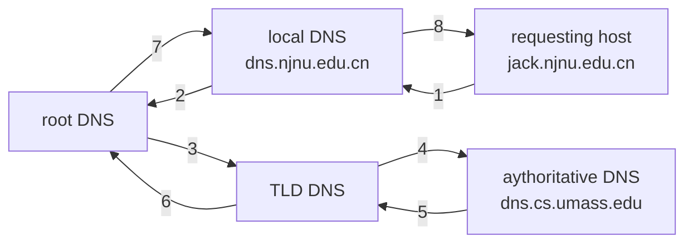
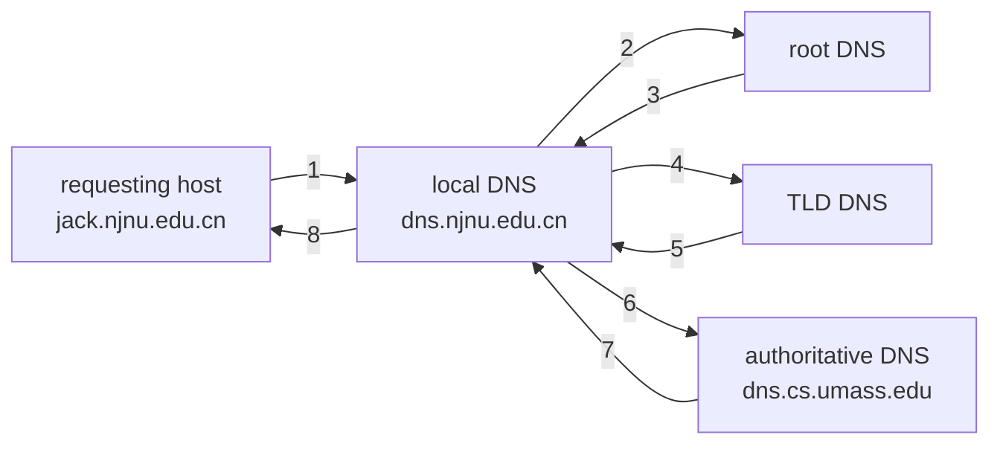
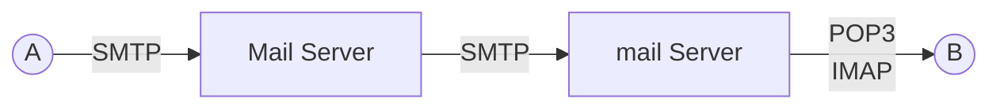
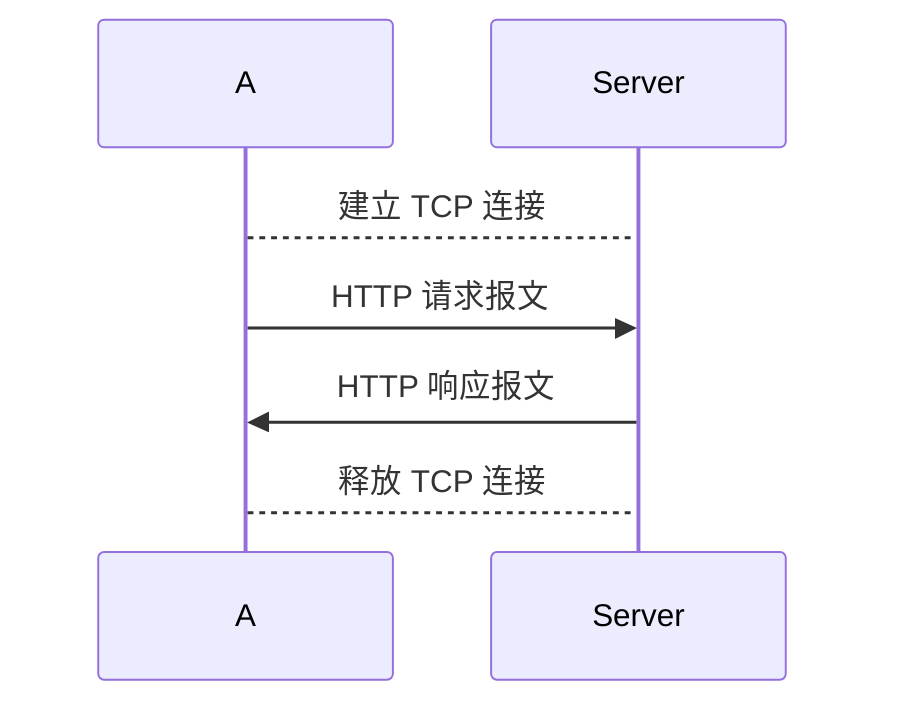

[toc]

# 1. 应用层协议概述

应用层 (Application Layer) 是特定类型的网络应用向网络用户提供相应的服务的窗口,其目的是==支持网络用户联网的应用需求==。

- 网络终端协议 Telnet
- 文件传输协议 FTP
- 简单邮件传输协议 SMTP
- 超文本传输协议 HTTP
- 域名解析协议 DNS
- 简单网络管理协议 SNMP

## 1.1. 基本概念

应用层协议规定了应用程序进程之间通信所遵循的通信规则，包括如何构造进程通信的报文，报文应该包括哪些字段，每个字段的意义与交互的过程等问题

## 1.2. 网络应用程序的结构

### 1.2.1. C/S 结构

- 服务器:
    - 7×24 一直在线的主机
    - 永久的 IP 地址
    - 利用大量服务器实现可扩展性
- 客户机:
    - 与服务器通信
    -  连接可能是间歇性的
    -  可能具有动态的IP地址
    -  相互之间不直接通信

### 1.2.2. P2P 结构

- 没有一直在线的服务器
- 端系统可以直接通信
- 对等节点间歇性连接
- 节点可以改变 IP 地址

### 1.2.3. C/S 和 P2P 混合结构

- Skype
- 及时消息
- Napster

## 1.3. 应用层协议的分类

- 基础设施类
    - 域名服务DNS协议、动态主机配置协议DHCP
- 网络应用类
    - C/S 工作模式：TELNET、SMTP、HTTP、FTP
    - P2P 工作模式：P2P 协议
- 网络管理类
    - SNMP 协议

# 2. 域名系统 DNS

## 2.1. 概念

域名（Domain Name）是 Internet 中主机按照一定的规则，用自然语言（英文、中文等）表示的网络主机名，是一种主机标识符。

### 2.1.1. 域名的结构

- 以 `.` 分割
- 层次化，从左到右级别依次升高，最右边为顶级域名
- 大小写不敏感，每个子域名最多不能超过 63 字符，整个域名不能超过 255 字符

### 2.1.2. 域名与 IP 地址

- IP 地址是数字型的，难于记忆与理解；域名是字符型的，直观，便于记忆与理解；
- IP 地址用于网络层；域名用于应用层；
- IP 地址与域名都是唯一的，并且它们之间具有对应关系。
    - 域名与IP地址不一定一一对应：一台只有一个 IP 地址的计算机可以有多个域名
- 因特网是 TCP/IP 网络，所以网络中的每一台网络设备都使用IP地址，因此需要在使用域名时，必须要==将其转换为 IP 地址（域名解析）==才能进行通信，因此产生了域名解析服务。

### 2.1.3. DNS 设计的基本要求

域名系统 DNS (Domain Name System) 的目标：提出一种分层次、基于域的命名方案，并且通过一个分布式数据库系统，以及维护与查询机制来实现域名服务功能。

- 域名空间：定义一个包括所有可能出现的主机名字的域名空间
- 域名注册：保证每台主机域名的唯一性
- 域名解析：提供一种有效的域名与IP地址转换机制

### DNS 组成部分

- 域名空间
- 域名服务器
- 域名解析程序

## 2.2. 域名空间结构

所有的域名是以树状结构进行存放和管理的

### 顶级域名类型

- 国家顶级域名
    - .cn, .uk, .us
- 通用顶级域名
    - .com, .net, .org, .edu, .gov
- 基础结构域名
    - 只有一个 arpa，用于反向域名解析

## 2.3. 域名服务器

所有的域名存放在==分布式==、==分层结构==的数据库中。运行这些数据库的服务器就称为域名==服务器DNS==（Domain Name Server）

大多数具有 Internet 连接的组织都设置了域名服务器，每个服务器包含连向其他域名服务器的信息，这些服务器形成了一个大的协同工作的域名数据库

### 2.3.1. 域名服务器类型

#### 根域名服务器

全球 13 个根服务器

#### 顶级域名服务器

- 负责所有的 com, org, net, edu 等, 以及所有的顶级国家域 uk, fr, ca, jp.
- Network Solutions 维护 com 顶级域名服务器
- Educause 维护 edu 顶级域名服务器

#### 权限域名服务器

- 机构的 DNS 服务器，提供==机构内部服务器==解析服务，即主机名到 IP 地址的权威映射信息
- 可以由==机构==或==服务提供商==维护

#### 本地域名服务器

- 并不严格属于层次结构
- 每个 ISP (本地 ISP, 公司, 大学) 有一个
    - 也被称作“默认名字服务器”
- 当主机产生 DNS 查询时，查询被发往本地 DNS 服务器
    - 作为一个代理，将查询请求转发到（层次化的）域名解析服务器系统

## 2.4. 域名解析及其工作原理

==域名解析==是指将域名转换为 IP 地址的过程，完成该功能的软件称为域名解析器。

域名解析是以==客户/服务器方式==进行工作的

- 当应用程序需要进行域名解析时（从域名到 IP 地址），它称为域名系统的一个客户。它向其默认域名服务器发出域名解析的请求，该域名服务器如找到对应的 IP 地址后，给出响应。
- 当这个域名服务器无法完成域名解析，它临时变成其上层域名服务器的客户，进行==递归解析==或==反复(迭代)解析==，直到该域名解析完成。

### 2.4.1. 递归解析

如果主机所询问的本地域名服务器不知道被查询域名的 IP 地址，那么本地域名服务器就以 DNS 客户的身份，向其他域名服务器继续发出查询请求报文。域名解析任务则由其他域名服务器完成。



问题：会造成 root DNS 在内的服务器高负载

### 2.4.2. 反复（迭代）解析

当其他域名服务器收到本地域名服务器的域名解析请求报文时，要么给出所要查询域名的 IP 地址，要么告诉本地域名服务器：“你下一步应当向哪一个域名服务器进行查询”。然后让本地域名服务器进行后续的查询。



## 2.5. 域名系统的性能优化

### 2.5.1. 配置根服务器表

- 当一个新的网络加入 Internet 时，其本地域名服务器中都会配置一个根域名服务器列表。
- 本地的 DNS 服务器可以为用户选择==响应最快的根服务器==。

### 2.5.2. 域名缓存

- 每个域名服务器和主机都维护一个高速域名缓存，存放==最近解析过的域名==以及从何处获得域名映射信息的记录。
- 域名缓存可大大==减轻根域名服务器的负荷==，使因特网上的 DNS 查询请求和回答报文的数量大为减少。

#### DNS 记录

本质上是存储资源记录 (RR:Resource Record) 的分布式数据库，格式为

|name|value|type|ttl|
|:---:|:---:|:---:|:---:|

#### 如何注册域名

在 DNS 注册机构 (e.g. ICANN) 注册域名

- 提供权威名字服务器(主、备两个)的名字和IP地址
- 注册机构向 com 顶级域名服务器中插入两条资源记录
    - `(networkutopia.com, dns1.networkutopia.com, NS)`
    - `(dns1.networkutopia.com, 212.212.212.1, A)`
- 在权威服务器上为主机 www.networkuptopia.com 创建一条A记录; 为 networkutopia.com 创建一条 MX 记录

#### DNS 的其它服务

- 主机的别名
    - 规范名字, 别名
    - 邮件服务器别名
- 负载均衡
    - 镜像 Web 服务器: 一个规范名字对应一组 IP 地址

# 3. 远程登录服务与 TELNET 协议

TCP 上，使用 NVT 格式

# 4. 电子邮件服务与 SMTP

## 4.1. 信息格式

- 信封
    - local-name@domain-name
- 内容
    - 头部
    - 现在：头部、正文、附件

## 4.2. SMTP 的组成

### 4.2.1. 用户代理 UA

邮件代理，实现编辑、发送、阅读和管理

### 4.2.2. 传输代理 MTA

邮件服务器，起邮局的作用，实现接收邮件，根据邮件目的地址传送到接受方的邮件服务器，并将邮件存放在用户邮箱内

## 4.3. 电子邮件协议



### 4.3.1. SMTP/MIME

用户代理向邮件服务器、邮件服务器之间

#### SMTP 简单邮件传输协议

TCP 连接，端口号为 25

Mail server 之间采用存储转发方式

#### MIME 多用途 Internet 邮件扩充协议

弥补 SMTP 只能传输文本的不足，增加了对图像、声音、视频、可执行文件等支持，作为 SMTP 的伙伴协议

### 4.3.2. POP/IMAP

邮件服务器到用户

#### POP3

TCP 上，端口号 110

- 离线访问方式，一次性下载全部邮件，脱机状态下运行
- 支持保留模式和删除模式

#### IMAP 交互式邮件访问协议

- 联机状态下运行，能够分步骤的下载用户邮件
- 在电子服务器中保留副本

# 5. WEB 与基于 WEB 的网络应用

World Wide Web

## 5.1. 核心技术

### 超文本标记语言 HTML

### 超文本传输协议 HTTP

建立在 TCP 协议上，基于 C/S 方式，工作在 80 端口

### 超连接 Hyperlink

### 统一资源定位符 URL

一般形式

```text
<URL 访问方式>://<主机>:<端口>/<路径>
```

- 访问方式：
    - http
    - ftp
    - news ...

## 5.2. 超文本与超媒体

www 的基础

超文本是由==信息节点和链==组成的

超媒体=多媒体+超文本

## 5.3. www 要解决的 4 个问题

- 显示？什么地方存在超链？
    - HTML
- 怎样标志分布在 Internet 的 www 文档
    - URL
- 怎样实现 www 上页面的传输
    - HTTP
- 怎样使用户能够很方便地找到信息
    - 搜索引擎

## 5.4. www 的工作过程



1. 在浏览器输入 xxx 大学 Web 网站的域名 www.xxx.edu.cn
2. 浏览器向默认DNS 服务器请求解析 www.xxx.edu.cn 的 IP 地址；
3. 域名系统解析出 www.xxx.edu.cn 的 IP 地址；
4. 浏览器与 xxx 大学 Web 服务器的 80 端口建立 TCP 连接；
5. 浏览器使用HTTP协议发出取主页文件的命令；
6. 服务器给出响应，使用 HTTP 协议把主页文件发给浏览器；
7. TCP 连接释放；
8. 浏览器解释并显示“xxx 大学”主页内容。

## 5.5. 请求一个 www 文档所需时间

![[public/network/jw6_04.svg]]

总时间=2RTT+文件传输时间

- 非持续连接
    - 每取一个文件建立一次TCP连接
    - 一个页面中有n个对象的获取时间
        - total=(2RTT+文件传输时间)×(n+1)
- 持续连接
    - 建立一次TCP连接，然后连续读取文件
        - 非流水线方式：
            - total = 2RTT+文件传输时间+n×(RTT+文件传输时间)
        - 流水线方式：
            - total = 2RTT+文件传输时间+RTT+n×文件传输时间


# 6. 即时通信工作模型

# 7. 主机配置与动态主机配置 DHCP

一台计算机接入Internet需要配置以下参数：

- IP 地址
- 子网掩码
- 默认路由器的 IP 地址
- 域名服务器的 IP 地址

这些信息通常存储在一个配置文件中，计算机在引导过程中可以对这个文件进行存取。

即插即用连网，自动分配 IP，无需手工分配，基于 C/S 模式，服务器端通常是 DHCP 服务器或默认网关

## 7.1. DHCP 报文的发送方式

![[public/network/jw6_02.svg]]

### DHCP 协议的工作过程

![[public/network/jw22.png]]
![[public/network/jw23.png]]

1. DHCP 服务器被动打开 UDP 端口 67，等待客户端发来的报文
2. DHCP 客户从 UDP 端口 68 发送 DHCP 发现报文
3. 凡收到 DHCP 发现报文的 DHCP 服务器都可以发出 DHCP 提供报文，因此客户可能收到多个 DHCP 提供报文
4. 客户从几个 DHCP 服务器中选择一个，并向其发送 DHCP 请求报文
5. 被选择的 DHCP 服务器发送确认报文 DHCPACK，进入已绑定状态，并可开始使用得到的临时 IP 地址
6. 租用期过了一半（T1 时间到），DHCP 发送请求报文 DHCPREQUEST 要求更新租用期。
7. DHCP 服务器若不统一，则发回否认报文 DHCPNAK，客户必须立即停止使用原来的 IP，必须重新申请新的 IP
8. DHCP 服务器同意，则发回确认报文 DHCPACK，客户得到了新的租用期，重新设置计时器
9. 客户可随时终止服务器提供的租用期，向 DHCP 服务器发送 DHCPRELEASE


# 8. 网络管理与简单网管协议 SNMP

# 9. FTP 文件传输协议

TCP，基于 C/S，客户机与服务器要建立两个 TCP 连接

![[public/network/jw24.png]]

## 9.1. 工作原理

### 9.1.1. 控制连接

客户进程使用一个临时端口号主动与端口为 21 的 FTP 服务器进程连接，服务器进程被动地建立一个控制连接，专门传输 TCP 命令和服务器回送信息。同时客户进程还要告诉服务器进程自己的另一个端口号码(本地分配)，用于建立数据传送连接。

### 9.1.2. 数据连接

服务器进程用自己传送数据的熟知端口(20)与客户进程所提供的端口号建立数据传送连接。每传输一个文件，建立一个连接，端口为都 20。

## 9.2. 功能

1. 客户机与服务器之间能够交换多种类型、多种结构、多种格式的文件
2. 提供对远程系统的目录操作功能，如改变目录名称、删除目录、新建目录等。
3. 具有对文件改名、显示内容、改变属性、删除之功能以及其他一些操作。

## 9.3. 服务类型

- 普通 FTP
- 匿名  

