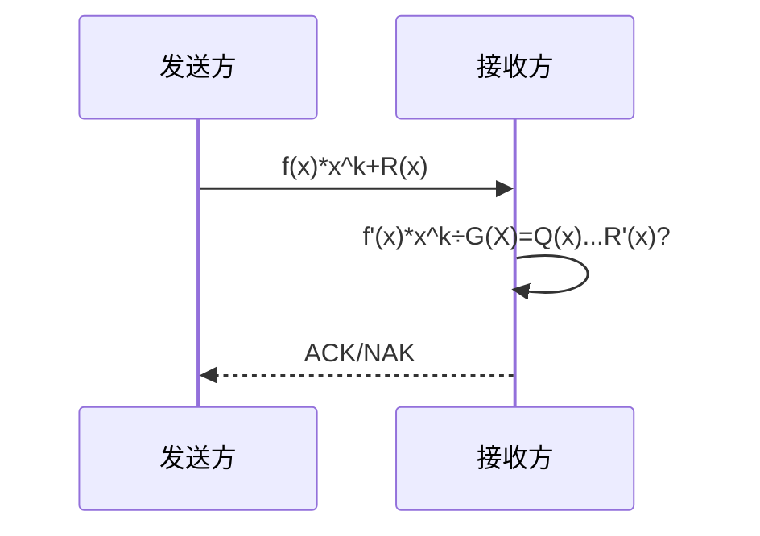
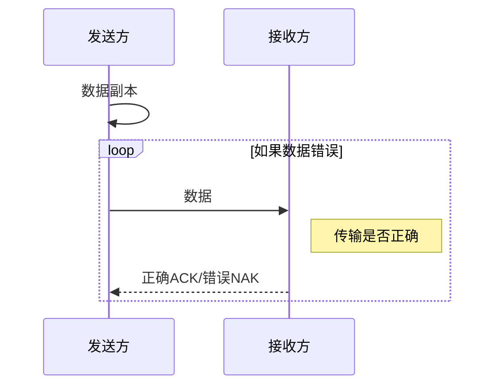
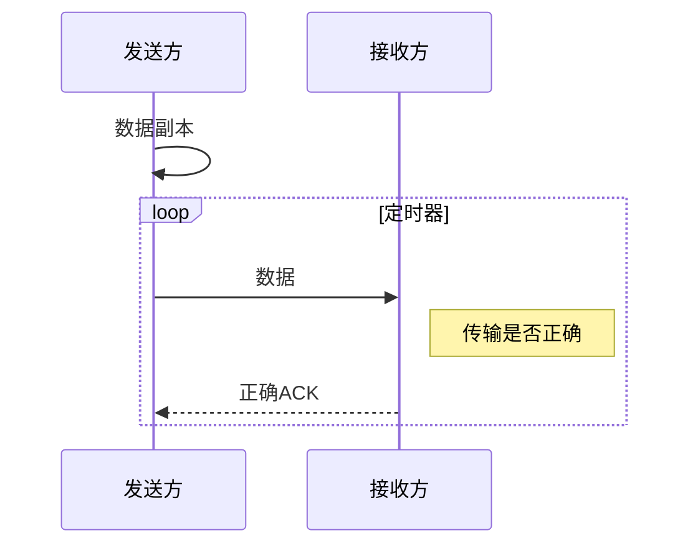

#### 1. 如果数据字段为 $11100011$，生成多项式 $G(X)=X^5+X^4+X+1$。请写出发送的比特序列，并画出曼彻斯特编码序号波形图。

生成多项式 $G(X)$ 对应二进制为 $110011$

$$f(X)\cdot X^6\div G(X)=1,1100,0110,0000\div 11,0011=1011,0110\cdots 11010$$

即 $R(X)=X^5+X^2+X$，发送的比特序列为 $1,1100,0111,1010$

```wavedrom
{signal: [
	{name: "wave", wave: "n..p..n...pnp"}
],
head: {
	text: "曼彻斯特编码波形图",
},
foot: {
	tock: "1 1 1 0 0 0 1 1 1 1 0 1 0 "
}}
```

#### 2. 某个数据通信系统采用 CRC 校验方式，并且生成多项式 $G(X)$ 的二进制比特序列为 11001，目的主机接收到的二进制比特序列为 110111001（含CRC校验码）。请判断传输过程是否出现了差错？为什么？

题中 $R(X)=X^4+X^3+1, f^\prime(X)=X^3+X^2+1$

接收到的序列 $110111001\div 11001=10011\cdots 10$，余数不为 $0$，出现差错。








