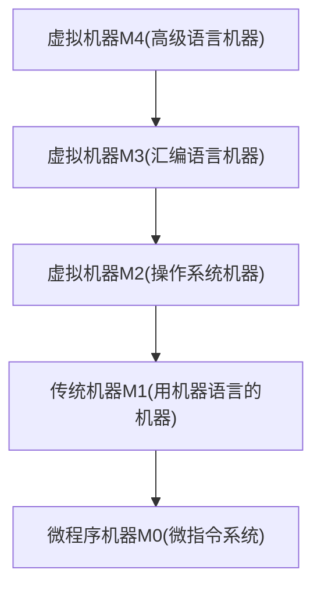

# 第 1 章 计算机系统概述

> [!quote] 内容
> 
> 1.  计算机系统层次结构
>     计算机系统的基本组成
>     计算机硬件的基本组成
>     计算机软件和硬件的关系
>     计算机系统的工作原理：“存储程序”方式、高级语言程序与机器语言程序的转换、程序指令和指令的执行过程
> 2.  计算机性能指标
>     吞吐量、响应时间、CPU 时钟周期、主频、CPI、CPU 执行时间
>     MIPS、MFLOPS、GFLOPS、TFLOPS、PFLOPS、EFLOPS、ZFLOPS

## 1.2. 计算机系统层次结构

### 1.2.1. 计算机系统的组成

硬件系统和软件系统共同构成了一个完整的计算机系统。

计算机系统性能的好坏，很大程度上是由软件的效率和作用来表征的，而软件性能的发挥离不开硬件的支持。

### 1.2.2. 计算机硬件

#### 1. 冯·诺依曼基本思想

**“存储程序”概念**

- 采用“存储程序”的工作方式
- 计算机硬件系统由==运算器、存储器、控制器、输入设备、输出设备 5 部分组成==
- 指令和数据以同等地位存储在存储器中，形式上没有区别，但计算机能区分它们
- 指令和数据均用二进制代码表示。指令由==操作码==和==地址码==组成，操作码指出操作的类型，地址码指出操作数的地址。

基本思想：将**事先编制好**的程序和原始数据**送入主存**后才能执行，一旦程序被启动执行，就无需操作人员干预，计算机会逐条执行指令，直至程序结束。

#### 2. 计算机的功能部件

##### 1. 输入设备

将程序和数据以机器所能识别和接受的信息形式输入计算机，如键盘鼠标等。

##### 2. 输出设备

将计算机处理的结果以人们所能接受的形式或其他系统所要求的信息形式输出，如显示器、打印机。

##### 3. 存储器

分为 ==主存储器（内存储器）== 和 ==辅助存储器（外存储器）== 。CPU 能直接访问主存储器。外存储器信息必须调入主存后，才能被 CPU 访问。

![[public/jz/jzc001.svg]]

地址寄存器 MAR 存放地址，经过地址译码后找到所选的存储单元。数据寄存器 MDR 用于暂存要从存储器中读或写的信息。

MAR 用于寻址，其位数对应着存储单元的个数，MAR 的长度与 PC 的长度相等。

MDR 的位数和存储字长相等，一般为字节的二次幂的整数相等。

##### 4. 运算器

用于进行算术运算和逻辑运算。核心是==算术逻辑单元 ALU==。

运算器包含若干通用寄存器，用于暂存操作数和中间结果，如累加器 ACC、乘商寄存器 MQ、操作数寄存器 X、变址寄存器 IX、基址寄存器 BR 等。

##### 5. 控制器

计算机的指挥中心，由其指挥各部件自动协调地工作。控制器由程序计数器 PC、指令寄存器 IR、控制单元 CU 组成。

PC 存储当前==欲执行指令的地址==，可以自动加一以形成下一条指令，与 MAR 之间有一条直接通路。

IR 用来存放当前指令，其内容来自主存的 MDR。指令中的操作码 OP (IR) 送至 CU，用以分析指令并发出各种为操作命令序列；地址码 Ad (IR) 送往 MAR，用以取操作数。

CPU 和主存之间通过一组总线连接，总线有地址、控制、数据 3 组信号线。

> [!caution]
> IR, MAR, MDR 是 CPU 的内部工作寄存器，对用户透明。

### 1.2.3. 计算机软件

#### 1. 系统软件和应用软件

**系统软件** 是一组保证计算机系统高效、正确运行的基础软件，通常作为系统资源提供给用户使用。主要有 OS、DBMS、语言处理程序、分布式软件系统、网络软件系统、标准库程序、服务性程序等。

**应用软件** 是指用户为解决某个应用领域中各类问题而编制的程序，如各种科学计算类程序、工程设计类程序等。

#### 2. 三个级别的语言

1. **机器语言** 又称二进制代码语言，是计算机唯一可以直接识别和执行的语言
2. **汇编语言** 用英文单词或缩写代替二进制的指令代码，更容易为人们记忆和理解，必须翻译为二进制代码才能在计算机硬件系统上执行
3. **高级语言** 为方便程序人员写出解决问题的处理方案和解题过程的程序。需要经过编译程序编程汇编语言程序，进一步经过汇编操作得到机器语言；或者从高级语言直接翻译为机器语言。

#### 3. 软件和硬件的逻辑功能等价性

硬件实现的往往是最基本的算术和逻辑运算功能，其他功能大多通过软件的扩充得以实现。

软件和硬件的功能分配及其界面的确定是计算机系统结构的重要内容。

### 1.2.4. 计算机系统的层次结构

> 关于计算机系统层次结构的分层方式目前尚无统一的标准，此处采用一种层次结构。



- M0: 由机器硬件直接执行微指令
- M1: 也是一个实际的机器层，由微程序解释机器指令系统
- M2: 由操作系统程序实现，操作系统程序是由机器指令和广义指令组成，这些广义指令是为了扩展机器功能而设置的，是由操作系统定义和解释的软件指令。
- M3: 为用户提供一种符号化的语言，借此可编写汇编语言程序，由汇编程序支持和执行
- M4: 面向用户，为方便用户编写应用程序而设置。该层由各种高级语言编译程序支持和执行

M2-M4 称为虚拟机，即软件实现的机器。

### 1.2.5. 计算机系统的工作原理

#### 1. “存储程序”工作方式

程序执行前，需要将程序所含的指令和数据送入主存，一旦程序被启动执行，就无需操作人员干预，自动逐条完成指令的取出和执行任务。执行过程如下


#### 2. 从源程序到可执行文件

在计算机中编写的 C 语言程序，都必须被转换为一系列低级机器指令，这些指令按照一种称为==可执行目标文件==的格式打包好，并以二进制磁盘文件的形式存放起来。

以 UNIX 系统中的 GCC 编译器程序为例，读取源程序文件 `hello.c`，并把它翻译成一个可执行目标文件 `hello`，整个翻译过程可分为 4 个阶段完成

![[public/jz/Pasted_image_20220517231238.png]]

1. **预处理阶段**：cpp 对源程序中以 `#` 开头的命令进行处理，例如将 `#include` 命令后的 `.h` 文件内容插入程序文件。输出结果是一个以 `.i` 为扩展名的源文件 `hello.i`
2. **编译阶段**：ccl 对预处理后的源程序进行编译，生成一个汇编语言源程序 `hello.s`。汇编语言源程序中的每一条语句都以一种文本格式描述了一条低级机器语言指令。
3. **汇编阶段**：as 将 `hello.s` 翻译成机器语言指令，把这些指令打包成一个称为可重定位目标文件 `hello.o`，它是一种二进制文件。
4. **链接阶段**：ld 将多个可重定位目标文件和标准库函数合并为一个可执行目标文件，或称可执行文件。本例中，链接器将 `hello.o` 和标准库函数 `printf` 所在的可重定位目标模块 `printf.o` 合并，生成可执行文件 `hello`，最终保存在磁盘上。

#### 3. 程序执行过程的描述

```shell
unix> ./hello
hello, world!
```

![[public/jz/Pasted-image-20220518195351.png]]

- shell 程序将用户键盘输入的每个字符逐一读入 CPU 寄存器（对应①）
- 然后保存到主存储器中，在主存的缓冲区形成字符串 `"./hello"`（对应②）
- 接收到 Enter 键时，shell 调出操作系统的内核程序，有内核来加载磁盘上的可执行文件 `hello` 到主存中（对应③）
- 内核加载完可执行文件中的代码和数据后，将 `hello` 的第一条指令送至 PC，CPU 随后开始执行 `hello` 程序，它将已加载到主存的字符串 `"hello, world!\n"` 中每个字符从主存取到 CPU 的寄存器中（对应④）
- 然后将 CPU 寄存器中的字符送到显示器（对应⑤）

由此可见，程序的执行过程就是数据在 C 、主存储器和 I/O 设备之间流动的过程，所有数据的流动都是通过总线、I/O 接口等进行的。

在程序的执行过程中，必须依靠操作系统的支持。特别是在涉及到对键盘、磁盘等外部设备的操作时，用户程序不能直接访问这些底层的硬件，需要依靠==操作系统内核==来完成（如中断）。

#### 4. 指令执行过程的描述

可执行文件代码段是由一条条机器指令构成的，指令由 0/1 序列表示，用来指示 CPU 完成一个特定的原子操作。

##### 1. 取指令

PC → MAR → M → MDR → IR

**根据 PC 取指令到 IR**。将 PC 的内容送 MAR，MAR 中的内容直接送地址线，同时控制器将读信号送读 / 写信号线，主存根据地址线上的地址和读信号，从指定存储单元读出指令，送到数据线上，MDR 从数据线接收指令信息，并送到 IR 中。

##### 2. 分析指令

OP(IR) → CU

**指令译码并送出控制信号**。控制器根据 IR 中指令的操作码，生成相应的控制信号，送到不同的执行部件。本例中，IR 是取数指令，读控制信号线被送到总线的控制线上。

##### 3. 执行指令

Ad(IR) → MAR → M → MDR → ACC

**取数操作**。将 IR 中指令的地址码送 MAR，MAR 中的内容送地址线，同时控制器将读信号送读 / 写信号线，从主存中读操作数，并通过数据线送至 MDR，再传送到 ACC 中。

每取完一条指令，还须为取下一条指令做准备，计算下一条指令的地址，即 PC = PC + 1

## 1.3. 计算机的性能指标

### 1.3.1 计算机的主要性能指标

#### 1. 字长

指计算机进行一次整数运算（即定点数运算）所能处理的二进制数据的位数，通常与 CPU 的寄存器位数、加法器有关。字长一般等于内部寄存器的大小，字长越长，数的表示范围越大，计算精度越高。通常为字节的整数倍。

#### 2. 数据通路带宽

指数据总线一次所能并行传送信息的位数。这里所说的数据通路宽度是指外部数据总线的宽度，与 CPU 内部数据总线宽度（寄存器大小）可能不同。

#### 3. 主存容量

指主存储器所能存储信息的最大容量，通常以==字节==来衡量，也可用==字数×字长==（如 512K × 16 位）来表示容量。其中，MAR 的位数反映存储单元的个数，MAR 的位数反映可寻址范围的最大值（而不一定是实际存储器的存储容量）。

MAR 为 16 位，表示该存储体内有 $2^{16}=65536$ 个存储单元（可称 64 K 内存），若 MDR 为 32 位，表示存储容量为 ==64K × 32 位==。

#### 4. 运算速度

##### 1. 吞吐量和响应时间

- **吞吐量** 指系统在单位时间内处理请求的数量。它取决于信息能多快地存入内存，CPU 能多快地取指令，数据能多快地从内存取出或存入，以及所得结果能多快地从内存送给一台外部设备。几乎每一步都关系到主存，因此系统吞吐量主要取决于主存的存取周期。
- **响应时间** 指从用户向计算机发送一个请求，到系统对该请求做出响应并获得所需结果的等待时间。通常包括 CPU 时间（运行一个程序所花费的时间）与等待时间（磁盘访问、存储器访问、I/O 操作、操作系统开销时间等）

##### 2. 主频和 CPU 时钟周期

- **CPU 时钟周期** 通常为节拍脉冲或 $T$ 周期，即主频的倒数，是 CPU 中最小的时间单位，执行指令的每个动作至少需要 1 个时钟周期
- **主频** 机器内部主时钟的频率。对于同一个型号的计算机，其主频越高，完成指令的一个步骤所用的时间越短，执行指令的速度越快。

##### 3. CPI 

即执行一条指令所需的时钟周期数。不同指令的时钟周期数可能不同，因此对于一个程序或一台机器来说，其 CPI 指该程序或该机器指令集中所有指令执行所需的平均时钟周期数，此时 CPI 是一个==平均值==。

##### 4. CPU 执行时间 指运行一个程序所花费的时间

CPU 执行时间 = CPU 时钟周期数 / 主频 = (指令条数 × CPI) / 主频

CPU 性能（执行时间）取决于三个要素

1. 主频（时钟频率）
2. 每条指令执行所用的时钟周期数（CPI）
3. 指令条数

以上三者是相互制约的。例如，更改指令集可以减少程序所含指令的条数，但同时可能引起 CPU 结构的调整，从而可能会增加时钟周期的宽度。

##### 5. MIPS (Million Instructions Per Second)

MIPS = 指令条数 / (执行时间 × $10^6$) = 主频 / (CPI × $10^6$)

MIPS 对不同机器进行性能比较是有缺陷的，因为不同机器的指令集不同，指令功能不同。

##### 6. MFLOPS GFLOPS TFLOPS PFLOPS EFLOPS ZFLOPS

- MFLOPS (Mega Floating-point Operations Per Second)，即每秒执行多少百万次浮点数运算。
- GFLOPS (Giga Floating-point Operations Per Second)，即每秒执行多少十亿次浮点数运算。
- TFLOPS (Tera Floating-point Operations Per Second)，即每秒执行多少万亿次浮点数运算。

#### 5. 基准程序

是专门用来进行性能评价的一组程序，能够很好地反映机器在运行实际负载时的性能，可以通过在不同机器上运行相同的基准程序来比较在不同机器上的运行时间，从而评测其性能。对于不同的应用场合，应该选择不同的基准程序。

## 1.4. 小结

#### 主频高的 CPU 一定比主频低的 CPU 快吗？

衡量 CPU 运算速度的指标很多，不能以单独的某个指标来判断 CPU 的好坏。 CPU 主频表示 CPU 内数字脉冲信号振荡的速度，主频和实际的运算速度存在一定的关系，但目前还没有一个确定的公式能够定量两者的数值关系。

CPU 的运算速度还要看 CPU 的流水线各方面的性能指标（架构、缓存、指令集、 CPU 的位数、 Cache 大小等）。

#### 翻译程序、解释程序、汇编程序、编译程序的区别和联系？

翻译程序有两种：

- 编译程序（将高级语言源程序一次全部翻译成目标程序，只要源程序不变，无须重新翻译）
- 解释程序（将源程序的一条语句翻译成对应的机器目标代码，并立即执行，然后翻译下一条源程序的语句并执行，直至所有源程序语句全部被翻译并执行完）

汇编程序也是一种语言翻译程序，它把汇编语言源程序翻译为机器语言程序。

#### 什么是透明性

在计算机领域中，站在某类用户的角度而言，若感觉不到某个事物或属性的存在，即“看”不见某个事物或属性，则称为==对该用户透明==。

对于高级语言程序员，浮点数格式、乘法指令等这些指令的格式、数据如何在运算器中运算都是透明的。

CPU 中， IR, MAR, MDR 对各类程序员都是透明的。

#### 字、字长、机器字长、指令字长、存储字长

32 位机器 = 字长为 32 = 机器字长为 32 = CPU 内部用于==整数运算的数据通路==的宽度

- 指令字长：一个指令字中包含的二进制代码的位数
- 存储字长：一个存储单元存储的二进制代码的长度

上述两个必须是字节的整数倍。指令字长一般取存储字长的整数倍，若指令字长等于存储字长的 2 倍，则需要 2 个访问周期来取出一条指令。若相等，则一次取一条。


