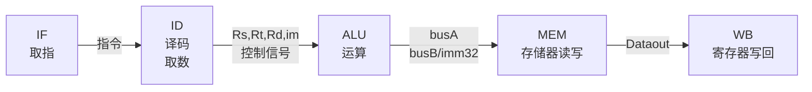

# 五级流水线 CPU 设计

## 1. 五级流水线运行流程

### 1.1. 单周期运行流程回顾



### 1.2. 流水线 CPU 的运作

#### 1.2.1. 工作流程

与单周期的流程类似，但将时钟周期缩短，每个周期都只完成一个部件的工作，系统最繁忙时刻可以在同一时刻同时运行 5 条流水线指令，提高了指令的吞吐量。

由于不同指令对于每个部件都有不同的使用区间，所以为了避免不同指令在同一时间对同一部件的访问，使得流水线顺利的运行，需要做到以下两点：

- 每个功能部件每条指令只能用一次（如：写口不能用两次或以上）
- 每个功能部件必须在相同的阶段被使用（如：写口总是在第五阶段被使用）

所以将所有指令都扩充到需要 5 个时钟周期来完成，每个时钟周期的长度由执行时间最长的那一个部件来决定。

![[src/Pasted_image_20211027142548.png]]

与此同时，在上述流程图中，仍然存在在 cycle 5 周期内，同时有指令 1 和指令 5 对寄存器进行访问，所以，在这里采用**寄存器和存储器的“先写后读”的方式**，来解决**结构冲突**。

#### 1.2.2. 核心部件及寄存器的分布

![[src/Pasted_image_20211027143630.png]]

在每个部件后面，都加入状态寄存器，用于保存当前周期当前部件所进行的状态，使得数据能够像流水线一样传递到下一个部件，同时当前部件会接收到新的信号和状态。

#### 1.2.3. 控制信号的给出

![[src/Pasted_image_20211027144521.png]]

Controller 控制器在 IF/ID 寄存器之后得到指令，并通过指令得到每个部件的控制信号，将这些信号发给下一级 ID/EX 寄存器，这些信号再经过下级寄存器继续流水发送。

## 2. 五级流水线 CPU 组成部件

### 2.1. 核心部件

| 部件名   | 作用                                                                                     |
| -------- | ---------------------------------------------------------------------------------------- |
| IUnit    | 用于取指令（包含指令存储器），并完成 PC + 4                                              |
| RFile    | 从寄存器中读取数据，放到 busA 和 busB 中，同时通过 Rd 给出的地址和 busW 将数据写回寄存器 |
| ExecUnit | 执行部件，完成立即数 imm 的扩展和 ALU 运算                                               |
| DataMem  | 将数据存入存储器，根据给定的地址读出数据                                                 |

### 2.2. 状态寄存器及 PC Unit

| 寄存器    | 存放的信号                                                                                              |
| --------- | ------------------------------------------------------------------------------------------------------- |
| u_pc      | `pc`                                                                                                      |
| IF/ID.reg | `pc+4`, `instruction`                                                                                       |
| ID/EX.reg | `ExtOp`, `ALUSrc`, `ALUOp`, `RegDst`, `MemWr`, `Branch`, `MemtoReg`, `RegWr`,<br>`Rs`, `Rt`, `Rd`, `busA`, `busB`, `imm`, `pc+4`, `jump`, `jump_target` |
| EX/ME.reg | `MemWr`, `Branch`, `MemtoReg`, `Target`, `Zero`, `ALUout`, `busB`, `Rd`, `jump`, `jump_target`                                       |
| ME/WB.reg | `Dataout`, `Rd`, `ALUout`, `MemtoReg`, `RegWr`                                                                        | 

### 2.3. 控制器 Controller

通过传入的指令，生成一系列控制信号。

| 控制信号    | 含义                                 |
| ----------- | ------------------------------------ |
| `RegWr`       | 寄存器写回                           |
| `RegDst`      | 目的寄存器                           |
| `MemtoReg`    | 存储器写回寄存器                     |
| `MemWr`       | 写入存储器                           |
| `Branch`      | `beq` 跳转                             |
| `Jump`        | `jump` 跳转                            |
| `ExtOp`       | 立即数带符号/无符号扩展              |
| `ALUctr[2:0]` | ALU 选择运算方式                     | 
| `ALUSrc`      | 控制 ALU inputB 的输入源 (`busB/imm32`) |

### 2.4. 存储器

| 部件名                   | 作用                                                                                                                                |
| ------------------------ | ----------------------------------------------------------------------------------------------------------------------------------- |
| InstructionMem           | 指令存储器，被 IUnit 模块调用；在初始化时提前放入指令                                                                               |
| DataMem (包含在核心部件) | 数据寄存器，输入 `ALUout` 作为地址，并输出存储器内数据；同时通过 `MemWr` 信号控制是否从 `Datain` 口存入数据；在初始化时提前放入数据 | 

### 2.5. 数据通路 DataPath

将 PC，取指令模块 IUnit，IF/ID 寄存器，取数译码模块 RFile，ID/EX 寄存器，执行模块 ExecUnit，EX/ME 寄存器，数据存储器 DataMem，ME/WB 寄存器组合，成为流水线数据通路。

### 2.6. 顶层模块 Pipeline

由 **DataPath 模块** 和 **Controller 模块** 组成。

DataPath 输出从取指令模块得到的指令，接收 Controller 发出的一系列控制信号。

Controller 接收 DataPath 发出的指令，发出从指令中翻译得到的一系列控制信号。

### 2.7. 测试模块 testbench

包含一个顶层模块 Pipeline，向其中输入 clk 和 run 信号。同时，通过 `$dumpfile` 和 `$dumpvars` 命令将波形引出。

### 2.8. 冒险检测控制部件

#### 2.8.1. 数据冒险

| 部件名                   | 作用                                                                                                      |
| ------------------------ | --------------------------------------------------------------------------------------------------------- |
| hazard_detection_unit    | 检测是否有 Load-use 数据冒险，若有则发出 `stall` 信号                                                     |
| forwarding_unit          | 读取并检测几个状态寄存器的 Rs, Rt, Rd，判断是否需要转发，给出 `forward_a[1:0]` 和 `forward_b[1:0]` 信号 |
| mux_foraward_a (mux3to1) | 通过 `forward_a` 从 `id/ex.busA`, `me/wr.ALUout`, `ex/me.ALUout` 3 个信号中选择正确的 ExecUnit A 口输入             | 
| mux_foraward_b (mux3to1) | 与 mux_foraward_a 类似，选择 ExecUnit 的 B 口的输入                                                                                                  |

#### 2.8.2. 控制冒险

| 部件名                | 作用                                                  |
| --------------------- | ----------------------------------------------------- |
| mux_real_pc (mux3to1) | 从 `pc+4`, `bz_target`, `jump_target` 中选出下一条 PC |
| bz_target_ahead       | 提前计算 `Branch` 跳转指令的目标 PC                   |
| jump_target           | 计算 `Jump` 跳转指令的目标 PC                         | 

## 3. 冒险处理

### 3.1. 冒险分析

在上述流水线 CPU 的构件中，简单地按照流程顺序将部件连接起来，能够使得每一条指令都能运行起来，但是出现了以下的问题。

#### 3.1.1. 数据冒险

#### 3.1.1.1. 第一条指令的目的寄存器还未写入新值，后面的指令需要用到该寄存器的值

![[src/Pasted_image_20211027151747.png]]

图中，若按照单周期的处理方式，仅能使得最后一条指令得到正确的结果。通过寄存器、存储器的**前半周期写，后半周期读**，解决了部分的冒险，可以使第 4 条指令也能够取到正确的数。

图中的第二、第三条指令在没有冒险处理的情况下无法得到正确的数，因此需要**转发**来处理冒险。

#### 3.1.1.2. Load 指令引起的数据冒险

![[src/Pasted_image_20211027151035.png]]

`lw` 指令需要经过上面的流程才能取到数，数据至少需要在 MEM 阶段之后才能得到。因此，在上面的示例中，如果 `lw` 指令后紧跟着需要用到的寄存器，则需要使用**转发与延迟结合**的方法才能正确执行，**需要延迟一个周期**。

#### 3.1.2. 控制冒险

##### 3.1.2.1. `beq` 和 `jump` 跳转指令引起的结构冒险

![[src/Pasted_image_20211027153112.png]]

在上图中，`branch & zero` 信号至少需要在 EX/ME 寄存器之后才能出现，如果需要跳转，则会将 `beq` 之后的 3 条无关指令放入 CPU 中运行。跳转之后的指令，如果需要用到寄存器或者存储器中的数据，则有可能发生错误。

`jump` 指令在 IF/ID 寄存器之后，由 Controller 给出，在下一个周期进行跳转。而在跳转时，IF/ID 寄存器中已经放入了 `jump` 的下一条无关指令，同样可能会发生错误。

### 3.2. 冒险处理

#### 3.2.1. 数据冒险（利用转发 Forwarding 或 Bypassing 旁路）技术

在上述的数据冒险中，大致分为两类，并在此给出一些解决方案：
##### 3.2.1.1. 若相关数据是ALU结果，可以通过转发解决
  - 第一行指令的 EX 阶段得到的结果，直接转发到第二行指令的 EX 输入端
    - 需要将 EX/ME 寄存器的 `ex_me_ALUout_out` 转发至 `u_exec` 的 `busA`, `busB` 处。
  - 第一行指令的 DM 阶段读出的结果，转发给第三行指令的 EX 输入端
    - 需要将 ME/WB 寄存器的 `me_wr_ALUout_out` 转发至 `u_exec` 的 `busA`, `busB` 处。

![[src/Pasted_image_20211027155159.png]]

##### 3.2.1.2. 若相关数据是上条指令 DM 读出内容（Load-use 冒险），则需要使用转发和阻塞配合实现

`lw` 指令之后，如果下一条指令的源寄存器中包含 `lw` 的目的寄存器，则需要将 DM 中的数据进行转发，并且将下一条指令阻塞一个周期运行，其中包含了寄存器的检测。

![[src/Pasted_image_20211027155341.png]]

##### 3.2.1.3. 解决方案

ExecUnit 的两个输入口之前插入三选一数据选择器，从 **寄存器读数**、**ALU 运算结果**、**存储器输出结果** 中选出应当输入的正确结果，数据选择信号为 `forward_a[1:0]` 和 `forward_b[1:0]`，由 **forwarding unit 模块**生成这两个信号。下面为三选一数据选择器选择的数据。

| `forward` | 数据           | 注释           |
| --------- | -------------- | -------------- |
| 00        | ID/EX.`busA/B`   | 寄存器读数     |
| 10        | EX/ME.`ALUout`   | ALU 运算结果   |
| 01        | ME/WR.`Databack` | 存储器输出结果（根据 `MemtoReg` 选择 **ALU 结果**或是**存储器读出结果**） | 

同时，由于 `lw` 指令的冒险也在此合并解决，所以需要添加一个 **数据冒险检测模块 hazard_detection_unit**。该模块检测 `lw` 指令的下一条指令是否用到了 `lw` 的目的寄存器，如果是，则产生的阻塞信号为有效（高电平）。下面修改数据通路实现阻塞。

-   检测“阻塞”过程中
    -   sub 指令在 IF/ID 寄存器中，并正被译码，控制信号和 Rs/Rt 的值将被写到 ID/EX 段寄存器
    -   and 指令地址在 PC 中，正被取出，取出的指令将被写到 IF/ID 段寄存器中
-   在阻塞点，必须将上述两条指令的执行结果清除，并延迟一个周期执行这两条指令
    -   将 ID/EX 段寄存器中所有控制信号清 0 ，插入一个“气泡” （bubble ID/Ex.Reg signals）
    -   IF/ID 寄存器中的信息不变（还是 sub 指令），sub 指令重新译码执行（stall IF/ID.Reg）
    -   PC 中的值不变（还是 and 指令地址），and 指令重新被取出执行（stall PC）

#### 3.2.2. 控制冒险（采用静态分支预测的方法）

##### 3.2.2.1. `Branch & Zero`

在 beq 指令中，原本需要运行到 exec 周期结束时，才能得到 Zero 信号，但如果在前面的 Reg/Dec 阶段，将从 Rs, Rt 中取出的数进行判断，就可以得到 Zero 的信号。也就是说，在先一个周期就可以提前得到这个信号，判断是否需要解决。与此同时，branch 的新地址已经送到 newpc 处。

此时，beq 的下一条指令还在 IFetch 阶段，得到了这一条指令。如果 beq 需要跳转，则将这一条已经取出的指令进行 bubble 处理，即只需**去除一条指令**，接下来的指令不会受到影响。

```verilog
// PC+4 和 imm16 在 IF/ID 寄存器出现
wire [31:0] bz_target_ahead;
wire [31:0] imm32_ahead;
extender ext_bz_ahead(
	.im		(si_im),
	.ExtOp	(ExtOp),
	.Im		(imm32_ahead)
);
assign bz_target_ahead = if_id_pc_inc_out + (imm32_ahead << 2);

// Branch 在 Controller 中给出
// Zero 通过提前运算给出
wire zero_ahead;
wire bz_ahead;
assign zero_ahead = (busA ^ busB) == 31'b0;
assign bz_ahead = zero_ahead & Branch;
```

##### 3.2.2.2. `Jump`

当 jump 指令到来，且得到需要真正跳转的信号时，下一条指令恰好在 IFetch 阶段，与此同时新的 PC 已经被送到 upc 部件。因此，该过程需要对**这一条已经在 IF 阶段的指令进行 bubble 处理**。

```verilog
// Jump 信号在 Controller 中给出
// jump_target_pc 目标地址通过 PC 高 4 位，指令 26 位立即数，两个 0 拼接而成
wire [31:0]  jump_target_pc;
assign jump_target_pc = {u_pc_pc_out[31:28], Instruction[25:0], 2'b00};
```

##### 3.2.2.3. 下地址逻辑的合并

在上述分析之后，可以发现，`beq` 和 `jump` 指令均需要阻塞一条指令，因此，可以定义一个 `IF_flush` 信号，`IF_flush = bz | Jump`，用于控制 IF/ID 寄存器的一次 bubble，以合并一部分处理。

最后，使用三选一数据选择器选择 `PC+4`, `bz_target_ahead`, `jump_target_pc` 中正确的 PC 作为下一条指令地址。

| `{Jump,bz_ahead}` | 选择的数据线    | 注释            |
| ----------------- | --------------- | --------------- |
| 00                | IF/ID.`PC_inc`    | PC+4            |
| 01                | `bz_target_ahead` | `beq` 跳转地址  |
| 10                | `jump_target_pc`  | `jump` 跳转地址 | 

## 4. 仿真分析

### 4.1. MIPS 汇编代码及注释

```asm
lw s1, zero, 0      // s1=1H
lw s2, zero, 1      // s2=fH
add s4, s0, s2      // s4=fH
sub s5, s0, s1      // s5=ffffffffH
add s6, s5, s4      // s6=eH
slt t0, s1, s2      // s1<s2, t0=1
subu s7, s4, s1     // s7=fH-1H=eH
sub s3, s1, s2      // s3=1h-fh=fffffff2H
addiu s4, s5, b     // s4=aH
sltu t1, s7, s3     // (u)s5<(u)s3, t1=1
ori s5, s0, 0F00    // s5=0|f00H=00000f00H
addiu t2, zero, 2   // t2=2H
beq s4, zero, 2     // if (s7==0) goto sw else s7--
sub s4, s4, s1 
sub s4, s4, s1
j c                 // goto line 12
sw s6, zero, 10     // store 
lw s5, zero, 10     // s5=10H
```

### 4.2 波形分析

载入存储器中的数据，并做指令操作。

![[src/jz_result1.png]]

`jump` 指令与 `beq` 指令的跳转测试。

![[src/jz_result2.png]]

寄存器数据循环递减，直至循环结束，利用 `sw` 指令存数。

![[src/jz_result3.png]]

## 5. 体会与总结

本次计算机组成原理课设要求我们设计一个五级流水线的 CPU，同时让我们考虑到了冒险等情况，使我们更加深刻得理解计算机底层的结构和设计逻辑。在实验中，我们掌握了每个部件的功能，各个寄存器在流水线工作中的地位，了解了流水线工作的原理。另外，在流水线工作的过程中，我们也了解到不少状态传递、数据反馈的问题，也了解了一些解决这些问题的方法，提高了查询资料的效率和编程能力。在上学期单周期数据通路的基础上，流水线 CPU 的效率得到了很大的提升。

## 6. 附件（verilog 源代码）

> 全部代码可到 github 查看：<https://github.com/widcardw/cpu-design.git>

```verilog
// 测试模块 testbench.v
`timescale 10ns/10ns
`include "./src/pipeline1.v"

module tb_pipeline1();

    reg Clk;
    reg Run;

    pipeline1 u_pipeline1(
                  .clk(Clk),
                  .run(Run)
              );

    localparam CLK_PERIOD = 10;
    always #(CLK_PERIOD/2) Clk=~Clk;

    initial begin
        $dumpfile("tb_pipeline1.vcd");
        $dumpvars(0, tb_pipeline1);
    end

    initial begin
        Clk <= 0;
        Run <= 0;
        #10 Run <= 1;
        #1500 $finish;
    end

endmodule //tb_pipeline1
```

```verilog
// 顶层模块 pipline1.v
`include "./src/datapath.v"
`include "./src/controller.v"
module pipeline1 (
        input clk,
        input run
    );

    // datapath unit

    wire    [31:0]  Instruction;

    wire            ctrl_RegWr;
    wire            ctrl_ExtOp;
    wire            ctrl_RegDst;
    wire    [2:0]   ctrl_ALUOp;
    wire            ctrl_ALUSrc;
    wire            ctrl_Branch;
    wire            ctrl_MemWr;
    wire            ctrl_MemtoReg;
    wire            ctrl_R_type;
    wire            ctrl_Jump;

    datapath u_datapath(
                 // input
                 .clk           (clk),
                 .run           (run),
                 .RegWr         (ctrl_RegWr),
                 .RegDst        (ctrl_ExtOp),
                 .ExtOp         (ctrl_RegDst),
                 .ALUOp         (ctrl_ALUOp),
                 .ALUSrc        (ctrl_ALUSrc),
                 .Branch        (ctrl_Branch),
                 .MemWr         (ctrl_MemWr),
                 .MemtoReg      (ctrl_MemtoReg),
                 .Jump          (ctrl_Jump),
                 // output
                 .Instruction   (Instruction)
             );

    controller u_controller(
                   // input
                   .Instruction (Instruction),
                   // output
                   .RegWr       (ctrl_RegWr),
                   .ALUSrc      (ctrl_ALUSrc),
                   .RegDst      (ctrl_RegDst),
                   .MemtoReg    (ctrl_MemtoReg),
                   .MemWr       (ctrl_MemWr),
                   .Branch      (ctrl_Branch),
                   .Jump        (ctrl_Jump),
                   .ExtOp       (ctrl_ExtOp),
                   .ALUctr      (ctrl_ALUOp),
                   .R_type      (ctrl_R_type)
               );
endmodule //pipeline1
```

```verilog
// 控制器 controller.v
module controller(
        input   [31:0]  Instruction,
        output          RegWr,
        output          ALUSrc,
        output          RegDst,
        output          MemtoReg,
        output          MemWr,
        output          Branch,
        output          Jump,
        output          ExtOp,
        output  [2:0]   ALUctr,
        output          R_type
    );
    wire ori, addiu, lw, sw, beq, jump;
    wire [2:0] ALUop, ALUfunc;

    OpDecoder opd(
                  .op(Instruction[31:26]),
                  .R_type(R_type),
                  .ori(ori),
                  .addiu(addiu),
                  .lw(lw),
                  .sw(sw),
                  .beq(beq),
                  .jump(jump)
              );

    assign Branch   = beq;
    assign RegWr    = R_type | ori | addiu | lw;
    assign ALUop    = {beq, ori, R_type};
    assign ALUSrc   = ori | addiu | lw | sw;
    assign MemtoReg = lw;
    assign RegDst   = R_type;
    assign Jump     = jump;
    assign MemWr    = sw;
    assign ExtOp    = addiu | lw | sw;

    ALUDecoder alud(
                   .func(Instruction[5:0]),
                   .outCtr(ALUfunc)
               );
    assign ALUctr = R_type == 1'b1 ? ALUfunc : ALUop;
endmodule

module OpDecoder(op, R_type, ori, addiu, lw, sw, beq, jump);
    input [5:0] op;
    output R_type, ori, addiu, lw, sw, beq, jump;
    assign R_type   = op == 6'b000000;
    assign ori      = op == 6'b001101;
    assign addiu    = op == 6'b001001;
    assign lw       = op == 6'b100011;
    assign sw       = op == 6'b101011;
    assign beq      = op == 6'b000100;
    assign jump     = op == 6'b000010;
endmodule

module ALUDecoder(func, outCtr);
    input [5:0] func;
    output [2:0] outCtr;
    assign outCtr[2] = ~func[2] & func[1];
    assign outCtr[1] = func[3] & ~func[2] & func[1];
    assign outCtr[0] = (~func[3] & ~func[2] & ~func[1] & ~func[0]) |
           (~func[2] & func[1] & ~func[0]);
endmodule
```

```verilog
// 数据通路 datapath.v
`include "./src/Registers/if_reg.v"
`include "./src/Registers/id_reg.v"
`include "./src/Registers/exec_reg.v"
`include "./src/Registers/mem_wr_reg.v"
`include "./src/units/adderk.v"
`include "./src/units/alu_dispatcher.v"
`include "./src/units/alu.v"
`include "./src/units/mux3to1.v"
`include "./src/units/mux2to1.v"
`include "./src/units/datamem.v"
`include "./src/units/exec_unit.v"
`include "./src/units/extender.v"
`include "./src/units/insmem.v"
`include "./src/units/iunit.v"
`include "./src/units/rfile.v"
`include "./src/units/split_instruction.v"
`include "./src/units/pc.v"
`include "./src/units/forwarding_unit.v"
`include "./src/units/hazard_detection_unit.v"

module datapath (
        input               clk,
        input               run,
        input               RegWr,
        input               RegDst,
        input               ExtOp,
        input       [2:0]   ALUOp,  // ALUctr
        input               ALUSrc,
        input               Branch,
        input               MemWr,
        input               MemtoReg,
        input               Jump,
        output      [31:0]  Instruction
    );

    // before IF module
    wire [31:0] m_bz_newpc;
    wire [31:0] m_real_newpc;
    wire [31:0] u_pc_pc_out;         // output by pc unit

    wire [31:0] pc_inc_out;     // output by iunit
    wire [31:0] iunit_instruction;

    wire    [4:0]   si_Rs;
    wire    [4:0]   si_Rt;
    wire    [4:0]   si_Rd;
    wire    [15:0]  si_im;

    wire            id_ex_ExtOp_out;
    wire            id_ex_ALUSrc_out;
    wire    [2:0]   id_ex_ALUOp_out;
    wire            id_ex_RegDst_out;
    wire            id_ex_MemWr_out;
    wire            id_ex_Branch_out;
    wire            id_ex_MemtoReg_out;
    wire            id_ex_RegWr_out;
    wire    [4:0]   id_ex_Rs_out;
    wire    [4:0]   id_ex_Rt_out;
    wire    [4:0]   id_ex_Rd_out;
    wire    [31:0]  id_ex_busA_out;
    wire    [31:0]  id_ex_busB_out;
    wire    [15:0]  id_ex_imm_out;
    wire    [31:0]  id_ex_pc_inc_out;
    wire            id_ex_jump;
    wire    [31:0]  id_ex_jump_target;

    wire            ex_me_MemWr_out;
    wire            ex_me_Branch_out;
    wire            ex_me_MemtoReg_out;
    wire            ex_me_RegWr_out;
    wire    [31:0]  ex_me_Target_out;
    wire            ex_me_Zero_out;
    wire    [31:0]  ex_me_ALUout_out;
    wire    [31:0]  ex_me_busB_out;
    wire    [4:0]   ex_me_Rw_out;
    wire            ex_me_jump;
    wire    [31:0]  ex_me_jump_target;
    wire            ex_me_bz;

    wire    [1:0]   forward_a;
    wire    [1:0]   forward_b;
    wire    [31:0]  forward_a_target;
    wire    [31:0]  forward_b_target;

    wire    [31:0]  me_wr_databack;
    wire    [31:0]  me_wr_Dataout_out;
    wire    [4:0]   me_wr_Rw_out;
    wire    [31:0]  me_wr_ALUout_out;
    wire            me_wr_MemtoReg_out;
    wire            me_wr_RegWr_out;

    // caution
    // pc, if_if_reg should be stalled when hazard detection is enabled
    // and the flag signals should be bubbled
    wire        pc_stall;
    assign      pc_stall = load_use_stall;

    pc # (
           .initial_addr    (32'h0000_0000)
       ) u_pc (
           .clk             (clk),
           .run             (run),
           .newpc           (m_real_newpc),
           .stall           (pc_stall),
           .pc              (u_pc_pc_out)
       );

    iunit u_iunit (
              .pc           (u_pc_pc_out),
              .Clk          (clk),
              .Run          (run),
              .pc_out       (pc_inc_out),
              .Instruction  (iunit_instruction)
          );

    // branch & zero mux
    mux2to1 # (
                .k          (32)
            ) mux_bz_newpc (
                .A          (pc_inc_out),
                .B          (ex_me_Target_out),   // Branch new pc
                .Selm       (ex_me_bz),     // Branch & Zero
                .R          (m_bz_newpc)
            );

    // IF_ID reg
    wire            if_id_bubble;
    wire            if_id_stall;

    assign          if_id_stall = load_use_stall;

    wire    [31:0]  if_id_pc_inc_out;       // output by if_id_reg
    wire    [31:0]  if_id_instruction_out;  // output by if_id_reg

    assign Instruction = if_id_instruction_out;

    if_reg # (
               .RNONE               (0)
           ) r_if_reg (
               .Clk                 (clk),
               .bubble              (if_id_bubble),
               .stall               (if_id_stall),
               .pc_inc              (pc_inc_out),
               .instruction         (iunit_instruction),
               .pc_inc_out          (if_id_pc_inc_out),
               .instruction_out     (if_id_instruction_out)
           );

    // Data hazard detection
    wire        load_use_stall;

    hazard_detection_unit u_hazard_detection (
                              .id_ex_Rt(id_ex_Rt_out),
                              .if_id_Rs(si_Rs),
                              .if_id_Rt(si_Rt),
                              .id_ex_MemtoReg(id_ex_MemtoReg_out),
                              .stall_out(load_use_stall)
                          );

    // Control hazard
    // Generate branch & zero signal ahead of some cycles
    wire [31:0] bz_target_ahead;
    wire [31:0] imm32_ahead;
    extender ext_bz_ahead(
                 .im     (si_im),
                 .ExtOp  (ExtOp),
                 .Im     (imm32_ahead)
             );
    assign bz_target_ahead = if_id_pc_inc_out + (imm32_ahead << 2);

    wire zero_ahead;
    wire bz_ahead;
    assign zero_ahead = ((rfile_busA ^ rfile_busB) == 32'b0);
    assign bz_ahead = zero_ahead & Branch;

    // jump target
    wire    [31:0]  jump_target_pc;

    assign jump_target_pc = {u_pc_pc_out[31:28], Instruction[25:0], 2'b00};

    // the next pc comes from pc+4, bz_target_ahead, jump_target_pc
    // so we can apply a mux3to1 as to select the right target
    // {Jump, bz_ahead}
    // +-- 00 --> pc+4
    // +-- 01 --> bz_target_ahead
    // +-- 10 --> jump_target_pc

    mux3to1 # (
                .k      (32)
            ) mux_real_pc (
                .U      (pc_inc_out),
                .V      (bz_target_ahead),
                .W      (jump_target_pc),
                .Sel    ({Jump, bz_ahead}),
                .F      (m_real_newpc)
            );

    // In addition, we should bubble the next instruction
    // if the branch prediction is wrong

    // IF_flush
    wire IF_flush;
    assign IF_flush = bz_ahead | Jump;
    assign if_id_bubble = IF_flush;

    // Instruction split, before signals are passed into rfile
    split_instruction u_si(
                          .Instruction  (if_id_instruction_out),
                          .Rs           (si_Rs),
                          .Rt           (si_Rt),
                          .Rd           (si_Rd),
                          .im           (si_im)
                      );

    // unit RFile
    wire    [31:0]  rfile_busA;
    wire    [31:0]  rfile_busB;

    rfile u_rfile(
              .Clk      (clk),
              .Run      (run),
              .Rs       (si_Rs),
              .Rt       (si_Rt),
              .Rw       (me_wr_Rw_out),  // wait for callback by MemWr Reg
              .RegWr    (RegWr),
              .busW     (me_wr_databack),  // wait for Datain by MemWr Reg
              .busA     (rfile_busA),
              .busB     (rfile_busB)
          );

    // data hazard bubble flag signals
    wire            m_hazard_RegWr;
    wire            m_hazard_MemtoReg;

    assign m_hazard_RegWr = load_use_stall == 1'b0 ? RegWr : 0;
    assign m_hazard_MemtoReg = load_use_stall == 1'b0 ? MemtoReg : 0;

    // ID_Ex_Register
    wire            id_ex_stall;
    wire            id_ex_bubble;

    assign          id_ex_stall = 0;
    assign          id_ex_bubble = 0;


    id_reg # (
               .RNONE               (0)
           ) r_id_ex (
               .Clk             (clk),
               .stall           (id_ex_stall),
               .bubble          (id_ex_bubble),

               .ExtOp           (ExtOp),
               .ALUSrc          (ALUSrc),
               .ALUctr          (ALUOp),
               .RegDst          (RegDst),
               .MemWr           (MemWr),
               .Branch          (Branch),
               .MemtoReg        (m_hazard_MemtoReg), // harzard
               .RegWr           (m_hazard_RegWr),  // hazard
               .Rs              (si_Rs),
               .Rt              (si_Rt),
               .Rd              (si_Rd),
               .busA            (rfile_busA),
               .busB            (rfile_busB),
               .imm             (si_im),
               .pc_inc          (if_id_pc_inc_out),
               .Jump            (Jump),
               .jump_target     (jump_target_pc),

               .ExtOp_out       (id_ex_ExtOp_out),
               .ALUSrc_out      (id_ex_ALUSrc_out),
               .ALUctr_out      (id_ex_ALUOp_out),
               .RegDst_out      (id_ex_RegDst_out),
               .MemWr_out       (id_ex_MemWr_out),
               .Branch_out      (id_ex_Branch_out),
               .MemtoReg_out    (id_ex_MemtoReg_out),
               .RegWr_out       (id_ex_RegWr_out),
               .Rs_out          (id_ex_Rs_out),
               .Rt_out          (id_ex_Rt_out),
               .Rd_out          (id_ex_Rd_out),
               .busA_out        (id_ex_busA_out),
               .busB_out        (id_ex_busB_out),
               .imm_out         (id_ex_imm_out),
               .pc_inc_out      (id_ex_pc_inc_out),
               .Jump_out        (id_ex_jump),
               .jump_target_out (id_ex_jump_target)
           );

    // mux Rt and Rd by RegDst
    wire    [4:0]   m_rt_rd_Rw;

    mux2to1 # (
                .k (5)
            ) m_rt_rd (
                .A      (id_ex_Rd_out),
                .B      (id_ex_Rt_out),
                .Selm   (id_ex_RegDst_out),
                .R      (m_rt_rd_Rw)
            );

    // forward mux
    mux3to1 # (
                .k      (32)
            ) m_forward_a (
                .U      (id_ex_busA_out),
                .V      (me_wr_databack),   // me_wr_ALUout
                .W      (ex_me_ALUout_out),
                .Sel    (forward_a),
                .F      (forward_a_target)
            );

    mux3to1 # (
                .k      (32)
            ) m_forward_b (
                .U      (id_ex_busB_out),
                .V      (me_wr_databack),   // me_wr_ALUout
                .W      (ex_me_ALUout_out),
                .Sel    (forward_b),
                .F      (forward_b_target)
            );

    // exec unit
    wire    [31:0]  u_exec_alu_result;
    wire            u_exec_alu_zero;
    wire    [31:0]  u_exec_target;

    exec_unit u_exec(
                  .pc_inc   (id_ex_pc_inc_out),
                  .busA     (forward_a_target),
                  .busB     (forward_b_target),
                  .imm      (id_ex_imm_out),
                  .ExtOp    (id_ex_ExtOp_out),
                  .ALUSrc   (id_ex_ALUSrc_out),
                  .ALUctr   (id_ex_ALUOp_out),
                  .ALUout   (u_exec_alu_result),
                  .Zero     (u_exec_alu_zero),
                  .Target   (u_exec_target)
              );

    // Ex/Mem Register
    wire            ex_me_stall;
    wire            ex_me_bubble;

    assign          ex_me_stall = 0;
    assign          ex_me_bubble = 0;

    exec_reg # (
                 .RNONE               (0)
             ) r_exec_mem (
                 .Clk               (clk),
                 .stall             (ex_me_stall),
                 .bubble            (ex_me_bubble),
                 .MemWr             (id_ex_MemWr_out),
                 .Branch            (id_ex_Branch_out),
                 .MemtoReg          (id_ex_MemtoReg_out),
                 .RegWr             (id_ex_RegWr_out),
                 .Target            (u_exec_target),
                 .Zero              (u_exec_alu_zero),
                 .ALUout            (u_exec_alu_result),
                 .busB              (id_ex_busB_out),
                 .Rw                (m_rt_rd_Rw),
                 .Jump              (id_ex_jump),
                 .jump_target       (id_ex_jump_target),

                 .MemWr_out         (ex_me_MemWr_out),
                 .Branch_out        (ex_me_Branch_out),
                 .MemtoReg_out      (ex_me_MemtoReg_out),
                 .RegWr_out         (ex_me_RegWr_out),
                 .Target_out        (ex_me_Target_out),
                 .Zero_out          (ex_me_Zero_out),
                 .ALUout_out        (ex_me_ALUout_out),
                 .busB_out          (ex_me_busB_out),
                 .Rw_out            (ex_me_Rw_out),
                 .Jump_out          (ex_me_jump),
                 .jump_target_out   (ex_me_jump_target)
             );

    // Branch & Zero signal
    assign ex_me_bz = ex_me_Branch_out & ex_me_Zero_out;

    // forward unit
    forwarding_unit u_foraward(
                        .id_ex_Rs(id_ex_Rs_out),
                        .id_ex_Rt(id_ex_Rt_out),
                        .ex_me_Rw(ex_me_Rw_out),
                        .ex_me_wb(ex_me_RegWr_out),
                        .me_wr_Rw(me_wr_Rw_out),
                        .me_wr_wb(me_wr_RegWr_out),
                        .forward_a(forward_a),
                        .forward_b(forward_b)
                    );

    // DataMem unit
    wire    [31:0]  u_datamem_dataout;

    datamem u_datamem(
                .Clk            (clk),
                .Run            (run),
                .MemWr          (ex_me_MemWr_out),
                .ReadAddr       (ex_me_ALUout_out),
                .WriteAddr      (ex_me_ALUout_out),
                .Datain         (ex_me_busB_out),
                .Dataout        (u_datamem_dataout)
            );

    // Mem/Wr Reg
    wire            me_wr_stall;
    wire            me_wr_bubble;

    assign          me_wr_stall = 0;
    assign          me_wr_bubble = 0;

    mem_wr_reg # (
                   .RNONE               (0)
               ) r_mem_wr (
                   .Clk             (clk),
                   .stall           (me_wr_stall),
                   .bubble          (me_wr_bubble),
                   .Dataout         (u_datamem_dataout),
                   .Rw              (ex_me_Rw_out),
                   .ALUout          (ex_me_ALUout_out),
                   .MemtoReg        (ex_me_MemtoReg_out),
                   .RegWr           (ex_me_RegWr_out),

                   .Dataout_out     (me_wr_Dataout_out),
                   .Rw_out          (me_wr_Rw_out),
                   .ALUout_out      (me_wr_ALUout_out),
                   .MemtoReg_out    (me_wr_MemtoReg_out),
                   .RegWr_out       (me_wr_RegWr_out)
               );

    // Mem to Reg write back
    mux2to1 #(
                .k      (32)
            )
            m_mem_to_reg(
                .A      (me_wr_ALUout_out),
                .B      (me_wr_Dataout_out),
                .Selm   (me_wr_MemtoReg_out),
                .R      (me_wr_databack)
            );
endmodule //datapath
```

```verilog
// pc.v
module pc # (
        parameter initial_addr = 32'h0000_0000
    )
    (
        input               clk,
        input               run,
        input       [31:0]  newpc,
        input               stall,
        output  reg [31:0]  pc
    );

    initial begin
        pc <= initial_addr;
    end

    always @(negedge clk) begin
        if (run == 1'b1) begin
            if (stall == 1'b0)
                pc <= newpc;
            else 
                pc <= pc;
        end
        else begin
            pc <= initial_addr;
        end
    end

endmodule
```

```verilog
// iunit.v
module iunit(
        input       [31:0]  pc,
        input               Clk,
        input               Run,

        output      [31:0]  pc_out,
        output      [31:0]  Instruction
    );
    assign pc_out = pc + 4;
    insmem instructionMem(
               .clk         (Clk),
               .run         (Run),
               .addr        (pc),
               .Instruction (Instruction)
           );
endmodule
```

```verilog
// rfile.v
module rfile(
        input               Clk,
        input               Run,
        input       [4:0]   Rs,
        input       [4:0]   Rt,
        input       [4:0]   Rw,    // input address for Rw
        input               RegWr,
        input       [31:0]  busW,  // input data for Di
        output      [31:0]  busA,
        output      [31:0]  busB
    );
    reg         [31:0]  Mem [31:0];

    initial begin
        $readmemh("./src/Memory/reg", Mem, 0, 31);
    end
	
    assign busA = Mem[Rs];
    assign busB = Mem[Rt];

    always @(posedge Clk) begin
        if (Run == 1'b1) begin
            if (RegWr == 1'b1)
                Mem[Rw] <= busW;
        end
    end
	
endmodule
```

```verilog
// exec_unit.v
module exec_unit(
        input       [31:0]  pc_inc,
        input       [31:0]  busA,
        input       [31:0]  busB,
        input       [15:0]  imm,
        input               ExtOp,
        input               ALUSrc,
        input       [2:0]   ALUctr,
        output      [31:0]  ALUout,
        output              Zero,
        output      [31:0]  Target
    );
    wire        [31:0]  imm32;
    wire        [31:0]  ALUinB;
    wire                overflow;

    extender ext(
                 .im     (imm),
                 .Im     (imm32),
                 .ExtOp  (ExtOp)
             );

    mux2to1 #(.k    (32))
            muxALUinB(
                .A      (busB),
                .B      (imm32),
                .Selm   (ALUSrc),
                .R      (ALUinB)
            );

    alu ALU(
            .input_a        (busA),
            .input_b        (ALUinB),
            .input_aluctr   (ALUctr),
            .out_result     (ALUout),
            .out_zero       (Zero),
            .out_overflow   (overflow)
        );

    assign Target = (imm32 << 2) + pc_inc;

endmodule
```

```verilog
// datamem.v
module datamem (
        // input
        input               Clk,
        input               Run,
        input               MemWr,
        input       [31:0]  ReadAddr,
        input       [31:0]  WriteAddr,
        input       [31:0]  Datain,
        output reg  [31:0]  Dataout
    );

    reg         [31:0]  Mem [31:0];

    always @(posedge Clk) begin
        if (Run == 1'b1) begin
            if (MemWr == 1'b1) begin
                Mem[WriteAddr] <= Datain;
            end
        end
    end

    always @(negedge Clk) begin
        if (Run == 1'b1) begin
            Dataout <= Mem[ReadAddr];
        end
    end

    initial begin
        $readmemh("./src/Memory/datamem", Mem, 0, 31);
    end

endmodule //datamem
```

