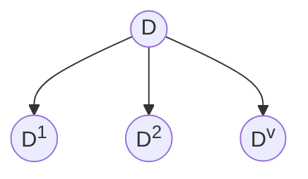

### 交叉熵

```am
op(Ent)(D) = - sum_(k=1)^abs(ccY) p_k log_2 p_k
```

- 最好时某一个类的概率为 1
- 最坏时为均匀分布

```am
op(Ent)(D)={ 
0, p_1=1;
log_2 abs(ccY), p_1=...=p_abs(ccY)=1/abs(ccY)
:}
```

$op(Ent)(D)$ 越小，划分的越清晰，纯度越高

### 信息增益

> [!note] 相当于 $Delta$，描述了划分和不划分之间的变化
>
> 划分之前，信息熵为 $op(Ent)(D)$，划分后，信息熵为 $sum_(v=1)^V abs(D^v)/abs(D) op(Ent)(D^v)$

信息增益越大，纯度提升越大

每个分类占了 $D^v$ 的权重，因此要对每个交叉熵乘一个 $abs(D^v)/abs(D)$




```am
op(Gain)(A,a)=op(Ent)(D)-sum_(v=1)^V abs(D^v)/abs(D) op(Ent)(D^v)
```

信息增益越大越好

#### 例

```am
op(Ent)(D) & = - sum_(k=1)^abs(ccY) p_k log_2 p_k

&= - (8/17 log_2 8/17 + 9/17 log_2 9/17) = 0.998
```

```am
op(Ent)'(D) &= -6/17 (3/6 log_2 3/6 + 3/6 log_2 3/6) 

&- 6/17 (4/6 log_2 4/6 + 2/6 log_2 2/6) 

&- 5/17 (1/5 log_2 1/5 + 4/5 log_2 4/5)
```

### 增益率


## 剪枝处理

- 预剪枝（生成过程中评估和剪枝）
- 后剪枝（用所有数据生成，尽管可能过拟合，之后再剪枝）

凹陷 (1, 2, 3), 14
稍凹 (6, 7), 15, 17
平坦 10, 16

## 连续值在决策树中的处理

- 按门限值划分 - 将连续值转化为分类问题

1. 离散化 - 门限 - 利用 max 找到门限
2. 找哪个使得 Gain 最大

连续属性可以不断划分，离散值重复划分是无效的

## 缺失值处理

- 无缺失值 $a$ 属性样本子集 $tilde D sube D$
- 属性值为 $a^v$ 样本子集 $tilde D^v$
- 标签为 $k$ 的样本子集 $tilde D^k$

