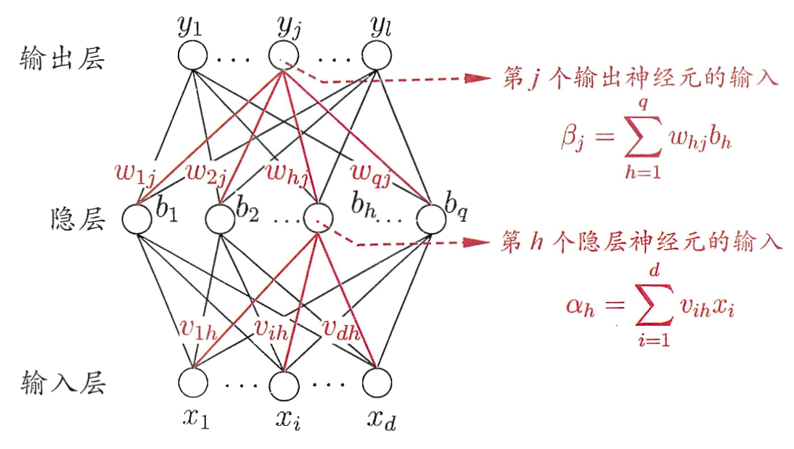

## 反向传播算法

- 输入层 $bb x = (x_1, ..., x_d)$
- 隐藏层 $bb b = (b_1, ..., b_q)$
- 输出层 $hat bb y=(y_1,...,y_l)$




训练数据 $(bb x_k, bb y_k)$，神经网络输出 $hat bb y_k = (haty_1^k,...,haty_l^k)$

```am
haty_j = f(beta_j-theta_j)
```

为了求导方便，设定均方误差 $E_k =1/2 sum_(j=1)^l (haty_j^k -y_j^k)^2$，前面有一个 $1/2$

参数调整的量为 $Delta w_(hj) = -eta pp (E_k) (w_(hj))$，$eta$ 是学习率，是人提供的，那么就要推导右侧的部分

```am
beta_j = sum_(h=1)^q w_(hj) b_h
```

```am
pp (E_k)(w_(hj)) & = pp (E_k) (haty_j^k) * pp (haty_j^k) (beta_j) * pp (beta_j) (w_(hj))

& = (haty_j^k - y_j^k) * (???) * b_h

& = (haty_j^k - y_j^k) * haty_j^k(1-haty_j^k) * b_h
```

$f$ 为 sigmoid 函数，可以求出其导数 $f'=f(1-f)$
