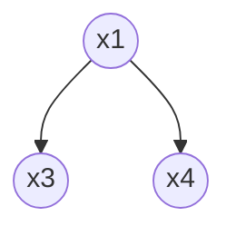
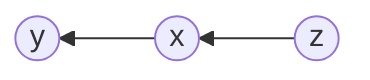
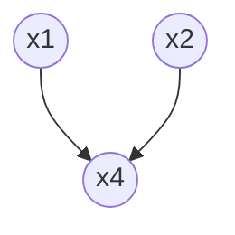

```am
P(x_3,x_4 | x_1) & = (P(x_1,x_3, x_4))/(P(x_1))

&=(P(x_3|x_1)P(x_4|x_1)P(x_1))/(P(x_1))
```




```am
P(y,z|x) &= (P(y|x)P(x|z)P(z))/(P(x))

&= (P(y|x)P(z|x)P(x))/(P(x))
```



```am
P(x_1,x_2) &= sum_(x_4) P(x_1,x_2,x_4)

&= sum_(x_4) P(x_4|x_1,x_2)P(x_1)P(x_2)

&=P(x_1)P(x_2)
```


