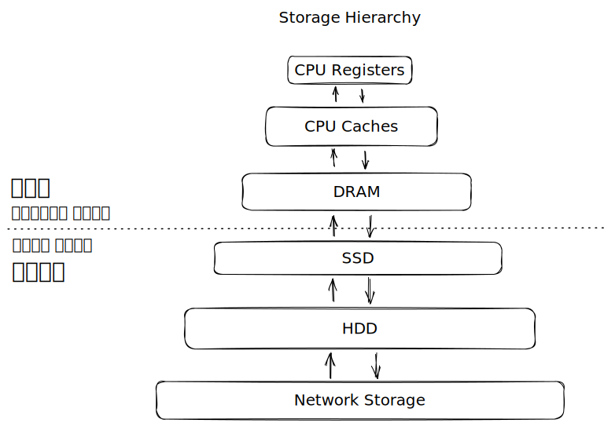
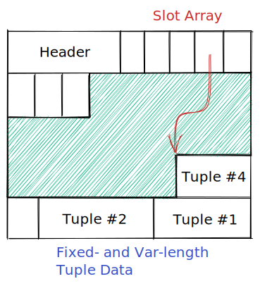

## 数据存储架构



## 顺序访问 vs. 随机访问

在非易失性存储器上随机存取要比顺序存取更慢。

DBMS 想要最大化顺序存取

- 设计算法，减少写入随机页，使得数据存储在连续的块上
- 在扩展的时候，分配多个页面

## 系统设计的目标

- 允许 DBMS 管理超出内存量的数据库
- 磁盘读写开销很大，因此需要更加精心的管理，避免长时间的阻塞和性能损失
- 磁盘上的随机存取相比于顺序存储是很慢的，因此 DBMS 需要最大化顺序存取

## Disk-orient DBMS


# Why not use the OS?

DBMS can use memory mapping (**mmap**) to store the contents of a file into the address space of a program.

> 利用内存映射，将文件的内容存储到程序的地址空间中

OS is responsible for moving the pages of a file in and out of memory, so the DBMS doesn't need to worry about it.

如果有多个线程会操作这个 mmap 的系统，对于只读的任务还好，但是对于多个写任务，那么将会非常复杂。

针对这个问题，有下面的几个解决方案

- madvice: 告诉 OS 你想要读取哪些指定的页
- mlock: 告诉 OS 指定范围的页不能被换出
- msync: 告诉 OS 将对应内存的磁盘内容也更新

DBMS 会在这些方面，做得比 OS 更好

- 在有“脏页”的时候，将它以正确的顺序更新到磁盘上
- Specialized prefetching 预取策略
- Buffer replacement policy 缓冲替换策略
- Thread/process scheduling 进程/线程调度策略

> [!faq] How the DBMS represent the database in files on disk?

> [!faq] How the DBMS manages its memory and moves data back-and-forth from disk?

## File Storage

DBMS 将数据库存储为一种专有格式的文件，存放在磁盘上。

> 一些执行自己的读和写调度，以改善页面的空间和时间局部性

存储管理器负责维护数据库的文件，当作“页面”集合来管理文件。

- 追踪页面上的数据读取和写入
- 追踪可用空间

## Database Pages

A page is a **fixed-size block of data**.

- It contains tuples, meta-data, indexes, log records, ...
- Most systems do not mix page types.
- Some systems require a page to be self-contained.

Each page is given a **unique identifier**.

- DBMS 使用一个间接层来将 page ID 映射到物理存储地址

Page 大小

- Hardware Page: 4KB —— 读写的块单位
- OS Page: 4KB
- Database Page: 512B-16KB

## Database Heap

数据库有 2 种方式可以找到页在硬盘上的位置，堆文件组织是一种方式。

A **heap file** is an ==unordered collection== of pages with tuples that are stored in random order.

- Create/Get/Write/Delete Page
- Must also support iterating over all pages.

表示 heap file 的两种方式

- Linked List 链表
- Page Directory 页字典

当只有一个 heap file 的时候，找到对应的“页”是很方便的。

> 需要 meta-data 来追踪多个文件中有哪些页，哪些含有空闲空间

### Linked List

在文件的头部维护一个 header page，其中包含了两个指针

- 空闲页表 free page list 的头指针
- 数据页表 data page list 的头指针


### Page Directory

DBMS 维护特殊的一些页面，这些页面追踪数据库文件中的数据页。

Directory 也记录每页空余插槽的数量。

> 必须保证 directory pages 与数据页同步

> 似乎有点像位示图

#### Page Header

每个页都包含了头部的元信息 meta-data，描述了页面的内容。

- Page Size
- Checksum
- DBMS Version
- Transaction Visibility
- Compression Information

> 一些系统要求页面是 self-contained，页的信息在页本身中，例如 Oracle

## Page Layout

对于任何存储架构都应该确定页内数据的组织结构。有两种方法

- Tuple-oriented
- Log-structured 数据库存储日志替代存储数据

#### Tuple Storage

> [!quote] Strawman Idea
> 追踪页内的 tuple 数量，当有新的 tuple 加入时直接追加在后面。
> 
> - 如果删除一个 tuple 会怎样？
> - 如果有变长属性怎么办？

#### Slotted Pages

> 页映射槽到偏移，这是目前数据库最常用的方法 The slot array maps "slots" to the tuple's starting position offsets.

页头会追踪

- 已经使用的槽的数量
- 最后一个被使用的槽的起始位置偏移
- 一个追踪了每个槽起始位置的槽数组

当插入一个 tuple 的时候，槽数组将从前往后插入，tuple 将从后往前插入。当槽数组和 tuple 数据相遇的时候说明当前页已满。



## Tuple Layout

元组本质上是一系列的字节。DBMS 的工作是将这些字节解释为属性类型和值。

#### Tuple Header

每个元组都有一个**头**，头中包含了一些元数据。元数据中不存储表的 schema. 

- Visibility Info
- Bit Map for `NULL` values

在创建表的时候，属性的顺序就确定了

```sql
CREATE TABLE foo (
  a INT PRIMARY KEY,
  b INT NOT NULL,
  c INT,
  d DOUBLE,
  e FLOAT
);
```


#### Record IDs

DBMS 需要一种方法来追踪独立的 tuple，每个 tuple 都会被授予一个唯一的记录标识 record identifier

- 最常用的: `page_id` + `offset/slot`
- 也可以包含文件位置信息等

 > 应用层无法根据这些 ID 来得到任何实际的信息，仅仅用于唯一标识
 

#### Denormalized Tuple Data 非规范化的元组数据

```sql
CREATE TABLE foo (
  a INT PRIMARY KEY,
  b INT NOT NULL
);
CREATE TABLE bar (
  c INT PRIMARY KEY,
  a INT
    REFERENCES foo (a)
);
```

DBMS 可以在物理上对相关元组进行非规范化，例如“预连接”，并将他们存储在同一个页面中。

- 潜在地减少了常规工作负载模式的 I/O 次数
- 可能会让==更新的开销更大==

> 两个表是相关联的，通过预连接，这两个表会存在相同的页中，这样可以让数据库只加载一个页而不是加载两个单独的页，从而减少了 I/O 的次数。

> [!tip] Not a new idea.
> - IBM System R 在 1970 年代已经做了这件事
> - 许多 NoSQL 数据库管理系统也实现了这个效果，且并不称之为物理上的非规范化


