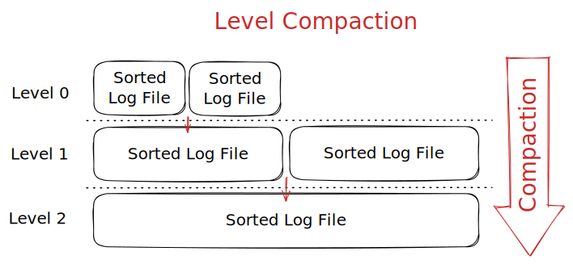
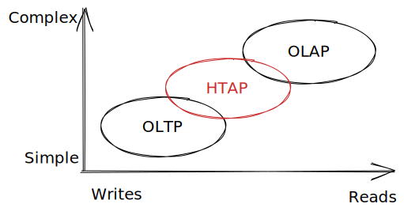
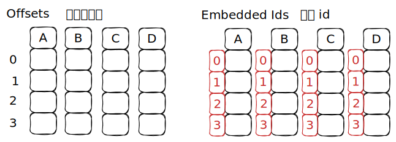

## Log-Structured File Organization

DBMS 只保存日志记录，不在页中保存元组。

系统会不断地向数据库文件增加日志

- 插入时保存整个 tuple
- 将删除的 tuple 标记为 `deleted`
- 更新时只保存更改的属性

| No. | Page Content        | index |
| --- | ------------------- | ----- |
| 1   | INSERT id=1, val=1  | id=1  |
| 2   | INSERT id=2, val=b  |       |
| 3   | DELETE id=4         | id=4  | 
| 4   | INSERT id=3, val=c  |       |
| 5   | UPDATE val=X (id=3) | id=3  |
| 6   | UPDATE val=Y (id=2) | id=2  |

如果需要读取记录，就需要从后向前扫描日志，“重新构建”我们需要的元组。

> 为这些日志创建索引，这样能够更好地进行跳转

## Log-Structured Compaction

删除不必要的记录，将大日志合并为小文件。

#### 层次压缩

类似于归并排序



#### 通用压缩

将相邻的日志文件压缩为一个文件。

## Data Representation

- `INTEGER` / `BIGINT` / `SMALLINT` / `TINYINT`
	- C/C++
- `FLOAT` / `REAL` vs. `NUMERIC` / `DECIMAL`
	- IEEE-754 Standard / Fixed-point Decimals
- `VARCHAR` / `VARBINARY` / `TEXT` /`BLOB`
	- Header with length followed by data bytes
- `TIME` / `DATE` / `TIMESTAMP`
	- 32/64-bit integer of (micro)seconds since Unix epoch

> 浮点数存在一些精度丢失的问题，例如经典的
> 
> ```python
> >>> 0.1 + 0.2
> 0.30000000000000004
> ```

### Fixed Precision Numbers

数字数据可能存在潜在的精度和大小问题，==有时使用舍入是不明智的==。可以使用一些不同的实现

- 使用带有额外 meta-data 的变长二进制精确表示
- 开摆：放弃使用任意精度

### Large Values

大多数 DBMS 不允许 tuple 超过一个页的大小。为了存储超过一页大小的数据，DBMS 必须将数据分割到不同的页面中。

- Postgres: TOAST (> 2KB)
- MySQL: Overflow (> 1/2 size of page)
- SQL Server: Overflow (> size of page)

### External Value Storage

一些系统允许将占用大的值存储在一个外部的文件中，将它看作是一个 `BLOB` 类型。

- Oracle: `BFILE` data type
- Microsoft: `FILESTREAM` data type

> DBMS 无法操控外部文件的内容，没有持久性保护和事务保护。

### System Catalogs 系统目录

DBMS 在 internal catalogs 中存储了数据库的元数据

- Tables, columns, indexes, views
- Users, permissions
- Internal statistics

几乎所有的 DBMS 都在数据库本身中存储了数据库的目录 catalog

- Wrap object abstraction around tuples 用对象抽象包装元组
- Specialized code for "bootstrapping" catalog tables 用于“引导”目录表的专用代码

数据库使用者可以查询 DBMS 的 internal `INFORMATION_SCHEMA` catalog 来获取数据库的信息。

> ANSI 标准会提供一组只读的视图，包含了一个数据库中所有的表、视图、列、程序。

#### Accessing Table Schema

```sql
SELECT *
  FROM INFORMATION_SCHEMA.TABLES
WHERE table_catalog = '<db_name>';
-- WHERE table_name = 'student';
```

```sql title="Postgres"
\d;
\d student;
```

```sql title="MySQL"
SHOW TABLES;
DESCRIBE student;
```

```sql title="SQLite"
.tables
.schema student
```

## Database Workloads

- Online Transaction Processing (OLTP)
	- 每次只是读取或更新小部分的数据
- Online Analytical Processing (OLAP)
	- 复杂的查询，可能包含非常多的数据和计算聚合
- Hybrid Transaction + Analytical Processing
	- OLTP + OLAP together on the same database instance



### Observation

The relational model does **not** specify that we have to store all of a tuple's attribute together in a single page.

> 关系模型并不要求我们将 tuple 的属性都存储在同一个页面中。

但这实际上对于一些 workloads 并不是好的布局……

## Storage Models

DBMS 可以用不同的方式来存储 tuple，这些方式更加适合 OLTP 或 OLAP 工作负载。

### *N*-Ary Storage Model (NSM)

DBMS 将一个元组的属性连续地存储在一个页面中。这对于 OLTP 来说是比较理想的，因为它的查询往往是==在单个实体上的操作==和==频繁插入==。

> 我们假设的都是 $n$ 元存储模型，即“行存储”

- 优点
	- 插入、更新、删除很快
- 缺点
	- 不适合扫描**表的大部分**或属性的子集，这会占用很多 I/O 带宽。因为它会处理查询不需要的数据，这污染了缓冲区。

### Decomposition Storage Model (DSM)

DBMS 按照一种属性（或者说，按照列）来连续存储所有的 tuple，这也被称为“列存储”。这种方式对于需要扫描子表属性的一些大型的查询来说是比较理想的，适合 OLAP。

- 优点
	- 减少了无效的查询，因为 DBMS 只需查找对于查询有效的数据
	- 压缩效率更高，同意属性的值被存储在连续的空间中
- 缺点
	- 单点查询、插入、更新、删除很慢，因为需要对 tuple 进行分割和合并

### Tuple Identification

- 定长偏移量
	- 每个属性的值所占长度相同
- 嵌入 tuple id
	- 每个值都与 tuple id 一起存储在这一列中
	- 查询时会根据 tuple id 重新组合


