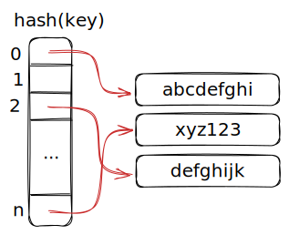
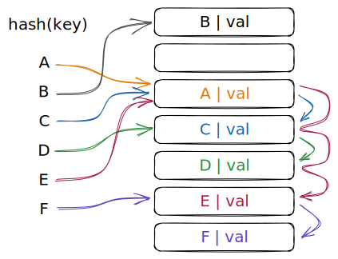
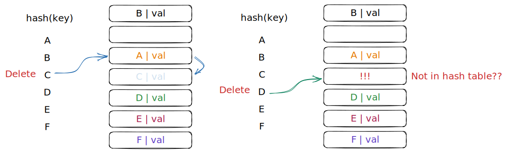
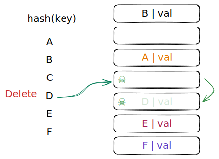
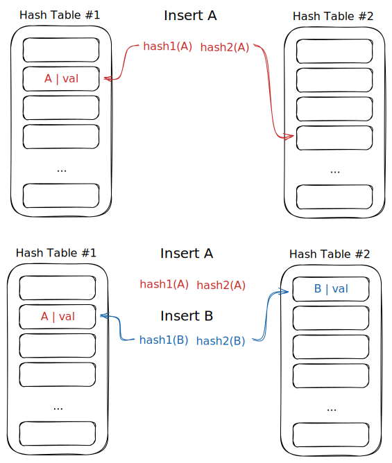
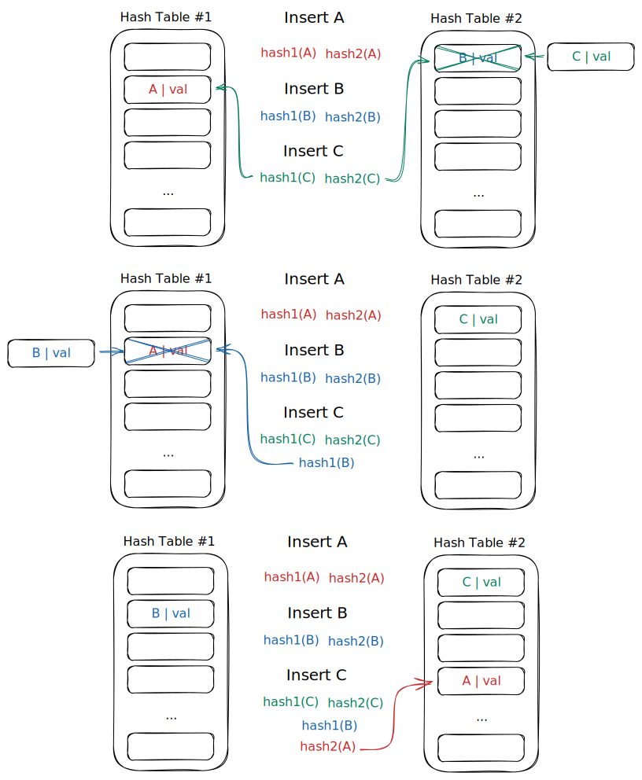
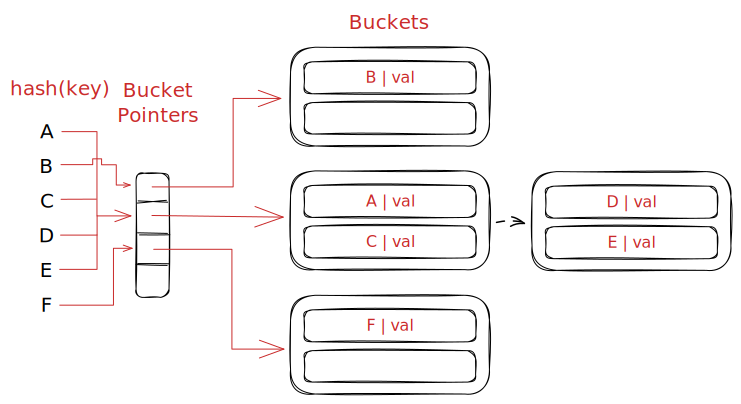
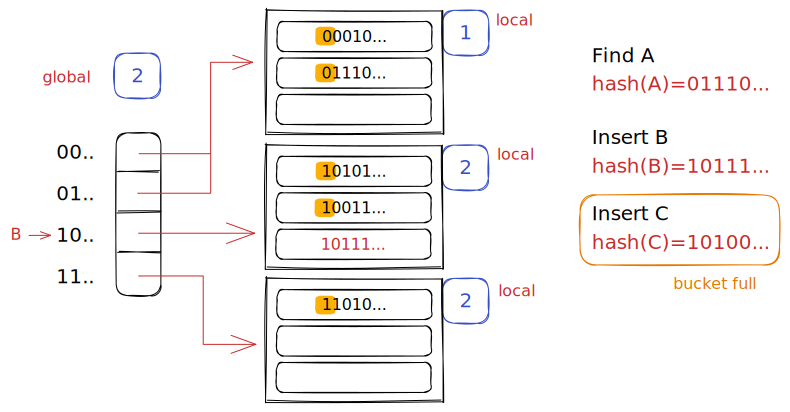
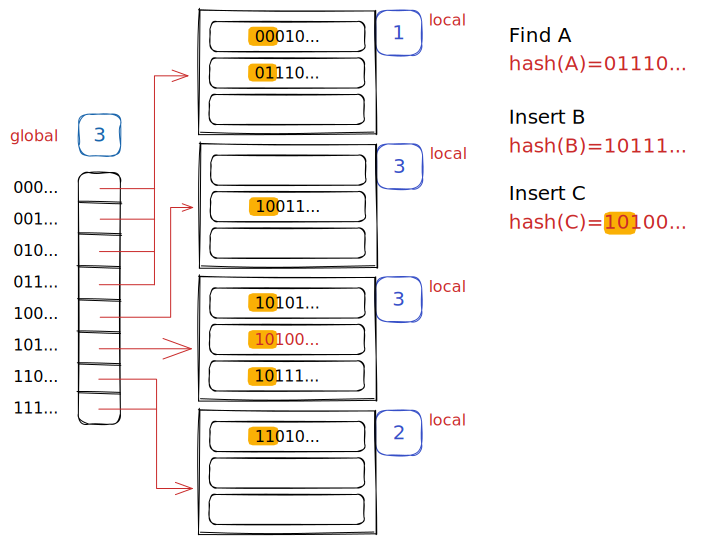
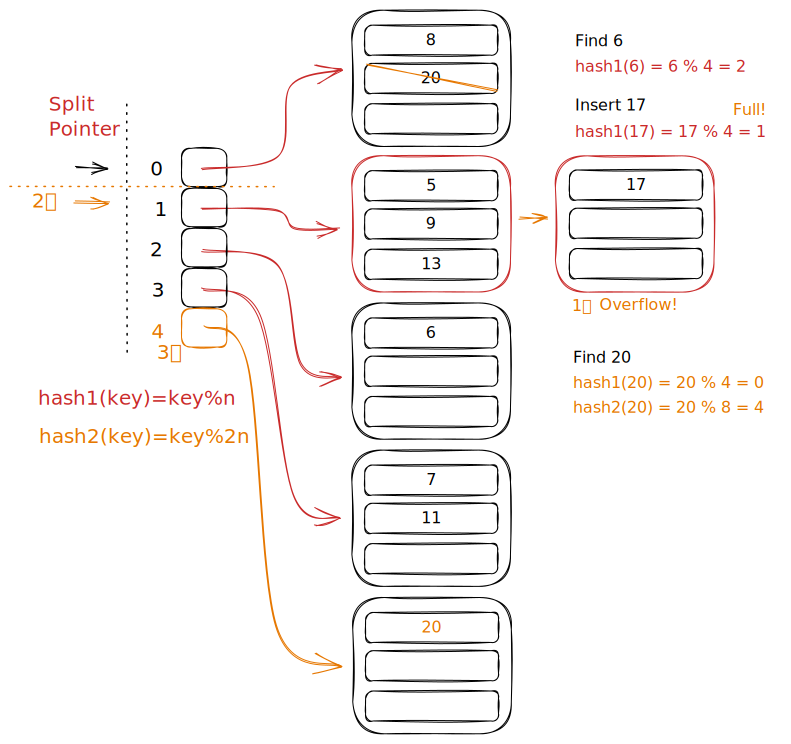

> [!faq] How to support the DBMS's execution engine to read/write data from pages
> 两种数据结构
> - Hash tables
> - Trees

## Data Structures

可以用于 DBMS 中很多的地方

- Internal meta-data
- Core data storage
- Temporary data structures
- Table indexes

### Design Decisions

如何组织数据结构需要考虑的因素

#### Data Organization

如何在内存/页面内布局数据结构，存储哪些信息能够达到更高的访问效率。

#### Concurrency

如何在多个线程同时访问数据的时候避免发生问题。

## Hash Tables

Hash table 实现了无序的关联数组，将 key 映射到 value.

利用哈希函数，根据给定的 key，计算出一个偏移量，根据这个偏移量能够找到值的位置。

- 空间复杂度 $O(n)$
- 时间复杂度
	- 最好 $O(1)$
	- 最差 $O(n)$

### Static Hash Table

分配一个较大的数组，每个元素都可以放在一个槽中。

需要寻找元素时，对 key 取数组长度 $n$ 的余数，来找到在数组中的偏移量。

> [!note] Assumptions
> - 已知元素的数量
> - 每个 key 都是唯一的
> - 很好的哈希函数，即没有冲突
> 	- 对于每一个 `key1 != key2` 都有 `hash(key1) != hash(key2)`

> [!tip] Design Decisions #1: Hash Function
> - 如何将很大范围的 key 映射到小范围的域内
> - 速度 vs. 冲突率之间的 trade-off

> [!tip] Design Decisions #2: Hash Scheme
> - 计算哈希值后如何处理冲突
> - 分配大的哈希表 vs. 增加查找/插入 key 的指令之间的 trade-off

## Hash Functions

对于任何的输入，将会返回一个 int 值，来表示 key.

对于 DBMS 的哈希表，我们并不希望使用加密散列函数，虽然这在密码学中有很好的应用，但这些方法通常很慢，而且我们也不需要其中的一些属性。

我们需要的是==快速==、==低冲突率==。

### 一些哈希函数

- CRC-64 (1975)
	- 用于网络中的错误检测
- MurmurHash (2008)
	- 快速、通用的哈希函数
- Google CityHash (2011)
	- 对于短的 key (<64 bytes)，运行的更快
- Facebook XXHash (2012)
	- From the creator of zstd compression
- Google FarmHash (2014)
	- 相比 Google CityHash 有更低的冲突率

## Static Hashing Schemes

### Linear Probe Hashing

建一个巨大的表，表中为插槽。

冲突处理方式：线性地查找表中下一个空的插槽。

- 要确定一个元素是否存在，需要计算出哈希值（偏移量），然后扫描之
- ==必须将键存储在索引中==，以便知道何时停止扫描
- 插入和删除与查找的方式基本一致

#### Insertion

#### Deletion

先删除 C，然后删除 D，但发现 D 的位置是空的，那么程序就会认为 D 不在哈希表中，这就会导致严重的问题。

> [!success] Approach #1: Tombstone
> 在已经删除的位置上写入一个“已删除”的标志，以表明以前这里有值，但是被删除了，如果当前 key 还未匹配到，那么会继续向后匹配。
> 
> 

> [!success] Approach #2: Movement
> 将刚才删除的单元，以及这个单元以下的部分重新排列。在这个例子中，删除 C 的同时，会将 D, E, F 都向上移动一格。但是同时算法也有可能将 B 移动到最底端的格子中，这种情况应该需要避免。

#### 对于可能重复的 key

- Choice #1: 使用链表将 key 重复的值挂在后面
- Choice #2: 冗余的 keys，将键重复的项存储在哈希表中

### Robin Hood Hashing

线性探测哈希的一种变体。从空槽富余的空间拿取一部分给空槽稀缺的地方。

- 每个 key 都追踪他们在表中的最佳位置所处的位置数量
- 在插入时，如果第一个键比第二个键离最佳位置更远，则一个键占用另一个键的槽位

> 实际效果并不怎么样，通常还是直接使用 linear probe hashing

### Cuckoo Hashing

使用具有不同哈希函数种子的多个哈希表。

- 插入时，检查每个表，选出任意一个有空槽的
- 如果没有表有空槽，选一个表，将对应位置的元素换出，然后重新计算哈希，找到一个新位置

查找和删除的复杂度是 $O(1)$，因为每个哈希表只检查一个位置

> [!faq] 如果这一过程中遇到了循环 kick out
> 可能需要一些标记来标识，如果真的遇到了循环，可能需要通过更换 hash 函数或者其他方式来修复这一问题。

> [!tip] Observation
> 前面介绍的哈希表都需要 DBMS 事先知道要存储多少元素，否则，就需要根据新的元素数目重新建立哈希表

## Dynamic Hashing Schemes

根据需求，能够动态地更改表的大小

### Chained Hashing

为哈希表中每个槽维护一个 bucket 的链表，将所有哈希值相同的元素，放到同一个 bucket 链中，如果超出了 bucket size，那么就在链表后面挂载新的 bucket

### Extendible Hashing

是另一种 chained hashing，但实现方法中，使用的是 split buckets 而不是挂载链表。多个槽可以指向同一个 bucket 链。

拆分时，重新洗牌 bucket entries，并增加要检测的位数。

> 在删除元素的时候，表可以考虑缩减

### Linear Hashing

哈希表维护一个指针，追踪了下一个要分割的 bucket.

> 当任意一个 bucket 溢出，则在指针的位置拆分这个 bucket

对于一个给定的 key，使用多个哈希函数来找到正确的 bucket

> 看不懂
