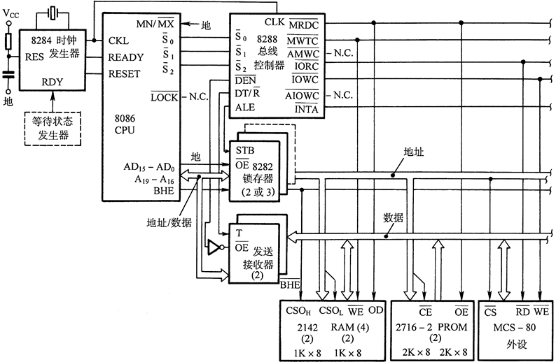
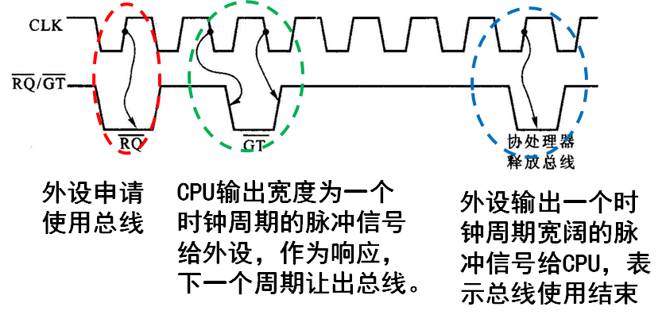
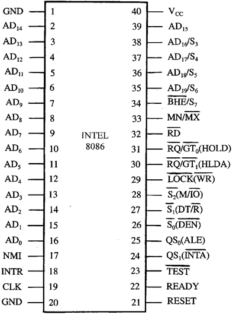
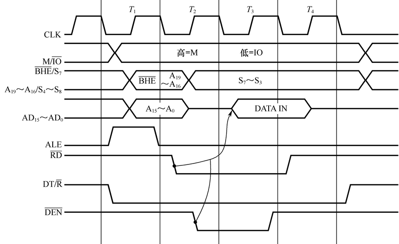
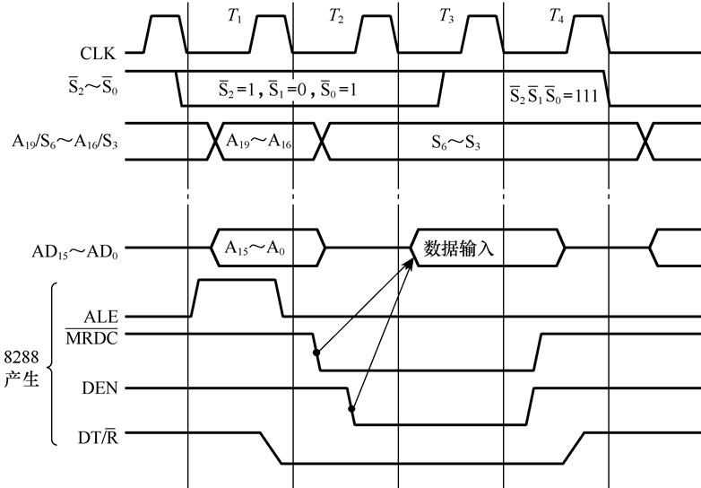
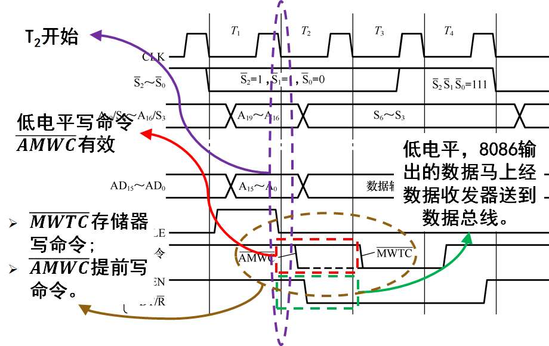
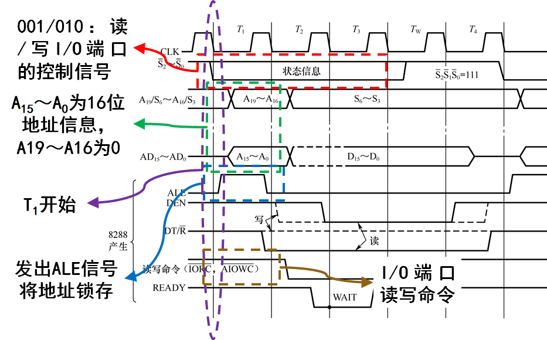
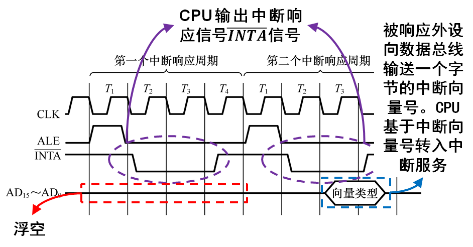
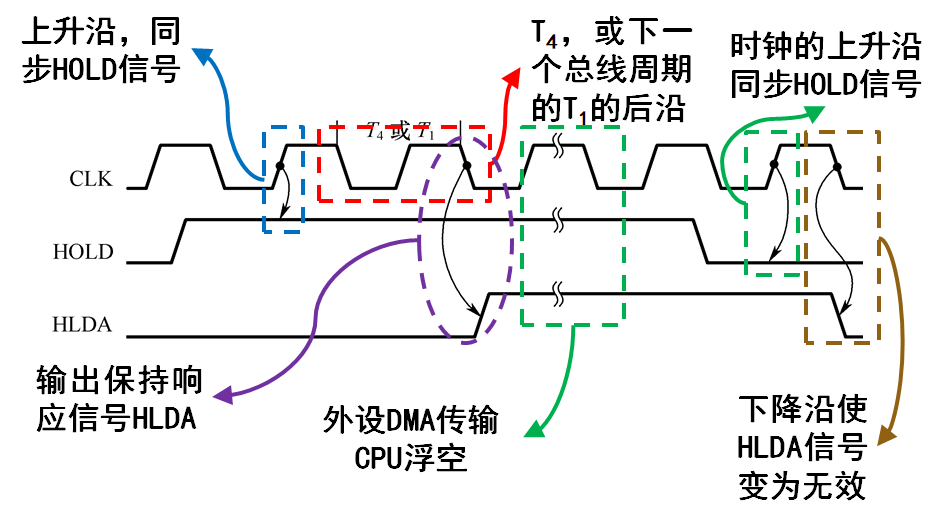
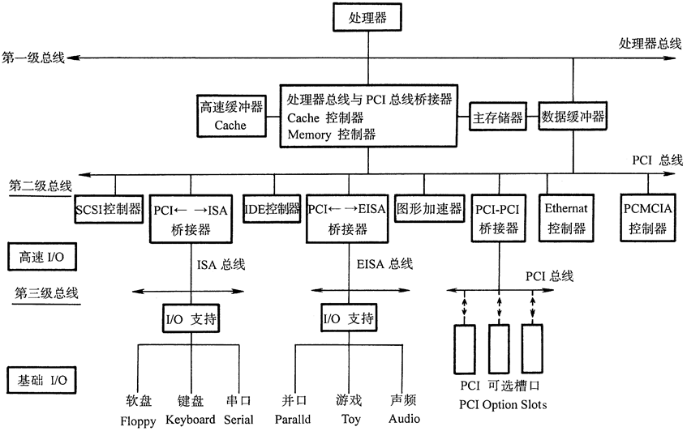

## 一. 8086 的引脚功能

### 1. 芯片引脚的外部特征

#### 1.1. 引脚功能

定义引脚的作用，其名称通常用英文缩写表示。例如 $AD, RD, WR$

电源：$VCC, GND, VDD$ 等固定引脚名称

#### 1.2. 信号流向

信号的流向有三种情况：==输出==，==输入==，==双向==

- 单线：单一信号线。例如：$INTR$ 是输入，$RD$ 是输出
- 总线：多线同时输入或输出。例如：$A_{19}\sim A_{0}$ 地址是输出，$D_{7}\sim D_{0}$ 是双向，$AD_{15}\sim AD_{0}$ 是分时复用

#### 1.3. 有效电平

信号起作用的电平，或触发沿。低有效就是在信号的上端加“—”。

#### 1.4. 三态能力

指信号是否具有三态。例如：当 CPU 空闲状态时，数据线处于高阻态（即第三态）

一般总线信号具有三态能力

### 2. 8086 的两种组态

- 最小组态
- 最大组态

常用的是最大组态。要求有较强的驱动能力。此时 8086 要通过一组总线控制器 8288 来形成各种总线周期，控制信号由 8288 供给。

8086 的两种组态条件下，脚24~脚31有不同的名称和意义，因此通过引脚 $MN/\overline{MX}$ 引脚来规定 8086 处于什么组态。

| $MN/\overline{MX}$    | 工作组态 |
| --------------------- | ---- |
| 连接电源 $+5\,\mathrm{V}$ | 最小组态 |
| 接地 $0$                | 最大组态 |

> [!note] 最大组态——总线控制器8288
> - 具有产生 ==8 种==总线周期下的控制信号；
> - 可控制系统总线信号==浮空==，以允许直接存储器访问 DMA，或仲裁总线优先权；
> - 对写信号提供==先行控制输出==，专为慢速存储器或 I/O 接口而设计的；
> - 可以封装控制信号，作为多总线或多微处理器结构中==实行存储器保护逻辑==的一种方法；
> - 产生线路驱动器所需的信号；
> - 产生简单或复合中断逻辑所需的控制信号。

#### $\overline{S_2},\overline{S_1},\overline{S_0}$ 输出三态

- $\overline{S_2},\overline{S_1},\overline{S_0}$ 由 8288 总线控制器用以产生有关存储器访问或I/O访问的总线周期和所需要的控制信号；
- 时钟周期 $T_4$ 状态期间， $\overline{S_2},\overline{S_1},\overline{S_0}$ 的任何变化，指示一个总线周期的开始；
- 在 $T_3$ 或 $T_w$ 期间返回到无源状态，即 $\overline{S_2},\overline{S_1},\overline{S_0}$ 都处于高状态（111），表示一个总线周期结束；
- CPU 处于 ==DMA 响应==状态时， $\overline{S_2},\overline{S_1},\overline{S_0}$ ==浮空==。

| $\overline{S_2}$ | $\overline{S_1}$ | $\overline{S_0}$ | 性能       | 信号                                   |
| ---------------- | ---------------- | ---------------- | -------- | ------------------------------------ |
| 0                | 0                | 0                | 中断响应     | $\overline{INTA}$                    |
| 0                | 0                | 1                | 读 I/O 信号 | $\overline{IORC}$                    |
| 0                | 1                | 0                | 写 I/O 端口 | $\overline{IOWC}, \overline{AIOWC}$  |
| 0                | 1                | 1                | 暂停       | $-$                                  |
| 1                | 0                | 0                | 取指       | $\overline{MRDC}$                    |
| 1                | 0                | 1                | 读存储器     | $\overline{MRDC}$                    |
| 1                | 1                | 0                | 写存储器     | $\overline{MWTC}$, $\overline{AMWTC}$ |
| 1                | 1                | 1                | 无源       | $-$                                  |

#### $\overline{RQ}/\overline{GT_0}, \overline{RQ}/\overline{GT_1}$ 输入输出

- 其它总线设备输送一个宽度为一个时钟周期的脉冲给 8086，表示总线请求，相当于 ==$HOLD$ 信号==；
- CPU 在当前总线周期的 $T_4$ 或下一个总线周期的 $T_1$ 状态，输出一个宽度为一个时钟周期的脉冲给请求总线的设备，作为总线响应信号，相当于 ==$HLDA$ 信号==，下一个时钟周期开始，==CPU 释放总线==；
- 当外设 DMA 传送结束时，总线请求主设备输出一个宽度为一个时钟周期的脉冲给 CPU，表示==总线请求结束==。下一个时钟周期 ==CPU 恢复总线控制==。

#### $\overline{LOCK}$ 输出 三态

- 低电平有效，有效时别的总线设备==不能获得对系统总线的控制==；
- $LOCK$ 信号由前缀指令 `LOCK` 使其有效，且在==下一个指令完成以前==保持有效；
- CPU 处于 DMA 响应状态时，此线==浮空==。

#### $QS_0, QS_1$ 输出

- $QS_1, QS_0$ 提供一种状态（Queue Status）允许==外部追踪 8086 内部的指令队列==；
- 队列状态在 ==CLK 周期期间是有效的==，在这以后，队列的操作已完成。

| $QS_1$ | $QS_0$ | 性能                  |
| ------ | ------ | ------------------- |
| 0      | 0      | 无操作                 |
| 0      | 1      | 从队列中取走操作码的第一个字节     |
| 1      | 0      | 队列空                 |
| 1      | 1      | 除第一个字节外，还取走队列中的其他字节 |

#### $\overline{BHE}/S_7$ 输出

- 在总线周期的 $T_1$ 状态， $BHE$ 低电平有效，把读/写的 8 位数据与$AD_{15}\sim AD_8$ 连通；
- 在总线周期的 $T_2,T_3,T_4$ 及 $T_w$ 状态，$\overline{BHE}/S_7$ 引脚输出状态信号 $S_7$ 。

### 3. 8086 的引线

#### $AD_{15}\sim AD_0$ （输入/输出，三态）

- 这些地址/数据引线是==多路开关的输出==；
- 在每个总线周期开始 $T_1$ 时，==用作地址总线的 16 位 $A_{15}\sim A_0$==，给出内存单元（或 I/O 端口）的地址；
- $T_2,T_3,T_w$ 状态进行==数据的读写==
- 在 DMA 方式时，这些线浮空。

地址线 20 位的低 16 位与数据线 16 位公用，在时间上加以区分

#### $A_{19}/S_6,A_{18}/S_5,A_{17}/S_4,A_{16}/S_3$ （输出，三态）

- 这些地址/数据引线是==多路开关的输出==；
- 在存储器操作的==总线周期开始 $T_1$ 时==，作地址总线的高 4 位 $A_{19}\sim A_{16}$，在 I/O 操作时引线均为低电平；
- 在总线周期的其余时间，这 4 条信号线指示 ==CPU 的状态信息==。$S_6$ 表示 CPU 与总线连接情况，$S_5$ 指示当前中断允许标志IF的状态。$S_3$ 与 $S_4$ 的代码组合用来知名当前正在使用的段寄存器；
- 在 DMA 方式时，这些线浮空。

| $S_4$ | $S_3$ | 含义                    |
| ----- | ----- | --------------------- |
| 0     | 0     | 当前正在使用 ES             |
| 0     | 1     | 当前正在使用 SS             |
| 1     | 0     | 当前正在使用 CS，或者未使用任何段寄存器 |
| 1     | 1     | 当前正在使用 DS             |

#### $\overline{RD}$ （输出，三态）

- 读选通信号，低电平有效；
- 当前有效时，表示正在进行==存储器读或者 I/O 读操作==；
- 在 DMA 方式时此线浮空。

#### $HOLD$ （输入）

- 保持==请求==信号；
- 当外部逻辑把 $HOLD$ 引脚信号置为高电平时，8086 在完成当前总线周期以后进入 $HOLD$（保持）状态，让出总线控制权。（DMA 方式请求总线控制权）

#### $HLDA$ （输出）

- 保持==响应==信号；
- 当 $HLDA$ 有效时，8086 的三条信号线全部处于高阻态，使外部逻辑可以控制总线。（DMA 方式 CPU 让出总线控制权）

#### $\overline{WR}$ （输出）

- ==写信号==，低电平有效；
- 当前有效时，对==存储器读或者 I/O 写操作==；
- 具体操作取决于 $M/\overline{IO}$ 引脚信号。

#### $M/\overline{IO}$ （输出）

- 存储器/IO 控制信号；
- 用于区分 CPU 是访问==存储器==（高电平）还是==访问 I/O 端口==（低电平）。

#### $DT/\overline{R}$ （输出）

- 数据发送/接收信号；
- 用于指示 CPU 是进行写操作（高电平）还是进行读操作（低电平）。

#### $\overline{DEN}$ （输出）

- 数据允许信号；
- $\overline{DEN}$ 在 CPU 访问存储器或 I/O 端口的总线周期的后一段时间内，该信号有效，用作系统中总线收发器的允许控制信号。

#### $ALE$ （输出）

- 地址锁存信号；
- 8086 CPU 在总线周期的==第一个时钟周期内==发出的正脉冲信号，其==下降沿==用来把地址/数据总线（$AD_{15}\sim AD_0$）以及地址/状态总线（$A_{19}/S_6\sim A_{16}/S_3$）中的地址信息锁住存入==地址锁存器==中。

#### $INTR$ （输入）

- ==可屏蔽中断请求信号==；
- 电平触发输入信号，高电平有效，==只要检测到高电平就一直触发中断==。
- CPU在每一个指令周期的==最后一个 $T$ 状态==采样 $INTR$ 以决定是否进入中断响应周期。

#### $\overline{INTA}$ （输出）

- ==中断响应信号==；
- 当 8086 响应来自 $INTR$ 引脚的可屏蔽中断请求时，在中断响应周期内，$INTA$ 变为低电平。

#### $READY$ （输入）

- ==准备就绪信号==，高电平有效，有效时完成数据传送；
- 是从所寻址的存储器或 I/O 设备来的响应信号；
- 当被访问的部件无法在8086CPU规定的时间内完成数据传送时，应由该部件向 8086 CPU 发出 $READY=L$，==使8086 CPU 处于等待状态==，插入一个或几个等待周期 $T_W$，当被访问的部件可以==完成数据传输时==，被访问的部件将使 $READY=H$（高电平），8086 CPU 继续运行。

#### $\overline{TEST}$ （输入）

- 等待测试控制信号，由 `Wait` 指令来检查；
- 低电平有效，引线出现低电平则执行继续；否则处理器就等待进入空转状态；
- 信号在每个时钟周期的==上升沿==由内部同步。

#### $NMI$ （输入）

- ==非屏蔽==中断输入信号；
- 边沿触发信号，当引线电平出现由低到高变化时，将在当前指令结束以后引起中断；
- $NMI$ 引线的中断请求信号==不能用软件加以屏蔽==。

#### $RESET$ （输入）

- 复位信号，引起处理器立即结束当前操作
- 这个信号必须==保持有效至少 4 个时钟周期==以完成内部的复位过程，当其返回为低电平时，它重新启动执行。

#### $CLK$ （输入）

- 时钟输入信号，为 8086 CPU 提供基本的定时脉冲

#### $V_{CC}$ （输入）

- 电源输入
- $5\,\mathrm{V}\pm10\%$

#### $GND$

- 接地线

## 二. 8086 处理器时序

### 1. 时序的基本概念

在时钟的统一控制下,一个一个节拍实现；取指令 → 译码 → 执行

- 执行一条指令所需要的时间称为==指令周期==；
- 8086 通过总线接口单元完成==一次总线操作==，称为==一个总线周期==，每个总线周期通常包含 4 个 T 状态，每个 T 状态是 8086 中处理动作的最小单位，即时钟周期（Clock Cycle）；
- 指令周期由以下的总线周期组成：
  - 存储器读或写
  - 输入输出端口的读或写
  - 中断响应

- $ALE$ 下降沿将地址存入地址锁存器
- $\overline{RD}$ 低电平指定读取数据
- $\overline{DEN}$ 低电平，总线收发器允许控制信号
- 如果存储器无法在 $T_4$ 周期前沿完成数据的读出，则需要加入 $T_w$ 周期（等待周期），在每个 $T_w$ 周期的前沿采样 ==$READY$ 线信号==，如果没有完成数据的读出则继续进入等待周期。

### 2. 8086 的典型时序

8086 工作在最大组态下的基本总线周期由 4 个 T 状态组成

#### $T_1$ 状态

- 8086 发出 ==20 位地址信号==，同时送出==状态信号 $\overline{S_0}, \overline{S_1}, \overline{S_2}$== 给8288总线控制器；
- 8288对 $\overline{S_0}, \overline{S_1}, \overline{S_2}$ 进行译码，产生相应的命令的控制信号输出
  - 8288在 ==$T_1$ 期间==送出==地址锁存==允许信号 $ALE$，将 CPU 输出的地址信息锁存至地址锁存器中，再输出到系统地址总线上。

#### $T_2$ 状态

- 8086 开始执行数据传送操作，8086 内部的多路开关进行切换，将地址/数据线 ==$AD_0\sim AD_{15}$ 上的地址撤消，切换为数据总线==，为读写数据作准备；
- 8288发出数据总线允许信号和数据发送/接收控制信号 $DT/\overline{R}$ ==允许数据收发器工作==，使==数据总线与 8086 的数据线接通==，并控制数据传送的方向；
- 把==地址/状态线 $A_{16}/S_3\sim A_{19}/S_6$== 切换成==与总线周期有关的状态信息==，指示若干与周期有关的情况。

#### $T_3$ 状态

- 周期开始的时钟下降沿上，8086 ==采样 $READY$ 线==；
- 如果 ==$READY$ 信号有效==（高电平），则在 $T_3$ 状态结束后进入 $T_4$ 状态，在 $T_4$ 状态开始的时钟下降沿，把数据总线上的数据读入 CPU 或写到地址选中的单元，==在 $T_4$ 状态中结束总线周期==；
- 如果 $READY$ 信号无效，==插入等待周期 $T_w$==，在 $T_w$ 状态 CPU ==继续采样 $READY$ 信号==直至其变为有效后再进入 $T_4$ 状态，完成数据传送，结束总线周期。

#### $T_4$ 状态

- 8086 完成数据传送，状态信号 $\overline{S_0}, \overline{S_1}, \overline{S_2}$ 变为无操作的过渡状态；
- 8086 结束总线周期，==恢复各信号线的初态==，准备执行下一个总线周期。

### 3. 8086 工作在最大组态下的典型时序

#### 最大组态下存储器读周期时序

##### $T_1$ 周期

- $\overline{S_2}\,\overline{S_1}\,\overline{S_0}=101$ 读存储器控制信号
- $A_{19}\sim A_{0}$ 共 20 位地址信号线
- 发出 $ALE$ 信号将地址锁存
- $DT/\overline{R}$ 低电平读操作

##### $T_2$ 周期

- $AD_{15}\sim AD_{0}$ 切换为数据总线准备传送数据
- $\overline{MRDC}$ 低电平有效，8288 发出都存储器命令，使地址选中的存储单元把数据送上数据总线
- $DEN$ 高电平有效，接通数据收发器，允许数据输入至 8086

##### $T_3$ 周期

- 采样 $READY$ 信号
- 数据输入
- $\overline{S_2}\,\overline{S_1}\,\overline{S_0}$ 发出 111 状态信号，使信号在 $T_4$ 周期恢复初态

##### $T_4$ 周期

- $READY$ 有效，进入 $T_4$
- 各信号回复出台，准备执行下一个总线周期

#### 最大组态下存储器写周期时序

#### 最大组态下 I/O 读写时序

#### 中断响应时序

#### 系统复位时序

| CPU 中的部分 | 内容      |
| -------- | ------- |
| 标志位      | 清除      |
| IP       | `0000H` |
| CS       | `FFFFH` |
| DS       | `0000H` |
| SS       | `0000H` |
| ES       | `0000H` |
| 指令队列     | 空       |

#### CPU 进入和退出保存状态的时序

- 当系统中有别的总线主设备==请求总线==时。向 CPU 输送==请求信号 $HOLD$==，$HOLD$ 信号可以与时钟异步，则在==下一个时钟的上升沿==同步 $HOLD$ 信号。
- CPU 接收同步的 $HOLD$ 信号后，在当前总线周期的 $T_4$，或下一个总线周期的 $T_1$ 的后沿输出保持响应信号 $HLDA$，紧接着==从下一个时钟开始 CPU 就让出总线==。
- 当外设的 DMA 传送结束，它将使 $HOLD$ 信号变低，$HOLD$ 信号是与 $CLK$ 异步的，则在==下一个时钟的上升沿同步==，在==紧接着的下降沿使 $HLDA$ 信号变为无效==。

## 三. 系统总线

### 1. 概述

采用一组公共的信号线作为微型计算机各部件之间的通信线

#### 1.1. 分类

##### 1.1.1. 按位置分

- 片内总线：==位于微处理器芯片内部==，ALU 与各种寄存器或其他功能单元之间的互连
- 片总线：是一台单板计算机或一个插件板的板内总线，==用于各芯片之间的连接==
- 内总线：又称为微型计算机总线或系统总线，用于==微型计算机系统各插件板之间的连接==
- 外总线：又称通信总线==用于系统之间的连接==，如微机系统之间，微机系统与仪器等等

##### 1.1.2. 规定

- 物理特性：总线的物理连接方式
- 功能特性：一组总线中每一根线的功能
- 电气特性：定义每一根线上信号的传送方向、有效电平范围
- 时间特性：每根线在什么时间有效

##### 1.1.3. 类型

- 地址总线
  - 地址线的数目决定了直接寻址范围
  - 单向、三态总线
- 数据总线
  - 双向信号线、三态总线
- 控制总线
  - 实现命令、状态传送、中断、直接存储器传送的请求与控制信号传送，以及提供系统使用的时钟和复位信号等
  - 根据不同的使用条件，控制总线有的为单向、有的为双向，有的为三态，有的为非三态
- 电源和地线
- 备用线

#### 1.2. 总线的操作过程

##### 1.2.1. 申请阶段

- 当系统总线上有==多个主控模块==时，需要使用总线的主控模块提出申请，由总线仲裁部分==确定将下一阶段的总线使用权授给哪个模块==。
- 如果系统总线上只有一个主控模块，则无需申请阶段。

##### 1.2.2. 寻址阶段

- 取得总线使用权的主控模块，通过总线发出本次打算访问的从属模块的地址及有关命令，以启动参与本次传输的从属模块。

##### 1.2.3. 传输阶段

- 主控模块和从属模块之间进行数据传输，数据由源模块发出经数据总线流入目的模块。

##### 1.2.4. 结束阶段

- 主控模块的有关信息均从系统总线上撤除，让出总线。

#### 1.3. 总线的数据传输方式

##### 1.3.1. 同步式传输

- 用系统时钟作为控制数据传送时间标准
- 主模块与从属模块统一，快的迁就慢的

##### 1.3.2. 异步式传输

- 应答式传输
- 根据模块的速率自动调整相应时间
- 应答关系完全互锁，ACK 和 REQ 之间右确定的制约关系

##### 1.3.3. 半同步式传输

- 使用系统时钟
- 对于慢速的从模块，其传输周期可延长时钟脉冲周期的整数倍。增加信号线（WAIT或READY）。READY信号线无效说明从设备尚未准备好数据传输。允许不同速度的模块协调工作。
- 能按时完成：同步
- 不能按时完成：强制主模块延迟等待若干周期

### 2. PC 总线

### 3. ISA 总线

### 4. PCI 总线

外部设备互连总线，能与其他总线互连

### 5. USB 总线

因为使用了总线的设计，所以可以在一个 USB 接口上接多个设备，理论上一个 USB 接口可以共同支持==连接 127 个设备==。

USB 接口可以为设备提供 +5V 的电源供应，所以只要所接外设不是高耗电的设备，如电机等（+12V），那么就可以由 USB 口直接供给电源，而无需另接电源了。

速度快，USB 接口可以连接一些高数据量的存储设备，比如外置存储器等

USB 是一种==独立的串口总线==，所以它在驱动设备的时候不需要占用中断和 DMA 通道，这样对于不太懂电脑的人来说，不需再设定这些参数。
