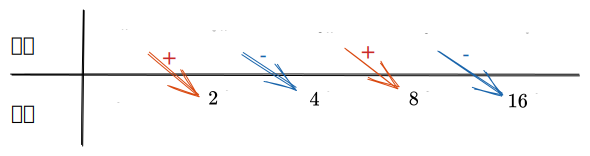
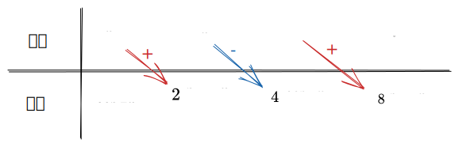
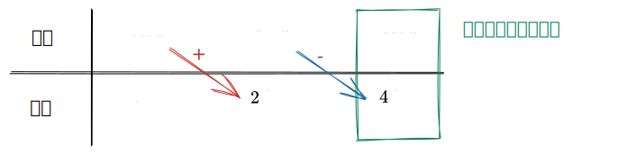

## 导数

$$
\displaystyle {\left( x^{\mu}\right)}^\prime=\mu x^{\mu- 1}
$$

$$
\displaystyle {\left( \sin{x}\right)}^\prime= \cos{x}
$$

$$
\displaystyle {\left( \cos{x}\right)}^\prime=- \sin{x}
$$

$$
\displaystyle {\left( \tan{x}\right)}^\prime={\sec}^{2} x
$$

$$
\displaystyle {\left( \cot{x}\right)}^\prime=-{\csc}^{2} x
$$

$$
\displaystyle {\left( \sec{x}\right)}^\prime= \sec{x} \tan{x}
$$

$$
\displaystyle {\left( \csc{x}\right)}^\prime=- \csc{x} \cot{x}
$$

$$
\displaystyle {\left( a^{x}\right)}^\prime= a^{x} \ln{a}
$$

$$
\displaystyle {\left(\text{e}^{x}\right)}^\prime=\text{e}^{x}
$$

$$
\displaystyle {\left({\log}_{a} x\right)}^\prime=\frac{1}{x \ln{a} }
$$

$$
\displaystyle {\left( \ln{x}\right)}^\prime=\frac{1}{x}
$$

$$
\displaystyle {\left( \arcsin{x}\right)}^\prime=\frac{1}{\sqrt{1- x^{2} } }
$$

$$
\displaystyle {\left( \arccos{x}\right)}^\prime=-\frac{1}{\sqrt{1- x^{2} } }
$$

$$
\displaystyle {\left( \arctan{x}\right)}^\prime=\frac{1}{1+ x^{2} }
$$

$$
\displaystyle {\left(\text{arccot} x\right)}^\prime=-\frac{1}{1+ x^{2} }
$$

## 积分

$$
\displaystyle \int k{\left.\text{d} x\right.}= k x+ C
$$

$$
\displaystyle \int x^{\mu}{\left.\text{d} x\right.}=\frac{1}{\mu+ 1} x^{\mu+ 1}+ C,{\left(\mu\ne- 1\right)}
$$

$$
\displaystyle \int\frac{1}{x}{\left.\text{d} x\right.}={\ln}{\left| x\right|}+ C
$$

$$
\displaystyle \int a^{x}{\left.\text{d} x\right.}=\frac{1}{\ln{a} } a^{x}+ C
$$

$$
\displaystyle \int \sin{x}{\left.\text{d} x\right.}=- \cos{x}+ C
$$

$$
\displaystyle \int \cos{\left.\text{d} x\right.}= \sin{x}+ C
$$

$$
\displaystyle \int\frac{1}{ {\sin}^{2} x}{\left.\text{d} x\right.}=\int{\csc}^{2} x{\left.\text{d} x\right.}=- \cot{x}+ C
$$

$$
\displaystyle \int\frac{1}{ {\cos}^{2} x}{\left.\text{d} x\right.}=\int{\sec}^{2} x{\left.\text{d} x\right.}= \tan{x}+ C
$$

$$
\begin{aligned}\displaystyle \int\frac{1}{\sqrt{a^{2}- x^{2} } }{\left.\text{d} x\right.}&= \arcsin{\left(\frac{x}{a}\right)}+ C,{\left( a> 0\right)} \\ \displaystyle \int\frac{1}{\sqrt{1- x^{2} } }{\left.\text{d} x\right.}&= \arcsin{x}+ C\end{aligned}
$$

$$
\begin{aligned}\displaystyle \int\frac{1}{a^{2}+ x^{2} }{\left.\text{d} x\right.}&=\frac{1}{a} \arctan{\left(\frac{x}{a}\right)}+ C,{\left( a> 0\right)} \\ \displaystyle \int\frac{1}{1+ x^{2} }{\left.\text{d} x\right.}&= \arctan{x}+ C\end{aligned}
$$

$$
\begin{aligned}\displaystyle \int\frac{1}{a^{2}- x^{2} }{\left.\text{d} x\right.}&=\frac{1}{2 a}{\ln}{\left|\frac{a+ x}{a- x}\right|}+ C,{\left( a> 0\right)} \\ \displaystyle \int\frac{1}{x^{2}- a^{2} }{\left.\text{d} x\right.}&=\frac{1}{2 a}{\ln}{\left|\frac{x- a}{x+ a}\right|}+ C,{\left( a> 0\right)}\end{aligned}
$$

$$
\displaystyle \int \tan{x}{\left.\text{d} x\right.}=-{\ln}{\left| \cos{x}\right|}+ C
$$

$$
\displaystyle \int \cot{x}{\left.\text{d} x\right.}={\ln}{\left| \sin{x}\right|}+ C
$$

$$
\begin{aligned}\displaystyle \int \csc{x}{\left.\text{d} x\right.}=\int\frac{1}{\sin{x} }{\left.\text{d} x\right.}&={\ln}{\left| \csc{x}- \cot{x}\right|}+ C \\ \displaystyle &={\ln}{\left| \tan{\left(\frac{x}{2}\right)}\right|}+ C\end{aligned}
$$

$$
\begin{aligned}\displaystyle \int \sec{x}{\left.\text{d} x\right.}=\int\frac{1}{\cos{x} }{\left.\text{d} x\right.}&={\ln}{\left| \sec{x}+ \tan{x}\right|}+ C \\ \displaystyle &={\ln}{\left| \tan{\left(\frac{x}{2}+\frac{\pi}{4}\right)}\right|}+ C\end{aligned}
$$

$$
\displaystyle \int\frac{1}{\sqrt{x^{2}\pm a^{2} } }{\left.\text{d} x\right.}={\ln}{\left| x+\sqrt{x^{2}\pm a^{2} }\right|}+ C
$$

$$
\displaystyle \int\sqrt{a^{2}- x^{2} }{\left.\text{d} x\right.}=\frac{a^{2} }{2} \arcsin{\left(\frac{x}{a}\right)}+\frac{x}{2}\sqrt{a^{2}- x^{2} }+ C
$$

$$
\displaystyle \int\sqrt{x^{2}\pm a^{2} }{\left.\text{d} x\right.}=\frac{x}{2}\sqrt{x^{2}\pm a^{2} }\pm\frac{a^{2} }{2}{\ln}{\left| x+\sqrt{x^{2}\pm a^{2} }\right|}+ C
$$

### 表格积分法

例 1

$$
\displaystyle \int x^{3}\text{e}^{2 x}{\left.\text{d} x\right.}
$$

$$
\begin{aligned}\displaystyle \int x^{3}\text{e}^{2 x}{\left.\text{d} x\right.}&=\frac{1}{2} x^{3}\text{e}^{2 x}-\frac{3}{4} x^{2}\text{e}^{2 x}+\frac{3}{4} x\text{e}^{2 x}-\frac{3}{8}\text{e}^{2 x}+ C \\ \displaystyle &={\left(\frac{1}{2} x^{3}-\frac{3}{4} x^{2}+\frac{3}{4} x-\frac{3}{8}\right)}\text{e}^{2 x}+ C\end{aligned}
$$

例 2

$$
\displaystyle \int x^{2} \cos{2} x{\left.\text{d} x\right.}
$$

$$
\displaystyle \int x^{2} \cos{2} x{\left.\text{d} x\right.}=\frac{1}{2} x \sin{2} x+\frac{1}{2} x \cos{2} x-\frac{1}{4} \sin{2} x+ C
$$

例 3

$$
\displaystyle \int\text{e}^{2 x} \cos{x}{\left.\text{d} x\right.}
$$

$$
\begin{aligned}\displaystyle \int\text{e}^{2 x} \cos{x}{\left.\text{d} x\right.}&=\frac{1}{2}\text{e}^{2 x} \cos{x}+\frac{1}{4}\text{e}^{2 x} \sin{x}-\frac{1}{4}\int\text{e}^{2 x} \cos{x}{\left.\text{d} x\right.} \\ \displaystyle \int\text{e}^{2 x} \cos{x}{\left.\text{d} x\right.}&=\frac{4}{5}{\left(\frac{1}{2}\text{e}^{2 x} \cos{x}+\frac{1}{4}\text{e}^{2 x} \sin{x}\right)}+ C\end{aligned}
$$

### 变限积分

- $\displaystyle  f{\left( x\right)}$ 为偶函数，则 $\displaystyle  F{\left( x\right)}=\int_{0}^{x} f{\left( t\right)}\text{d} t$ 为奇函数，注意，必须满足 $\displaystyle  F{\left( 0\right)}= 0$
- $\displaystyle  f{\left( x\right)}$ 为奇函数，则 $\displaystyle  F{\left( x\right)}=\int_{a}^{x} f{\left( t\right)}\text{d} t$ 为偶函数，没有上面的限制，因此下限可以是 $\displaystyle  a$

## 多元隐函数求导

如果用“隐函数存在定理”求，即通过计算 $\displaystyle  F_{x}^\prime, F_{y}^\prime, F_{z}^\prime$，并且用 $\displaystyle \frac{\partial z}{\partial x}=-\frac{\partial F_{x}^\prime}{\partial F_{z}^\prime}$ 计算偏导数，一定要注意，$F(x,y,z)$ 关于求 $x$ 偏导的时候，==$y$ 和 $z$ 需要当作常数==，$F(x,y,z)$ 关于 $y$ 和 $z$ 求偏导的时候也是。

例：$z=z(x,y)$ 是由 $x^2+y^2+z^2-4z=0$ 确定的函数，求 $\displaystyle \frac{\partial z}{\partial x}$

如果设 $F(x,y,z)=x^2+y^2+z^2-4z$，那么

$$
\begin{aligned}\displaystyle  F_{x}^\prime&= 2 x \\ \displaystyle  F_{z}^\prime&= 2 z- 4\end{aligned}
$$

$$
\displaystyle \frac{\partial z}{\partial x}=-\frac{F_{x}^\prime}{F_{z}^\prime}=-\frac{x}{z- 2}
$$

不要把第一个式子中的 $\displaystyle  z$ 当作 $x$ 的函数，而应该将 $z$ 看作是常数。

