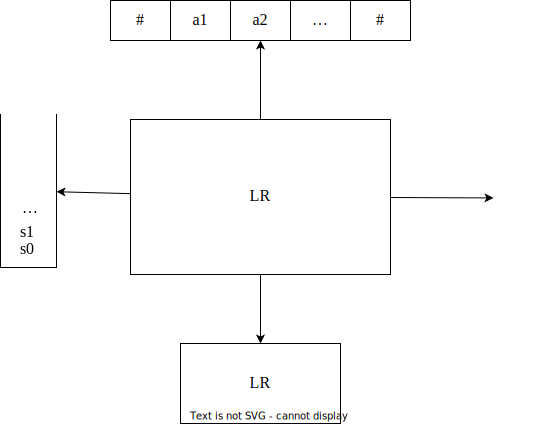
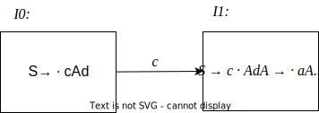
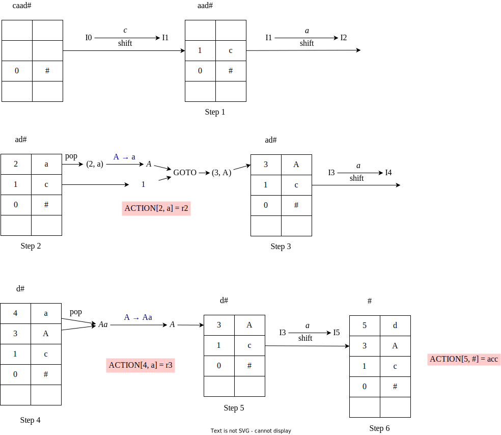

## 5.4. LR 分析技术

### 5.4.1. LR 分析技术概述

前面讨论的算符优先分析法对文法有一定的要求，必须是==算符文法==，不能包含 $A\to \varepsilon$ 的空规则的性质，而 LR 系列分析技术，对文法几乎没有限制，如果他允许左递归，允许回溯，允许两个非终结符相邻，允许有空规则 $A\to \varepsilon$ 等。LR 系列分析技术是当前最通用的分析方法。

LR(k) 分析技术，L 代表从左向右分析，R 代表最右推导，$k$ 代表向前查看 $k$ 个字符。LR 分析法实际上是最右推导的逆过程——==规范归约==。

LR(k) 分析技术利用已经移进栈中的和归约后进入栈中的一切文法符号，并向前查看最多 k 个符号，就能确定句柄（自底向上语法分析中的“可归约子串”）是否已经在栈顶形成，一旦句柄出现在栈顶，立即进行归约。因此 LR(k) 是一种严格的从左向右分析法。

> 算符优先分析法并不是严格从左向右的，因为当栈顶形成最左素短语的尾部，要向栈底（即从右向左）去寻找素短语的头部。

通常，我们考虑 $k=0,1$ 的情形。LR 系列分析技术有 LR(0), SLR(1), LR(1), LALR(1)。所有这些分析法，只是 LR 分析表中填写的内容不同，分析表的结构和程序相同。

LR 分析器的 4 个组成部分：

- 一个输入串
- 一个分析栈
- 一张 LR 分析表
- LR 分析总控程序



### 5.4.2. LR(0) 分析法

#### 问题分析

在 LR(0) 中，0 表示不用向前查看任何字符，不需要利用即将读入的下一个字符的信息。

LR 分析法如何回答自底向上分析法面临的两个问题呢？

- 如何确定或找出“可归约子串”？
- 可归约子串归约到哪一个非终结符？

设文法 $G[S]$

$$
\begin{aligned}
S&\to cAd \text{①}\\
A&\to a \text{②}\\
A&\to Aa \text{③}
\end{aligned}
$$

在推导过程中将序号也带入句型中

给定输入串 `#caaaad#`，先分析推导过程

$$
S \Rightarrow cAd \text{①} \Rightarrow cAa \text{③} d \text{①} \Rightarrow cAa \text{③} a \text{③} d \text{①} \Rightarrow cAa \text{③} a \text{③} a \text{③} d \text{①} \Rightarrow ca \text{②} a \text{③} a \text{③} a \text{③} d \text{①}
$$

现在对末尾的句子进行规范归约


仔细观察每一次归约时栈中的内容可以发现，当发生归约时，栈中总为如下形式：$\beta\omega \bigcirc \!\!\!\!\!\! p \,\,$，其中 $\omega$ 一定是第 $p$ 条规则的右部：$A\to \omega$。如第一次归约时，$\beta=c, \omega=a, \bigcirc \!\!\!\! p\,=②$

此时，上面的两个问题就得到了答案

- $\omega$ 为可归约子串
- 归约到第 $p$ 条规则的非终结符

$\beta\omega \bigcirc \!\!\!\!\!\! p \,\,$ 的形式较为重要，因此引入 ==活前缀== 的概念

#### 活前缀

**定义 5.10** 把句型中 $\beta\omega \bigcirc \!\!\!\!\!\! p \,$ 这种形式的==前部==称为==活前缀==，有时也称为可归约前缀或 $\bigcirc \!\!\!\! p$ 可归前缀

任何前部都是从左开始的，如 $abcd②$ 的活前缀有 $a,ab,abc,abcd$

如果求出了文法 G 的所有活前缀，就可以很方便的进行语法分析。假设文法 G 的所有活前缀为 $x_1 \bigcirc \!\!\!\!\!\! {\scriptsize p_1}\,, x_2 \bigcirc \!\!\!\!\!\! {\scriptsize p_2}\,,\cdots ,x_n \bigcirc \!\!\!\!\!\! {\scriptsize p_n}\,$ 则移进归约的语法分析过程大致为：每当移进一个符号，就查看栈中内容是否与某一个活前缀 $x_i \bigcirc \!\!\!\!\!\! {\scriptsize p_i}\,$ 相同，若相同，则按照第 $p_i$ 条规则进行归约，否则移进下一个符号（具体的还是看上面的流程图方便理解）

于是问题的核心变成了：如何求文法 G 的所有活前缀？

我们发现，如果 $\beta A\xi \bigcirc \!\!\!\!\!\! p \,\,$ 是活前缀，且有 $A\to \omega \bigcirc \!\!\!\!\!\! {\scriptsize m}\,$，则 $\beta\omega \bigcirc \!\!\!\!\!\! {\scriptsize m} \,$ 一定是活前缀。这个基本性质是求所有活前缀的基础（我好像发现不了）。

当 $U\to \beta \bullet A\xi \bigcirc \!\!\!\!\!\! p \,$ 分析到非终结符 $A$ 时（$\beta$ 已经分析完成，进入栈中，下一步将分析 $A$），对于 $A$ 的任何产生式规则 $A\to \omega \bigcirc \!\!\!\!\!\! {\scriptsize m}\,$，都会产生新的活前缀 $\beta \bullet \omega \bigcirc \!\!\!\!\!\! {\scriptsize m}\,$，这个新活前缀表示，$\beta$ 已经在栈中，分析将从 $\omega$ 继续。由于两个活前缀 $\beta \bullet A\xi \bigcirc \!\!\!\!\!\! p \,,\beta  \bullet \omega \bigcirc \!\!\!\!\!\! {\scriptsize m}\,$ 中的 $\beta$ 是相同的部分，因此将它们组成一个集合

$$
\begin{aligned}
U&\to \beta \bullet A\xi \bigcirc \!\!\!\!\!\! p\\
A&\to \omega \bigcirc \!\!\!\!\!\! {\scriptsize m}
\end{aligned}
$$

上述思想经过进一步提炼，产生了 LR(0) 项目和 LR(0) 项目集及其闭包的概念。

#### 项目 项目集 项目集闭包

**定义 5.11** 文法 G 中每一条产生式规则的右部添加一个圆点，称为一个 LR(0) 项目集。

对规则 $A\to cAd$，有 4 个 LR(0) 项目：

$$
\begin{aligned}
A&\to \bullet cAd \\
A&\to c\bullet Ad \\
A&\to cA\bullet d \\
A&\to cAd \bullet \\

\end{aligned}
$$

对于空规则 $A\to \varepsilon$，只有一个项目 $A\to \bullet$

**定义 5.12**

- $S\to \bullet \alpha$，$S$ 为文法的开始符号，称该项目为==初始项目==
- $A\to \alpha \bullet a\beta$，其中 $a\in V_\mathrm{T}$，称该项目为==移进项目==
- $A\to \alpha \bullet B\beta$，其中 $B\in V_\mathrm{N}$，称该项目为==待约项目==
- $A\to \alpha \bullet$，其中 $A\in V_\mathrm{N}$，若 $A$ 不是文法 G 的开始符号，则称为==归约项目==，否则称为==接收项目==
- 设有两个项目 $A\to \alpha \bullet a\beta, A\to \alpha a \bullet \beta$，两者同属于一条规则，只是圆点位置相差一个终结符，则称后者为前者的==后继项目==

为保证文法 G 中只有==一个==接收项目，且一旦到达接收项目，就完成整个语法分析。为此，需要对不满足要求的文法进行==拓广==。若一个文法 G 的开始符号 $S$ ==不是只出现在一条规则的左边==，则这个文法 G 需要拓广。

**定义 5.13** 设文法 G 的开始符号为 $S$，引入一个新的开始符号 $S^\prime$，并加入一条新规则 $S^\prime\to S$。于是形成了新的文法 $G^\prime[S^\prime]$，$G^\prime$ 是 $G$ 的拓广。

文法拓广的目的就是保证==开始符号只出现在第一条规则左边==。

**定义 5.14** 由 LR(0) 项目组成的集合，称为 LR(0) 项目集。

在活前缀部分，若 $U\to \beta \bullet A\xi \bigcirc \!\!\!\!\!\! p \,$ 是活前缀，则对任何 $A\to B\omega \bigcirc \!\!\!\!\!\! {\scriptsize m}\,$，都会产生新的活前缀 $\beta \bullet B\xi \bigcirc \!\!\!\!\!\! p \,$，组成集合 $\{U\to \beta \bullet A\xi \bigcirc \!\!\!\!\!\! p \,,A\to \bullet B\omega \bigcirc \!\!\!\!\!\! {\scriptsize m}\,\}$

若 $B$ 为非终结符，则关于 $B$ 的任何规则 $B\to \xi \bigcirc \!\!\!\!\!\! k\,$，又都会产生新活前缀 $\beta \xi \bigcirc \!\!\!\!\!\! k\,$，于是这个集合就扩大为 $\{U\to \beta \bullet A\xi \bigcirc \!\!\!\!\!\! p \,,A\to \bullet B\omega \bigcirc \!\!\!\!\!\! {\scriptsize m}\,,B\to \bullet \xi \bigcirc \!\!\!\!\!\! k\,\}$

这一过程将一直进行下去，直到该集合==不再扩大为止==。由此产生了求 ==LR(0) 项目集闭包==的算法。

> [!note] 算法描述
> 
> 已知项目集 $I$，求 $I$ 的闭包 $\text{CLOSURE}(I)$ 的算法如下：
> 
> 1. 项目集 $I$ 中所有的项目加入到集合中
> 2. 若待约项目 $A\to \alpha \bullet B\beta\in \text{CLOSURE}(I)$，则对于每一个关于 $B$ 的产生式规则 $B\to \gamma$，将 $B\to \bullet \gamma$ 加入到集合中
> 3. 反复执行 2，直到集合中不再有新的项目加入为止

**例 5.10** 已知文法 G

$$
\begin{aligned}
S&\to A\\
A&\to Bb\mid a\\
B&\to SB\mid b
\end{aligned}
$$

已知项目集 $I:\{S\to \bullet A\}$，求 $\text{CLOSURE}(I)$

> [!example] 分析
> 
> 根据项目集的闭包求解策略，可得 $\text{CLOSURE}(I)=\{S\to \bullet A, A\to \bullet Bb, A\to \bullet a, B\to \bullet SB, B\to \bullet b\}$，其中，$S\to \bullet A$ 是项目集中原本就有的，这是 $\text{CLOSURE}(I)$ 的**核**。其他 4 个都是从核出发反复展开而得到的。

> 警告！下面的内容没有人能看得懂！

#### 状态变迁

有了项目集的闭包，现在考虑项目集之间的状态变迁。

设有文法 $G[S]$

$$
\begin{aligned}
S&\to cAd \text{①}\\
A&\to a \text{②}\\
A&\to Aa \text{③}
\end{aligned}
$$

另有项目集 $I:\{S\to \bullet cAd\}$，当终结符号 $c$ 移进栈后，项目集应变迁到它的后继项目集的闭包 $\text{CLOSURE}(\{S\to c \bullet Ad\})=\{S\to c \bullet Ad,A\to \bullet a, A\to \bullet Aa\}$



为此，可定义 GO 函数表达状态之间的这种转换。

**定义 5.15** 项目集 $I$ 经过符号 $X$ 的状态转换函数 $\text{GO}(I,X)=\text{CLOSURE}(I$ 的后继项目集$)$.

例如，若 $I$ 是 $\{S\to \bullet cAd\}$，$X=c$，则 $I$ 的后继项目集是 $\{S\to c \bullet Ad\}$，该后继项目集的闭包为 $\{S\to c \bullet Ad,A\to \bullet a, A\to \bullet Aa\}$。因此，$\text{GO}(\{S\to c \bullet Ad\}, c)=\{S\to c \bullet Ad,A\to \bullet a, A\to \bullet Aa\}$

#### 构造 DFA 项目集规范族

有了 CLOSURE 和 GO，可以很方便的构造一个 DFA，它正好能够识别一个文法 G 中的所有活前缀。这个 DFA，它正好能够识别一个文法DFA 中的每一个状态，都是一个 LR(0) 的项目集的闭包。

设拓广文法 G' 的开始符号规则是 $S^\prime\to S$，DFA 构造步骤如下：

```js
state_set = CLOSURE(['S_1 -> S'])
// state_set 是一个由各个 LR(0) 项目集闭包所组成的集合
let flag = false
do {
  flag = false
  // state_set 中每个项目集 I 及文法 G' 中每个符号 X
  for (const { I, X } of THETA(state_set, G_1.symbols)) {
    // 如果 GO(I, X) 不空且不在 state_set 中，则添加进去
    if (GO(I, X) !== null && !state_set.has(GO(I, X))) {
      state_set.push(GO(I, X))
      flag = true
    }
  }
} while (flag)
```

这个 DFA 的初始状态是文法 G 的初始项目所在的 LR(0) 项目集闭包。终止状态是含有归约项目或接收项目的 LR(0) 项目集闭包。这个 DFA 识别的正好是文法 G 的所有活前缀。有时把识别文法 G 的所有活前缀的 LR(0) 项目集闭包组成的 DFA 称为 LR(0) 项目集规范族。

> 没错，我写到这里早就已经看不懂了，感觉没有任何目标和头绪。

**例 5.11** 设有文法 $G[S]$

$$
\begin{aligned}
S&\to cAd \text{①}\\
A&\to a \text{②}\\
A&\to Aa \text{③}
\end{aligned}
$$

试给出该文法 G 的 LR(0) 项目集规范族

> [!example] 分析
> 
> 由于文法的开始符号 $S$ 满足要求，不需要进行拓广。LR(0) 项目规范族如图。
> 
> 
> 
> 这个 DFA 正好识别出文法 $G[S]$ 的所有活前缀。


**例 5.12** 已知文法 $G: A\to aA\mid \varepsilon$

试给出该文法的 LR(0) 项目集规范族。

> [!example] 分析
> 由于文法的开始符号 $A$ 不满足要求，需要进行拓广，新文法为 $G[S]$
> 
> $$
> \begin{aligned}
> &S \to A ①\\
> &A \to aA ②\\
> &A\to \varepsilon ③
> \end{aligned}
> $$
> 
> 其项目集规范族如图
> 
> 
> 按老师的讲解，心中时刻需要有一个“栈”，即需要通过弹栈、归约、压栈的一系列过程来理解
> 
> LR(0) 分析表
> 
> | 状态 | ACTION |      | GOTO |     |
> |:----:|:------:|:----:|:----:|:---:|
> | ^^   | $a$    | $\#$ | $S$  | $A$ |
> | 0    | s2/r3  | r3   |      | 1   |
> | 1    |        | acc  |      |     |
> | 2    | s2/r3  | r3   |      | 3   |
> | 3    | r2     | r2   |      |     |
> 
> 可以看到，表中有冲突项，因此该文法不是 LR(0) 文法


> [!example] 哈工大老师的视频讲解
> 
> 设有文法 $G[S]$
> 
> $$
> \begin{aligned}
> S&\to cAd \text{①}\\
> A&\to a \text{②}\\
> A&\to Aa \text{③}
> \end{aligned}
> $$
> 
> 那么文法中的项目有
> 
> $$
> \begin{aligned}
> &① S\to cAd  && ② A\to a && ③ A\to Aa\\\\
> &(0) S\to \bullet cAd &&  && \\
> &\color{blue}{(1) S\to c \bullet Ad} &&  && \color{blue}{(6) A\to \bullet Aa}\\
> &(2) S\to c A \bullet d && \color{blue}{(4) A\to \bullet a} && (7) A\to A \bullet a\\
> &(3) S\to c A d\bullet && (5) A\to a \bullet && (8) A\to A a \bullet\\
> \end{aligned}
> $$
> 
> (0) 为初始项目，(3) 为接收项目；最后一行 (3)(5)(8) 圆点都在式子末尾，为归约项目
> 
> 这里将所有的项目都写出来，但将所有项目都作为自动机的状态，那自动机的状态数目就会过于庞大。因此需要找出一些==等价的项目==。
> 
> 此时我们这么考虑：
> 
> - 圆点后面有一个==非终结符==，假设 $\bullet S$ 表示当前状态正在等待 $S$，而它本质上就是在等待 $S$ 的 First，或者说是它的==后继项目==，当然这里只是类似的去理解。
> - 由于有文法 $S\to cAd$，因此等待 $S$ 就等价于等待 $cAd$，即 $S^\prime\to\bullet S$ 等价于 $S\to \bullet cAd$
> 
> 于是，在给到的例子中，对于 (1) 来说，在等待 $A$，等价于等待 $a$ 或者 $Aa$，那么 (1)(4)(6) 等价。
> 
> **例** 给定文法 $G[S^\prime]$
> 
> $$
> \begin{aligned}
> &(0)S^\prime \to S\\
> &(1)S\to BB\\
> &(2)B\to aB\\
> &(3)B\to b
> \end{aligned}
> $$
> 
> 画出其自动机
> 
> 
> - 首先构造初始状态，将 $S^\prime\to\bullet S$ 放入 $I_0$ 中，接下来继续向其中加入==等价项目==
>     - 同时，等待 $S$ 就相当于等待 $B$，将 $S\to \bullet BB$ 加入 $I_0$
>         - 等待 $B$ 就相当于等待 $a$ 或 $b$，将 $B\to \bullet aB, B\to \bullet b$ 加入 $I_0$
> - $I_0$ 的第一项，当归约出 $S$ 时，识别的过程可以向前进展一步，于是将这个项目的后继项目 $S^\prime\to S\bullet$ 加入状态 $I_1$
> - $I_0$ 的第二项，当归约出 $B$ 时，识别的过程可以向前进展一步，于是将其后继项目 $S\to B \bullet B$ 加入状态 $I_2$
>     - 同时，它有等价项目 $B\to \bullet aB,B\to \bullet b$，因此也加入到 $I_2$ 中
> - $I_0$ 的第三项，圆点后为终结符，没有等价项，当识别出 $a$ 时，是别过程进展一步，其后继 $B\to a \bullet B$，加入状态 $I_3$
>     - 同时，它有等价项目 $B\to \bullet aB,B\to \bullet b$，因此也加入到 $I_3$ 中
> - $I_0$ 的第四项，圆点后为终结符，当识别出 $b$ 时，识别过程进展一步，其后继 $B\to b\bullet$ 加入状态 $I_4$
> - $I_1$ 中已经到了归约项目
> - $I_2$ 中第一项，当归约出 $B$，识别的过程可以向前进展一步，于是将其后继 $S\to BB\bullet$ 加入状态 $I_5$ 
> - $I_2$ 中第二项，当识别到 $a$，进展一步，得到项目 $B\to a\bullet B$，与 $I_3$ 一致
> - $I_2$ 中第三项，当识别到 $b$，进展一步，得到项目 $B\to b\bullet$，与 $I_4$ 一致
> - $I_3$ 中第一项，当归约出 $B$，识别的过程可以向前进展一步，于是将其后继 $S\to aB\bullet$ 加入状态 $I_6$
> - $I_3$ 中第二项，当识别到 $a$，进展一步，得到项目 $B\to a\bullet B$，与 $I_3$ 一致
> - $I_3$ 中第三项，当识别到 $b$，进展一步，得到项目 $B\to b\bullet$，与 $I_4$ 一致
> - $I_4,I_5,I_6$ 均为归约项目
> 
> 
> 
> |  状态 |     | ACTION |      | GOTO |     |
> |:----:|:---:|:------:|:----:|:----:|:---:|
> |  ^^  | $a$ |  $b$   | $\#$ | $S$  | $B$ |
> |  0   | s3  |   s4   |      |  1   |  2  |
> |  1   |     |        | acc  |      |     |
> |  2   | s3  |   s4   |      |  5   |     |
> |  3   | s3  |   s4   |      |      |  6  |
> |  4   | r3  |   r3   |  r3  |      |     |
> |  5   | r1  |   r1   |  r1  |      |     |
> |  6   | r2  |   r2   |  r2  |      |     |
> 
> 其中，状态 4 对应的是 (3) 号产生式规则，状态 5 对应 (1) 号产生式规则，状态 6 对应 (2) 号产生式规则。
> 
> > s 即为 shift，r 即为 reduce
> 

#### LR(0) 分析表

LR(0) 项目集规范族中包含了丰富的信息，从中可以形成一张 LR(0) 分析表。分析表由 ACTION 子表和 GOTO 子表组成，其中，ACTION 下的 $a_i$ 是终结符，GOTO 下的 $S$ 等是非终结符。

ACTION 子表有如下动作

1. 移进。如果状态 0 所在行与 $a_1$ 所在列的单元格内为 s2，即有 $a_1$ 移进栈，并将状态转为 2
    - 
2. 归约。如果状态 $n$ 所在行与 $a_1$ 所在列的单元格内为 r3，即有“按照第 3 条产生式规则归约”
    - 
3. 接收。如果状态 1 所在行与 `#` 所在列交叉处为 acc，则成功接收，正确识别出句子。
4. 报错。ACTION 子表的空白处为报错。


GOTO 子表的列均为非终结符，表示状态转移，终结符的状态由 ACTION 完成。例如，状态 0 所在行与 GOTO 的 $A$ 所在列交叉处为 2，则当前状态 0 若识别出非终结符 $A$，状态将变迁为 2.

> [!warning]
> 不要将 GOTO 子表与状态转换函数 GO 相混淆

LR(0) 分析表的构造步骤：

1. 若移进项目 $A\to \alpha \bullet a\beta$ 属于 $I_k$ 且 $\text{GO}(I_k, a)=I_j$，则令 $\text{ACTION}[k][a]=s_j$，即
    -  
2. 若归约项目 $A\to \beta \bullet$ 属于 $I_k$，设 $A\to \beta \bigcirc \!\!\!\!\!\! p\,$，则令 $\text{ACTION}[k][:]=r_p$，表示不论下一个字符是什么，只要当前状态为 $k$，则一定按照第 $p$ 条产生式规则归约。
3. 若接收项目 $S^\prime \to S \bullet$ 属于 $I_k$，则令 $\text{ACTION}[k][\#]=acc$，表示成功接收
4. 若 $\text{GO}(I_k,A)=I_p$，则令 $\text{GOTO}[k][A]=p$，表示状态 $k$ 下若识别出非终结符 $A$，则状态变为 $p$
5. 分析表中不能用以上规则填写的交叉处，全部填上“报错标记”

  


**定义 5.16** 若一个文法 G 的 LR(0) 项目集规范族中所有的 LR(0) 项目集均不含有冲突项目，则称该文法为 LR(0) 文法。

#### 冲突分析

1. “移进-归约”冲突
   在例 5.12 中，分析表一个单元格内同时出现了 s2 和 r3，即在这一步有两种选择：按照 $A\to \bullet aA$ 移进，或者按照 $A\to \bullet \text{③}$ 归约。
   广义地，有项目集 $I_k=\{A\to \alpha \bullet a \beta, B\to \gamma \bullet\}$，有两种选择此时，发生了冲突
    - $I_k \underset{\text{shift} }{\overset{a}{\longrightarrow} } I_m$
    - reduce by $B\to \gamma \bigcirc\!\!\!\!\!\! p\,$
2. “归约-归约”冲突
   有项目集 $I_k=\{A\to \beta \bullet, B\to \gamma \bullet\}$，由于两个都是归约项目，因此可以按照 $A\to \beta\bigcirc\!\!\!\!\!\! p\,$ 或 $B\to \gamma \bigcirc\!\!\!\!\!\! {\scriptsize m}\,$ 归约，此时发生了冲突
3. “移进-移进”冲突不会发生

**例 5.14** 对例 5.11 中的文法 $G[S]$，给出 LR(0) 分析器识别串 `#caad#` 的过程


|态 | ACTION |     |     |     | GOTO |     |
|:----:|:------:|:---:|:---:|:---:|:----:|:---:|
| ^^   | c      | a   | d   | #   | S    | A   |
| 0    | s1     |     |     |     |      |     |
| 1    |        | s2  |     |     |      | 3   |
| 2    | r2     | r2  | r2  | r2  |      |     |
| 3    |        | s4  | s5  |     |      |     |
| 4    | r3     | r3  | r3  | r3  |      |     |
| 5    |        |     |     | acc    |      |     |

从而给出分析过程



```typescript
type MySymbol = string;
let stack: Array<[number, MySymbol]> = [];

stack.push([0, '#'])   // 状态 0 和 # 入栈
let a: MySymbol = getSymbol()  // 读入符号
while (true) {
    let [state, s] = stack[stack.length - 1]           // 根据栈顶当前状态和 a
    let t: Shift | Reduce | Acc | never = ACTION[state][a] // 查表
    if (t instanceof Shift) {
        stack.push([t.state, a])  // 对移进动作，将二元组 (I_j, a) 入栈
        a = getSymbol()
    } else if (t instanceof Reduce) {  // 对归约动作，按照第 j 条规则归约
        let tobeReduced: MySymbol[] = []
        for (let i = 0; i < t.symbol_num; i++) {
            tobeReduced.push(stack.pop()[1])
        }
        let newSymbol: MySymbol = reduce(tobeReduced, t.rule)
        let currentState: number = stack[stack.length - 1][0]
        let nextState: number = GOTO[currentState][newSymbol];
        stack.push([nextState, newSymbol])
    } else if (t instanceof Acc) {
        return true
    } else {
        throw new Error("error!")
    }
}
```

$$
\begin{aligned}
S^\prime & \to S \\
S & \to L=R \\
S & \to R \\
L & \to \ast R \\
L & \to i \\
R & \to L
\end{aligned}
$$


