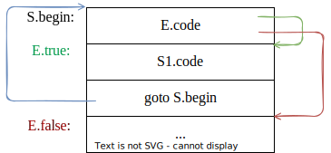

## 7.1. 语义分析的主要任务

分析源程序的含义并做出相应的语义处理。语义处理通常包含静态语义检查和语义的翻译。

静态语义检查包括

- 类型检查（赋值运算两边类型是否相容等）
- 控制流检查（goto 语句、continue 语句位置是否合法）
- 唯一性检查（switch 中 case 的标号是否重定义等）
- 其他相关的语言检查

此外，还要进行语义翻译，通常是生成==中间代码==。它有以下特点

- 独立于机器
- 复杂性介于源语言和目标语言之间

生成与硬件机器相对独立的中间语言形式的中间代码，有以下好处

- 使编译程序的结构在逻辑上更为简单明确
- 便于进行与机器无关的代码优化工作
- 易于移植「当要将编译程序移植到新的目标机器时，前端（词法分析、语法分析、语义分析及中间代码生成）几乎不变，只要修改后端即可。后端是针对具体目标机器的代码生成与优化。」

## 7.2. 中间语言

### 7.2.1. 图表示

- 抽象语法树 AST
- 有向无环图 DAG

有向无环图

- 对表达式的每个子表达式，DAG 中都有一个节点
- 一个内部节点代表一个操作符，它的孩子代表操作数
- 在一个 DAG 中代表公共子表达式的节点具有==多个父节点==


### 7.2.3. 三地址代码

形式 $x:= y \; \text{op} \; z$，式子 $a+b\ast c$ 的三地址代码

$$
\begin{aligned}
T_1 & := b \ast c\\
T_2 & := a + T_1
\end{aligned}
$$

$T_1, T_2$ 都是编译器产生的临时变量

1. 双目运算 $x:=y \; \text{op} \; z$
2. 单目运算 $x := \text{op} \; y$
3. 复写语句，直接赋值 $x:=y$
4. 无条件跳转到标号处 $\text{goto Label}$
5. $\text{if } x \text{ relop } y \text{ goto Label}$，其中 relop 是关系运算符，条件跳转
6. $\text{param }x$ 实参进栈
7. $\text{call } p, n$ 调用过程或函数 $p$，共有 $n$ 个参数
8. $\text{return }y$ 函数返回并带回值 $y$
9. $x:=y[i], x[i]:=y$ 索引赋值
10. $x:=\&y,x:=*y,*x=y$ 地址和指针赋值

### 7.2.4. 四元式

一个带有四个域的记录结构，这四个域分别为 op, arg1, arg2, result，注意参数位置不能颠倒

- $(+, a, 12, T_1)$ 等价于 $T_1:=a+12$
- $(-,y,,T_2)$ 等价于 $T_2:=-y$

### 7.2.5. 三元式

用三个域表示: (op, arg1, arg2)

| 序号  | op     | arg1  | arg2  |   含义          |
| ----- | ------ | ----- | ----- | ----------- |
| $(0)$ | uminus | $c$   | None  | $(0)=-c$    |
| $(1)$ | $*$    | $b$   | $(0)$ | $(1)=b*(0)$ |
| $(2)$ | $+$    | $(1)$ | $c$   | $(2)=(1)+c$ |
| $(3)$ | $:=$   | $a$   | $(2)$ | $a:=(2)$    |
| $(4)$ | $[]=$  | $x$   | $i$   | $(4)=x[i]$  |
| $(5)$ | $:=$   | $(4)$ | $y$   | $y=(4)$     |
| $(6)$ | $=[]$  | $y$   | $i$   | $(6)=y[i]$  |
| $(7)$ | $:=$   | $x$   | $(6)$ | $x=(6)$     | 

## 7.3. 声明语句的翻译

### 7.3.1. 变量声明语句

#### 常量定义

```
const <类型> id1 = <值1或其他常量名>, ..., idn = <值n或其他常量名>;
```

$D \to \text{const } T \; L;$

```js
L.in = T.type  // L.in 继承属性保存从左边 T.type 传递过来的常量类型信息
```

$T \to \text{int}$

```js
T.type = INT
```

$T \to \text{float}$

```js
T.type = float
```

$L \to L_1, E$

```js
L1.in = L.in
E.in = L.in  // 将 L.in 中保存的常量类型信息继续向右或向下传递
```

$L \to E$

```js
E.in = L.in  // 将 L.in 中保存的常量类型信息继续向右或向下传递
```

$E \to \text{id=num}$

```js
id.pos = lookUp(num.lexval)
id.type = E.in
id.kind = CONSTANT
addType(id.entry, id.type, id.kind, id.pos)
```

$E \to \text{id}=\text{id}_1$

```js
id.pos = id1.pos
id.type = id1.type
id.kind = id1.kind
addType(id.entry, id.type, id.kind, id.pos)
```

#### 变量定义

$P \to D;S$

```
P → { offset = 0 } D; S
```

$D \to D; D$

一系列的变量定义语句

$D \to T \text{ id};$

```js
id.kind = VAR
enter(id.name, T.type, id.kind, offset)
offset = offset + T.width
```

$D \to T \text{ id}[num]$

```js
id.kind = VAR
enter(id.name, array(num.lexval, T.type), id.kind, offset)
offset = offset + num.lexval * T.width
```

$T \to \text{int}$

```js
T.type = INT
T.width = 2
```

$T \to \text{float}$

```js
T.type = FLOAT
T.width = 4
```

$T \to T_1 \ast$

```js
T.type = pointer(T1.type)
T.width = 4
```

### 7.3.2. 函数定义

函数定义的翻译涉及到变量的作用域的问题，即局部变量的作用域。

翻译处理的基本工作有：定义一个全局符号表，存放全局变量与函数名称等标识符信息的符号表。每个函数都有一张自己独立的符号表，在该表中登记本函数内部出现的变量等标识符信息。所有这些符号表构成一个符号表栈。每个符号表内都有自己的 offset ，用于记录本函数内部局部变量的相对地址。

需要数据结构：符号表栈 tblptr 栈，偏移量栈 offset 栈


## 7.4. 赋值语句

```
id := E
```

功能：对表达式 E 求值并置于变量 T 中，`id.place := T`

赋值语句生成三地址代码的 ==S-属性文法==

- 非终结符 S 有综合属性 code，它代表赋值语句 S 的三地址代码
- 非终结符号 E 有两个属性
    - E.place 表示存放 E 值的单元的名字（地址）
    - E.code 表示对 E 求值的三地址语句序列
- 函数 newTemp 功能是，每次调用它时，将返回一个不同的临时变量名字，如 $T_1,T_2$ 等

| 产生式               | 语义规则                                                                                    |
| -------------------- | ------------------------------------------------------------------------------------------- |
| $S \to \text{id}:=E$ | S.code:=E.code; gen(id.place ':=' E.place)                                                  |
| $E \to E_1 + E_2$    | E.place:=newTemp; <br>E.code:=E1.code; E2.code;<br>gen(E.place ':=' E1.place '+' E2.place)  |
| $E \to E_1 \ast E_2$   | E.place:=newTemp; <br>E.code:=E1.code; E2.code;<br>gen(E.place ':=' E1.place '\*' E2.place) |
| $E \to -E_1$         | E.place:=newTemp;<br>E.code:=E1.code; <br>gen(E.place ':=' 'uminus' E1.place)                   |
| $E \to (E_1)$        | E.place:=E1.place; E.code:=E1.code                                                          |
| $E \to \text{id}$    | E.place:=id.place                                                                                            |

##### 产生赋值语句三地址代码的翻译模式

过程 emit 将三地址代码送到输出文件中

- $S \to \text{id} := E$
    ```
    p := lookUp(id.name)
    if p != nil:
        emit(p ':=' E.place)
    else
        throw Error
    ```
- $E \to E_1+E_2$
    ```
    E.place := newTemp
    emit(E.place ':=' E1.place '+' E2.place)
    ```
- $E \to -E_1$
    ```
    E.place := newTemp
    emit(E.place ':=' 'uminus' E1.place)
    ```
- $E \to (E_1)$
    ```
    E.place := E1.place
    ```
- $E \to \text{id}$
    ```
    p := loopUp(id.name)
    if p != nil:
        E.place := p
    else
        throw Error
    ```

## 7.5. 数组定义

- 设 $A$ 为 $n$ 维数组，按行存放，每个元素宽度为 $w$
    - $low_i$ 为第 $i$ 维下界
    - $up_i$ 为第 $i$ 维上界
    - $n_i$ 为第 $i$ 维可取值的个数 $n_i = up_i - low_i + 1$
    - $base$ 为 $A$ 的第一个元素相对地址
- 元素 $A[i_1,i_2,\cdots,i_k]$ 相对地址公式
$$
\begin{aligned}
&\color{red}{((\cdots((i_1n_2+i_2)n_3+i_3)\cdots)n_k+i_k)\times w}\\
&\color{darkblue}{+base-}\color{blue}{((\cdots((low_1n_2+low_2)n_3+low_3)\cdots)n_k+low_k)\times w}
\end{aligned}
$$

- 红色为可变部分，蓝色为不变部分，记<span style="color: blue">蓝色</span>部分为 $C$

##### 数组地址计算

id 出现的地方也允许下面产生式的 L 出现

$$
\begin{aligned}
L &\to \text{id} [Elist] \mid \text{id}\\
Elist & \to Elist, E \mid E
\end{aligned}
$$

为了便于处理，改写为

$$
\begin{aligned}
L & \to {\color{red}Elist ]} \mid \text{id}\\
Elist & \to {\color{red}Elist, E} \mid {\color{red}\text{id} [ E}
\end{aligned}
$$

引入下列语义变量或语义过程

- Elist.dim ：下标个数计数器
- Elist.place ：保存临时变量的名字，这些临时变量存放已经形成的 Elist 中的下标表达式计算出来的值
- Elist.array ：保存数组名
- limit(array, j) ：函数过程，它给出数组 array 的第 $j$ 维的长度

代表变量的非终结符 L 有两项语义值

- L.place
    - 若 L 为简单变量 $i$，指变量 $i$ 的符号表入口
    - 若 L 为下标变量，指存放<span style="color: blue">不变部分</span>的临时变量的名字
- L.offset
    - 若 L 为简单变量，null
    - 若 L 为下标变量，指存放<span style="color: red">可变部分</span>的临时变量的名字

##### 带数组元素引用的赋值语句

$S \to L:=E$

```js
if (L.offset == null) {  // L 是简单变量
    emit(`${L.place} := ${E.place}`)
} else {
    emit(`${L.place}[ ${L.offset} ] := ${E.place}`)
}
```

$E \to E_1+E_2$

```js
E.place = newTemp
emit(`${E.place} := ${E1.place} + ${E2.place}`)
```

$E \to (E_1)$

```js
E.place = E1.place
```

$E \to L$

```js
if (L.offset == null) {  // 简单变量
    E.place = L.place
} else {
    E.place = newTemp
    emit(`${E.place} := ${L.place} [ ${L.offset} ]`)
}
```


$Elist \to \text{id} [ E$

处理到第一维

```js
Elist.place = E.place
Elist.ndim = 1
Elist.array = id.place
```

$Elist \to Elist_1][ E$

```js
t = newTemp
m = Elist.ndim + 1
emit(`${t} := ${Elist1.place} * ${limit(Elist1.array, m)}`)
emit(`${t} := ${t} + ${E.place}`)
Elist.place = t
Elist.ndim = m
Elist.array = Elist1.array
```

$L \to Elist ]$

```js
L.place = newTemp
emit(`${L.place} := ${Elist.array} - ${C}`)
L.offset = newTemp
emit(`${L.offset} := ${w} * ${Elist.place}*)
```

- Elist.array 相当于数组的首地址

$L \to \text{id}$

```js
L.place = id.place
L.offset = null
```

#### 类型转换

```c
double x, y; int i, j;
// ...
x = y + i * j;
```

产生的三地址代码为

$$
\begin{aligned}
T_1 &:= i \ast_{int} j\\
T_3 &:= \text{intToDouble } T_1\\
T_2 &:= y +_{double} T_3\\
x &:= T_2
\end{aligned}
$$

用 E.type 表示非终结符 E 的类型属性，产生式 $E \to E_1 \text{ op } E_2$ 的语义动作中关于 E.type 的语义规则可定义为：

```js
if (E1.type == INT && E2.type == INT) {
    E.type = INT
} else {
    E.type = DOUBLE
}
```

产生式 $E \to E_1 + E_2$ 的语义动作

```js
E.place = newTemp
if (E1.type == INT && E2.type == INT) {
    emit(`${E.place} := ${E1.place} int+ ${E2.place}`)
    E.type = INT
} else if (E1.type == DOUBLE && E2.type == DOUBLE) {
    emit(`${E.place} := ${E1.place} double+ ${E2.place}`)
    E.type = DOUBLE
} else if (E1.type == INT && E2.type == DOUBLE) {
    let u = newTemp
    emit(`${u} := intToDouble ${E1.place}`)
    emit(`${E.place} := ${E1.place} double+ ${E2.place}`)
    E.type = DOUBLE
} else if (E1.type == DOUBLE && E2.type == INT) {
    let u = newTemp
    emit(`${u} := intToDouble ${E2.place}`)
    emit(`${E.place} := ${E1.place} double+ ${E2.place}`)
    E.type = DOUBLE
} else {
    E.type = TYPE_ERROR
}
```

## 7.6. 布尔表达式

$$
E \to E \text{ or }  E \mid E \text{ and } E \mid \text{not } E \mid \text{id}_1 \text{ relop } \text{id}_2 \mid \text{id}
$$

- 用于逻辑演算，计算逻辑值
- 用于控制语句的条件式

计算方法

- 数值表示法：如同计算算术表达式一样一步一步酸
    - `A || (B && C > D)` 翻译
        ```
        (>, C, D, T1)       // T1 := C > D
        (and, B, T1, T2)    // T2 := B and T1
        (or, A, T2, T3)     // T3 := A or T2
        ```
- 带优化的翻译法
    - A or B := if A then true else B
    - A and B := if A then B else false
    - not A := if A then false else true

### 数值计算法


$E \to E_1 \parallel E_2$

```js
E.place = newTemp
emit(`${E.place} := ${E1.place} or ${E2.place}`)
```

$E \to E_1 \&\& E_2$

```js
E.place = newTemp
emit(`${E.place} := ${E1.place} and ${E2.place}`)
```

$E \to \text{not }E$

```js
E.place = newTemp
emit(`${E.place} := not ${E1.place}`)
```

$E \to (E_1)$

```js
E.place = E1.place
```

$E \to \text{id}_1 \text{ relop } \text{id}_2$

```
100: if a < b goto 103
101: T := 0
102: goto 104
103: T := 1
104:
```

```js
E.place = newTemp
emit(`if ${id2.place} ${relop.op} ${id2.place} goto ${nextStat + 3}`)
emit(`${E.place} := 0`)
emit(`goto ${nextStat + 2}`)
emit(`${E.place} := 1`)
```

$E \to \text{id}$

```js
E.place = id.place
```

### 条件控制

```js
if (E) {
    // S1
} else {
    // S2
} 
```


```js
if (a > c || b < d) {
    // S1
} else {
    // s2
}
```

```c
    if (a > c) goto L2
    goto L1
L1: if (b < d) goto L2
    goto L3
L2: // S1
    goto Lnext
L3: // S2
Lnext:
```

#### 产生布尔表达式三地址代码的属性文法

- 语义函数 newLabel 返回一个新的符号标号
- 对于一个布尔表达式 E ，设置两个继承属性
    - E.true 是为真时控制流转向的标号
    - E.false 是为假时控制流转向的标号
- E.code 记录 E 生成的三地址代码序列

$E \to E_1 \parallel E_2$

```js
E1.true = E.true
E1.false = newLabel
E2.true = E.true
E2.false = E.false
E.code = E1.code + gen(`${E1.false}:`) + E2.code
```

$E \to E_1 \&\& E_2$

```js
E1.true = newLabel
E1.false = E.false
E2.true = E.true
E2.false = E.false
E.code = E1.code + gen(`${E1.true}:`) + E2.code
```

$E \to \text{not } E$

```js
E1.true = E.false
E1.false = E.true
E.code = E1.code
```

$E \to (E_1)$

```js
E1.true = E.true
E1.false = E.false
E.code = E1.code
```

$E \to \text{id}_1 \text{ relop } \text{id}_2$

```js
E.code = gen(`if ${id1.place} ${relop.op} ${id2.place} goto ${E.true}`)
       + gen(`goto ${E.false}`)
```

$E \to \text{true}$

```js
E.code = gen(`goto ${E.true}`)
```

$E \to \text{false}$

```js
E.code = gen(`goto ${E.false}`)
```

#### 多遍翻译

根据属性文法翻译表达式

```c
a < b || (c < d && e < f)
```

假定整个表达式的真假出口已分别设置为 `Ltrue` 和 `Lfalse` ，首先画出自上而下的继承属性的计算（需要按照上面的布尔运算来生成）


接下来自下而上计算综合属性

- 最左侧 E.code
    ```c
        if (a < b) goto Ltrue;
        goto L1;
    ```
- 蓝色 E.code
    ```c
    L1: if (c < d) goto L2;
        goto Lfalse;
    ```
- 绿色 E.code
    ```c
    L2: if (e < f) goto Ltrue;
        goto Lfalse;
    ```

蓝色和绿色合并为紫色 E.code 部分，所有代码构成整个 E.code 部分

#### 一遍扫描

- 以四元式为中间语言
- 四元式存入一个数组，数组下标代表其标号
- 约定
    - `(jnz, a, null, p)` 表示 `if (a) goto p`
    - `(jrop, x, y, p)` 表示 `if (x rop y) goto p`
    - `(j, null, null, p)` 表示 `goto p`
- 过程 `emit` 将四元式代码输送到输出数组
- 产生跳转四元式时，它的转移地址无法直接知道，需要以后扫描到特定位置时才能回头过来确定，把这些未完成的四元式地址作为 E 的语义值保存，待机“回填”

| 地址 | 四元式               |
| ---- | -------------------- |
| 100  | (j<, a, b, 104)      |
| 101  | (j, null, null, 102) |
| 102  | (j<, c, d, 104)      |
| 103  | (j, null, null, 104) |
| 104  | ...                  |
| ...  | ...                  | 
| 110  | ...                  |

- 为非终结符 E 赋予两个综合属性 E.trueList, E.falseList ，分别记录布尔表达式 E 所对应的四元式中需要回填“真”、“假”出口的四元式的标号所构成的链表
    - 例如，假定 E 的四元式中要回填“真”出口的 p, q, r 三个四元式，则 E.tureList 为
    - 
- 引入语义变量和过程
    - 变量 `nextQuad` 指向下一条将要产生但尚未形成的四元式的地址（标号）`nextQuad` 的初值为 1 ，每当执行一次 `emit` 之后，`nextQuad` 将自动增 1
    - 函数 `makeList(i)` 将创建一个仅含 `i` 的新链表，其中 `i` 是四元式数组的一个下标；函数返回指向这个链的指针
    - 函数 `merge(p1, p2)` 把以 $p_1$ 和 $p_2$ 为链首的两条链合并为一，作为函数值，回送合并后的链首
    - 过程 `backPatch(p, t)` 其功能是完成“回填”，把 $p$ 所链接的每个四元式的第四区段都填为 $t$

为了使得翻译模式能够和自下而上的语法分析结合起来，我们希望所有的语义动作都放在产生式的最右端，使得语义动作的执行时机能够统一到用这个产生式进行归约的时候。为此需要对文法进行一定的改造

$$
\begin{aligned}
E & \to E_1 \text{ or } E_2  && E \to E_1 \text{ or } {\color{red} M} E_2  \\
E & \to E_1 \text{ and } E_2 && E \to E_1 \text{ and } {\color{red} M} E_2  \\
&&& M \to \varepsilon
\end{aligned}
$$

$M \to \varepsilon$

```js
M.quad = nextQuad
```

$E \to E_1 \text{ or } M E_2$

```js
// 将 M.quad 记录的 E2 开头四元式的地址，去回填 E1.falseList 中的每一个四元式
backPatch(E1.falseList, M.quad)
// 整个表达式为真的地方
E.trueList = merge(E1.trueList, E2.trueList)
// 整个为假时，其实已经进行到 E2.falseList ，保留到 E.falseList
E.falseList = E2.falseList
```


$E \to E_1 \text{ and } M E_2$

```js
// 将 M.quad 记录的 E2 开头四元式的地址，去回填 E1.falseList 中的每一个四元式
backPatch(E1.trueList, M.quad)
// 整个表达式为真的地方，保留到 E.trueList
E.trueList = E2.trueList
// E1 或 E2 为假时需要去的地方
E.falseList = merge(E1.falseList, E2.falseList)
```

$E \to \text{not } E_1$

```js
E.trueList = E1.falseList
E.falseList = E1.trueList
```

$E \to \text{id}_1 \text{ relop } \text{id}_2$

```js
E.trueList = makeList(nextQuad)
E.falseList = makeList(nextQuad + 1)
emit(`j ${relop.op}, ${id1.place}, ${id2.place}, 0`)
emit(`j, -, -, 0`)  // 0 表示链尾
```

$E \to \text{id}$

```js
E.trueList = makeList(nextQuad)
E.falseList = makeList(nextQuad + 1)
emit(`jnz, ${id.place}, -, 0`)
emit(`j, -, -, 0`)  // 0 表示链尾
```

例：对表达式 `a < b || (c < d && e < f)` 分析


## 7.7. if 语句的翻译

$S \to \text{if } E \text{ then } S_1$

```js
E.true = newLabel // 生成一个标号，将来放在 S1 开始的位置，标识 true 的位置
E.false = S.next  // 整个 if-then 的后继
S1.next = S.next
S.code = E.code 
       + gen(`${E.true}: `) + S1.code
```


$S \to \text{if } E \text{ then } S_1 \text{ else } S_2$

```js
E.true = newLabel
E.false = newLabel
S1.next = S.next
S2.next = S.next
S.code = E.code 
       + gen(`${E.true}: `) + S1.code
       + gen(`goto ${S.next}`)
       + gen(`${E.false}: `) + S2.code
       + gen(`${S.next}: `)
```


## 7.8. while 语句

$S \to \text{while } E \text{ do } S_1$



```js
S.begin = newLabel
E.true = newLabel
E.false = S.next
S1.next = S.begin
S.code = gen(`${S.begin}:`) + E.code
       + gen(`${E.true}: `) + S1.code
       + gen(`goto ${S.begin}`)
       + gen(`${S.next}:`)
```

## 7.9. switch 语句

```c
switch (E) {
    case C1: // S1 
    case C2: // S2
    ...
    case Cn: // Sn
    default: // Sn+1
}
```

### 直接设计方案

```asm
        goto test
L1:     ; S1 的代码
L2:     ; S2 的代码
...
Ln:     ; Sn 的代码
Ln1:    ; Sn+1 的代码
        goto next
test:   if (T == C1) goto L1
        if (T == C2) goto L2
        ...
        if (T == Cn) goto Ln
        goto Ln1
next:
```

### 较小的范围使用表格标注指令地址

将常量 $C_i$ 直接作为表格的下标，设表格为 table ，则常量 $C_i$ 对应的 $S_i$ 语句的地址就是 $\text{table}[C_i]$。表格中其余空白处填写 default 后面所对应的 $S_{n+1}$ 的地址。

最后代码结构

```
    E 的代码（假设 E 的最终值存放在变量 T 中）
    goto table[T]
```

## 7.10. break 语句

出现情况：switch 和 while

翻译方案是，直接将 break 语句翻译成一条 `goto S.loopNext` 即可，`S.loopNext` 是包围该 break 语句的最内层 while 语句的 `S.next`

```js
if (!S.loopNext) {
    throw new Error()
} else {
    gen(`goto ${S.loopNext}`)
}
```

## 7.11. continue 语句

翻译方案为，直接将 continue 翻译成一条 `goto S.loopBegin` 即可，`S.loopBegin` 是包围该 continue 语句的最内层 while 语句的 `S.begin`

```js
if (!S.loopBegin) {
    throw new Error()
} else {
    gen(`goto ${S.loopBegin}`)
}
```

## 7.12. goto 语句

```c
goto Label;
```

## 7.13. 函数调用语句

将实参一一入栈（可能还有其他编译程序认为需要入栈的参数），然后跳转到函数体开始执行。在执行函数体代码时，会在栈中为局部变量开辟空间，建立当前函数的活动记录。

当函数执行完毕返回调用者时，自动撤销当前函数的活动记录，因此所有局部变量自动销毁。

C 语言程序 `func(p1, p2, ..., pn)` 被调用时的代码结构

```asm
; 计算 pn 的代码
param pn  ; 将实参 pn入栈
; 计算 p_{n-1} 的代码
param pn_1
...
; 计算 p1 的代码
param p1
call func, n ; 转入到函数 func 中执行，共有 n 个参数
```

翻译方案（Elist 为参数列表）

$S \to \text{id}(Elist)$

```js
S.code = Elist.code 
       + gen(`call ${id.place}, ${Elist.count}`)
```

$Elist \to Elist_1, E$

```js
Elist.count = Elist1.count + 1
Elist.code = E.code
           + gen(`param ${E.place}`)
           + Elist1.code
```

$Elist \to E$

```js
Elist.count = 1
Elist.code = E.code
           + gen(`param ${E.place}`)
```
