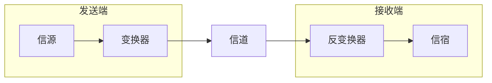

## 2.1. 通信基础

### 2.1.1. 基本概念

#### 1. 数据、信号、码元

- 通信的目的是传送信息。
- 数据是指传送信息的实体。
- 信号是数据的电气或电磁表现。

数据和信号都可用“模拟的”或“数字的”来修饰

- 连续变化的数据或信号称为模拟数据（==模拟信号==）
- 取值仅允许为有限的几个离散数值的数据或信号称为数字数据（==数字信号==）

数据的传输方式可分为串行传输和并行传输。

- 串行： 1 比特 1 比特按照时间顺序传输（远距离常用串行传输）
- 并行：若干比特通过多条通信信道同时传输

码元是指用一个固定时长的波形（数字脉冲）表示一位 $k$ 进制数字，代表不同离散数字的基本波形，是数字通信中数字信号的计量单位，这里时长的信号称为 $k$ 进展码元，该时长称为码元宽度

#### 2. 信源 信宿 信道

数据通信是指数字计算机或其他数字终端之间的通信。一个数据通信系统主要划分为==信源、信道、信宿==三个部分。

- 信源是产生和发送数据的源头
- 信宿是接收数据的终点
- 信道是信号的传输媒介



> 如图为一个单向通信系统的模型，实际的通信系统大多为双向的。

- 信道按传输信号的形式不同，可分为传送模拟信号的==模拟信道==和传送数字信号的==数字信道==两类
- 信道按传输介质的不同可分为有线信道和无线信道

信道上传送的信号有基带信号和宽带信号之分。

- 基带信号将数字 0 和 1 直接用两种不同的电压表示，然后传到数字信道上传输（==基带传输==）
- 宽带信号将基带信号进行==调制==后形成频分复用模拟信号，然后送到模拟信道上传输（==频带传输/宽带传输==）

通信双方信息交互方式看，分为三种基本方式

- 单向通信。只有一个方向的通信而没有反向的交互，仅需要一条信道。
- 半双工通信。通信的双方都可以发送或接收消息，但任何一方都不能同时发送和接收信息，此时需要两条信道。
- 全双工通信。通信双方可以同时发送和接收消息，需要两条信道。

#### 3. 速率 波特 带宽

速率也称数据率，指数据传输速率，表示单位时间内传输的数据量。可以用码元传输速率和信息传输速率表示。

- 码元传输速率（波特率）表示单位时间内数字通信系统所传输的码元个数，单位是波特 Baud。 1 波特表示数字通信系统每秒传输一个码元。
- 信息传输速率（信息速率、比特率）表示单位时间内数字通信系统传输的二进制码元个数（即比特数），单位是 bit/s

> [!tip] 比特率= 波特率 $\times \log_{2}n$
> 若一个码元有 $k$ 比特的信息量，则表示该码元所需要的不同离散值为 $n=2^{k}$ 个

带宽原指信号具有的频带宽度，单位是赫兹 Hz。带宽与数据率存在数值上的互换关系，常用来表示网络的通信线路所能传输数据的能力。带宽表示单位时间内从网络的某一点到另一点所能通过的“最高数据率”，此时单位是 b/s

### 2.1.2. 奈奎斯特定理和香农定理

#### 1. Nyquist 定理

具体的信道所能通过的频率范围总是有限的。信号中的许多高频分量往往不能通过信道，否则在传输过程中会衰减，导致接收端收到的信号波形失去码元之间清晰界限，这种现象称为码间串扰。

奈奎斯特定理规定：在理想低通（没有噪声、带宽有限）的信道中，为了避免码间串扰，极限码元传输速率为 $2W$ 波特，其中 $W$ 是理想低通信道的带宽。若用 $V$ 表示每个码元离散电平的数目（16 种不同码元需要 4 位二进制），则极限数据率为

> [!tip]
> 理想低通信道下的极限数据传输速率 = $2W \log_{2}V \text{ b/s}$

对于奈氏准则，有下面结论

1. 在任何信道中，码元传输速率有上限。若传输速率超过此上限，就会出现严重的码间串扰问题，使得接收端不可能完全正确识别码元
2. 信道的频带越宽（即通过的信号高频分量越多），就可用更高的速率进行码元的有效传输
3. 奈氏准则给出了码元传输速率的限制，但并未对信息传输速率给出限制，即未对一个码元可以对应多少个二进制位给出限制

#### 2. Shannon 定理

香农定理给出了带宽受限且有高斯白噪声干扰的信道的极限数据传输速率，当用此速率进行传输时，可以做到不产生误差

信道的极限数据传输速率 = $W \log _{2}(1 + S/N)\text{ b/s}$

式中，$W$ 为信道的带宽，$S$ 为信道所传输信号的平均功率，$N$ 为信道内部的高斯噪声功率。$S/N$ 为信噪比，即信号的平均功率与噪声的平均功率之比，信噪比 = $10 \log_{10}(S/N)$ 单位为 dB

> [!note] 例子
> $S/N=10$ 时，信噪比为 10 dB，$S/N=1000$ 时，信噪比为 30 dB

由香农定理得出的结论

1. 信道的带宽或信道中的信噪比越大，信息的极限传输速率越高
2. 对一定的传输带宽和一定的信噪比，信息传输速率的上限是确定的
3. 只要信息传输速率低于信道极限传输速率，就能找到某种方法来实现误差错传输
4. 香农定理得出的是极限信息传输速率，实际信道能达到的传输速率要比它低不少

### 2.1.3. 编码与调制

把数据变换为模拟信号的过程称为==调制==，把数据变换为数字信号的过程称为==编码==

信号是数据的具体表示形式，它和数据有一定的关系，但又和数据不同。数字数据可以通过数字发送器转换为**数字信号**传输，也可通过调制器转换为**模拟信号**传输；同样，模拟数据可以通过 PCM 编码器转换成**数字信号**传输，也可通过放大器调制器转换成**模拟信号**传输。

下面有 4 中编码方式

#### 1. 数字数据编码为数字信号

用于基带传输，在基本不改变数字数据信号频率的情况下，直接传输数字信号。

1. 归零编码 RZ
   高电平代表 1 ，低电平代表 0 （或相反），每个时钟周期的==中间均跳变到低电平==，接收方根据该调变调整本方的时钟基准，这就为传输双方提供了自同步机制，但归零需要占用一部分带宽
2. 非归零编码 NRZ
   不用归零，==一个周期可以全用来传输数据==。但 NRZ 无法传递时钟信号，双方难以同步，需要额外的时钟线
3. 反向归零编码
   用信号的翻转代表 0 ，信号保持不变代表 1 。翻转的信号本身可以作为一种通知机制，这种编码方式集成了前两种编码的优点，既能传输时钟信号，又能尽量不损失系统宽带
4. 曼彻斯特编码
   将一个码元分成两个相等的间隔，前高（电平）后低（电平）表示 1 ，反之表示 0 。可作为时钟信号，也可作为数据信号。所占频带宽度是原始基带宽度的两倍
5. 差分曼彻斯特编码
   若码元为 1 ，则前半个码元的电平与上一个码元的后半个码元电平相同；若码元为 0 ，则相反。每个码元的中间都有一次电平跳转，可以实现自同步，且抗干扰性好
6. 4B/5B 编码
   将欲发送数据流的每 4 位作为一组，按照编码规则转换为相应的 5 位码。 5 位码共 32 种组合，但只采用其中的 16 位对应 16 种不同的 4 位码，其他用作控制或保留

```
bit data  | 1 | 0 | 0 | 1 | 1 | 0 | 1 | 0 |

RZ        |¯¯_|___|___|¯¯_|¯¯_|___|¯¯_|___|

NRZ       |¯¯¯|___|___|¯¯¯|¯¯¯|___|¯¯¯|___|

RRZ       |¯¯¯|___|___|¯¯¯|¯¯¯|___|¯¯¯|___|

Manchest  |¯|_|_|¯|_|¯|¯|_|¯|_|_|¯|¯|_|_|¯|

Diff Man  |¯|_|¯|_|¯|_|_|¯|¯|_|¯|_|_|¯|_|¯|
```

#### 2. 数字数据调制为模拟信号

1. 幅移键控（ASK）通过改变载波信号的振幅来表示数字信号 1 和 0 ，而载波的频率和相位都不改变。容易实现，抗干扰能力差
2. 频移监控（FSK）通过改变载波信号的频率来表示数字信号 1 和 0 ，载波的振幅和相位不变。容易实现，抗干扰能力强，应用广泛
3. 相移键控（PSK）通过改变载波信号的相位来表示数字信号 1 和 0 ，振幅和频率不变。分为绝对调相和相对调相
4. 正交振幅调相（QAM）在频率相同的前提下，将 ASK 和 PSK 结合，形成叠加信号。设波特率为 $B$，采用 $m$ 个相位，每个相位有 $n$ 种振幅，则该 QAM 技术的数据传输速率为
   $$R=\log _{2} (mn) \text{ b/s}$$

![[public/network/jw0201kfdf.png]]

#### 3. 模拟数据编码为数字信号

常用于对音频信号进行编码的脉码调制（PCM），主要包括三个步骤：采样、量化、编码

> [!note] 采样定理
> 在通信领域，带宽是指信号最高频率与最低频率之差，单位是 Hz 。因此，将模拟信号转换成数字信号时，假设原始信号中最大频率是 $f$，那么采样频率 $f_\text{sample}$ 必须大于等于最大频率 $f$ 的两倍，才能保证采样后的数字信号完整保留原始模拟信号的信息。
> 
> 采样定理又称奈奎斯特定理。

1. 采样是指对模拟信号进行周期性扫描，把时间上连续的信号变成时间上离散的信号。采样频率大于等于模拟数据频带带宽（最高变化频率）的两倍时，所得的离散信号可以无失真地代表被采用的模拟数据
2. 量化：把采样取得的电平幅值按一定的分级标度转化为对应的数字值并取整
3. 编码：把量化的结果转换为与之对应的二进制编码

#### 4. 模拟数据调制为模拟信号

为了实现传输的有效性，可能需要较高的频率。这种调制方式可以使用频分复用（FDM）技术，充分利用带宽资源。

### 2.1.4. 电路交换、报文交换、分组交换

#### 1. 电路交换

进行数据传输之前两个节点之间必须先建立一条专用（双方独占）的物理通信路径，该路径可能经过许多中间节点。这一路径在真格数据传输期间一直被独占，直到通信结束才被释放。电路交换技术分为三个阶段：连接建立、数据传输、连接释放。

从通信资源的分配角度来看，“交换”就是按照某种方式动态的分配传输路线的资源。电路交换：在数据传输的过程中，用户始终占用端到端的固定传输带宽。

> [!tip] 优点
> - 通信时延小
> - 有序传输
> - 没有冲突
> - 适用范围广
> - 实时性强
> - 控制简单

> [!caution] 缺点
> - 建立连接时间长
> - 线路独占
> - 灵活性差
> - 难以规格化


#### 2. 报文交换

数据交换的单位是报文，携带有目的地址、源地址等信息。在交换节点采用==存储转发==的传输方式。

> [!tip] 优点
> - 无需建立连接：不需要建立专用的通信线路
> - 动态分配线路
> - 提高线路的可靠性：路径故障可以重新选路
> - 提高线路的利用率
> - 提供多目标服务：一个报文可以同时发送给多个目标地址

> [!caution] 缺点
> - 数据进入交换节点需要经历存储、转发这一过程，会引起转发时延（包括接收报文、检验正确性、排队、发送时间等）
> - 报文交换对报文的大小没有限制，这就要求网络节点需要有较大的缓存空间


#### 3. 分组交换

采用存储转发方式，但解决了报文交换中大文件传输的问题。分组交换限制了每次传送的数据块大小上限，把大的数据块划分为合理的小数据块，再加上一些必要的控制信息（源地址、目的地址、编号信息等），构成分组。网络节点根据控制信息把分组传送到下一个节点，下一个节点接收到分组后，暂时保存并排队等待传输，然后根据分组控制信息选择它的下一个节点，直到到达目的节点。

> [!tip] 优点
> - 无建立时延
> - 线路利用率高
> - 简化了存储管理
> - 加速传输：分组是逐个传输的，可以使后一个分组的存储操作与前一个分组的转发操作并行，这种流水线方式减少了报文的传输时间。
> - 减少了出错概率和重发数据量：分组较短，出错概率减小，每次重发的数据量也大大减少。

> [!caution] 缺点
> - 存在传输时延：相对于电路交换仍然存在存储转发时延，而且其节点交换机必须具有更强的处理能力
> - 需要传输额外的信息量：每个数据块都要加上头部信息
> - 当分组交换采用数据报服务时，可能会出现失序、丢失或重复分组，分组到达目的节点时，要对分组按编号进行排序。若采用虚电路方式，虽无失序问题，但有呼叫建立、数据传输、虚电路释放三个过程。

![[public/network/jw02dfdsgr.svg]]

### 2.1.5. 数据报与虚电路

这两种服务方式都由网络层提供。这两种方式是分组交换的两种方式

- 数据报：无连接
- 虚电路：面向连接

#### 1. 数据报

作为通信子网用户的端系统发送一个报文时，在端系统中实现的高层协议先把报文拆成若干带有序号的数据单元，并在网络层加上地址等控制信息后形成数据报分组（即网络层的 PDU）。中间节点存储分组很短一段时间，找到最佳路由后，尽快转发每个分组。不同的分组可以走不同的路径，也可按照不同的顺序到达目的节点。

当分组正在某一链路上传送时，分组并不占用网络的其他部分资源。因为采用存储转发技术，资源是共享的，所以主机 A 在发送分组时，主机 B 也可同时向其他主机发送分组。

> [!tip] 特点
> - 发送分组前不需要建立连接。发送方可随时发送分组，网络中的节点可随时接收分组。
> - 网络尽最大努力交付，传输不保证可靠，所以可能丢失；为每个分组独立选择路由，转发路径可能不同，分组不一定按照顺序到达目的节点
> - 发送的分组中包括发送端和接收端的完整地址，以便独立传输
> - 分组在交换节点存储转发时，需要==排队等待处理==，这会带来一定的时延。
> - 网络具有冗余路径，当某个交换节点或链路故障，可相应地更新转发表，新找另一条路径转发分组，对故障的适应能力强
> - 存储转发的时延一般较小，提高了网络的吞吐量
> - 收发双方不独占链路，资源利用率高

#### 2. 虚电路

虚电路方式试图将数据报方式和电路交换方式结合。

在分组发送前，要求发送方和接收方建立一条逻辑上相连的虚电路，并且连接一旦建立，就固定了虚电路所对应的物理路径。通信过程分三个阶段：虚电路建立、数据传输、虚电路释放。

虚电路号：区别于本系统中的其他虚电路。在虚电路网络中的每个节点上都维持一张虚电路表，表中每项记录了一个打开的虚电路的信息，包括在接收链路和发送链路上的虚电路号、前一节点、下一节点标识。数据传输是双向进行的。

> [!tip] 特点
> - 虚电路通信链路的建立和拆除需要时间开销，对交互式应用和小量的短分组情况很浪费，但对长时间、频繁的数据交换效率高
> - 路由选择体现在连接建立阶段，连接建立后，就确定了传输路径
> - 提供了可靠的通信功能，能保证每个分组正确且有序到达。还可以对两个数据端点的流量进行控制，当接收方来不及接收数据时，可以通知发送方暂缓
> - ==致命弱点==：当网络中某一个节点或某条链路故障而彻底失效时，所有经过该节点或该链路的虚电路将遭到破坏
> - 分组首部不包含目的地址，包含的是虚电路标识符，相对于数据报方式，开销小

 虚电路是“虚”的，是因为这条电路不是专用的，每个节点到其他节点直接按的链路可能同时有若干虚电路通过，也可能同时与多个节点之间建立虚电路。

![[public/network/jw02nvgfb.svg]]

| 两者的比较         | 数据报服务                                                   | 虚电路服务                                               |
| ------------------ | ------------------------------------------------------------ | -------------------------------------------------------- |
| 连接建立           | 不需要                                                       | 必须有                                                   |
| 目的地址           | 每个分组都有完整的目的地址                                   | 仅在建立连接阶段使用，之后每个分组使用长度较短的虚电路号 |
| 路由选择           | 每个分组独立进行路由选择和转发                               | 属于同一条虚电路的分组按照统一路由转发                   |
| 分组顺序           | 不保证有序到达                                               | 保证分组有序到达                                         |
| 可靠性             | 不保证可靠通信，可靠性由用户主机保证                         | 可靠性由网络保证                                         |
| 对网络故障的适应性 | 出故障的节点丢失分组，其他分组路径选择发生变化时可以正常传输 | 所有经过故障节点的虚电路都不工作                         |
| 差错处理和流量控制 | 由用户主机进行流量控制，不保证数据报的可靠性                 | 可由分组交换网络负责，也可由用户主机负责                 | 

## 2.2. 传输介质

### 2.2.1. 双绞线、同轴电缆、光纤、无线传输介质

传输介质也称传输媒体，是数据传输系统中发送设备和接收设备之间的物理通路。传输介质可分为导向传输介质和非导向传输介质。

- 导向传输介质中，电磁波被导向沿着固体媒介（铜线或光纤）传播
- 非导向传输介质可以是空气、真空、海水等

#### 1. 双绞线

由两根采用一定规则并排绞合的、相互绝缘的铜导线组成。绞合可以减少对相邻导线的电磁干扰。

价格便宜，在局域网和传统电话中普遍使用。带宽取决于铜线的粗细和传输的距离。

#### 2. 同轴电缆

内导体、绝缘层、网状编织屏蔽层、外层塑料。

具有良好的抗干扰特性。传输距离更远。

#### 3. 光纤

利用光导纤维传递光脉冲来进行通信。可见光频率约为 $10^{8}$ MHz ，光纤通信系统带宽范围极大。

- 传输损耗小，中继距离长，对远距离传输特别经济
- 抗雷电和抗电磁干扰性能好
- 无串音干扰，保密性好，不易被窃听或截取数据
- 体积小，重量轻

#### 4. 无限传输介质

1. 无线电波
2. 微波、红外线和激光

### 2.2.2. 物理层接口的特性

1. ==机械特性==：指明接口所用接线器的形状和尺寸、引脚数目和排列、固定和锁定装置等
2. ==电气特性==：指明在接口电缆的各条线上出现的电压范围
3. ==功能特性==：指明某条线上出现的某一电平的电压表示何种意义
4. ==过程特性==：指明对于不同功能的各种可能事件的出现顺序

## 2.3. 物理层设备

### 2.3.1. 中继器

主要功能是将信号整形并放大再转发出去，以消除信号经过一长段电缆后而产生的失真和衰减，使信号的波形和强度达到所需要的要求，进而扩大网络传输的距离。

中继器两端的网络部分是网段，而不是子网，使用中继器连接的几个网段仍然是一个局域网。

==中继器的使用不能无限沿伸==。网络标准中对信号的延迟范围做了具体规定，中继器只能在此规定范围内有效工作，否则会引起网络故障。

> 中继器放大的是数字信号，原理是将衰减的信号整形再生。

### 2.3.2. 集线器

实质上是一个多端口的中继器。一个端口接收到数据信号后，整形放大再生到发送时的状态，紧接着转发到其他所有处于工作状态的端口。只起放大和转发的作用，不具备信号的定向传送能力，是一个标准的共享式设备。

只能工作在半双工下。

> 如果同时有两个或多个端口输入，那么输出时会发生冲突。

> [!example] 一个带宽为 10 Mb/s 的集线器连接了 8 台计算机，每台计算机真正拥有的带宽为？
> $10/8\text{ Mb/s}=1.25\text{ Mb/s}$

## 2.4. 小结

#### 1. 传输媒体是物理层吗？传输媒体和物理层的主要区别？

并不是。由于传输媒体在物理层的下面，而物理层是体系结构的第一层，因此有称传输媒体是 0 层。传输媒体中传输的是信号，但传输媒体并不知道所传输的信号代表什么，即传输媒体不知道什么时候是 0 什么时候是 1。但物理层由于规定了==电气特性==，因此可以识别出传送的比特流。

#### 2. 什么是基带传输、频带传输、宽带传输？

计算机内部或在相邻设备之间近距离传输时，可以不通过调制就在信道上直接进行传输的方式称为==基带传输==。常用于局域网。

用数字信号对特定频率的载波进行调制（数字调整），将其变成合适传输的信号后再进行传输，这叫==频带传输==。远距离传输或无线传输时，数字信号必须用频带传输技术进行传输。频带传输解决了电话系统传输数字信号的问题，而且可以多路复用，进而提高传输信道的利用率。

借助频带传输，可将链路容量分解成两个或多个信道，每个信道可以携带不同的信号，这就是==宽带传输==。其中所有的信道能同时互不干扰的发送信号，链路容量大大增加。

#### 3. 奈氏准则和香农定理的主要区别？两个定理对数据通信的意义？

奈氏准则指出，码元传输的速率是受限的，不能任意提高，否则接收端就不能正确判定码元所携带的比特是 1 还是 0（因为存在码元之间的相互干扰）

奈氏准则是在理想条件下推导出来的。

奈氏准则并未限制信息传输速率（b/s）。要提高信息传输速率，就必须每个传输的码元能够代表许多比特的信息，这就需要很好的编码技术。

香农定理给出了信息传输速率的极限，即对于一定的传输带宽（单位 Hz）和一定的信噪比，信息传输速率的上限就确定了，这个极限是不能被突破的。想要提高信息传输速率，要么设法提高传输线路的带宽，要么设法提高所穿信道的信噪比，此外没有其他任何办法。


