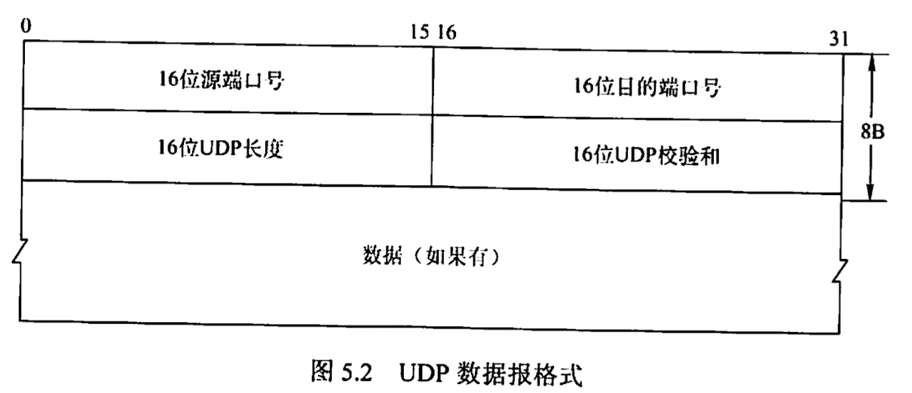
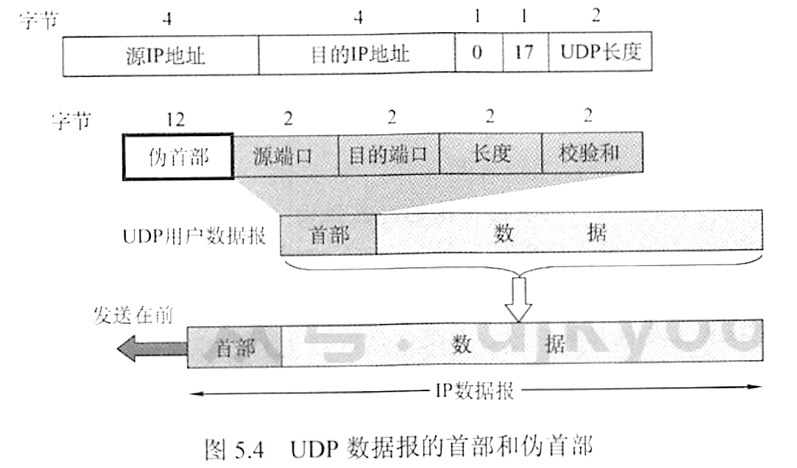
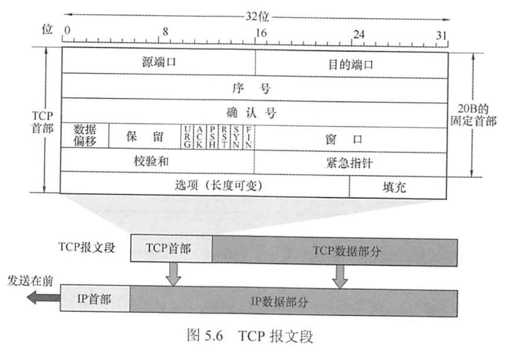
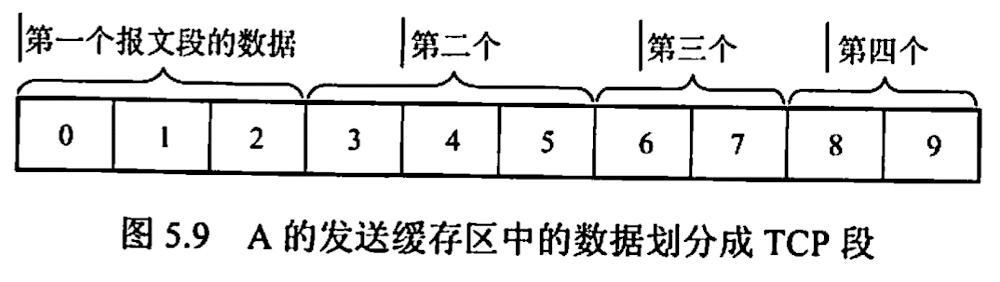
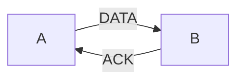
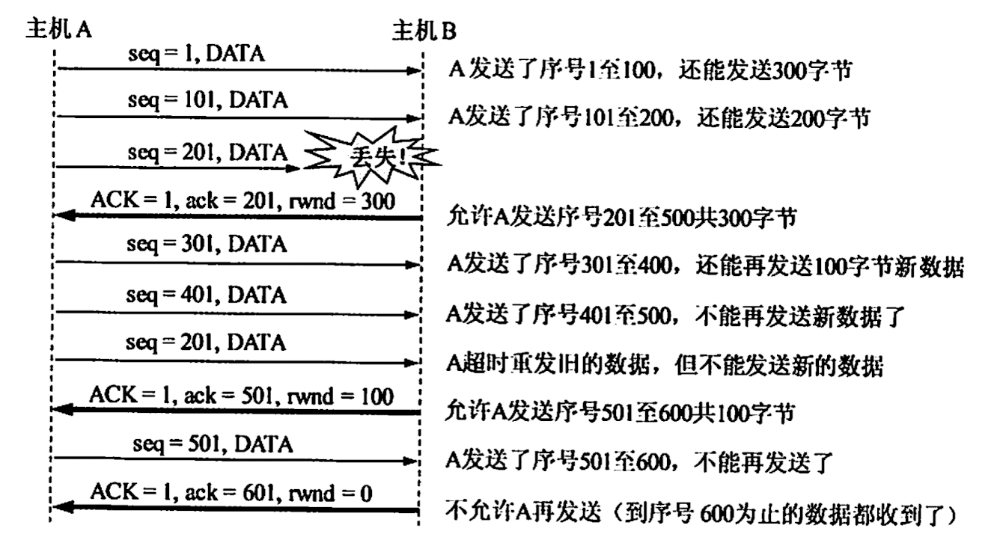
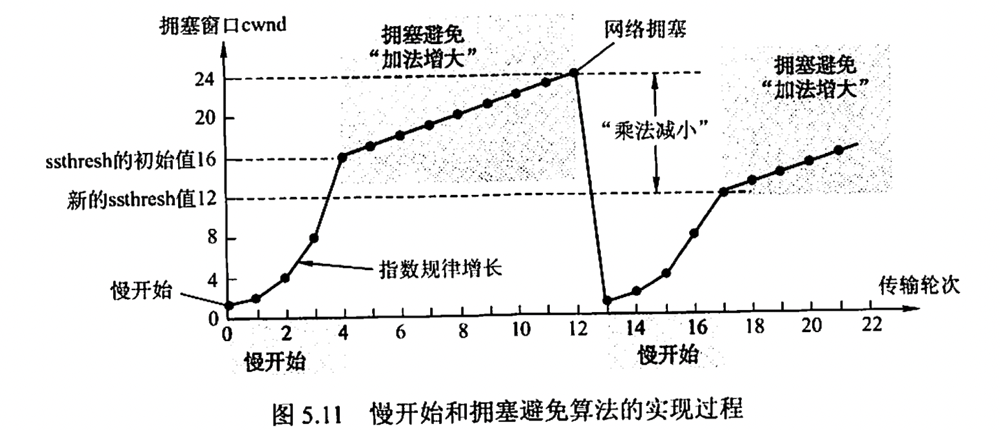
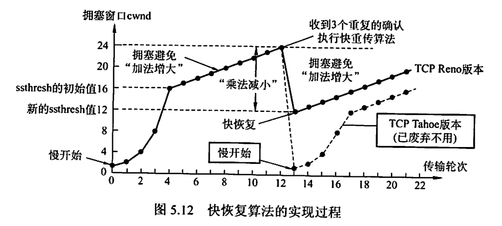

> [!info] 内容
> 1. 传输层提供的服务
> 	1. 传输层的功能
> 	2. 传输层寻址与端口
> 	3. 无连接服务和面向连接服务
> 2. UDP
> 	1. UDP 数据报
> 	2. UDP 校验
> 3. TCP
> 	1. TCP 段
> 	2. TCP 连接管理
> 	3. TCP 可靠传输
> 	4. TCP 流量控制与拥塞控制

## 5.1. 传输层提供的服务

### 5.1.1. 功能

从通信和信息处理的角度看，传输层向它上面的应用层提供通信服务，属于面向通信部分的最高层，同时也是用户功能中的最低层。

传输层位于网络层之上，为运行在==不同主机上的进程==之间提供了逻辑通信，二网络层提供==主机==之间的逻辑通信。即使网络层不可靠（网络层协议使分组丢失、混乱或重复），传输层只存在于通信子网以外的主机中。

> [!tip] 功能
> 1. 传输层提供应用进程之间的逻辑通信（即端到端）通信。与网络层区别是，网络层提供主机之间的逻辑通信。
> 	1. 两台主机之间的通信实际上是指两台主机中的应用进程之间地方通信，即端到端的逻辑通信
> 	2. 逻辑通信是指，传输层之间的通信好像是沿水平方向传送数据，但事实上两个传输层之间并没有水平方向的物理连接
> 2. 复用和分用
> 	1. 复用指发送方不同的应用进程都可使用一个传输层协议传输数据
> 	2. 分用指接收方的传输层在剥去报文的首部之后能够把这些数据正确交付到目的应用进程
> 3. 传输层还要对收到的报文进行差错检验（首部和数据部分）。网络称只检查 IP 数据报的首部，不检验数据部分。
> 4. 提供两种不同的传输协议：面向连接的 TCP 和无连接的 UDP。网络层无法同时实现两种协议（网络层要么只提供面向连接的虚电路，要么只提供无连接的数据报服务，不可能同时存在两种方式）

传输层向高层屏蔽了低层网络核心的细节（网络拓扑、路由协议等），使应用进程看见的是在两个传输层实体之间好像有一条端到端的逻辑通信信道。

这条逻辑通信信道对上层的表现却因传输层协议不同而有很大的差别。当传输层采用 TCP，尽管下面的网络是不可靠的（尽最大努力交付），但这种逻辑通信信道就相当于一条全双工的可靠信道。当传输层采用 UDP，该逻辑通信信道仍然是不可靠的。

### 5.1.2. 传输层的寻址与端口

#### 1. 端口的作用

端口能够让应用层的各种应用进程将数据通过端口向下交付给传输层，以及让传输层知道应当将其报文段中的数据向上通过端口交付给应用层相应的进程。端口是传输层服务访问点，在传输层的作用类似于 IP 地址在网络层的错用或 MAC 地址在数据链路层的作用。端口标识的是主机中的==应用进程==。

在协议栈层间的抽象的协议端口是==软件端口==，它与路由器或交换机上的==硬件端口==是完全不同的概念。硬件端口是不同硬件设备进行交互的接口，而软件端口是应用层的各种协议进程与传输实体进行层间交互的一种地址。传输层使用的是==软件端口==。

#### 2. 端口号

端口号长为 16 bit，能表示 65536 个不同的端口号。

端口号只具有本地意义，即只表示本计算机应用层中的各进程，在因特网中不同计算机的相同端口号是没有联系的

> [!tip] 根据端口号范围可将端口分为两类
> 1. 服务器端使用的端口号
> 	1. 熟知端口号 0 ~ 1023
> 	2. 登记端口号 1024 ~ 49151
> 2. 客户使用的端口号（短暂端口号、临时端口） 49152 ~ 65535
> 
> | 应用程序   | FTP | TELNET | SMTP | DNS | TFTP | HTTP | SNMP |
> |:----------:|:---:|:------:|:----:|:---:|:----:|:----:|:----:|
> | 熟知端口号 | 21  | 23     | 25   | 53  | 69   | 80   | 161  | 

#### 3. 套接字

在网络中通过 IP 地址来表示和区别不同的主机，通过端口号来标识和区分一台主机中的不同应用进程，使用下面的格式

<div style="text-align: center;">套接字 Socket = IP 地址 : 端口号</div>

它唯一标识网络中一台主机和其上的一个应用（进程）

### 5.1.3. 无连接服务与面向连接服务

面向连接服务就是在通信双方进行通信之前，必须先建立连接，在通信过程中，整个连接的情况一直被实时地监控和管理。同心结束后，应该释放连接。

无连接服务指两个实体之间的通信不需要先建立好链接，需要通信时，直接将信息发送到“网络”中，让该信息的传递在网上尽力而为地往目的地传送。

TCP/IP 协议族在 IP 层之上使用了两个传输协议

- 面向连接的传输控制协议 TCP，采用 TCP 时，传输层向上提供一条全双工的可靠逻辑信道
	- 增加开销，确认、流量控制、计时器、连接管理等，头部大很多，占用处理机资源
	- 适用于可靠性更重要的场合，如文件传输、超文本传输、远程登录等
- 无连接的用户数据报协议 UDP，采用 UDP 时，传输层向上提供的是一条不可靠的逻辑信道
	- 在 IP 之上仅提供两个附加服务：多路复用和对数据的错误检查。IP 知道怎样把分组投递到一台主机，但不知道怎样把他们投递给主机上的具体应用。
	- 无需建立连接，远程主机的传输层收到 UDP 报文后，不需要回复确认。
	- 简单，执行速度快，实时性好，主要用于小文件传输 TFTP、DNS、SNMP 和实时传输协议 RTP

> [!caution]
> 1.  IP 数据报和 UDP 数据报的区别
> 	1. IP 数据报在网络层要经过路由的存储转发
> 	2. UDP 数据报在传输层的端到端的逻辑信道中传输，封装成 IP 数据报在网络层传输时，UDP 数据报的信息对路由是不可见的
> 2. TCP 和网络层虚电路的区别
> 	1. TCP 报文段在传输层抽象的逻辑信道中传输，对路由器不可见。传输层采用 TCP 不影响网络层提供无连接服务
> 	2. 虚电路所经过的交换节点都必须保存虚电路状态信息。在网络层采用虚电路方式，无法提供无连接服务

## 5.2. UDP 协议

### 5.2.1. UDP 数据报

#### 1. 概述

UDP 仅在 IP 的数据报服务商增加了两个最基础的服务：复用和分用、差错检测。如果应用开发者选择 UDP 而非 TCP，那么应用程序几乎直接与 IP 打交道。

> [!tip] UDP 的优点
> 1. UDP 无需建立连接，没有建立连接的时延。如果 DNS 建立在 TCP 上，那么会慢很多。
> 2. 无连接状态，不维护连接状态，不跟踪这些参数。某些专用应用服务器使用 UDP 时，一般都能支持更多的活动客户机
> 3. 分组开销小，TCP 有 20 B 的首部开销，UDP 只有 8 B
> 4. 应用层能更好地控制要发送的数据和发送时间。UDP 没有拥塞控制，因此网络中的拥塞不会影响主机的发送效率。某些实时应用要求以稳定的速度发送，能容忍一些数据的丢失，但不允许有较大的时延，则可用 UDP
> 5. UDP 支持一对一、一对多、多对一和多对多的交互通信

UDP 常用于一次性传输较少数据的网络应用，如 DNS、SNMP 等，使用 UDP 无需过大的开销，没有过大的延迟。

UDP 不保证可靠交付，所有维护可靠性的工作可由用户在应用层完成，并不以为止应用对数据的要求是不可靠的。

UDP 是面向报文的，发送方 UDP 对应用称交下来的报文，在添加首部后就向下交付给 IP 层，一次发送一个报文，既不合并，也不拆分，而是保留这些报文的边界；接收方 UDP 对 IP 层交上来的 UDP 数据报，在去除首部后就原封不动的交付给上层应用进程，一次交付一个完整报文。因此==报文不可分割==，==是 UDP 数据报处理的最小单位==。因此应用程序必须选择合适大小的报文。

#### 2. UDP 首部格式

首部有 8 B，由 4 个字段组成，每个字段 2 B。

1. 源端口
2. 目的端口
3. 长度：UDP 数据报的长度（包括首部和数据），最小值为 8
4. 校验和:检测 UDP 数据报在传输过程中是否有错，有错就丢弃。可选，不想校验时全 0.



当传输层从 IP 层收到 UDP 数据报时，就根据首部中的目的端口，把 UDP 数据报通过相应端口上交给应用进程。

如果接收方 UDP 发现收到的报文中目的端口号不正确，就丢弃该报文，并由 ICMP 发送“端口不可达”差错报文给发送方。

### 5.2.2. UDP 校验

在计算校验和时，要在 UDP 数据报之间增加 12 B 的伪首部。为首部并不是 UDP 的真正首部，只是在计算校验和时，临时加在 UDP 数据报前面。

伪首部==既不向下传送==，==也不向上递交==，知识为了计算校验和。



UDP 检验首部和数据部分。发送方首先把全 0 放入校验和字段并添加伪首部，然后把 UDP 数据报视为许多 16 位的字串接起来。若数据部分不是偶数字节则填 0，但此字节不发送。按二进制反码计算出这些 16 位字的和，将此和的二进制反码写入校验和字段，并发送。

接收方把收到的 UDP 数据报加上伪首部（若不是偶数字节，则填 0 ）后，按二进制反码求这些 16 位字的和。当无差错时应当为全 1，否则出现差错，丢弃分组。

设有 UDP 数据报

```
99 13 08 68  // 153.19.8.104 源 IP
AB 03 0E 0B  // 171.3.14.11  目的 IP
00 11 00 0F  // 0， 17， 长度 15 字节
04 3F 00 0D  // 1087, 13 源/目的端口号
00 0F 00 00  // 长度 15, 校验和字段全 0
54 45 53 54  // 数据
49 4E 47 00  // 数据 + 补 0
```

```
10011001 00010011  // 153.19
00001000 01101000  // 8.104
10101011 00000011  // 171.3
00001110 00001011  // 14.11
00000000 00010001  // 0, 17
00000000 00001111  // 15
00000100 00111111  // 1087
00000000 00001101  // 13
00000000 00001111  // 15
00000000 00000000  // 0 校验和
01010100 01000101  // 数据
01010011 01010100  // 数据
01001001 01001110  // 数据
01000111 00000000  // 数据和填充 0
-----------------
10010110 11101101  // 求和
01101001 00010010  // 取反
```

## 5.3. TCP 协议

### 5.3.1. 特点

TCP 是在不可靠的 IP 层之上实现的可靠的数据传输协议，它主要解决传输的可靠、有序、无丢失、不重复的问题。

> [!tip] 特点
> 1. TCP 是面向连接的传输层协议，TCP 连接是一条逻辑连接
> 2. 每条 TCP 连接只能有两个端点，每条 TCP 链接只能是端到端的（进程对进程）
> 3. TCP 提供可靠交付的服务，保证传送的数据无差错、不丢失、不重复、有序
> 4. TCP 提供全双工通信，允许通信双方的应用进程在任何时候都能发送数据，为此 TCP 连接的两端都设有发送缓存和接收缓存，用来临时存放双向通信的数据。
> 	1. 发送缓存用来暂存以下数据
> 		1. 发送应用程序传送给发送方 TCP 准备发送的数据
> 		2. TCP 已发送但尚未收到确认的数据
> 	2. 接收缓存用来暂存以下数据
> 		1. 按序到达但尚未被接受应用程序读取的数据
> 		2. 不按序到达的数据
> 5. TCP 是面向字节流的，虽然应用程序和 TCP 的交互是一次一个数据块，但 TCP 把应用程序交下来的数据仅视为一连串的无结构字节流

TCP 和 UDP 在发送报文时采用的方式完全不同。UDP 报文的长度由发送应用进程决定，而 TCP 报文的长度则根据接收方给出的窗口值和当前网络拥塞程度决定。

### 5.3.2. TCP 报文段

TCP 传送的数据单元称为报文段。TCP 报文段既可以用来运载数据，又可以用来建立连接，释放连接和应答。

整个 TCP 报文段作为 IP 数据报的数据部分封装在 IP 数据报中。首部的前 20 B 固定。首都最短 20 B，最长 60 B，必须为 4 字节的倍数。



字段意义

1. ==源端口和目的端口==，各占 2 B 。端口是传输层与应用层的服务接口，运输层的复用和分用功能都要通过端口实现
2. ==序号==占 4 B，范围为 $0\sim 2^{32}-1$，TCP 是面向字节流的（即是逐个字节传送的），所以 TCP 连接传送的字节流中的每个字节都按顺序编号。序号字段的值指的是本报文所发送的第一个数据的第一个字节的序号。
     - 一个报文段长 100 字节，起始序号若为 301，最后一个字节序号是 400，下一个报文段的数据序号从 401 开始
3. ==确认号==占 4 B，是期望收到对方下一个报文段的第一个数据字节的序号。若确认号为 $N$，则表明到序号 $N-1$ 为止的所有数据都已正确收到
4. ==数据偏移==（首部长度）占 4 位，以 4B 为单位，最大能表示的数字是 15，因此 TCP 首部的最大长度为 60 B
5. ==保留==占 6 位
6. ==紧急位 URG==，当为 1 时，表示有效，告诉系统此报文段中有紧急数据，应尽快传送。需要和首部中紧急指针字段配合使用
7. ==确认位 ACK==，当为 1 时，确认号字段有效，为 0 时无效。TCP 规定，在连接建立后所有传送的报文段都必须把 ACK 置 1
8. ==推送位 PSH==，接收方 TCP 收到 PSH=1 的报文段，就尽快地交付给接收应用进程，而不再等到整个缓存都填满了后再向上交付
9. ==复位位 RST==，当 RST=1 时，表明 TCP 连接中出现严重差错，必须释放重新建立
10. ==同步位 SYN==，当 SYN=1 时表示这是一个连接请求或连接接收报文
11. ==终止位 FIN==，用来释放一个连接。当 FIN=1时，表明此报文段发送方的数据已发送完毕，并要求释放运输连接
12. ==窗口==占 2 B，范围是 $0\sim 2^{16}-1$。它指出现在允许对方发送的数据量。接收方的数据缓存空间是有限的，因此用窗口值作为接收方让发送方设置其发送窗口的依据
	  - 设确认号为 701，窗口字段 1000. 这表明，从 701 号算起，发送此报文段的一方还有接收 1000 字节数据的接收缓冲空间
13. ==校验和==占 2 B，校验和字段检验的范围包括首部和数据两部分。在计算校验和时，和 UDP 一样，要在 TCP 报文段的前面加上 12 B 的伪首部（协议字段 17 改成 6 ）
14. ==紧急指针==占 2 B，紧急指针仅在 URG=1时才有意义，指出在本报文段中紧急数据共有多少字节
15. ==选项==，长度可变。TCP 最初只规定了一种选项，即最大报文段长度 MSS
16. ==填充==，这是为了整个首部长度是 4 B 的整数倍

### 5.3.3. TCP 连接管理

TCP 是面向连接的协议，因此每个 TCP 链接都有三个阶段：连接建立、数据传送、连接释放。TCP 连接的管理就是使运输链接的建立和释放都能正常进行

> [!faq] TCP 连接建立的过程中，要解决以下三个问题
> 1. 要使每一方能够确知对方的存在
> 2. 要允许双方协商一些参数（如最大窗口值、是否使用窗口扩大选项、时间戳选项及服务质量等）
> 3. 能够对运输实体资源（如缓存大小、连接表中的项目等）进行分配

TCP 把链接作为最基本的抽象，每条 TCP 链接有两个端点，TCP 连接的端点不是主机，不是主机的 IP 地址，不是应用进程，也不是传输层协议端口。TCP 链接的端口即为套接字或插口，每条 TCP 连接唯一地被通信的两个端点（即两个套接字）确定。

TCP 链接的建立采用客服/服务器模式。主动发起连接建立的应用进程称为==客户==，而被动等待连接建立的应用进程称为==服务器==。

#### 1. TCP 连接的建立



1. 同步位 SYN = 1，选择一个初始序号 seq = $x$，TCP 规定，SYN 报文段不能携带数据，但要消耗一个序号。此时 TCP 客户进程进入 SYN - SENT 状态。
2. 服务器的 TCP 收到连接请求报文段后，如果同意建立连接，则向客户机发回确认，并为该 TCP 连接分配缓存和变量。在确认报文段中，把 SYN 和 ACK 都置 1，确认号是 ack = $x+1$，同时也为自己选择一个初始序号 seq = $y$。不能携带数据，要消耗一个序号。
3. 当客户机收到确认报文段后，还要向服务器给出确认，并为该 TCP 连接分配缓存和变量。确认报文段 ACK = 1，确认号 ack = $y+1$，序号 seq = $x+1$，可以携带数据，若不携带则不消耗序号

TCP 提供的是全双工通信，因此通信双方的应用进程在任何时候都能发送数据。服务器端的资源实在完成第二次握手时分配的，而客户端的资源是在完成第三次握手时分配的，这就使得服务器易于收到 SYN 洪泛攻击。

#### 2. TCP 连接的释放



1. 客户机打算关闭连接时，向其 TCP 发送连接释放报文段，并停止发送数据，主动关闭 TCP 连接，该报文段的终止位 FIN = 1，序号 seq = $u$，它等于前面已传送过的数据的最后一个字节序号加一，FIN 报文段即使不携带数据，也消耗掉一个序号这时，客户进程进入 FIN - wait - 1 状态。全双工通路中，关闭了一条数据通路，但对方还可以发送数据。
2. 服务器收到链接释放报文后即发出确认，确认号 ack = $u+1$，序号 seq = $v$，等于它前面已传送过的数据的最后一个字节的序号加一。服务器进入 CLOSE - wait 状态。从客户机到服务器这个方向的连接就释放了，TCP 连接处于半关闭状态。但服务器若发送数据，客户机仍要接收，即从服务器到客户机这个方向的连接并未关闭
3. 若服务器已经没有要向客户机发送的数据，就通知 TCP 释放连接，此时，其发出 FIN = 1 的连接释放报文段。设该报文段的序号为 $w$，还须重复上次已发送的确认号 ack = $u+1$，这时服务器进入 LAST - ACK
4. 客户机收到连接释放报文段后，必须发送确认。把确认报文段中的确认位 ACK = 1，确认号 ack = $w+1$，序号 seq = $u+1$. 此时 TCP 还未释放，必须经过时间等待计时器设置的时间 2MSL （最长报文段寿命） 后，客户机才进入 CLOSED 状态。

> [!summary] 总结
> 1. 连接建立
> 	1. SYN = 1, seq = $x$
> 	2. SYN = 1, ACK = 1, seq = $y$, ack = $x+1$
> 	3. ACK = 1, seq = $x+1$, ack = $y+1$
> 2. 释放连接
> 	1. FIN = 1, seq = $u$
> 	2. ACK = 1, seq = $v$, ack = $u + 1$
> 	3. FIN = 1, ACK = 1, seq = $w$, ack = $u+1$
> 	4. ACK = 1, seq = $u+1$, ack = $w+1$

### 5.3.4. TCP 可靠传输

TCP 的任务在 IP 层不可靠的、尽力而为服务的基础上建立一种可靠数据传输服务。TCP 提供的可靠数据传输服务保证接收方进程从缓冲区读出的字节流与发送方发出的字节流完全一致。

TCP 使用了校验、序号、确认和重传等机制来达到这一目的。其中，TCP 的校验机制与 UDP 校验一样。

#### 1. 序号

TCP 首部的序号字段用来保证数据能有效提交给应用层，TCP 把数据视为一个无结构但有序的字节流，序号建立在传送的字节流上，而不建立在报文段上。

TCP 连接传送的数据流中每个字节都编上一个序号。序号字段的值是指本报文段所发送的数据的第一个字节的序号。A 的发送缓冲中共有 10 B，序号从 0 开始标号，第一个报文包含第 0 ~ 2 个字节，则该 TCP 报文段的序号是 0，第二个序号是 3.



#### 2. 确认

TCP 首部的确认号是期望收到对方的下一个报文段的数据的第一个字节的序号。上图中，如果接收方 B 已收到第一个报文段，此时 B 希望收到的下一个报文段的数据是从第 3 个字节开始的，那么 B 发送给 A 的报文中的确认号字段应为 3. 发送方缓存区会继续存储那些已发送但未收到确认的报文段，以便在需要时重传。

TCP 默认使用累积确认，即 TCP 只确认数据流中第一个丢失字节为止的字节。上图中，接收方 B 收到了 A 发送的字节 0 ~ 2 及 6 ~ 7 的报文段。由于某种原因，B 还没收到字节 3 ~ 5 的报文段，此时 B 仍在等待字节 3，因此 B 到 A 的下一个报文段将确认字段置为 3.

#### 3. 重传

有两种事件会导致 TCP 对报文进行重传：超时冗余 ACK

##### 超时

TCP 每发送一个报文段，就对这个报文设置一次计时器。计时器设置的重传时间到期但还未收到确认时，就要重传这一报文段。

由于 TCP 的下层是一个互联网环境，IP 数据报所选择的路由变化很大，因而传输层的往返时延方差也很大。TCP 采用一种自适应算法，记录一个报文段发出的时间，以及收到相应确认的时间，这两个时间之差称为报文段的往返时间 RTT。TCP 保留了 RTT 的一个加权平均往返时间 RTT$_\text{S}$，它会随新测量 RTT 样本值的变化而变化。超时计时器设置的超时重传时间 RTO 应略大于 RTT$_\text{S}$。

##### 冗余 ACK

超时触发重传存在的问题是超市周期往往太长。但发送方通常可在超时事件发生之前通过注意所谓的冗余 ACK 来较好地检测丢包情况。冗余 ACK 就是再次确认某个报文段的 ACK，而发送方先前已经收到过该报文段的确认。

例如，A 发送了序号为 1, 2, 3, 4, 5 的报文段，但 2 在链路中丢失。因此 3, 4, 5 对于 B 来说是失序3的。TCP 规定每当比期望序号大的是虚报文段到达 B 时，就发送一个冗余 ACK，指明下一个期待字节的序号。在本例中，B 发送 3 个对 1 号报文段的冗余 ACK，表示期望收到 2 号报文段。A 收到这 3 个冗余 ACK，可以认为 2 号报文已经丢失，立即重传 2 号报文段。

### 5.3.5. TCP 流量控制

TCP 提供流量控制服务来消除发送方（发送速率过快）使接收方缓存区溢出的可能性，因此可以说流量控制是一个速度匹配服务（匹配发送方的发送速率与接收方的读取速率）

TCP 提供一种基于滑动窗口协议的流量控制机制。

接收方的==接收窗口==称为 ==rwnd==，根据自己接收缓存的大小，动态调整发送方窗口大小（调整 TCP 报文段首部中的“窗口”字段）。发送方根据其对当前网络拥塞程度的估计而确定窗口值，称为==拥塞窗口 cwnd==，其大小与网络的带宽和时延密切相关。



B 可以通过设置确认报文首部的窗口字段来将 rwnd 通知给 A。A 总是根据最新收到的 rwnd 值来限制自己发送窗口的大小，从而将未确认的数据量控制在 rwnd 大小之内，保证 A 不会使 B 的接收缓存溢出。



> [!faq] 传输层和数据链路层的流量控制的区别
> - 传输层定义端到端用户之间的流量控制，数据链路层定义两个中间相邻节点的流量控制
> - 数据链路层的滑动窗口协议的窗口大小不能动态变化，传输层可以动态变化

### 5.3.6. TCP 拥塞控制

拥塞控制是防止过多的数据注入网络，保证网络中的路由器或链路不过载。出现拥塞时，端点并不了解拥塞发生的细节，对通信连接的端点来说，拥塞往往表现为通信时延的增加。

> [!tip] 拥塞控制和流量控制的区别
> - 拥塞控制是让网络能够承受现有的网络负荷，是一个全局性的过程，涉及所有主机、路由器，以及与降低网络传输性能有关的所有因素
> - 流量控制往往是指点对点的通信量的控制，是一个端到端的问题（接收端控制发送端），要做的是抑制发送端发送数据的速率，以便接收端来得及接收

拥塞控制的 4 种方法：慢开始、拥塞避免、快重传、快恢复

> [info] TCP 要求发送方维护以下两个窗口
> 1. 接收窗口 rwnd，接收方根据目前接收缓存大小所许诺的最新窗口值，反映接收方的容量。由接收方根据其放在 TCP 报文的首部的窗口字段通知发送方
> 2. 拥塞窗口 cwnd，发送方根据自己估算的网络拥塞程度而设置的窗口值，反映网络的当前容量。只要网络未出现拥塞，拥塞窗口就再增大一些，以便把更多的分组发送出去。

发送窗口的上限值应取两者的最小值，即

<div style="text-align: center">
发送窗口的上限值 = min(rwnd, cwnd)
</div>

#### 1. 慢开始和拥塞避免

##### 慢开始算法

TCP 刚刚链接好并开始发送 TCP 报文时，先令拥塞窗口 cwnd = 1，即一个最大报文段长度 MSS。每收到一个对新报文段的确认后，cwnd++。用这种方法逐渐增大发送方的 cwnd。

慢开始是指在 TCP 开始发送报文时先设置 cwnd = 1，使得发送方在开始时只发送一个报文段（目的是试探网络拥塞情况），然后逐渐增大 cwnd。使用慢开始算法后，每经过一个伦次（即往返时延 RTT ），cwnd ==加倍==，即 cwnd 的值随传输伦次线性增长。这样，慢开始一直把 cwnd 增大到一个规定的慢开始门限 ssthresh（阈值），然后改用拥塞避免算法。

##### 拥塞避免算法

思路是让拥塞窗口 cwnd 缓慢增大：每经过一个 RTT 就把发送方的 cwnd 加一，而不是加倍，使 cwnd 按线性规律缓慢增长，这比慢开始算法的拥塞窗口增长速率要慢。

- cwnd < ssthresh 时，使用慢开始算法
- cwnd > ssthresh 时，停止使用慢开始算法，改用拥塞避免算法
- cwnd = ssthresh 时，两者都可以用，通常采用拥塞避免算法

##### 网络拥塞的处理

无论在慢开始阶段还是拥塞避免阶段，只要发送方判断网络出现拥塞（未能按时收到确认）就要把慢开始门限 ssthresh 设置为出现拥塞时的发送方的 cwnd 值的一半（但不小于 2 ）。然后把拥塞窗口 cwnd 重新设置为 1，执行慢开始算法。这样做的目的是迅速减少主机发送到网络中的分组数，使得发生拥塞的路由器有足够时间把队列中积压的分组处理完。



- 初始时，cwnd = 1，慢开始门限 ssthresh
- 慢开始阶段，cwnd = 1，以后发送方每收到一个 ACK，cwnd += 1，即经过每个传输伦次 RTT，cwnd 呈指数规律增长。当 cwnd 增长到慢开始门限时 (cwnd = 16)，改用拥塞避免算法，cwnd 线性增长。
- 假设 cwnd = 24 时网络出现超时，更新 ssthresh = 12（即超市时 cwnd 的一半），cwnd 重置为 1，并执行慢开始；当 cwnd = 12 时，改为执行拥塞避免算法。

> 在慢开始阶段 ==下一次 cwnd== = min(2cwnd, ssthresh)

慢开始和拥塞避免中使用 “乘法减小” 和 “加法增大” 方法。

拥塞避免并不能完全避免拥塞，利用以上措施要完全避免网络拥塞时不可能的。拥塞避免是指在拥塞避免阶段把拥塞窗口控制为按线性增长，使网络比较不容易拥塞。

#### 2. 快重传和快恢复

快重传和快恢复是对慢开始和拥塞避免的改进。

##### 快重传

快重传使用了冗余 ACK 来检测丢包的发生。同样，冗余 ACK 也用于网络拥塞的检测。快重传并非取消重传计时器，而是在某些情况下可更早的重传丢失的报文段。

当发送方连续收到==三个重复的 ACK 报文==时，直接重传对方尚未收到的报文段，而不必等待那个报文段设置的重传计时器超时。

##### 快恢复

当发送方连续收到三个冗余 ACK 时，执行 “乘法减小” 算法，把慢开始门限 ssthresh 设置为此时发送方 cwnd 的一半（为了预防网络发生拥塞）。

但发送方现在认为网络可能没有发生（严重）拥塞，否则就不会有几个报文段连续到达接收方，也不会连续收到重复确认。因此与慢开始的不同之处是他把 cwnd 值设置为慢开始门限 ssthresh 改变后的数值，而后开始 “加法增大”。

由于跳过了拥塞窗口 cwnd 从 1 起始的慢开始过程，所以被称为快恢复。



## 5.4. 小结

#### 为何不采用 “三次握手” 释放连接？且发送最后一次握手报文后要等待 2 MSL 时间？

1. 保证 A 发生的最后一个确认报文能够到达 B。如果 A 不等待 2 MSL，若 A 返回的最后确认报文段丢失，则 B 不能进入正常关闭状态，而此时 A 已经关闭，不可能再重传。
2. 防止出现 “已失效的连接请求报文段”。A 在发送最后一个确认报文后，再经过 2 MSL 可保证本连接持续的时间内所产生的所有报文段从网络中消失。

#### 假定在互联网中，所有链路的传输都是不出现差错的，所有节点也都不发生故障，那么 TCP 的可靠交付是否多余？

- 每个 IP 数据报独立地选择路由，因此在到达目的主机时有可能出现失序
- 由于路由选择的计算出现错误，导致 IP 数据报在互联网中转圈，最后数据报首部中的生存时间 TTL 数值下降到 0，这个数据报在中途就被丢弃
- 某个路由器突然出现很大的通信量，以至于路由器来不及处理到达的数据报，因此有的数据报被丢弃

上述问题表明，TCP 的可靠交付时有必要的

RIP 
