## 5.1. 对称加密体制的密钥分配

### 5.1.1. 基本方法

两个用户在使用单钥体制进行通信时，必须预先共享秘密密钥，并且应当时常更新，用户 A 和 B 共享密钥的 方法主要有

1. A 选取密钥并通过物理手段发送给 B
2. 第三方选取密钥并通过物理手段发送给 A 和 B
3. A, B 事先已有一密钥，其中一方选取新密钥，用已有密钥加密新密钥发送给另一方
4. A 和 B 分别与第三方 C 有一保密信道，C 为 A, B 选取密钥，分别在两个保密信道上发送给 A 和 B

- 如果有 $n$ 个用户，需要两两拥有共享密钥，一共需要 $n(n-1)/2$ 的密钥
- 采用第 4 中方法，只需要 $n$ 个主密钥

- $K_S$ 一次性会话密钥
- $N_1, N_2$ 随机数
- $K_A, K_B$ 为 A 与 B 和 KDC 的共享密钥
- $f$ 为某种函数变换

1. A 向 KDC 发送会话密钥请求。请求信息由两个数据项组成：① A 和 B 的身份 ② 这次业务唯一识别符 $N_1$
2. KDC 为 A 的请求发出应答。应答是由 $K_A$ 加密的消息，因此只有 A 能成功解密，并且 A 可以相信该消息是由 KDC 发出的。消息中包含两项内容 ① 一次性会话密钥 $K_S$ ② A 在 1 中发出的请求，包括唯一标识符等（可用于验证）
    - 此外还包含 B 希望得到的两项内容 ① 一次性会话密钥 $K_S$ ② A 的身份 $ID_A$，由 $K_B$ 加密，用于向 B 证明 A 的身份
3. A 存储会话密钥，向 B 转发 $E_{K_B}[K_S \parallel ID_A]$，转发过程不会被窃听。B 收到后可获得会话密钥 $K_S$，并由 $ID_A$ 验证 A 的身份，从 $E_{K_B}$ 知道 $K_S$ 确实来自 KDC
4. B 用会话密钥 $K_S$ 加密另一个随机数 $N_2$，发给 A
5. A 以 $f(N_2)$ 应答 B，用会话密钥加密后发给 B

> 3 已经完成密钥分配，4 5 用于认证

### 5.1.5. 无中心的密钥控制

> B 与 A 需要提前共享一个主密钥

1. A 向 B 发出建立会话密钥的请求和一个一次性随机数 $N_1$
2. ==B 用与 A 共享的主密钥 $MK_m$ 对应答的消息加密==，并发送给 A 。应答的消息中有 B 选取的会话密钥、B 的身份、$f(N_1)$ 和 $N_2$
3. A 使用新建立的会话密钥 $K_S$ 对 $f(N_2)$ 加密后发给 B

## 5.2. 公钥加密体制的密钥管理

### 5.2.1. 公钥的分配

#### 1. 公开发布

- 用户将自己的公钥发给每一个其他用户  
- 方法简单，但没有认证性，因为任何人都可以伪造这种公开发布

#### 3. 公钥管理机构

- 公钥管理机构为用户建立维护动态的公钥目录。
- 每个用户知道管理机构的公开钥
- 只有管理机构知道自己的秘密钥

#### 4. 公钥证书

上述公钥管理机构分配公开钥时也有缺点，由于==每一用户要想和他人联系都需求助于管理机构==，所以管理机构有可能成为系统的瓶颈，而且由管理机构维护的公钥目录表也易被敌手窜扰。

分配公钥的另一方法是==公钥证书==，用户通过公钥证书相互之间==交换自己的公钥==而无需与公钥管理机构联系。

公钥证书由证书管理机构 CA(Certificate Authority) 为用户建立，其中的数据项有与该用户的秘密钥相匹配的公开钥及用户的身份和时戳等，所有的数据项经 CA 用自己的秘密钥签字后就形成证书，即证书的形式为

$$
C_A = E_{SK_{CA}}[T, ID_A, PK_A]
$$

- $ID_A$ 是用户 A 的身份
- $PK_A$ 是 A 的公钥
- $T$ 是当前时间戳
- $SK_{CA}$ 是 CA 的秘密钥
- $C_A$ 即为 CA 为 A 产生的证书

用户可将自己的公开钥通过公钥证书发给另一用户，接收方可用 CA 的公钥 $PK_{CA}$ 对证书加以验证，即

$$
D_{PK_{CA}}[C_A]=D_{PK_{CA}}[E_{SK_{CA}}[T, ID_A, PK_A]]=(T, ID_A, PK_A)
$$

因为只有用 CA 的公钥才能解读证书，接收方从而验证了证书的确是由 CA 发放的，且也获得了发方的身份 $ID_A$ 和公开钥 $PK$ 。

时戳 $T$ 为接收方保证了收到的证书的新鲜性，用以防止发方或敌方重放一旧证书。因此==时戳可被当作截止日期，证书如果过旧，则被吊销==。

### 5.2.2. 用公钥加密分配对称密码体制的密钥

#### 1. 简单分配

容易受到中间人主动攻击

#### 2. 用公钥加密分配单钥密码体制的密钥

具有保密性和认证性的密钥分配

> 前提：双方已完成公钥交换

### 5.2.3. Diffie-Hellman 密钥交换

A 和 B 共享一个素数 $p$ 以及整数 $g$，$g$ 是 $p$ 的本原根

#### 中间人攻击

## 习题

在公钥体制中，每一用户 U 都有自己的公开钥 $PK_U$ 和秘密钥 $SK_U$。如果任意两个用户 A、B 按以下方式通信，A 发给 B 消息 $(E_{PK_{B}}(m),A)$，B 收到后，自动向 A 返回消息 $(E_{PK_A}(m),B)$ 以通知 A， B 确实收到报文 $m$

(1) 用户 C 怎样通过攻击手段获取报文 $m$

> [!example] 解答
> 
> A 给 B 发送消息时，并没有对 A 的身份进行验证，因此 C 可以冒充其中一方以获得信息
> 
> - A 发送 $(E_{PK_B}(m),A)$，中途 C 进行截获，并用自己的身份进行替换。
> - B 收到 $(E_{PK_B}(m), C)$，依据身份 C 发送 $(E_{PK_C}(m), B)$，此时 C 可以截获，用自己的私钥来解密
> - C 做后续处理，将消息封装为 $(E_{PK_A}(m),B)$ 发给 A
> 
> 在这期间，双方都无法发现 C 在中间截获了信息。
> 
> ~~~mermaid
> graph LR
> 
> A((A)) -- "(EPKB(m), A)" --> C{{C}}
> C -- "(EPKB(m), C)" --> B((B))
> B -- "(EPKC(m), B)" --> C
> C -- "(EPKA(m), B)" --> A
> ~~~
> 

(2) 若通信格式变为

- A 向 B 发送 $E_{PK_B}(E_{SK_A}(m), m, A)$
- B 向 A 发送 $E_{PK_A}(E_{SK_B}(m), m,B)$

先对信息签名，而后进行加密，传送的消息有了保密性和认证性，安全性提高。
