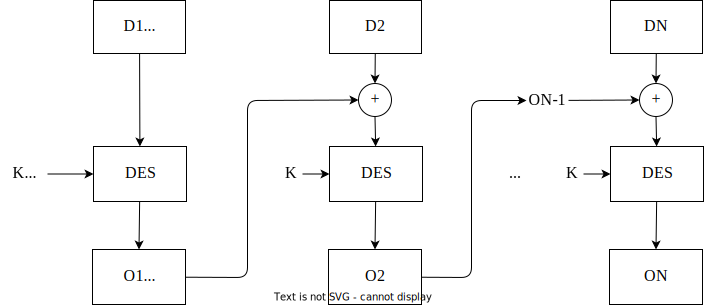
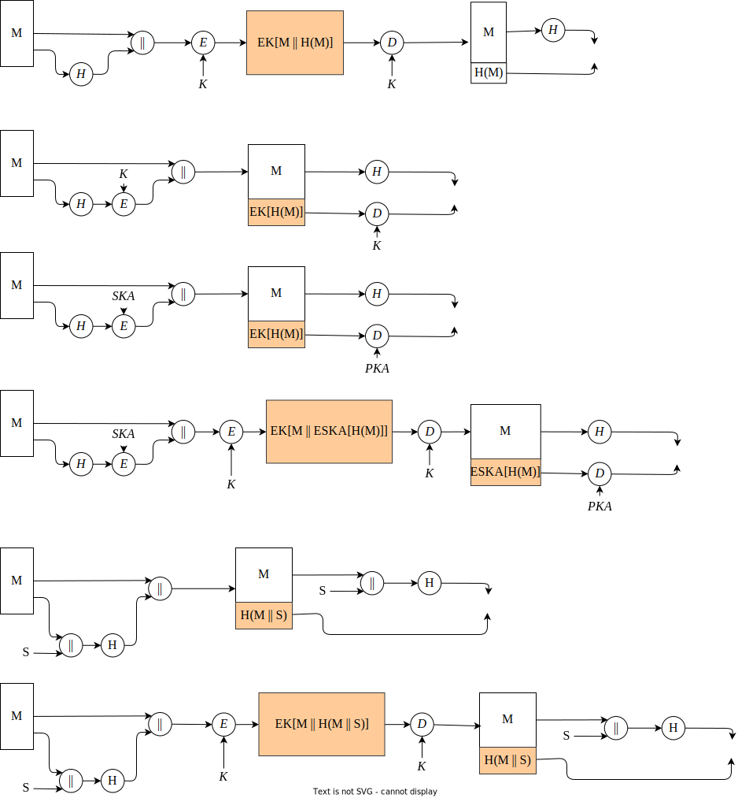

## 6.1. 消息认证码

### 6.1.1. 消息认证码的定义及使用方式

指消息被一密钥控制的公开函数作用后产生的、用作认证符的、固定长度的数值, 或称为密码校验和。

此时需要通信双方 A 和 B 共享一密钥 K 。设 A 欲发送给 B 的消息是 $M$，A 首先计算 $\text{MAC}=C_K(M)$，其中 $C_K$ 是密钥控制的公开函数，然后向 B 发送 $M \parallel \text{MAC}$，B 收到后与 A 做相同的计算，求得一个新 MAC，并与收到的 MAC 比较。

如果仅收发双方知道 K，且 B 计算得到的 MAC 与接收到的 MAC 一致，则这一就实现了以下功能

1. 接收方相信发送方发来的消息未被篡改
2. 接收方相信发送方不是冒充的

MAC 函数与加密算法类似，不同之处为 MAC 函数==不必是可逆的==，因此与加密算法相比更不易被攻破。

上述过程中，由于消息本身在发送过程中是明文形式，所以这一过程==只提供认证性而未提供保密性==。

### 6.1.2. 产生 MAC 的函数应满足的要求

> [!hint]
> - 消息认证码的穷搜索攻击的代价比使用相同长度密钥的加密算法的穷搜索攻击还要大。
>     - 已知 $M \parallel C_K(M)$，找 $K$
>     - 攻击者可以假冒发假消息 $M^\prime \parallel C_K (M^\prime)$ 给接收方
> - 有些攻击法却不需要寻找产生 MAC 所使用的密钥

攻击 MAC (找 $K$): 设密钥长度为 $k$，MAC 长度为 $n$，$k>n$

1. 第一轮，已知 $M_1$，$\text{MAC}_1$ ，其中 $\text{MAC}_1 = C_K(M_1)$。对所有 $2^k$ 个可能的密钥计算 $\text{MAC}_i = C_{K_i}(M_1)$，得 $2^{k-n}$ 个可能的密钥
2. 第二轮，已知 $M_2$，$\text{MAC}_2$ ，其中 $\text{MAC}_2 = C_K(M_2)$。对所有 $2^k$ 个可能的密钥计算 $\text{MAC}_i = C_{K_i}(M_2)$，得 $2^{k-2n}$ 个可能的密钥

如此下去，如果 $k = \alpha n$，则上述攻击方式平均需要 $\alpha$ 轮。例如密钥长度为 80 比特，MAC 长为 32比特，则第 1 轮产生大约 $2^{48}$ 个可能的密钥，第 2 轮产生 $2^{16}$ 个可能的密钥，第 3 轮即可找出正确的密钥。

### 6.1.3. 数据认证算法

数据认证算法是最为广泛使用的消息认证码中的一个。==算法基于 CBC 模式的 DES 算法==，其初始向量取为零向量。需被认证的数据被分为 64 比特长的分组 $D_1, D_2, \cdots, D_N$，其中最后一个分组不够 64 比特的话，可在其右边填充一些 0，然后按以下过程计算数据认证码

数据认证码取值为下面二者选一

- $O_N$
- $O_N$ 的最左 $M$ 个比特，$16 \leqslant M \leqslant 64$

## 6.2. 哈希函数

### 6.2.1. 哈希函数的定义及使用方式

哈希（杂凑）函数 $H$ 是一公开函数：用于将任意长的消息 $M$ 映射为较短的、固定长度的一个值 $H(M)$，作为认证符。

> 称函数值 $H(M)$ 为哈希值、哈希码、消息摘要，hash 值、散列值

哈希码是消息中所有比特的函数，因此提供了一种==错误检测能力==，即改变消息中任何一个比特或几个比特都会使哈希码发生改变。

> [!note] 在信息安全方面的应用
> 
> - 文件校验
> - 数字签名
> - 认证

### 6.2.2. 哈希函数应满足的条件

1. 函数的输入可以是任意长。
2. 函数的输出是固定长。
3. 已知 $x$，求 $H(x)$ 较为容易，可用硬件或软件实现。
4. 已知 $h$，求使得 $H(x)=h$ 的 $x$ 在计算上是不可行的，这一性质称为函数的单向性，称 $H(x)$ 为==单向哈希函数==。
5. 已知 $x$，找出 $y(y \ne x)$ 使得 $H(y)=H(x)$ 在计算上是不可行的。如果单向哈希函数满足这一性质，则称其为==弱单向哈希函数==。（找不出两条不同消息的 Hash 值相等）
6. 找出任意两个不同的输入 $x,y$，使得 $H(y)=H(x)$ 在计算上是不可行的。==强单向哈希函数==。（用于抵抗生日攻击）

### 6.2.3. 生日攻击

> 不知道考不考诶

## 6.5 HMAC

HMAC (Hash-based Message Authentication Code): HMAC 是==密钥相关的哈希运算消息认证码==，HMAC 运算利用哈希算法，以一个密钥和一个消息为输入，生成一个消息摘要作为输出。

[[#6 1 3 数据认证算法]] 的数据认证算法，反映了传统上构造 MAC 最为普遍使用的方法，即==基于分组密码的构造方法==。但近年来研究构造 MAC 的兴趣已转移到==基于密码哈希函数的构造方法==，这是因为：

- 密码哈希函数（如 MD5，SHA）的软件实现快于分组密码（如 DES）的软件实现。
- 密码哈希函数的库代码来源广泛。
- 密码哈希函数没有出口限制，而分组密码即使用于 MAC 也有出口限制。

哈希函数并不是为用于 MAC 而设计的，由于哈希函数不使用密钥，因此不能直接用于MAC

[[# 6 5 HMAC]]
