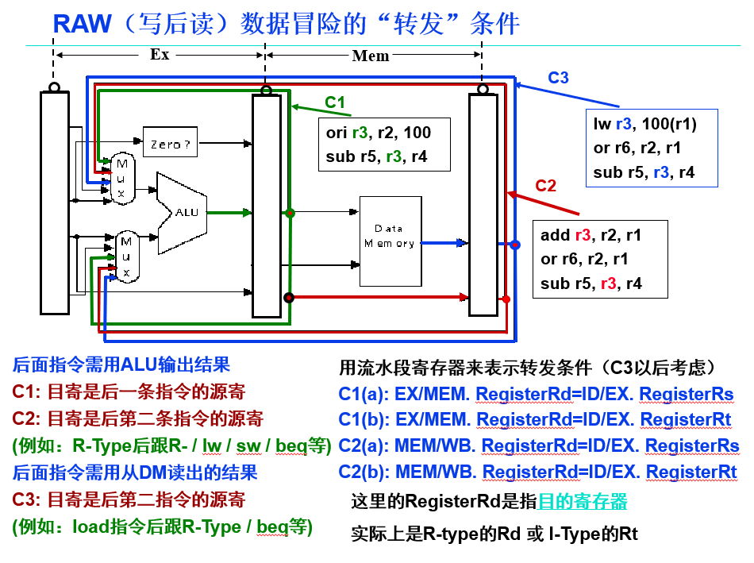
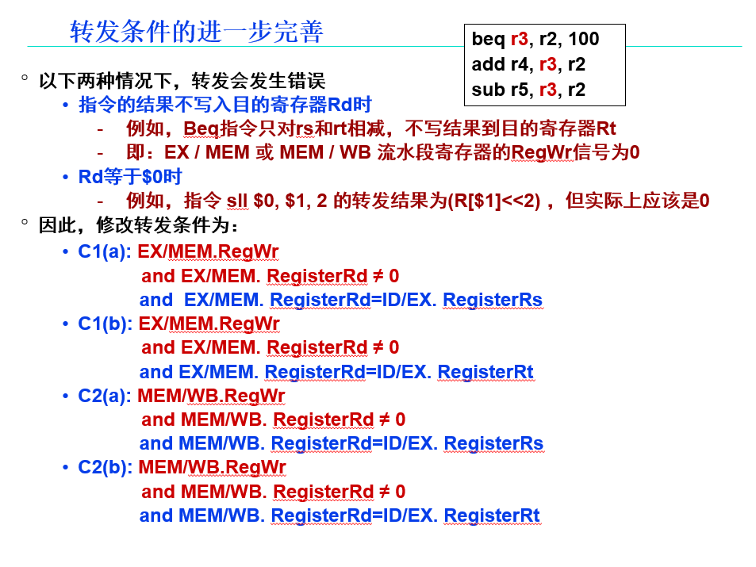
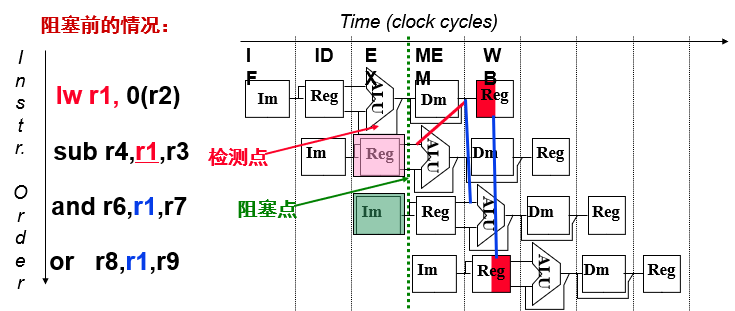

## DONE

### 单周期数据通路

- ALU
- 32 个 32 位寄存器
- 数据存储器
- 取指令
- 控制器

### Verilog 相关

- 读取十六进制文本为内存中的数据
```verilog
initial begin
	$readmemh(filePath, localRegister, startAddr, endAddr);
end
```
- 使用命令行进行仿真
```shell
iverilog -o testbench testbench.v  # 编译 testbench
vvp testbench                      # 运行，即仿真
gtkwave wave.vcd                   # 查看波形
```
- `reg [31:0] Mem [63:0]` 的含义
  表示 32 位的寄存器组，共有 64 个寄存器单元，即==前面表示存储单元宽度==，==后面表示存储单元个数==


### 汇编代码转 16 进制代码

通过 python 字符串处理以及正则表达式将 MIPS 的 11 条汇编指令代码翻译为 32 位机器码

## TODO

### 1. 流水线数据通路

#### 核心部件

##### 4 个部件

- IUnit
- RFile
- ExecUnit
- DataMem

##### 4 个状态寄存器 + PC

| 寄存器     | 需要保存的状态                |
| ---------- | ----------------------------- |
| PC Reg     | PC,newpc                      | 
| IF/ID Reg  | PC+4,Instruction              |
| ID/Ex Reg  | PC+4,Imm,Rt,Rd,busA,busB      |
| Ex/Mem Reg | PC+4,Zero,busB,Result,RtRdDst |
| Mem/Wr Reg | DataOut,Result,RtRdDst        |

### 2. 控制冒险（采用静态分支预测的方法）

#### 2.1. Branch & Zero

在 beq 指令中，原本需要运行到 exec 周期结束时，才能得到 Zero 信号，但如果在前面的 Reg/Dec 阶段，将==从 Rs, Rt 中取出的数进行异或，得到的结果每位或，就可以得到 Zero 的信号==。也就是说，在==先一个周期==就可以提前得到这个信号，判断是否需要解决。与此同时，branch 的新地址已经送到 newpc 处。

此时，beq 的下一条指令还在 IFetch 阶段，得到了这一条指令。如果 beq 需要跳转，则将这一条已经取出的指令进行 bubble 处理，即==只需去除一条指令==，接下来的指令不会受到影响

> [!note] 本部分来自 ppt
> - 缩短分支延迟，减少错误预测代价
> 	- 可以将 “转移地址计算”和“分支条件判断”操作调整到 ID 阶段来缩短延迟
> 		- 将转移地址生成从 MEM 阶段移到 ID 阶段，可以吗？为什么？
>       		是可能的：IF/ID 流水段寄存器中已经有PC的值和立即数）
> 		- 将“判 0”操作从 EX 阶段移到 ID 阶段，可以吗？为什么？
>       			用逻辑运算(如，先按位异或，再结果各位相或)来直接比较Rs和Rt的值）
>      			（ 简单判断用逻辑运算，复杂判断可以用专门指令生成条件码）
>      			（许多条件判断都很简单）			
> - 预测错误的检测和处理（称为“冲刷、冲洗” -- Flush）
> 	- 当 Branch=1 并且 Zero=1 时，发生转移（taken）
> 	- 增加控制信号：IF.Flush=Branch and Zero，取值为 1 时，说明预测失败
> 	- 预测失败 (条件满足) 时，完成以下两件事（延迟损失时间片C=1时）：
> 		- 将转移目标地址->PC
> 		- 清除 IF 段中取出的指令，即：将 IF/ID 中的指令字清 0，转变为 nop 指令

##### 2.1.1. Branch & Zero 信号和目标地址的生成

该部分在 IF/ID 之后完成

```verilog
// PC+4 和 imm16 在 IF/ID 寄存器出现
wire [31:0] bz_target_ahead;
wire [31:0] imm32_ahead;
extender ext_bz_ahead(
	.im		(si_im),
	.ExtOp	(ExtOp),
	.Im		(imm32_ahead)
);
assign bz_target_ahead = if_id_pc_inc_out + (imm32_ahead << 2);

// Branch 在 Controller 中给出
// Zero 通过异或给出
wire zero_ahead;
wire bz_ahead;
assign zero_ahead = (busA ^ busB) == 31'b0;
assign bz_ahead = zero_ahead & Branch;
```

得到这两条信号 `bz_target_ahead`，`bz_ahead` 之后，将这两根线替换掉原来在 Exec 部件之后生成的 Branch 信号线。

#### 2.2. Jump

当 jump 指令到来，且得到需要真正跳转的信号时，下一条指令恰好在 IFetch 阶段，与此同时新的 PC 已经被送到 upc 部件。因此，该过程需要==对这一条已经在 IF 阶段的指令==进行 bubble 处理。

##### 2.2.1. Jump 信号和地址的生成

该部分在 IF/ID 之后完成

```verilog
// Jump 信号在 Controller 中给出
// jump_target_pc 目标地址通过 PC 高 4 位，指令 26 位立即数，两个 0 拼接而成
wire [31:0]  jump_target_pc;
assign jump_target_pc = {u_pc_pc_out[31:28], Instruction[25:0], 2'b00};
```

得到 `Jump` 信号和 `jump_target_pc` 后，将这两根线替换原来在 Exec 部件之后和 Branch 信号线通过 mux 得到的线。

#### 2.3. 等一下，似乎有什么可以并在一起的处理

在上面的讨论中，BZ 和 Jump 在跳转时均需要 bubble 下一个周期的指令，也就是说，可以定义一个 IF_flush 指令，`IF_flush = bz | Jump`，用于控制 IF/ID 寄存器的一次 bubble，以合并一部分处理。

另外，`PC+4`, `bz_target_ahead`, `jump_target_pc` 似乎可以用一个 32 位 `mux3to1` 多路选择器来选择。

##### 2.3.1. IF_flush 和下一条指令的 bubble

```verilog
wire IF_flush;
assign IF_flush = bz_ahead | Jump;
assign if_id_bubble = IF_flush;  
// 暂时先这么写，在之后或许会碰到其他的信号，也需要控制这个 bubble 信号
```

### 3. 数据冒险

#### 3.1. 连续需要用到同一个寄存器的数据冒险


图中，若按照单周期的处理方式，仅能使得最后一条指令得到正确的结果。通过寄存器、存储器的==前半周期写，后半周期读==，解决了部分的冒险，可以使第 4 条指令也能够取到正确的数。

图中的第二、第三条指令在没有冒险处理的情况下无法得到正确的数，因此需要==转发==来处理冒险。

> [!note] 转发（Forwarding 或 Bypassing 旁路）技术
> 
> - 若相关数据是ALU结果，则如何？
>   - 可通过转发解决
> - 若相关数据是上条指令 DM 读出内容，则如何？（Load-use 数据冒险）
>   - 不能通过转发解决，随后指令需==被阻塞一个时钟==或加 NOP 指令


把数据从流水段寄存器中直接取到 ALU 的输入端
^data-hazard
1. 第一行指令的 EX 阶段得到的结果，直接转发到第二行指令的 EX 输入端
	- 需要将寄存器 `r_exec_mem` 的 `ex_me_ALUout_out` 转发至 `u_exec` 的 `busA`, `busB` 处。
2. 第一行指令的 DM 阶段读出的结果，转发给第三行指令的 EX 输入端
	- 需要将寄存器 `r_mem_wr` 的 `me_wr_ALUout_out` 转发至 `u_exec` 的 `busA`, `busB` 处。
3. Load-use 中的一部分冒险也通过在这里加入转发线来解决

需要在 ALU 的输入端插入一些多路选择器，选择应当输入的数据。


#### 3.2. Load-use 数据冒险

`lw` 指令需要经过下面的流程才能取到数，数据至少需要在 MEM 阶段之后才能得到。


因此，在上面的示例中，`lw` 指令后紧跟着需要用到的寄存器，则需要使用==转发与延迟结合==的方法才能正确执行，需要延迟一个周期。





##### 3.2.1. 编写 `forward_unit` 模块

为解决数据冒险中 ALU 的多个输入，采用 `forward_unit` 生成多路选择[[#^data-hazard]]

```verilog
output [1:0] forward_a;
output [1:0] forward_b;

wire c1a, c1b, c2a, c2b;

assign forward_a = {c1a, c2a};
assign forward_b = {c1b, c2b};

assign c1a = (ex_me_wb) && (ex_me_Rw != 0) && (ex_me_Rw == id_ex_Rs);
assign c2a = (me_wr_wb) && (me_wr_Rw != 0) && (ex_me_Rw != id_ex_Rs) && (me_wr_Rw == id_ex_Rs);
assign c1b = (ex_me_wb) && (ex_me_Rw != 0) && (ex_me_Rw == id_ex_Rt);
assign c2b = (me_wr_wb) && (me_wr_Rw != 0) && (ex_me_Rw != id_ex_Rt) && (me_wr_Rw == id_ex_Rt);
```

TODO: wb 信号为所有需要写回寄存器的信号的“或”，即 `RegWr`

`forward_a` 和 `forward_b` 用于 `u_exec` 的 `busA` `busB` 的多路选择。
- `forward_a == forward_b = 00` : 原输入 `id_ex_busA_out` `id_ex_busB_out`
- `forward_a || forward_b = 01` : `me_wr_ALUout_out`
- `forward_a || forward_b = 10` : `ex_me_ALUout_out`

```verilog
wire 	[31:0]	forward_a_target;  // busB 输入端类似

mux3to1 #(
	.k 		(32)
) m_forward_a (
	.U		(id_ex_busA_out),
	.V		(me_wr_ALUout_out),
	.W		(ex_me_ALUout_out),
	.Selm	(forward_a),
	.F		(forward_a_target)
);
```

##### 3.2.2. 编写 `hazard_detection_unit` 模块

硬件阻塞方式，需要判断何时进行阻塞
- 前面为 `lw` 指令，并且前面指令的目的寄存器等于当前刚取出指令的源寄存器，即 `stall = id_ex_MemtoReg && (id_ex_Rt == if_id_Rs || id_ex_Rt == if_id_Rt)`



如何修改数据通路实现阻塞
- 检测“阻塞”过程中
	- sub 指令在 IF/ID 寄存器中，并正被译码，控制信号和 Rs/Rt 的值将被写到 ID/EX 段寄存器
	- and 指令地址在 PC 中，正被取出，取出的指令将被写到 IF/ID 段寄存器中
- 在阻塞点，必须将上述两条指令的执行结果清除，并延迟一个周期执行这两条指令
	- 将 ID/EX 段寄存器中所有控制信号清 0 ，插入一个“气泡” （bubble ID/Ex.Reg signals）
	- IF/ID 寄存器中的信息不变（还是 sub 指令），sub 指令重新译码执行（stall IF/ID.Reg）
	- PC 中的值不变（还是 and 指令地址），and 指令重新被取出执行（stall PC）

```verilog
module hazard_detection_unit (
	input	[4:0]	id_ex_Rt,
	input	[4:0]	if_id_Rs,
	input	[4:0]	if_id_Rt,
	input	    	id_ex_MemtoReg,
	output 			stall_out
);
	assign stall_out = id_ex_MemtoReg && 
		(id_ex_Rt == if_id_Rs || id_ex_Rt == if_id_Rt);
endmodule
```

