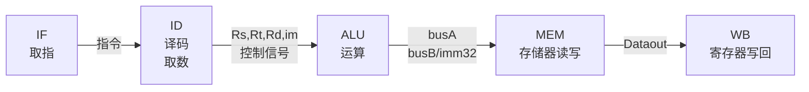

## 1. 五级流水线运行流程

### 1.1. 单周期运行流程回顾



### 1.2. 流水线 CPU 的运作

#### 1.2.1. 工作流程

与单周期的流程类似，但将时钟周期缩短，每个周期都只完成一个部件的工作，系统最繁忙时刻可以在同一时刻同时运行 5 条流水线指令，提高了指令的吞吐量。

由于不同指令对于每个部件都有不同的使用区间，所以为了避免不同指令在同一时间对同一部件的访问，使得流水线顺利的运行，需要做到以下两点：

- 每个功能部件每条指令只能用一次（如：写口不能用两次或以上）
- 每个功能部件必须在相同的阶段被使用（如：写口总是在第五阶段被使用）

所以将所有指令都扩充到需要 5 个时钟周期来完成，每个时钟周期的长度由执行时间最长的那一个部件来决定。

![[public/computer_design/Pasted_image_20211027142548.png]]

与此同时，在上述流程图中，仍然存在在 cycle 5 周期内，同时有指令 1 和指令 5 对寄存器进行访问，所以，在这里采用**寄存器和存储器的“先写后读”的方式**，来解决**结构冲突**。

#### 1.2.2. 核心部件及寄存器的分布

![[public/computer_design/Pasted_image_20211027143630.png]]

在每个部件后面，都加入状态寄存器，用于保存当前周期当前部件所进行的状态，使得数据能够像流水线一样传递到下一个部件，同时当前部件会接收到新的信号和状态。

#### 1.2.3. 控制信号的给出

![[public/computer_design/Pasted_image_20211027144521.png]]

Controller 控制器在 IF/ID 寄存器之后得到指令，并通过指令得到每个部件的控制信号，将这些信号发给下一级 ID/EX 寄存器，这些信号再经过下级寄存器继续流水发送。

## 2. 五级流水线 CPU 组成部件

### 2.1. 核心部件

| 部件名   | 作用                                                                                     |
| -------- | ---------------------------------------------------------------------------------------- |
| IUnit    | 用于取指令（包含指令存储器），并完成 PC + 4                                              |
| RFile    | 从寄存器中读取数据，放到 busA 和 busB 中，同时通过 Rd 给出的地址和 busW 将数据写回寄存器 |
| ExecUnit | 执行部件，完成立即数 imm 的扩展和 ALU 运算                                               |
| DataMem  | 将数据存入存储器，根据给定的地址读出数据                                                 |

### 2.2. 状态寄存器及 PC Unit

| 寄存器    | 存放的信号                                                                                              |
| --------- | ------------------------------------------------------------------------------------------------------- |
| u_pc      | `pc`                                                                                                      |
| IF/ID.reg | `pc+4`, `instruction`                                                                                       |
| ID/EX.reg | `ExtOp`, `ALUSrc`, `ALUOp`, `RegDst`, `MemWr`, `Branch`, `MemtoReg`, `RegWr`,<br>`Rs`, `Rt`, `Rd`, `busA`, `busB`, `imm`, `pc+4`, `jump`, `jump_target` |
| EX/ME.reg | `MemWr`, `Branch`, `MemtoReg`, `Target`, `Zero`, `ALUout`, `busB`, `Rd`, `jump`, `jump_target`                                       |
| ME/WB.reg | `Dataout`, `Rd`, `ALUout`, `MemtoReg`, `RegWr`                                                                        | 

### 2.3. 控制器 Controller

通过传入的指令，生成一系列控制信号。

| 控制信号    | 含义                                 |
| ----------- | ------------------------------------ |
| `RegWr`       | 寄存器写回                           |
| `RegDst`      | 目的寄存器                           |
| `MemtoReg`    | 存储器写回寄存器                     |
| `MemWr`       | 写入存储器                           |
| `Branch`      | `beq` 跳转                             |
| `Jump`        | `jump` 跳转                            |
| `ExtOp`       | 立即数带符号/无符号扩展              |
| `ALUctr[2:0]` | ALU 选择运算方式                     | 
| `ALUSrc`      | 控制 ALU inputB 的输入源 (`busB/imm32`) |

### 2.4. 存储器

| 部件名                   | 作用                                                                                                                                |
| ------------------------ | ----------------------------------------------------------------------------------------------------------------------------------- |
| InstructionMem           | 指令存储器，被 IUnit 模块调用；在初始化时提前放入指令                                                                               |
| DataMem (包含在核心部件) | 数据寄存器，输入 `ALUout` 作为地址，并输出存储器内数据；同时通过 `MemWr` 信号控制是否从 `Datain` 口存入数据；在初始化时提前放入数据 | 

### 2.5. 数据通路 DataPath

将 PC，取指令模块 IUnit，IF/ID 寄存器，取数译码模块 RFile，ID/EX 寄存器，执行模块 ExecUnit，EX/ME 寄存器，数据存储器 DataMem，ME/WB 寄存器组合，成为流水线数据通路。

### 2.6. 顶层模块 Pipeline

由 **DataPath 模块** 和 **Controller 模块** 组成。

DataPath 输出从取指令模块得到的指令，接收 Controller 发出的一系列控制信号。

Controller 接收 DataPath 发出的指令，发出从指令中翻译得到的一系列控制信号。

### 2.7. 测试模块 testbench

包含一个顶层模块 Pipeline，向其中输入 clk 和 run 信号。同时，通过 `$dumpfile` 和 `$dumpvars` 命令将波形引出。

### 2.8. 冒险检测控制部件

#### 2.8.1. 数据冒险

| 部件名                   | 作用                                                                                                      |
| ------------------------ | --------------------------------------------------------------------------------------------------------- |
| hazard_detection_unit    | 检测是否有 Load-use 数据冒险，若有则发出 `stall` 信号                                                     |
| forwarding_unit          | 读取并检测几个状态寄存器的 Rs, Rt, Rd，判断是否需要转发，给出 `forward_a[1:0]` 和 `forward_b[1:0]` 信号 |
| mux_foraward_a (mux3to1) | 通过 `forward_a` 从 `id/ex.busA`, `me/wr.ALUout`, `ex/me.ALUout` 3 个信号中选择正确的 ExecUnit A 口输入             | 
| mux_foraward_b (mux3to1) | 与 mux_foraward_a 类似，选择 ExecUnit 的 B 口的输入                                                                                                  |

#### 2.8.2. 控制冒险

| 部件名                | 作用                                                  |
| --------------------- | ----------------------------------------------------- |
| mux_real_pc (mux3to1) | 从 `pc+4`, `bz_target`, `jump_target` 中选出下一条 PC |
| bz_target_ahead       | 提前计算 `Branch` 跳转指令的目标 PC                   |
| jump_target           | 计算 `Jump` 跳转指令的目标 PC                         | 

## 3. 冒险处理

### 3.1. 冒险分析

在上述流水线 CPU 的构件中，简单地按照流程顺序将部件连接起来，能够使得每一条指令都能运行起来，但是出现了以下的问题。

#### 3.1.1. 数据冒险

#### 3.1.1.1. 第一条指令的目的寄存器还未写入新值，后面的指令需要用到该寄存器的值

![[public/computer_design/Pasted_image_20211027151747.png]]

图中，若按照单周期的处理方式，仅能使得最后一条指令得到正确的结果。通过寄存器、存储器的**前半周期写，后半周期读**，解决了部分的冒险，可以使第 4 条指令也能够取到正确的数。

图中的第二、第三条指令在没有冒险处理的情况下无法得到正确的数，因此需要**转发**来处理冒险。

#### 3.1.1.2. Load 指令引起的数据冒险

![[public/computer_design/Pasted_image_20211027151035.png]]

`lw` 指令需要经过上面的流程才能取到数，数据至少需要在 MEM 阶段之后才能得到。因此，在上面的示例中，如果 `lw` 指令后紧跟着需要用到的寄存器，则需要使用**转发与延迟结合**的方法才能正确执行，**需要延迟一个周期**。

#### 3.1.2. 控制冒险

##### 3.1.2.1. `beq` 和 `jump` 跳转指令引起的结构冒险

![[public/computer_design/Pasted_image_20211027153112.png]]

在上图中，`branch & zero` 信号至少需要在 EX/ME 寄存器之后才能出现，如果需要跳转，则会将 `beq` 之后的 3 条无关指令放入 CPU 中运行。跳转之后的指令，如果需要用到寄存器或者存储器中的数据，则有可能发生错误。

`jump` 指令在 IF/ID 寄存器之后，由 Controller 给出，在下一个周期进行跳转。而在跳转时，IF/ID 寄存器中已经放入了 `jump` 的下一条无关指令，同样可能会发生错误。

### 3.2. 冒险处理

#### 3.2.1. 数据冒险（利用转发 Forwarding 或 Bypassing 旁路）技术

在上述的数据冒险中，大致分为两类，并在此给出一些解决方案：
##### 3.2.1.1. 若相关数据是ALU结果，可以通过转发解决
  - 第一行指令的 EX 阶段得到的结果，直接转发到第二行指令的 EX 输入端
    - 需要将 EX/ME 寄存器的 `ex_me_ALUout_out` 转发至 `u_exec` 的 `busA`, `busB` 处。
  - 第一行指令的 DM 阶段读出的结果，转发给第三行指令的 EX 输入端
    - 需要将 ME/WB 寄存器的 `me_wr_ALUout_out` 转发至 `u_exec` 的 `busA`, `busB` 处。

![[public/computer_design/Pasted_image_20211027155159.png]]

##### 3.2.1.2. 若相关数据是上条指令 DM 读出内容（Load-use 冒险），则需要使用转发和阻塞配合实现

`lw` 指令之后，如果下一条指令的源寄存器中包含 `lw` 的目的寄存器，则需要将 DM 中的数据进行转发，并且将下一条指令阻塞一个周期运行，其中包含了寄存器的检测。

![[public/computer_design/Pasted_image_20211027155341.png]]

##### 3.2.1.3. 解决方案

ExecUnit 的两个输入口之前插入三选一数据选择器，从 **寄存器读数**、**ALU 运算结果**、**存储器输出结果** 中选出应当输入的正确结果，数据选择信号为 `forward_a[1:0]` 和 `forward_b[1:0]`，由 **forwarding unit 模块**生成这两个信号。下面为三选一数据选择器选择的数据。

| `forward` | 数据           | 注释           |
| --------- | -------------- | -------------- |
| 00        | ID/EX.`busA/B`   | 寄存器读数     |
| 10        | EX/ME.`ALUout`   | ALU 运算结果   |
| 01        | ME/WR.`Databack` | 存储器输出结果（根据 `MemtoReg` 选择 **ALU 结果**或是**存储器读出结果**） | 

同时，由于 `lw` 指令的冒险也在此合并解决，所以需要添加一个 **数据冒险检测模块 hazard_detection_unit**。该模块检测 `lw` 指令的下一条指令是否用到了 `lw` 的目的寄存器，如果是，则产生的阻塞信号为有效（高电平）。下面修改数据通路实现阻塞。

-   检测“阻塞”过程中
    -   sub 指令在 IF/ID 寄存器中，并正被译码，控制信号和 Rs/Rt 的值将被写到 ID/EX 段寄存器
    -   and 指令地址在 PC 中，正被取出，取出的指令将被写到 IF/ID 段寄存器中
-   在阻塞点，必须将上述两条指令的执行结果清除，并延迟一个周期执行这两条指令
    -   将 ID/EX 段寄存器中所有控制信号清 0 ，插入一个“气泡” （bubble ID/Ex.Reg signals）
    -   IF/ID 寄存器中的信息不变（还是 sub 指令），sub 指令重新译码执行（stall IF/ID.Reg）
    -   PC 中的值不变（还是 and 指令地址），and 指令重新被取出执行（stall PC）

#### 3.2.2. 控制冒险（采用静态分支预测的方法）

##### 3.2.2.1. `Branch & Zero`

在 beq 指令中，原本需要运行到 exec 周期结束时，才能得到 Zero 信号，但如果在前面的 Reg/Dec 阶段，将从 Rs, Rt 中取出的数进行判断，就可以得到 Zero 的信号。也就是说，在先一个周期就可以提前得到这个信号，判断是否需要解决。与此同时，branch 的新地址已经送到 newpc 处。

此时，beq 的下一条指令还在 IFetch 阶段，得到了这一条指令。如果 beq 需要跳转，则将这一条已经取出的指令进行 bubble 处理，即只需**去除一条指令**，接下来的指令不会受到影响。

```verilog
// PC+4 和 imm16 在 IF/ID 寄存器出现
wire [31:0] bz_target_ahead;
wire [31:0] imm32_ahead;
extender ext_bz_ahead(
	.im		(si_im),
	.ExtOp	(ExtOp),
	.Im		(imm32_ahead)
);
assign bz_target_ahead = if_id_pc_inc_out + (imm32_ahead << 2);

// Branch 在 Controller 中给出
// Zero 通过提前运算给出
wire zero_ahead;
wire bz_ahead;
assign zero_ahead = (busA ^ busB) == 31'b0;
assign bz_ahead = zero_ahead & Branch;
```

##### 3.2.2.2. `Jump`

当 jump 指令到来，且得到需要真正跳转的信号时，下一条指令恰好在 IFetch 阶段，与此同时新的 PC 已经被送到 upc 部件。因此，该过程需要对**这一条已经在 IF 阶段的指令进行 bubble 处理**。

```verilog
// Jump 信号在 Controller 中给出
// jump_target_pc 目标地址通过 PC 高 4 位，指令 26 位立即数，两个 0 拼接而成
wire [31:0]  jump_target_pc;
assign jump_target_pc = {u_pc_pc_out[31:28], Instruction[25:0], 2'b00};
```

##### 3.2.2.3. 下地址逻辑的合并

在上述分析之后，可以发现，`beq` 和 `jump` 指令均需要阻塞一条指令，因此，可以定义一个 `IF_flush` 信号，`IF_flush = bz | Jump`，用于控制 IF/ID 寄存器的一次 bubble，以合并一部分处理。

最后，使用三选一数据选择器选择 `PC+4`, `bz_target_ahead`, `jump_target_pc` 中正确的 PC 作为下一条指令地址。

| `{Jump,bz_ahead}` | 选择的数据线    | 注释            |
| ----------------- | --------------- | --------------- |
| 00                | IF/ID.`PC_inc`    | PC+4            |
| 01                | `bz_target_ahead` | `beq` 跳转地址  |
| 10                | `jump_target_pc`  | `jump` 跳转地址 | 

## 4. 仿真分析

### 4.1. MIPS 汇编代码及注释

```asm
lw s1, zero, 0      // s1=1H
lw s2, zero, 1      // s2=fH
add s4, s0, s2      // s4=fH
sub s5, s0, s1      // s5=ffffffffH
add s6, s5, s4      // s6=eH
slt t0, s1, s2      // s1<s2, t0=1
subu s7, s4, s1     // s7=fH-1H=eH
sub s3, s1, s2      // s3=1h-fh=fffffff2H
addiu s4, s5, b     // s4=aH
sltu t1, s7, s3     // (u)s5<(u)s3, t1=1
ori s5, s0, 0F00    // s5=0|f00H=00000f00H
addiu t2, zero, 2   // t2=2H
beq s4, zero, 2     // if (s7==0) goto sw else s7--
sub s4, s4, s1 
sub s4, s4, s1
j c                 // goto line 12
sw s6, zero, 10     // store 
lw s5, zero, 10     // s5=10H
```

### 4.2 波形分析

载入存储器中的数据，并做指令操作。

![[public/computer_design/jz_result1.png]]

`jump` 指令与 `beq` 指令的跳转测试。

![[public/computer_design/jz_result2.png]]

寄存器数据循环递减，直至循环结束，利用 `sw` 指令存数。

![[public/computer_design/jz_result3.png]]

## 5. 体会与总结

本次计算机组成原理课设要求我们设计一个五级流水线的 CPU，同时让我们考虑到了冒险等情况，使我们更加深刻得理解计算机底层的结构和设计逻辑。在实验中，我们掌握了每个部件的功能，各个寄存器在流水线工作中的地位，了解了流水线工作的原理。另外，在流水线工作的过程中，我们也了解到不少状态传递、数据反馈的问题，也了解了一些解决这些问题的方法，提高了查询资料的效率和编程能力。在上学期单周期数据通路的基础上，流水线 CPU 的效率得到了很大的提升。

## 6. 附件（verilog 源代码）

> 全部代码可到 github 查看：<https://github.com/widcardw/cpu-design.git>
