> [!info] 内容
> 1. 存储器的分类
> 2. 层次化存储器的基本结构
> 3. 半导体随机存取存储器
> 	1. SRAM
> 	2. DRAM
> 	3. Flash 存储器
> 4. 主存储器
> 	1. DRAM 芯片和内存条
> 	2. 多模块存储器
> 	3. 主存和 CPU 之间的连接
> 5. 外部存储器
> 	1. 磁盘存储器
> 	2. 固态硬盘 SSD
> 6. 高速缓冲存储器 Cache
> 	1. 基本原理；Cache 与主存之间的映射方式
> 	2. Cache 中主存块的替换算法；Cache 写策略
> 7. 虚拟存储器
> 	1. 虚拟存储器的基本概念
> 	2. 页式虚拟存储器：基本原理、页表、地址转换、TLB
> 	3. 段式虚拟存储器的基本原理；段页式虚拟存储器的基本原理

## 3.1. 存储器概述

### 3.1.1. 分类

#### 1. 按在计算机中的作用分类

- 主存储器（内存储器）
- 辅助存储器（外存储器）
- 高速缓冲存储器

#### 2. 按存储介质分类

- 磁表面存储器（磁带、磁带）
- 磁芯存储器
- 半导体存储器（MOS 型存储器、双极型存储器）
- 光存储器（光盘）

#### 3. 按存取方式

- 随机存储器 RAM
	- 静态 SRAM
	- 动态 DRAM
- 只读存储器 ROM
- 串行访问存储器：需要按其物理位置的先后顺序寻址，包括顺序存取存储器（磁带）与直接存取存储器（磁盘、光盘）

#### 4. 按信息的可保存性分类

- 易失性：断电后存储信息消失，如 RAM
- 非易失性：断电后仍然保持，如 ROM

### 3.1.2. 存储器的性能指标

> [!tip] 3 个主要性能指标
> - 存储容量 = 存储字数 × 字长（如 1M × 8 位）
> - 单位成本 = 总成本 / 总容量
> - 存储速度：数据传输率 = 数据的宽度 / 存储周期
> 	- 存取时间：从启动一次存储器操作到完成该操作所经历的时间
> 	- 存取周期：读写周期 / 访问周期，指存储器进行一次完整的读写操作所需的全部时间
> 	- 主存带宽：数据传输率，每秒从主存进出信息的最大数量

存取时间不等于存储周期，通常存储周期大于存取时间。对任何一种存储器，在读写操作之后，总要有一段内部状态的复原时间。

### 3.1.3. 多级层次的存储系统

为解决存储系统大容量、高速度、低成本 3 个相互制约的矛盾，通常采用多级存储器结构。

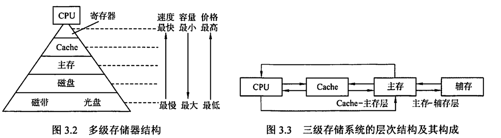

主要思想是上一层的存储器作为低一层存储器的高速缓存。

在主存-辅存层的不断发展中，逐渐形成了虚拟存储系统，在这个系统中程序员编程的地址范围与虚拟存储器的地址空间相对应。对具有虚拟存储器的计算机而言，编程时可用的地址空间远大于主存空间。

## 3.2. 主存储器

主存储器由 DRAM 实现，靠处理器的那一层（Cache）则由 SRAM 实现，它们都属于易失性存储器。DRAM 的每位价格低于 SRAM ，速度也慢于 SRAM 。

### 3.2.1. SRAM 芯片与 DRAM 芯片

#### 1. SRAM 的工作原理

静态 RAM 的存储元是用双稳态触发器（六个晶体管 MOS）来记忆信息的，因此即使信息被读出后，仍然保持原状态而不需要再生。

SRAM 的存取速度快，但集成度低，功耗较大，价格昂贵，一般用于 Cache 。

#### 2. DRAM 工作原理

动态 RAM 是利用存储元电路中栅极电容上的电荷来存储信息的，通常只使用一个晶体管，所以比 SRAM 的密度要高很多。相比 SRAM，DRAM 具有容易集成，价位低，功耗低等优点，但 DRAM 的存取速度比 SRAM 慢，一般用于大容量的主存系统。

DRAM 电容上的电荷一般只能维持 1 ~ 2 ms，因此即使电源不断电，信息也会自动消失，为此每隔一段时间必须刷新，通常取 2 ms，称为刷新周期。常用刷新方式有 3 种：

- 集中刷新：在一个刷新周期内，利用一段固定时间，依次逐一再生，在此期间停止对存储器的读写操作，称为 “死时间”。
- 分散刷新：把对每行的刷新分散到各个工作周期中。这样，一个存储器的系统工作周期分为两部分：前半部分正常读、写或保持，后半部分用于刷新。没有死区，但是加长了系统存取周期，降低了整机的速度。
- 异步刷新：前两种的结合，将刷新周期除以行数，得到两次刷新操作之间的时间间隔 $t$，利用逻辑电路每隔时间 $t$ 产生一次刷新请求。这样避免使 CPU 连续等待过长的时间，而且减少了刷新次数，从根本上提高了整机的工作效率。

> [!caution]
> - 刷新对 CPU 是透明的，即刷新不依赖于外部的访问
> - 动态 RAM 的刷新单位是行，由芯片内部自行生成行地址
> - 刷新操作类似于读操作，但又有所不同
> - 刷新时不需要选片，即整个存储器中的所有芯片同时被刷新

#### 3. DRAM 芯片的读写周期

在读周期中，为使芯片能正确接收行、列地址，在 $\overline{RAS}$ 有效前将行地址送到芯片的地址引脚，$\overline{CAS}$ 滞后 $\overline{RAS}$ 一段时间，在 $\overline{CAS}$ 有效前再将列地址送到芯片的地址引脚，$\overline{RAS}, \overline{CAS}$ 应至少保持 $t_{RAS}$ 和 $t_{CAS}$ 的时间。在读周期中 $\overline{WE}$ 为高电平，并在 $\overline{CAS}$ 有效前建立。

在写周期中，行列选通的时序关系和读周期相同。在写周期中 $\overline{WE}$ 为低电平，在 $\overline{CAS}$ 有效前建立。为保证数据的可靠写入，写数据必须在 $\overline{CAS}$ 有效前在数据总线上保持稳定。

读（写）周期时间 $t_{RC}(t_{WC})$ 表示 DRAM 芯片进行两次连续读（写）操作必须间隔的时间。

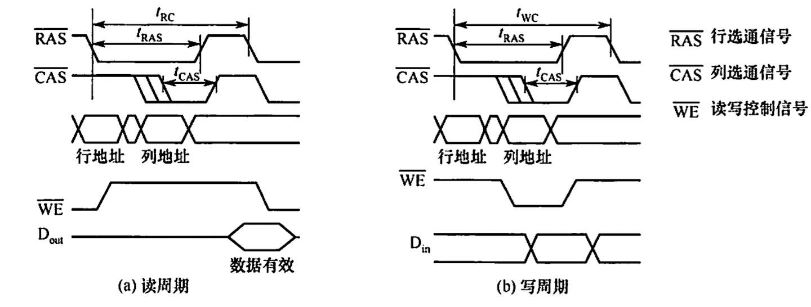

#### 4. SRAM 和 DRAM 比较

|            |   SRAM   |   DRAM   |
|:----------:|:--------:|:--------:|
|  存储信息  |  触发器  |   电容   |
| 破坏性读出 |    否    |    是    |
|  需要刷新  |    否    |    是    |
| 送行列地址 |  同时送  |  分两次  |
|  运行速度  |    快    |    慢    |
|   集成度   |    低    |    高    |
|  存储成本  |    高    |    低    |
|  主要用途  | 高速缓存 | 主机内存 |

#### 5. 存储器芯片的内部结构

存储器芯片由存储体、I/O 读写电路、地址译码和控制电路等部分组成。

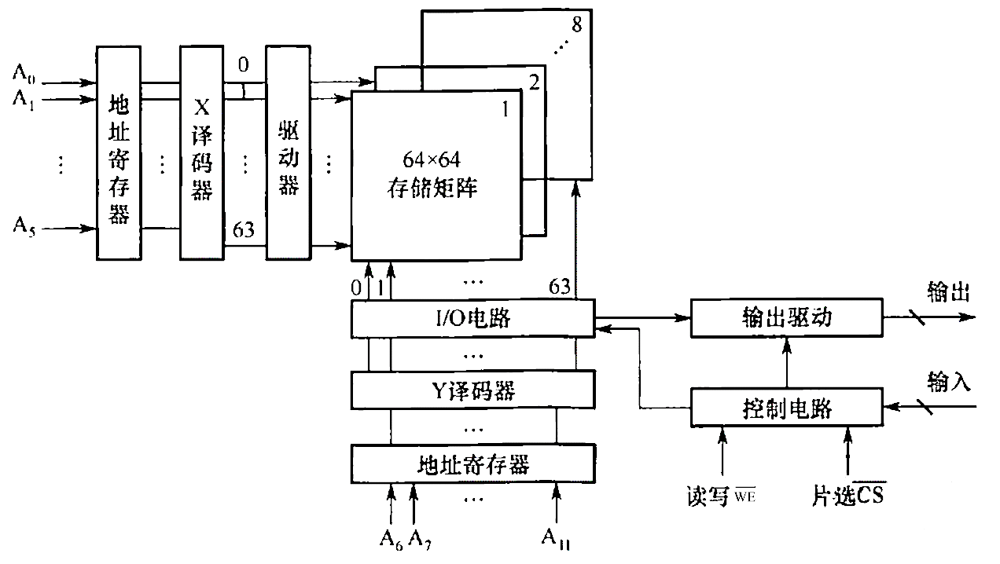

1. 存储体是存储单元的集合，由行选择线 X 和列选择线 Y 来选择所访问的单元，存储体的相同行、列上的位同时被读出或写入
2. 地址译码器，用来将地址转换为译码输出线上的高电平，以便驱动相应的读写电路
3. I/O 控制电路，用以控制被选中的单元的读出或写入，具有放大信息的作用。
4. 片选控制信号。单个芯片容量太小，往往满足不了计算机对存储容量的需求，因此需要用一定量的芯片进行存储器的扩展。访问字时必须选中该存储字所在的芯片，才能从芯片中选到字。
5. 读写控制信号，根据 CPU 给出的读命令或写命令，控制被选中的单元进行读写。

### 3.2.2. 只读存储器

#### 1. ROM 的特点

支持随机存取，一旦有了信息，就不能轻易改变，即使掉电也不会丢失，在计算机系统中是只供读出的存储器。

> [!tip] 优点
> 1. 结构简单，所以密度比可读写存储器的高
> 2. 具有非易失性，可靠性高

#### 2. ROM 的类型

##### 掩模式只读存储器 MROM

内容由制造厂商直接写入，之后任何人无法更改。可靠性高，集成度高，价格便宜，但灵活性差

##### 一次可编程只读存储器 PROM

可以实现一次性编程的只读存储器。允许用户利用专门的设备（编程器）写入自己的程序，一旦写入，无法改变。

##### 可擦除可编程只读存储器 EPROM

可以由用户利用编程器写入信息，而且可以对其内容进行多次改写，但编程次数有限，写入时间过长。

##### Flash 存储器

在 EPROM 和 E$^2$PROM 的基础上发展起来的，特点是既可在不加电的情况下长期保存信息，又能在线进行快速擦除和重写。

##### 固态硬盘 SSD

基于闪存的固态硬盘是用固态电子存储芯片阵列制成的硬盘，由控制单元和存储单元组成。保留了 Flash 存储器长期保存信息、快速擦除与重写的特性，相比传统，读写速度快、低功耗，但价格高。

### 3.2.3. 主存储器的基本组成

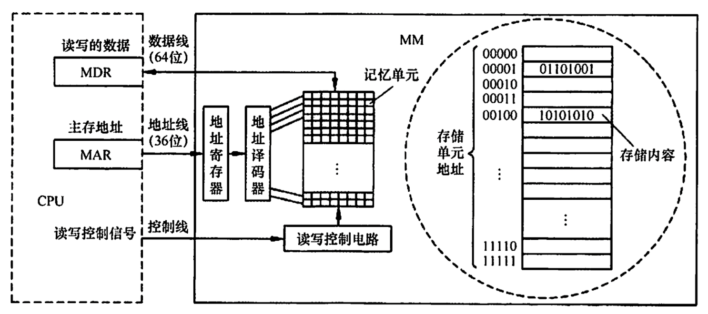

上图为主存储器的基本框图，其中由一个个存储 0 或 1 的记忆单元（存储元件）构成的存储矩阵（存储体）是存储器的核心部分。记忆单元是具有两种稳态的能表示二进制 0 和 1 的物理器件。为了存取存储体中的信息，必须对存储单元编号（编址）。编址单位是指具有相同地址的那些存储元件构成的一个单位，可按字节编址，也可按字编址。现代计算机通常采用字节编址方式。

36 位地址的最大寻址范围是 $0\sim 2^{36}-1$，即地址从 0 开始编号。采用 64 位数据线，在按字节编址方式下，每次最多可存取 8 个单元的内容。芯片总容量为 $2^{36}\times 64$ 位。

DRAM 芯片容量较大，地址位数较多，为了减少芯片的地址引脚数，通常采用地址引脚复用技术，行地址和列地址通过相同的引脚分先后两次输入，这样地址引脚数可以减少一半。

### 3.2.4. 多模块存储器

是一种空间并行技术，利用多个结构完全相同的存储块的并行工作来提高存储器的吞吐率。常用的有单体多字存储器和多体低位交叉存储器。

> CPU 的速度比存储器的快，若同时从存储器中取出 $n$ 条指令，就可充分利用 CPU 资源，提高运行速度，多体交叉存储器就是基于这种思想提出的。

#### 1. 单体多字存储器

存储器中只有一个存储体，每个存储单元存储 $m$ 个字，总线宽度也为 $m$ 个字。一次并行读出 $m$ 个字，地址必须顺序排列并处于同一个存储单元。

单体多字系统在一个存取周期内，从同一地址取出 $m$ 条指令，然后将指令逐条送至 CPU 执行，即每隔 $1/m$ 存取周期，CPU 向主存取一条指令。这提高了单体存储器的工作速度。

> 缺点：指令和数据在主存内必须是连续存放的，一旦遇到转移指令，或操作数不能连续存放，这种方法的效果就不明显。

#### 2. 多体并行存储器

由多体模块组成，每个模块都有相同的容量和存取速度，各模块都有独立的读写控制电路、地址寄存器、数据寄存器。既能并行工作，又能交叉工作。

##### 高位交叉编址（顺序方式）

高位地址表示体号，低位地址为体内地址。

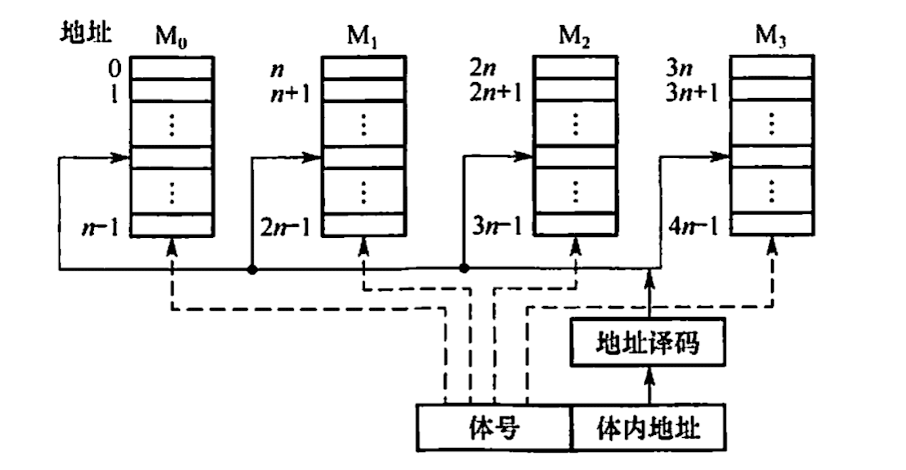

高位交叉方式下，总是把低位的体内地址送到由高位体号确定的模块内进行译码。访问一个连续主存块时，总是先在一个模块内访问，等到该模块访问完才转到下一个模块访问，CPU 总是按顺序访问存储模块，各模块不能被并行访问，不能提高存储器的吞吐率。

##### 低位交叉编址（交叉方式）

低地址为体号，高地址为体内地址。每个模块按 “模 $m$” 交叉编址，模块号 = 单元地址 % $m$，假定有 $m$ 个模块，每个模块有 $k$ 个单元，则 $0,m,\cdots,(k-1)m$ 单元位于 $M_{0}$，$1, m+1, \cdots, (k-1)m+1$ 位于 $M_{1}$。

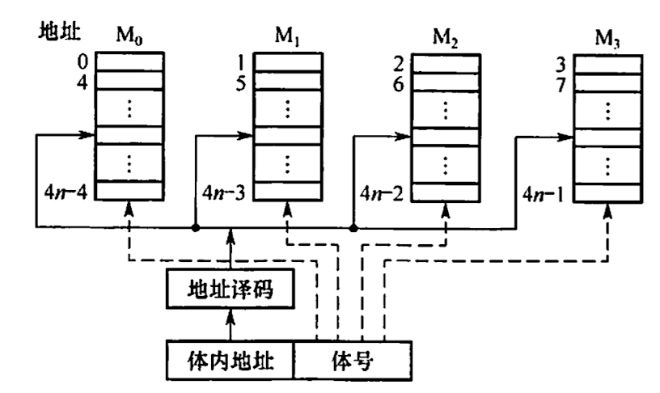

在该方式下，总是把高位的体内地址送到由低位体号确定的模块内进行译码。程序连续存放在相邻模块中，因此称采用此编址方式的存储器为交叉存储器。采用这种方式可在不改变每个模块存取周期的前提下，采用流水线的方式并行存取，提高存储器的带宽。

设模块字长等于数据总线宽度，模块存取一个字的存取周期为 $T$，总线传送周期为 $r$，为实现流水线方式存取，存储器交叉模块数应大于等于 $m=T/r$，$m$ 称为交叉存取度。

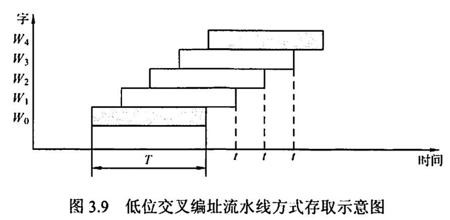

流水线方式连续存取 $m$ 个字所需时间为 $t_{1}=T+(m-1)r$，顺序方式需要 $t_{2}=mT$

## 3.3. 主存与 CPU 的连接

### 3.3.1. 连接原理

1. 主存储器通过数据总线、地址总线、控制总线与 CPU 连接
2. 数据总线的位数与工作频率的乘积正比于数据传输率
3. 地址总线的位数决定了最大内存空间
4. 控制总线（读/写）指出总线周期的类型和本次输入/输出操作完成的时刻

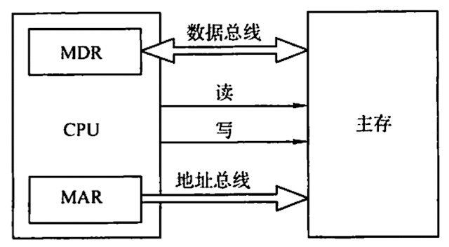

单个芯片的容量不可能很大，往往通过存储芯片扩展技术，将多个芯片集成在一个内存条上，然后由多个内存条及主板上的 ROM 芯片组成计算机所需的主存空间，再通过总线与 CPU 相连。

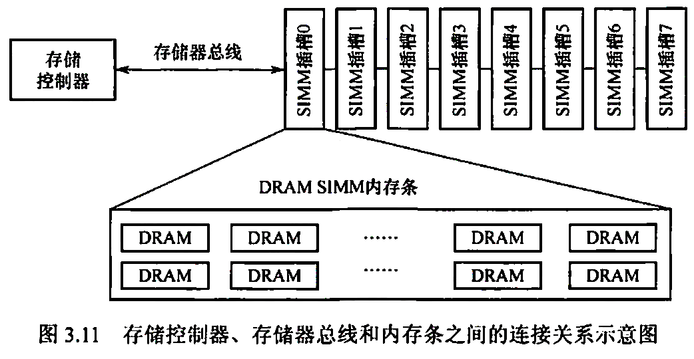

内存条插槽就是存储器总线，内存条中的信息通过内存条的引脚，再通过插槽内的引线连接到主板上，通过主板上的导线连接到 CPU 芯片。

### 3.3.2. 主存容量的扩展

由于单个存储芯片的容量是有限的，它在字数或字长方面与实际存储器的要求都有差距，需要在==字==或==位==两方面进行扩充。

#### 1. 位扩展法

CPU 的数据线数与存储芯片的数据位数不一定相等，此时必须对存储芯片扩位（位扩展，用多个存储器件对字长进行扩充，增加存储字长），使其数据位数与 CPU 的数据线数相等。

连接方式是将多个芯片的地址端、片选端和读写控制端相应并联，数据端分别引出。

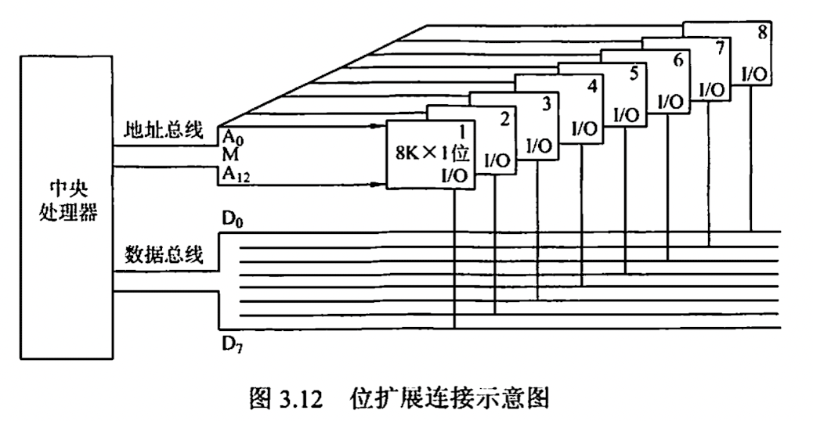

8 片 8K × 1 位的 RAM 芯片组成 8K × 8 位的存储器。8 片的地址线 $A_{12}\sim A_{0}, \overline{CS}, \overline{WE}$ 都分别连在一起，每片的数据线依次作为 CPU 数据线的一位。

> 在某一时刻选中所有芯片，同时取出所有片上的那一个数据，$\overline{CS}$ 要连接到所有芯片

#### 2. 字扩展法

增加存储器中字的数量，位数不变。字扩展将芯片的地址线、数据线、读写控制线相应并联，而由片选信号来区分各芯片的地址范围。

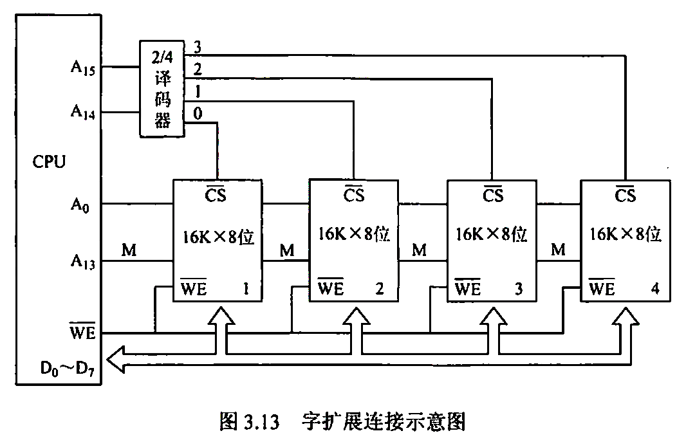

用 4 片 16K × 8 位的 RAM 芯片组成 64K ÷ 8 位的存储器。4 片 RAM 的数据线 $D_{0}\sim D_{7}$ 和 $\overline{WE}$ 都分别连在一起，$A_{15}A_{14}$ 作为片选信号，$A_{15}A_{14}=00$ 时，译码器输出端 0 有效，选中 1 号芯片；其他以此类推。

> 某一时刻只选中部分芯片，通过片选信号 $\overline{CS}$ 或采用译码器设计连接到相应的芯片

#### 3. 字位同时扩展

用 8 片 16K × 4 位的 RAM 组成 64K × 8 位的存储器，每两片构成一组 16K× 8 位的存储器（位扩展），4 组构成 64K × 8 位的存储器（字扩展）。地址线 $A_{15}A_{14}$ 经译码器得到 4 个片选信号，$A_{15}A_{14}=00$ 时，输出端 0 有效，选中第一组芯片；其他以此类推。

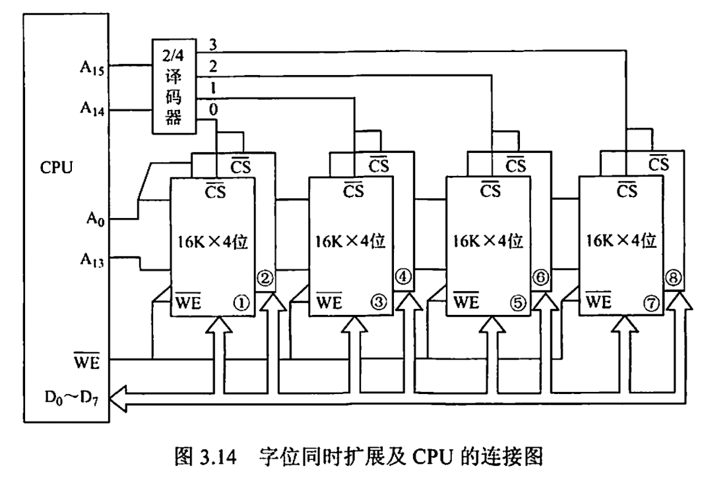

> 采用同时扩展时，各芯片连接地址线的方式相同，但链接数据线的方式不同，且需要通过片选信号 $\overline{CS}$ 或采用译码器设计连接到相应的芯片

### 3.3.3. 存储芯片的地址分配和片选

CPU 要实现对存储单元的访问，首先要片选，然后为选中的芯片按地址码选择相应的存储单元，以进行数据的存取，进行字选。

字选通常由 CPU 送出的 $N$ 条低位地址线完成，地址线直接连接到所有存储芯片的地址输入端。片选信号的产生分为线选法和译码片选法。

#### 1. 线选法

用除片内寻址外的高地址线直接分别接至各个芯片的片选端，当某地址线信息为 0 时，就选中与之对应的存储芯片。这些片选地址线每次寻址时只能有一位有效，不允许同时有多位有效，这样能保证每次只选中一个芯片（组）。

4 片 2K × 8 位存储芯片构成 8K × 8 位存储器，各芯片的片选信号如下，其中低位地址线 $A_{10}\sim A_{0}$ 作为字选线，用于片内寻址。

| 芯片 | $A_{14}\sim A_{11}$ |
|:----:|:-------------------:|
| #0   | 1110                |
| #1   | 1101                |
| #2   | 1011                |
| #3   | 0111                | 

> [!tip] 优缺点
> - 不需要地址译码，线路简单
> - 地址空间不均匀，选片的地址线必须分时为低电平，不能充分利用系统的存储器空间，造成地址的浪费

#### 2. 译码片选法

用除片内寻址外的高位地址线通过==地址译码器==芯片产生片选信号。

8 片 8K × 8 位的存储芯片组成 64K × 8 位的存储器（地址线 16 位，数据线 8 位），需要 8 个片选信号；若采用线选法，除去片内寻址的 13 位地址线，仅余高 3 位，不足以产生 8 个片选信号。因此，采用译码片选法，用一片 74LS138 作为地址译码器，$A_{15}A_{14}A_{13}=000$ 时选中第一片；后面以此类推。

### 3.3.4. 存储器于 CPU 连接

#### 1. 合理选择存储芯片

主要是芯片类型（RAM 或 ROM）和数量。ROM 存放系统程序、标准子程序、常量，RAM 是为用户编程而设置的。

#### 2. 地址块的连接

存储芯片容量不同，地址线数目也不同，CPU 的地址线数往往比存储芯片的地址线数目要多。通常将 CPU 地址线的低位与存储芯片的地址线相连，以选择芯片的某一单元（字选），这部分的译码是由芯片的片内逻辑完成的。

CPU 地址线的高位则在扩充存储芯片时使用，用来选择存储芯片（片选），这部分译码由外接译码器逻辑完成。

#### 3. 数据线的连接

CPU 的数据线与存储芯片的数据线不一定相等，在相等时可以直接连接；不相等时必须对存储芯片扩位，使数据位与  CPU 数据线数相等。

#### 4. 读/写命令线的连接

CPU 的读写命令线一般可直接与存储芯片的读写控制端连接，通常为高电平读，低电平写。有些 CPU 的读写命令线是分开的，此时 CPU 的读命令线与存储芯片的允许读控制端相连，而 CPU 的写，命令线应与存储芯片的允许写控制相连。

#### 5. 片选线的连接

存储器由许多存储芯片叠加而成，那一片被选中取决于该存储芯片的片选控制信号 $\overline{CS}$ 是否能接收到来自 CPU 的片选有效信号。

片选有效信号与 CPU 的访存控制信号 $\overline{MREQ}$ 有关，因为只有当 CPU 要求访存时，才要求选中存储芯片。

## 3.4. 外部存储器

### 3.4.1. 磁盘存储器

> [!tip] 优点
> - 存储容量大，位价格低
> - 记录介质可以重复使用
> - 记录信息可长期保存而不丢失，甚至可以脱机存档
> - 非破坏性读出，读出时不需要再生

> [!bug] 缺点
> - 存取速度慢，机械结构复杂，对工作环境要求高

#### 1. 磁盘存储器

##### 磁盘的组成

1. 硬盘存储器的组成。硬盘存储器由磁盘驱动器、磁盘控制器和盘片组成
	- 磁盘驱动器：核心部件是磁头组件和盘片组件
	- 磁盘控制器：硬盘存储器和主机的接口，主流标准有 IDE、SCSI、SATA
2. 存储区域。一块硬盘有若干记录面，每个记录面划分为若干磁道，而每条磁道又划分为若干扇区，扇区是磁盘读写的最小单位，即磁盘按块存取
	- 磁头数 Heads：即记录面数，表示硬盘共有多少个磁头，磁头用于读出/写入盘片上面记录的信息，一个记录面对应一个磁头
	- 柱面数 Cylinders：表示硬盘每个盘面上有多少磁道。在一个盘组中，不同记录面的相同编号（位置）的各磁道构成一个圆柱面
	- 扇区数 Sectors：表示每条磁道有多少扇区

##### 磁记录原理

> 磁头和磁性记录介质相对运动时，通过电磁转换完成读写操作

编码方法：按某种方案（规律），把一连串的二进制信息变换为存储介质磁层中一个磁化翻转状态的序列，并使读写控制电路容易、可靠地实现转换。

磁记录方式：通常采用调频制 FM 和改进型调频制 MFM 的记录方式。

##### 磁盘的性能指标

1. 记录密度：指盘片单位面积上海记录的二进制信息量，通常是以道密度、位密度、面密度表示。
	- 道密度：沿磁盘半径方向单位长度上的磁道数
	- 位密度：磁道单位长度上能记录的二进制代码位数
	- 面密度：上面两者的乘积
2. 磁盘容量：有格式化容量和非格式化容量之分。
	- 非格式化容量：磁记录表面可利用的磁化单元总数，由道密度和位密度计算而来
	- 格式化容量：按照某种特定的记录格式所能存储的信息的总量，比非格式化容量小
3. 平均存取时间：由寻道时间、旋转延迟时间、传输时间构成。由于寻道和找扇区的距离远近不一，故寻道时间和旋转延迟通常取平均值
4. 数据传输率：磁盘存储器在单位时间内向主机传送数据的字节数。假设磁盘转数为 $r$ 转/秒，每条磁道容量为 $N$ 字节，则数据传输率 $D_{\text{r} } = rN$

##### 磁盘寻址

主机向磁盘控制器发送寻址信息，磁盘的地址一般如下表示

| 驱动器号 | 柱面号 | 盘面号 | 扇区号 |
| -------- | ------ | ------ | ------ |

若系统中有 4 个驱动器，每个驱动器带一个磁盘，每个磁盘 256 磁道、16 盘面，每个盘面划分为 16 个扇区，则每个扇区地址要 18 位二进制代码

| 驱动器号 | 柱面号 | 盘面号 | 扇区号 |
|:--------:|:------:|:------:|:------:|
| 2 位     | 8 位   | 4 位   | 4 位       |

##### 硬盘工作过程

主要操作是寻址、读盘、写盘。每个操作都对应着一个控制字，硬盘工作时，第一步是取控制字，第二步是执行控制字。

硬盘数据机械式部件，其读写操作是串行的，不可能在同一时间既读又写，也不可能在同一时刻读出两组数据。

#### 2. 磁盘阵列

RAID（独立荣誉磁盘阵列）是指将多个独立的物理磁盘组成一个独立的逻辑盘，数据在多个物理盘上分割交叉存储、并行访问，具有更好的存储性能、可靠性、安全性。

- RAID0 无冗余无校验的磁盘阵列，把连续多个数据块交替的存放在不同的物理磁盘的扇区中，几个磁盘交叉并行读写，扩大了存储容量，提高了磁盘数据读取速度，但不具备容错能力
- RAID1 镜像磁盘阵列，两个磁盘同时读写，互为备份
- RAID2 采用纠错的海明码的磁盘阵列
- RAID3 位交叉奇偶校验的磁盘阵列
- RAID4 块交叉奇偶校验的磁盘阵列
- RAID5 无独立校验的奇偶校验磁盘阵列

### 3.4.2. 固态硬盘

SSD 是一种基于闪存技术的存储器。与 U 盘没有本质区别，只是容量更大，存取性能更好。

一个 SSD 由一个或多个闪存芯片和闪存翻译层组成，闪存芯片替代传统旋转磁盘中的机械驱动器，而闪存翻译层将来自 CPU 的逻辑块读写请求翻译成对底层物理设备的读写控制信号，因此，这个闪存翻译层相当于磁盘控制器的角色。

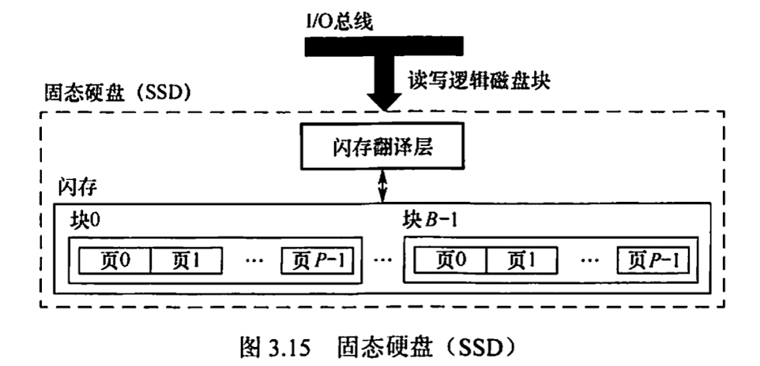

一个闪存由 $B$ 块组成，每块由 $P$ 页组成。通常页的大小是 512 B ~ 4 KB，每块由 32 ~ 128 页组成，块的大小为 16 KB ~ 512 KB。数据是以页为单位读写的。只有在一页所属的块整个被擦除后，才能写这一页。一旦一个块被擦除，块中的每个页都可以直接再写一次。某个块进行了约 10 万次重复写后，就会磨损坏，不能使用。

随机写很慢（擦除块慢，修改已有数据需要重新复制到一个新的块）

> [!tip] 优点
> - 由半导体存储器构成，没有移动的部件，随机访问时间比机械磁盘快很多
> - 没有机械噪声和震动，能耗低，抗震好，安全性高

> [!bug] 缺点
> - 反复写后，闪存块会磨损（实际上，平均磨损逻辑处理好，很多年 SSD 才会磨损）

## 3.5. 高速缓冲存储器

由于程序的转移概率不会很低，数据分布的离散性较大，所以单纯依靠并行主存系统提高主存系统的频宽是有限的。这就必须从系统结构上进行改进，即采用存储体系。

通常将存储系统划分为 ==Cache -主存== 层次和 ==主存-辅存== 层次

> [!tip]
> CPU 与 Cache 之间信息交换的单位是==字==，Cache 与主存之间信息交换的单位是==块==。

### 3.5.1. 程序访问的局部性原理

包括时间局部性和空间局部性。

- 时间局部性：最近的未来要用到的信息，很可能是现在正在使用的信息，因为程序中存在循环。
- 空间局部性：在最近的未来要用到的信息，很可能与现在正在使用的信息在存储空间上是邻近的，因为指令通常是顺序存放、顺序执行的，数据一般也是以向量、数组等形式簇聚存储在一起的。

Cache 利用局部性原理，把程序中正在使用的部分数据存放在一个高速的、容量较小的 Cache 中途，使 CPU 的访存操作大多通过 Cache 进行，从而提高程序的执行速度。

> [!info] 对于下面的程序，哪一个执行更快
> 
> ```c
> // 1
> int sum_array_rows(int a[M[N]) {
> 	int i, j, sum = 0;
> 	for (i = 0; i < M; i++) {
> 		for (j = 0; j < N; j++) {
> 			sum += a[i][j];
> 		}
> 	}
> 	return sum;
> }
> 
> // 2
> int sum_array_cols(int a[M][N]) {
> 	int i, j, sum = 0;
> 	for (j = 0; j < N; j++) {
> 		for (i = 0; i < M; i++) {
> 			sum += a[i][j];
> 		}
> 	}
> 	return sum;
> }
> ```

假定 M, N 都为 2048，按字节编址，每个数组元素占 4 字节。

程序 1 对数组的访问是 `a[0][0], a[0][1], ..., a[0][2047], a[1][0], ...` 访问顺序与存放顺序一致，空间局部性好。

程序 2 对数组的访问是 `a[0][0], a[1][0], ..., a[2047][0], a[0][1], ...` 访问顺序与存放顺序不一致，每次都需要跳过 2048 个元素，没有利用好空间局部性。

对于 for 循环体，循环体内部的代码都被连续执行很多次，时间局部性好。

### 3.5.2. Cache 基本工作原理

Cache 位于存储器层次结构的顶层，通常由 SRAM 构成。

为便于 Cache 和主存之间交换信息，Cache 和主存都被划分为相等的快，Cache 块又称 Cache 行，每块由若干字节组成，快的长度称为块长。Cache 块数远小于主存的块数，仅保存主存中最活跃的若干块的副本。Cache 按照某种策略，预测 CPU 在未来一段时间内欲访存的数据，将其装入 Cache。

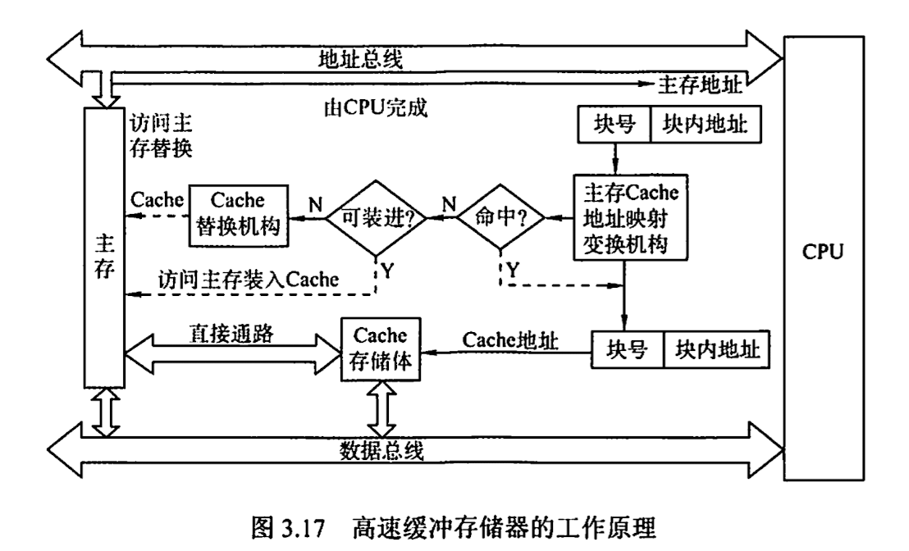

CPU 发出读请求

- 访存地址在 Cache 中命中
	- 将地址转换成 Cache 地址，直接读取 Cache，与主存无关
- Cache 不命中
	- 访问主存，把此字所在的块一次性从主存调入 Cache
	- 若 Cache 已满
		- 根据替换算法替换块

> [!caution]
> CPU 与 Cache 之间的数据交换以字为单位，而 Cache 与主存之间的数据交换以 Cache 块为单位。

当 CPU 发出写请求时，若 Cache 命中，有可能遇到 Cache 与主存中的内容不一致的问题。比如 Cache 已经改变，而主存未改变。所以若 Cache 命中，需要按照一定的写策略处理，常见的处理方法有全写法和回写法。

CPU 欲访问的信息在 Cache 中的比率称为 Cache 的命中率。设一个程序执行期间，Cache 的总命中次数为 $N_{\text{c} }$，访问主存的总次数为 $N_{\text{m} }$，则命中率 $H$ 为

$$
H=\frac{N_{\text{c} } }{N_{\text{c} } + N_{\text{m} } }
$$

设 $t_{\text{c} }$ 为命中时的 Cache 访问时间，$t_{\text{m} }$ 为为命中时的访问时间，$1-H$ 表示未命中率，则 Cache - 主存系统的平均访问时间为

$$
T_{\text{a} }=H t_{\text{c} } + (1-H) t_{\text{m} }
$$

> [!faq] 根据 Cache 的读写流程，实现 Cache 时需要解决以下问题
> - 数据查找：如何快速判断数据是否在 Cache 中
> - 地址映射：主存块如何存放在 Cache 中，如何将主存地址转换为 Cache 地址
> - 替换策略：Cache 满后，使用何种策略对 Cache 块进行替换或淘汰
> - 写入策略：如何既保证主存块和 Cache 块的数据一致性，又尽量提升效率

### 3.5.3. Cache 和主存的映射方式

#### 1. 直接映射

不使用替换算法，实现简单，不够灵活，即使 Cache 的其他许多地址空着也不能占用，冲突率较高。

直接映射的关系可以定义为

<div style="text-align: center;">
Cache 行号 = 主存块号 mod Cache 总行数
</div>

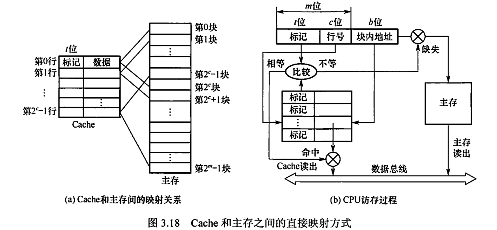

直接映射的地址结构

| 标记 | Cache 行号 | 块内地址 |
| ---- | ---------- | -------- |

- 根据访存地址中间的 c 位，找到 Cache 行，将对应 Cache 行中的标记和主存地址的高 $t$ 位标记比较
	- 若相等且有效位为 1，则命中，依据贮存地址中低位的块内地址，在对应的 Cache 行中存取信息
	- 若不相等或有效位为 0，则不命中，此时 CPU 从主存中读出该地址所在的一块信息送到对应的 Cache 行中，将有效位置 1，并将标记设置为地址中的高 $t$ 位，同时将该地址中的内容送 CPU

#### 2. 全相联映射

主存的每一块可以装入 Cache 中的任何位置，每行的标记用于指出该行取自主存的哪一个块，所以 CPU 访存时需要与所有 Cache 行的标记进行比较。

灵活，冲突率低，命中率高；但标记的比较速度慢，实现成本高。

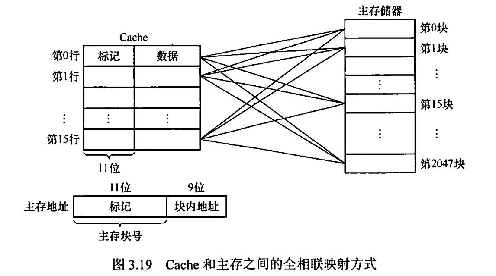

主存地址结构

| 标记 | 块内地址 |
| ---- | -------- |

Cahe 地址结构

| Cache 行号 | 行内地址 |
| ---------- | -------- |

#### 3. 组相联映射

将 Cache 分为 $Q$ 个大小相等的组，每个主存块可以装入固定组中的任意一行，即组间采用直接映射、组内采用全相联映射。

假设每组有 $r$ 个 Cache 行，则称之为 $r$ 路组相联。每组有 2 个 Cache 行，就称为二路组相联。

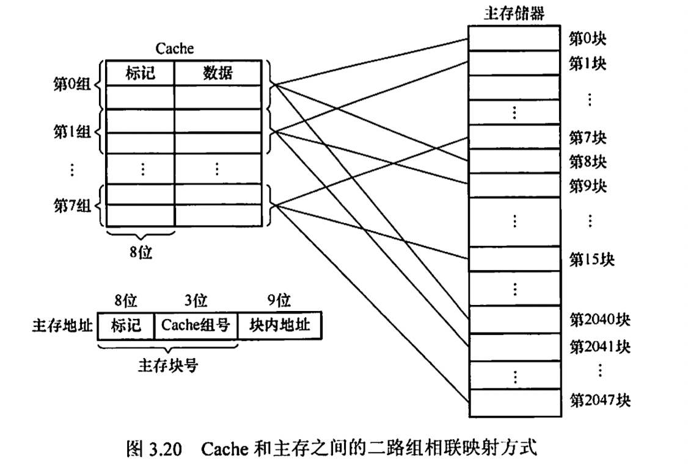

组相联映射关系可以定义为

<div style="text-align: center">Cache 组号 = 主存块号 mod Cache 组数</div>

路数越大，每组 Cache 行的数量越大，发生块冲突的概率越低，但相联比较电路也越复杂。

组相联映射地址结构

| 标记 | 组号 | 块内地址 |
| ---- | ---- | -------- |

> [!tip] 访存过程
> - 根据访存地址中间的组号找到对应的 Cache 组；将对应 Cache 组中每个行的标记与主存地址的高位标记进行比较
> 	- 若有一个相等且有效位为 1，则命中，根据主存地址中的块内地址，在对应 Cache 行中存取信息
> 	- 若都不相等或虽相等但有效位为 0，则不命中，CPU 从主存中读出该地址所在的一块信息送到对应 Cache 组的任意一个空闲行，将有效位置 1，设置标记，同时将该地址中的内容给 CPU

**例 3.4** 假设某个计算机的贮存地址空间大小为 256 MB，按字节编址，其数据 Cache 有 8 行，行长为 64 B

1. 若不考虑用于 Cache 的一致维护性和替换算法控制位，采用直接映射方式，则该 Cache 的总容量为？
2. 若该 Cache 采用直接映射方式，则主存地址为 3200（十进制）的主存块对应的 Cache 行号是多少？采用二路组相联映射时优势多少？
3. 以直接映射方式为例，简述访存过程（设访存地址为 0x0123456 ）。

> [!example] 解答
> - 第 1 问
> 
> 标记字段：主存地址有 28 位 (256 MB = 2<sup>28</sup> B)，其中 6 位为块内地址 (64 B = 2<sup>6</sup> B)，3 位为行号 (8 = 2<sup>3</sup>)，剩余 28 - 6 - 3 = 19 位作为标记字段，总容量为 $8\times(1+19+512)=4256$ 位
> 
> - 第 2 问
> 
> 直接映射方式中，主存按照块的大小划分，主存地址 3200 对应的字块号为 3200 B / 64  B = 50. 而 Cache 只有 8 行，则 50 % 8 = 2，因此行号为 2.
> 
> 二路相联映射方式，实质上是用两个 Cache 行合并，内部采用全相联映射方式，外部采用直接映射方式，50 % 4 = 2，组号为 2，即对应 Cache 的行号为 4 或 5
> 
> - 第 3 问
> 
> 直接映射方式中，28 位贮存地址可分为 19 位主存标记位，3 位块号，6 位块内地址
> 
> | 主存标记位 | 0000 0001 0010 0011 010 |
> |:----------:|:----------------------- |
> | 块号       | 001                     |
> | 块内地址   | 010110                        |
> 
> 首先根据块号，差 Cache 001 行中对应的主存标记位，若相同，继续看有效位，如果是 1，则命中，按块内地址 `010110` 读出 Cache 行所对应的单元并送入 CPU 中，完成访存。
> 
> 若不命中，访问主存将数据取出并送往 CPU 和 Cache 的对应块中，把主存的最高 19 位存入 001 行的 Tag 中，并将有效位置 1.

### 3.5.4. Cache 中主存块的替换算法

采用全相联映射或组相联映射方式时，从主存向 Cache 传送一个新块，当 Cache 或 Cache 组中的空间已被占满时，就需要替换算法置换 Cache 行。

常用有随机算法、先进先出 FIFO 算法、近期最少使用 LRU 算法、最不经常使用 LFU 算法。

1. 随机算法：随机确定替换的 Cache 块，实现简单
2. 先进先出算法：选择最早调入的行进行替换，实现简单，未依据程序访问的局部性原理
3. 近期最少用算法：依据程序局部性原理，选择近期内长久未访问过的 Cache 作为替换的行，平均命中率要比 FIFO 高，是堆栈类算法
4. 最不经常使用算法：将一段时间内被访问次数最少的存储行换出。每行设置一个计数器，新行建立后从 0 开始计数，每访问一次计数值加一，替换时将最小的值换出。

LRU 对每个 Cache 行设置一个计数器，用计数值来记录主存块的使用情况，并根据计数值选择淘汰某个块，计数值的位数与 Cache 组大小有关，2 路时有一位 LRU 位，4 路时有两位 LRU 位。

假定采用四路组相联，有 5 个主存块 {1, 2, 3, 4, 5} 映射到 Cache 的同一组，对于主存访问序列 {1, 2, 3, 4, 1, 2, 5, 1, 2, 3, 4, 5}，采用 LRU 算法的替换过程如下标。

| 计  | 1   | 计  | 2   | 计  | 3   | 计  | 4   | 计  | 1   | 计  | 2   | 计  | 5   | 计  | 1   | 计  | 2   | 计  | 3   | 计  | 4   | 计  | 5   |
| --- | --- | --- | --- | --- | --- | --- | --- | --- | --- | --- | --- | --- | --- | --- | --- | --- | --- | --- | --- | --- | --- | --- | --- |
| 0   | 1   | 1   | 1   | 2   | 1   | 3   | 1   | ==0==   | 1   | 1   | 1   | 2   | 1   | ==0==   | 1   | 1   | 1   | 2   | 1   | 3   | 1   | ==0==   | ==5==   |
|     |     | 0   | 2   | 1   | 2   | 2   | 2   | 3   | 2   | ==0==   | 2   | 1   | 2   | 2   | 2   | ==0==   | 2   | 1   | 2   | 2   | 2   | 3   | 2   |
|     |     |     |     | 0   | 3   | 1   | 3   | 2   | 3   | 3   | 3   | ==0==   | ==5==   | 1   | 5   | 2   | 5   | 3   | 5   | ==0==   | ==4==   | 1   | 4   |
|     |     |     |     |     |     | 0   | 4   | 1   | 4   | 2   | 4   | 3   | 4   | 3   | 4   | 3   | 4   | ==0==   | ==3==   | 1   | 3   | 2   | 3    |

计数器变化规则：

1. 命中时，所命中的行的计数器清零，比其低的计数器加一，其余不变
2. 非命中且还有空闲行时，新装入的行的计数器置 0，其余全加一
3. 未命中且无空闲行时，计数值为 3 的行的信息块被淘汰，新装行的块的计数器置 0，其余全加一

### 3.5.5. Cache 写策略

因为 Cache 中的内容是主存的副本，当对 Cache 中的内容进行更新时，就需选用写操作策略使 Cache 内容和贮存内容保持一致。

对于 Cache 写命中 (write hit)，有两种处理方法

#### 1. 全写法 write through

当 CPU 对 Cache 写命中时，必须把数据同时写入 Cache 和主存。当某一块要替换时，不必把这一块写回主存，用新调入的块直接覆盖即可。

这种方法实现简单，能随时保持贮存数据的正确性。缺点是增加了访问次数，降低了 Cache 的效率。

> [!note] 写缓冲
> 为减少全写法直接写入主存的时间损耗，在 Cache 和主存之间加一个写缓冲 (write buffer)。
> 
> CPU 同时写数据到 Cache 和写缓冲中，写缓冲再控制将内容写入主存。写缓冲是一个 FIFO 队列，写缓冲可以解决速度不匹配问题。但如果频繁写，会使写缓冲饱和溢出。
> 
> 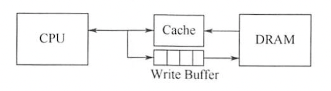

#### 2. 回写法 write back

当 CPU 对 Cache 写命中时，只把数据写入 Cache，而不立即写入主存，只有当此块被换出时才写回主存。这种方法减少了访问次数，但存在不一致的隐患。

为减少写回主存的开销，每个 Cache 行设置一个修改位（脏位）。

- 若修改位为 1，说明对应 Cache 行中的块被修改过，替换时需要写回主存。
- 若为 0，说明对应 Cache 行中的块未被修改过，替换时无须写回主存。

全写法和回写法都对应于 Cache 写命中（要被修改的单元在 Cache 中）时的情况。

对于 Cache 写不命中，有两种处理方法

#### 写分配法 write allocate

加载储存中的块到 Cache 中，然后更新这个 Cache 块。它试图利用程序的空间局部性，但缺点时每次不命中需要从主存中读取一块。

#### 非写分配法 not write allocate

只写入主存，不进行调块。

> 非写分配法通常与全写法何用，写分配法通常与回写法合用。

### \* 多级 Cache

了解即可吧。

## 3.6. 虚拟存储器

主存和辅存共同构成了虚拟存储器，二者在硬件和系统软件的共同管理下工作，对于应用程序员而言，虚拟存储器时透明的。

### 3.6.1. 虚拟存储器的基本概念

虚拟存储器将主存或辅存的地址孔嘉统一编址，形成一个庞大的地址空间，在这个地址空间内，用户可以自由编程，而不必在乎实际的主存容量和程序在主存中实际的存放位置。

用户编程允许设计的地址称为虚地址或逻辑地址，虚地址对应的存储空间称为虚拟空间或程序空间。实际的主存单元地址称为实地址或物理地址，实地址对应的是主存地址空间，也称为实地址空间。虚地址要比实地址大很多。



> - 实地址 = 主存页号 + 页内字地址
> - 虚地址 = 虚拟页号 + 页内字地址
> - 辅存地址 = 磁盘号 + 盘面号 + 磁道号 + 扇区号

CPU 使用虚地址时，由辅助硬件找出虚地址和实地址之间的对应关系，并判断这个虚地址对应的存储单元内容是否已装入主存。

- 若已在，则通过地址变换，CPU 可直接访问主存指示的实际单元
- 若不在，则把包含这个字的一页或一段调入主存后再由 CPU 访问。
- 若主存已满，则采用替换算法置换主存中的交换块（即页面）

虚拟存储页采用 Cache 类似的技术，将辅存中经常访问的数据副本存放在主存中。==缺页==而访问辅存的代价很大。

### 3.6.2. 页式虚拟存储器

页式虚拟存储器以页为基本单位。虚拟空间与主存空间都被划分为同样大小的页，主存的页称为实页、页框，虚存的页称为虚页。

把虚拟地址分为两个字段：虚页号和业内地址。

虚拟地址到物理地址的转换是由页表实现的。页表是一张存放在主存中的虚页号和实页号的对照表，它记录程序的虚页调入主存时被安排在主存中的位置。页表一般长久的保存在内存中。

#### 1. 页表

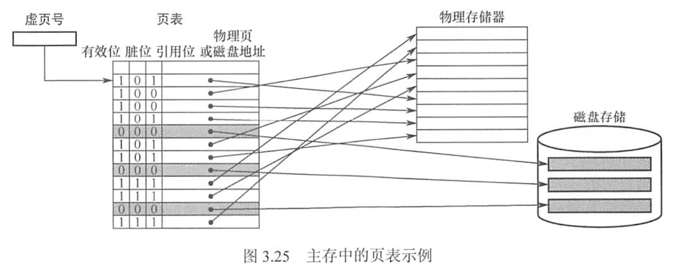

- 有效位
- 脏位：表示页面是否被修改过，虚存机制中采用回写策略，利用脏位可以判断替换时是否需要写回磁盘
- 引用位：配合替换策略进行设置，实现 FIFO 或 LRU 策略等

CPU 执行指令时，需要先将虚拟地址转换为主存物理地址。页表基址寄存器存放进程的页表首地址，然后根据虚拟地址高位部分的虚拟页号找到对应的页表项。

- 若装入位为 1，则取出物理页号，和虚拟地址低位部分的页内地址==拼接==，形成实际物理地址
- 若装入位为 0，需要操作系统进行==缺页==处理

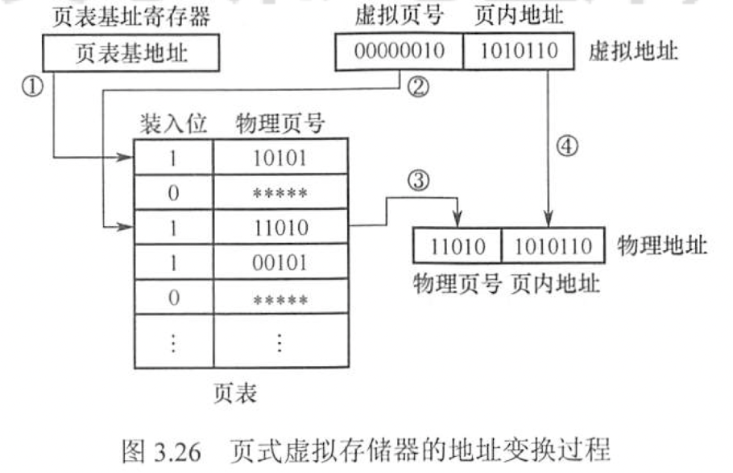

> [!tip] 优缺点
> - 页面长度固定，页表简单，调入方便
> - 由于程序不可能正好是页面的整数倍，最后一页的零头将无法利用而造成浪费，并且页不是逻辑上独立的实体，所以处理、保护、共享都不如段式虚拟存储器方便

#### 2. 快表 TLB

由地址转换过程可知，访存时先访问一次主存去查页表，再访问主存才能取得数据。如果缺页，那么还要进行页面替换、页面修改等，因此采用虚拟存储机制后，访问主存的次数更多了。

依据程序执行的局部性原理，在一段时间内总是经常访问某些页时，若把这些页对应的页表项放在高速缓冲器组成的快表中，可以明显提高效率。相应地把放在主存中的页表称为慢表。在地址转换时，如果 TLB 命中，则无需再访问主存中的页表。

快表通常使用全相联或组相联方式。每个 TLB 项由页表表项内容加上一个 TLB 标记字段组成，TLB 标记用来表示该表项取自页表中哪个虚页号对应的表项，因此 TLB 标记的内容在全相联方式下就是该页表项对应的虚页号；组相联方式下则是对应虚页号的高位部分，而虚页号的低位部分用于选择 TLB 组的组索引。

#### 3. 具有 TLB 和 Cache 的多级存储系统

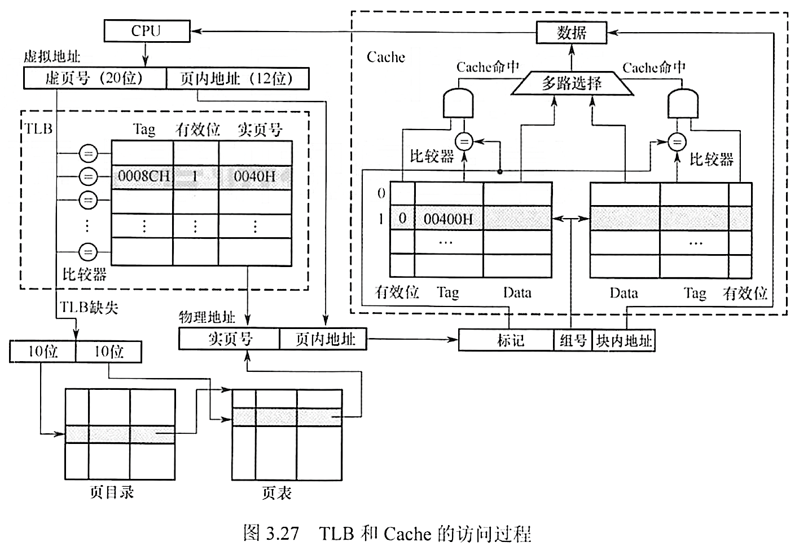

如图是具有 TLB 和 Cache 的多级存储系统，Cache 采用二路组相联，TLB 采用全相联方式，每项都有一个比较器。

CPU 给出一个 32 位虚拟地址，TLB 使用比较器比较，查找时将虚页号与每个 TLB 标记字段同时进行比较

- 若有一项相等且对应有效位为 1，则 TLB 命中，此时可以直接通过 TLB 进行地址转换
- 若为命中，则 TLB 缺失，需要访问主存去查页表

图中为两级页表方式，虚页号被分成页目录索引和页表索引两部分，由这两部分得到对应的页表项，从而进行地址转换，并将相应表项调入 TLB。若 TLB 满，则需要采用替换策略。

完成由虚拟地址到物理地址的转换后，Cache 机构根据映射方式将物理地址划分为多个字段，然后根据映射规则找到对应的 Cache 行或组，将对应 Cache 行中的标记与物理地址中的高位部分进行比较，若相等且对应有效位为 1，则 Cache 命中，此时根据块内地址取出对应的字送 CPU。

查找时，快表和慢表也可以同步进行，若快表中有此虚页号，则能很快找到对应的实页号，并使慢表的查找作废，从而就能做到虽采用虚拟存储器但访问主存速度几乎没有下降。

在一个具有 Cache 和 TLB 的虚拟存储系统中，CPU 一次访存操作可能涉及 TLB、页表、Cache、主存的磁盘的访问。

CPU 访存过程中存在三种缺失情况：

- TLB 缺失：要访问的页面的页表项不在 TLB 中
- Cache 缺失：要访问的主存块不在 Cache 中
- Page 缺失：要访问的页面不在主存中

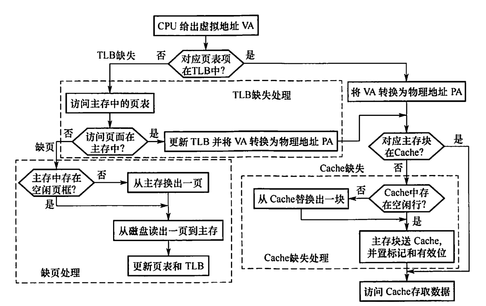

| 序号 | TLB  | Page | Cache | 说明                                                                     |
| ---- | ---- | ---- | ----- | ------------------------------------------------------------------------ |
| 1    | 命中 | 命中 | 命中  | TLB 命中则 Page 一定命中，信息在主存，就可能在 Cache 中，无须访问主存    |
| 2    | 命中 | 命中 | 缺失  | 信息在主存，也可能不在 Cache 中，访问一次主存                            |
| 3    | 缺失 | 命中 | 命中  | TLB 缺失但 Page 可能命中，信息在主存，可能在 Cache 中，访问一次主存      |
| 4    | 缺失 | 命中 | 缺失  | 信息在主存，也可能不在 Cache 中，访问 2 次主存                           |
| 5    | 缺失 | 缺失 | 缺失  | TLB 缺失则 Page 也可能缺失，信息不在主存，也一定不在 Cache，发生缺页异常 | 

### 3.6.3. 段式虚拟存储器

段是按程序的逻辑结构划分的，各个段的长度因程序而异。把虚拟地址分为两部分：段号和段内地址。虚拟地址到实地址之间的变换是由段表来实现的。段表是程序的逻辑段和在主存中存放位置的对照表。段表的每行记录与某个段对应的段号、装入位、段起点的段长等信息。由于段的长度可变，所以段表中要给出各段的起始地址与段的长度。

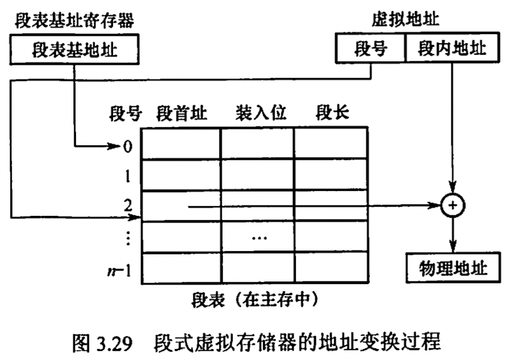

CPU 根据虚拟地址访存时，首先根据段号与段表基址拼接成对应的段表行，然后根据该段表行的装入位判断该段是否已调入主存。 已调入主存时，从段表读出该段在主存中的起始地址，与段内地址（偏移量）相加，得到对应的主存实地址。

> [!tip] 优缺点
> - 段的分界与程序的自然分界相对应，因而具有逻辑独立性，使得它易于编译、管理、修改、保护，页便于多道程序的共享
> - 因为段长度可变，分配空间不便，容易在段时间留下碎片，不好利用，造成浪费。

### 3.6.4. 段页式虚拟存储器

把程序按逻辑结构分段，每段再划分为固定大小的页，主存空间也划分为大小相等的页，程序对主存的调入、调出仍以页为基本传送单位。

在段页式虚拟存储器中，每个程序对应一个段表，每段对应一个页表，段的长度必须是页长的整数倍，段的起点必须是某一页的起点。

虚拟地址分为段号、段内页号、页内地址三部分。

- CPU 根据虚拟地址访存时，首先根据段号得到段表地址
- 然后动段表中取出该段的页表起始地址，与虚地址段内页号合成，得到页表地址
- 最后从页表中取出实页号，与业内地址拼接成主存实地址

> [!tip] 优缺点
> - 兼具页式和段式虚拟存储器的优点，可以按段实现共享和保护
> - 在地址变换过程中需要两次查表，系统开销大

### 3.6.5. 虚拟存储器和 Cache 的比较

#### 1. 相同之处

- 最终目标都是为了提高系统性能，两者都有容量、速度、价格的梯度
- 都把数据划分为小信息块，并作为基本的传递单位，虚存系统的信息块更大
- 都有地址映射、替换算法、更新策略等问题
- 依据程序的局部性原理应用“快速缓存的思想”，将活跃的数据放在相对高速的部件中。

#### 2. 不同之处

- Cache 主要解决系统速度，虚拟存储器为了解决主存容量问题
- Cache 全由硬件实现，是硬件存储器，对所有程序员透明；虚拟存储器由 OS 和硬件共同实现，是逻辑上的存储器，对系统程序员不透明，对应用程序员透明
- 对于不命中性能影响，因为 CPU 的速度约为 Cache 的 10 倍，主存的速度为硬盘的 100 倍以上，因此虚拟存储器系统不命中时对系统性能影响更大
- CPU 与 Cache 和主存之间都建立了直接访问的通路，而辅存与 CPU 没有直接通路；虚拟存储器系统不命中时，只能先由硬盘调入主存，不能与 CPU 直接通信


