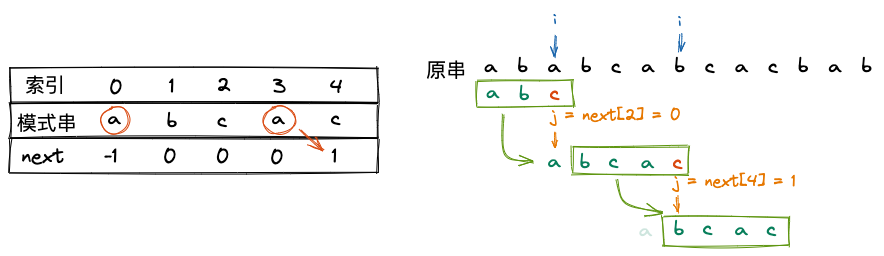
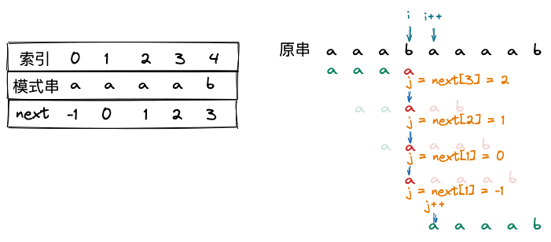
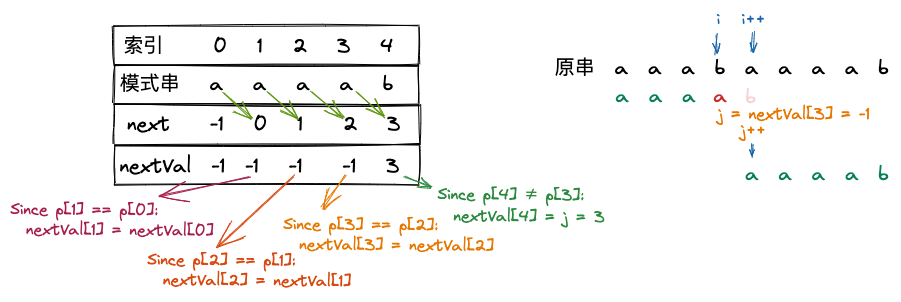

## 4.2. 串的模式匹配

### 4.2.1. 简单的模式匹配算法

```ts
function strMatch(s1: string, s2: string): number {
  let i = 0
  let j = 0
  while (i < s1.length && j < s2.length) {
    if (s1[i] === s2[j]) {
      i++
      j++
    }
    else {
      i = i - j + 1
      j = 0
    }
  }
  if (j >= s2.length)
    return i - s2.length
  else return -1
}
```

### 4.2.2. KMP 算法

例如，想要从 `ababcabcacbab` 中匹配 `abcac`，用暴力法就会出现下面的情况

|  索引   |  0  |       1        |       2        |        3         |        4         |  5  |       6        |  7  |  8  |  9  | 10  | 11  | 12    |
|:-------:|:---:|:--------------:|:--------------:|:----------------:|:----------------:|:---:|:--------------:|:---:|:---:|:---:|:---:|:---:|:---:|
|  原串   | $a$ |      $b$       |      $a$       |       $b$        |       $c$        | $a$ |      $b$       | $c$ | $a$ | $c$ | $b$ | $a$ | $b$ |
| 第 1 次 | $a$ |      $b$       | $\color{red}c$ |                  |                  |     |                |     |     |     |     |     |     |
| 第 2 次 |     | $\color{red}a$ |                |                  |                  |     |                |     |     |     |     |     |     |
| 第 3 次 |     |                |      $a$       |       $b$        |       $c$        | $a$ | $\color{red}c$ |     |     |     |     |     |     |
| 第 4 次 |     |                |                | ${\color{red}a}$ |                  |     |                |     |     |     |     |     |     |
| 第 5 次 |     |                |                |                  | ${\color{red}a}$ |     |                |     |     |     |     |     |     |
| 第 6 次 |     |                |                |                  |                  | $a$ |      $b$       | $c$ | $a$ | $c$ |     |     |     |

可以发现，这种情况下，效率就相对比较差。我们希望在副串移动时直接移动到合适的位置，并且 $i$ 不应该回溯。

|  索引   |  0  |       1        |       2        |        3         |        4         |  5  |       6        |  7  |  8  |  9  | 10  | 11  | 12    |
|:-------:|:---:|:--------------:|:--------------:|:----------------:|:----------------:|:---:|:--------------:|:---:|:---:|:---:|:---:|:---:|:---:|
|  原串   | $a$ |      $b$       |      $a$       |       $b$        |       $c$        | $a$ |      $b$       | $c$ | $a$ | $c$ | $b$ | $a$ | $b$ |
| 第 1 次 | $a$ |      $b$       | $\color{red}c$ |                  |                  |     |                |     |     |     |     |     |     |
| 第 2 次 |     |                |      $a$       |       $b$        |       $c$        | $a$ | $\color{red}c$ |     |     |     |     |     |     |
| 第 3 次 |     |                |                |                  |                  | $\color{gray}a$ |      $b$       | $c$ | $a$ | $c$ |     |     |     |

<p style="text-align: center;">右移位数 = 已匹配的字符数 - 对应部分的匹配值</p>

```js
Move = j - PM[j - 1]
```

使用部分匹配值时，每当匹配失败，就去找他==前一个元素==的部分匹配值，这样有些别扭，那就不妨把 `PM` 表右移一位，这样哪个元素匹配失败，直接看他自己的部分匹配值即可。

| $a$ | $b$ | $c$ | $a$ | $c$ |
|:---:|:---:|:---:|:---:|:---:|
| -1  |  0  |  0  |  0  |  1  |

于是，上式改写成

```js
Move = j - next[j]
```

相当于回退到

```js
j = j - Move = j - (j - next[j]) = next[j]
```



模式串与 `next` 数组

```ts
function getNext(t: string, next: number[]) {
  let i = 0
  let j = -1
  next[0] = -1
  while (i < t.length - 1) {
    if (j === -1 || t[i] === t[j]) {
      ++i
      ++j
      next[i] = j
    }
    else { j = next[j] }
  }
}

function kmp(s: string, t: string, next: number[]): number {
  let i = 0
  let j = 0
  while (i < s.length && j < t.length) {
    if (j === -1 || s[i] === t[j]) {
      ++i
      ++j
    }
    else { j = next[j] }
  }
  if (j >= t.length)
    return i - t.length
  else
    return -1
}

const t = 'abcac'
const next = Array(t.length).fill(0)

getNext(t, next)
const i = kmp('ababcabcacbab', t, next)
console.log(next, i)
// [-1, 0, 0, 0, 1] 5
```

### 4.2.3. KMP 算法的优化

`next` 数组在某些情况下仍然有一些缺陷，还可以进一步优化，例如 `aaaab` 与 `aaabaaaab` 的匹配



中间多了 3 次多余的匹配，因此我们可以考虑将它优化。

观察到，当 `s[3] != p[3]` 时，如果用 `next` 数组，还需要 `s[3]` 与 `p[2]`, `p[1]`, `p[0]` 分别匹配。

此时应当注意到，不应该出现 `p[j] == p[next[j]]`，因为当 `p[j] != s[j]` 时，下一次比较必然是 `p[next[j]]` 和 `s[j]`，因此需要 ==递归== 一下，将 `next[j]` 修正为 `next[next[j]]`，直至两者不相等为止。



```ts
function getNextVal(t: string, nextVal: number[]) {
  let i = 0
  let j = -1
  nextVal[0] = -1
  while (i < t.length - 1) {
    if (j === -1 || t[i] === t[j]) {
      ++i
      ++j
      if (t[i] !== t[j])
        nextVal[i] = j
      else
        nextVal[i] = nextVal[j]
    }
    else { j = nextVal[j] }
  }
}

function kmp(s: string, t: string, next: number[]): number {
  let i = 0
  let j = -1
  while (i < s.length && j < t.length) {
    if (j === -1 || s[i] === t[j]) {
      ++i
      ++j
    }
    else { j = next[j] }
  }
  if (j >= t.length)
    return i - t.length
  else
    return -1
}

const t = 'aaaab'
const next = Array(t.length).fill(0)

getNextVal(t, next)
const i = kmp('aaabaaaab', t, next)
console.log(next, i)
// [-1, -1, -1, -1, 3] 4
```

