## 7.2. 顺序和折半

### 7.2.1. 顺序

顺序 ASL<sub>成功</sub> = $\displaystyle\sum_{i=1}^n P(n-i+1) = {n+1 \over 2}$

### 7.2.2. 折半

仅适用于有序顺序表

```cpp
// 从升序表中查找
int binary_search(int* L, int n, int key) {
	int low = 0, high = n - 1, mid;
	while (low <= high) {
		mid = (low + high) / 2;
		if (L[mid] == key)
			return mid;
		else if (L[mid] > key) 
			high = mid - 1;  // 从前半部分查找
		else
			low = mid + 1;   // 从后半部分查找
	}
	return -1;
}
```

$$
ASL &= 1/n sum_(i=1)^n l_i

&= 1/n(1xx1+2xx2+...+hxx2^(h-1))

&=(n+1)/n log_2(n+1)

&~~log_2(n+1)-1
$$


### 7.2.3. 分块查找

块间有序，块内可以无序

## 7.3. 树形查找

### 7.3.1. 二叉排序树

#### 1. 定义

- 若左子树非空，则左子树所有元素都小于根结点的值
- 若右子树非空，则右子树所有元素都大于根结点的值
- 左右子树分别也是二叉排序树

中序遍历可以得到有序序列

#### 2. 查找

```cpp
BSTNode* BSTSeatch(BSTNode* t, int key) {
	while (t != NULL && key != t->data) {
		if (key < t->data)
			t = t->lchild;  // 根元素的值大于 key，则在左子树中找
		else
			t = t->rchild;  // 根元素的值小于 key，则在右子树中找
	}
	return t;
}
```

#### 3. 插入

```cpp
bool BSTInsert(BSTNode* t, int k) {
	if (t == NULL) {
		t = new BSTNode();
		t->data = k;
		t->lchild = t->rchild = NULL;
		return true;
	} else if (k == t->data)  // 关键字重复，插入失败
		return false;
	else if (k < t->data) 
		return BSTInsert(t->lchild, k);
	else
		return BSTInsert(t->rchild, k);
}
```

#### 4. 删除

若删除叶节点，效率较高；若删除的是分支节点，则需要移动指针。

#### 5. 性能分析

- 情况最好时 $O(\log_2 n)$
- 情况最差时，是一条偏向一侧的单链，$O(n)$

### 7.3.2. 平衡二叉树

#### 1. 定义

任意节点的左右子树高度差的绝对值不超过 1

#### 2. 插入

##### LL 旋转 - 右单旋转

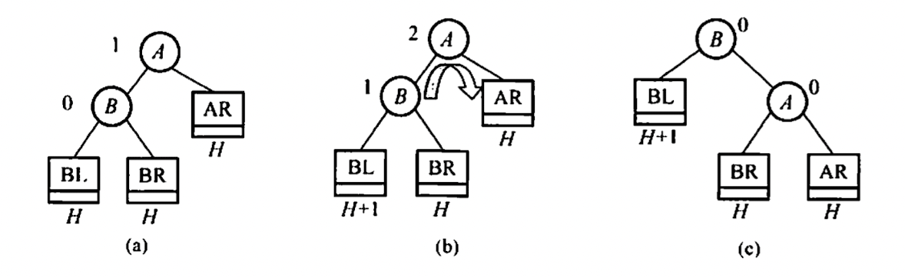

##### RR 旋转 - 左单旋转

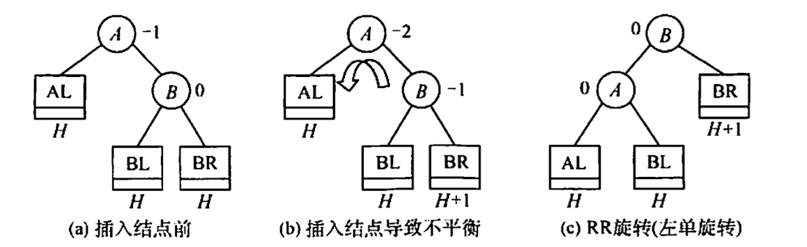

##### LR 平衡旋转 - 先左后右双旋转

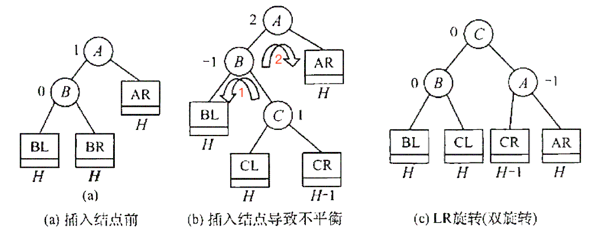

##### RL 平衡旋转 - 先右后左双旋转

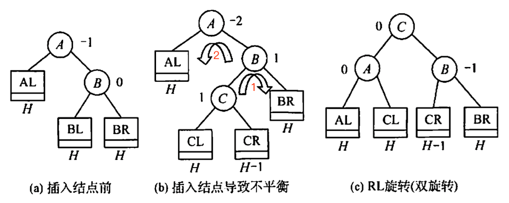

#### 3. 删除

与插入类似，同样需要旋转

#### 4. 查找

平均查找长度为 $O(\log_2 n)$

### 7.3.3. 红黑树

#### 1. 定义

一棵红黑树是满足如下红黑性质的二叉排序树

- 每个结点或是红色，或是黑色的
- ==根结点是黑色的==
- 叶结点（虚构的外部结点、NULL 结点）都是黑色的
- ==不存在两个相邻的红结点==（即红结点的父结,点和孩子结点均是黑色的）
- 对每个结点，从该结点到任一叶结点的==简单路径==上，所含==黑结点的数量相同==

> [!tip] 结论 1 从根到叶节点的最长路径不大于最短路径的 2 倍

> [!tip] 结论 2 有 $n$ 个内部节点的红黑树高度 $h \leqslant 2 \log _2(n+1)$

#### 2. 插入

> [!error] 结论 3 新插入红黑数的节点初始着为红色

可以将红黑树看作是稍微错位一些的 234 树，详情见 [BV1BB4y1X7u3](https://b23.tv/BV1BB4y1X7u3)

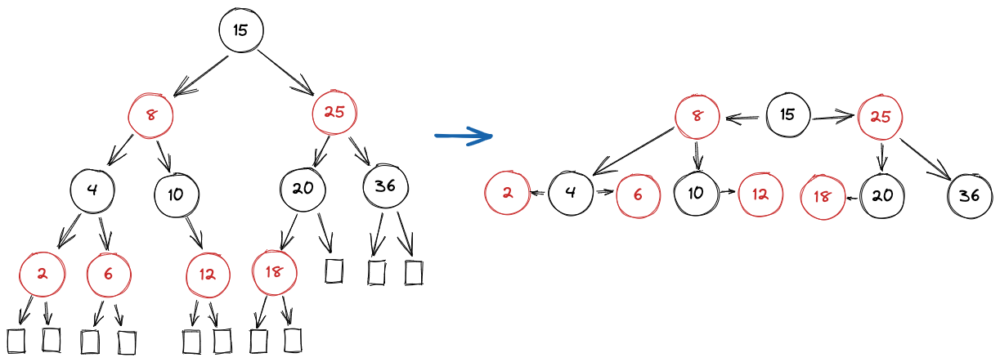

父节点为黑

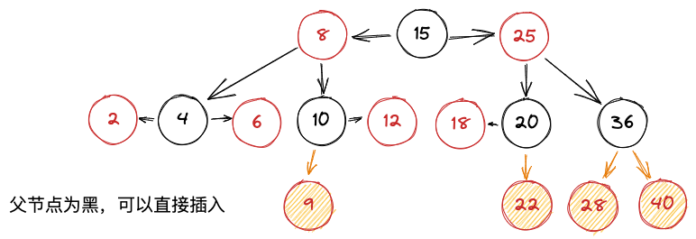

需要旋转的情况

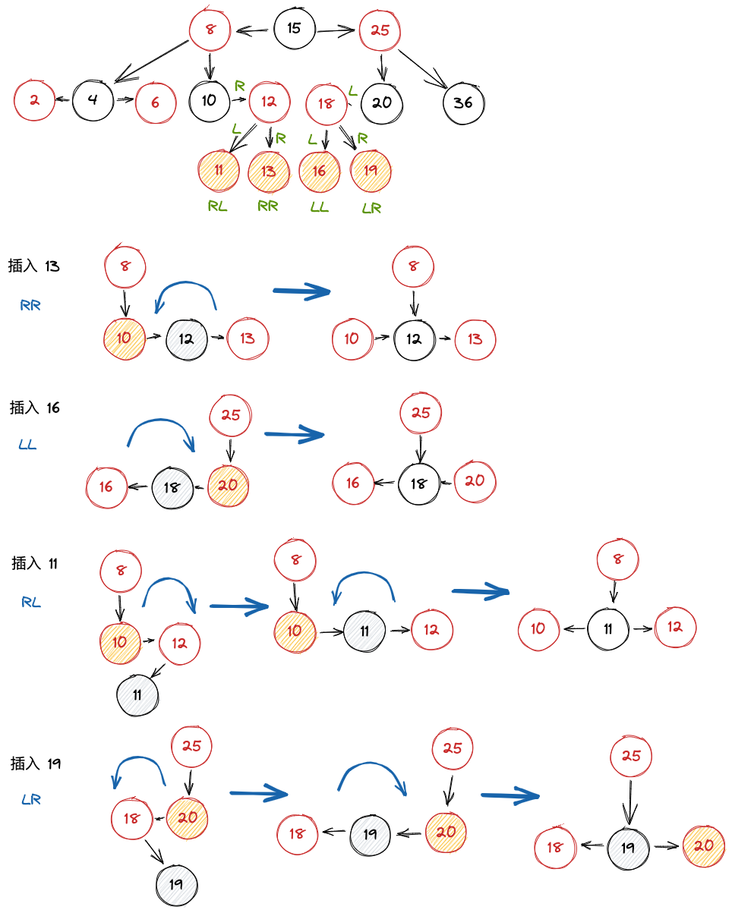

上溢的情况

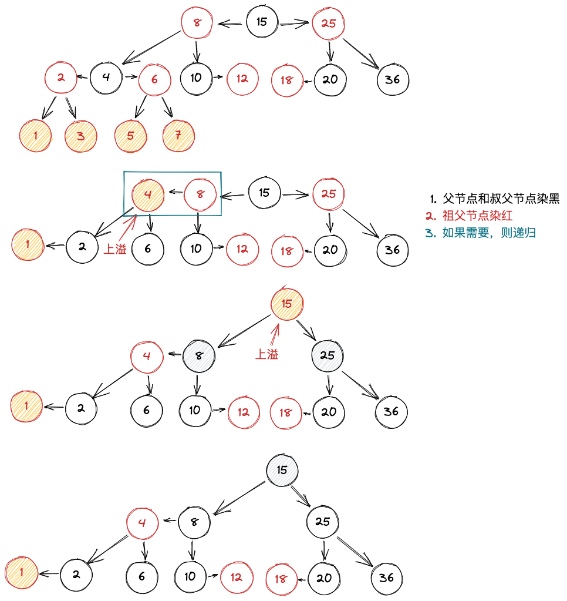

#### 3. 删除

- 红色节点可以直接删除（转为底层红节点的删除）
- 黑色节点的删除
	- 有一个红色子节点的黑色节点（红色子节点代替删除节点）
	- 黑色叶子节点（下溢）
		- 删除节点为根节点，直接删除
		- 删除节点的兄弟节点为黑色
			- 兄弟节点有红色子节点（借用兄弟子节点修复）
			- 兄弟节点没有红色子节点（父节点向下合并）
		- 删除节点的兄弟节点为红色（转变为黑色处理）

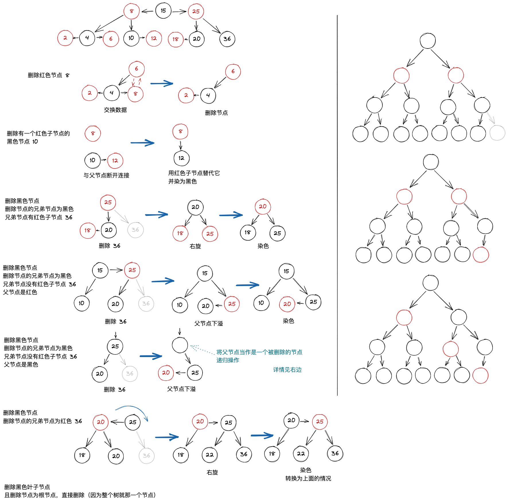

## 7.4. B 树 和 B+ 树

### 7.4.1. B 树

又称多路平衡查找树，B 树中所有节点的孩子个数的最大值称为 B 树的阶，通常用 $m$ 表示。一颗 $m$ 阶的 B 树或为空树，货位满足如下特征的 $m$ 叉树

1. 书中每个节点至多有 $m$ 棵子树，即至多含有 $m-1$ 个关键字
2. 若根节点不是终端节点，则至少有两棵子树
3. 除根节点外的所有==非叶节点至少有 $\left \lceil  m/2 \right \rceil$ 棵子树==，即至少包含 $\left \lceil m/2 \right \rceil -1$ 个关键字
4. 所有非叶节点的结构如下

| $n$ | $P_0$ | $K_1$ | $P_1$ | $K_2$ | $P_2$ | $\cdots$ | $K_n$ | $P_n$ |
| --- | ----- | ----- | ----- | ----- | ----- | -------- | ----- | ----- |

其中，$K_i$ 为节点的关键字，且满足 $K_{1}< K_{2}<\cdots < K_{n}$；$P_i$ 为指向子树根节点的指针，且指针 $P_{i-1}$ 所指子树中所有节点的关键字均小于 $K_i$，$P_i$ 所指子树中所有节点的关键字均大于 $K_i$

5. 所有叶节点都出现在同一层次上，并且不带信息（可视为外部节点或者类细雨这般查找判定树的查找失败节点，实际这些节点不存在，指向这些节点的指针均为空）

B 树是所有节点的平衡因子均等于 0 的多路平衡查找树。

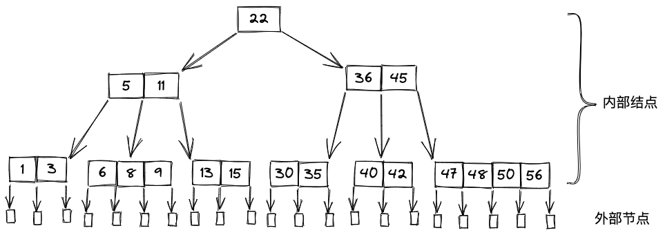


- 节点孩子个数等于该节点中关键字个数加一
- 如果根节点没有关键字就没有子树，此时 B 树为空；如果根节点有关键字，其==子树必然大于等于两棵==。
- 除根节点外的所有非终端节点至少有 $\lceil m/2\rceil=\lceil 5/2\rceil=3$ 棵子树，至多有 5 棵子树
- 节点中关键字从左到右递增有序，关键字两侧均有指向子树的指针，左侧指针指向的子树的所有关键字均小于该关键字，邮编指针所指向的子树的所有关键字均大于该关键字
- 所有叶子节点都在第 4 层，代表查找失败的位置

#### 1. B 树的高度

##### 最小高度

B 树中每个节点最多有 $m$ 棵子树， $m-1$ 个关键字，所以在一棵高度为 $h$ 的 $m$ 阶 B 树中关键字的个数满足

$$
n \leqslant (m-1)(1 + m + m^{2} + \cdots + m^{h-1}) = m^{h}-1
$$

即

$$
h \geqslant \log_{m}(n+1)
$$

##### 最大高度

由于其定义：第一层至少 1 个节点；第二层至少有 2 个节点；除根节点外的每个为终端节点至少有 $\left \lceil  m/2 \right \rceil$ 棵子树，侧第三层至少有 $2 \lceil m/2 \rceil$ 个节点，第 $h+1$ 层至少有 $2 \left(\lceil m/2 \rceil\right)^{h-1}$，而 $h+1$ 层是不包含任何信息的叶子节点。

对于关键字个数为 $n$ 的 B 树，叶节点查找不成功的节点为 $n+1$，由此有 $n+1 \geqslant 2 \left(\lceil m/2 \rceil\right)^{h-1}$，即

$$
h \leqslant \log _{\lceil m/2 \rceil}\left((n+1)/2\right)+1
$$

#### 2. B 树的查找

1. 在 B 树中找节点
2. 在节点内找关键字

#### 3. B 树的插入

- 定位：利用查找算法，找出插入该关键字的最低层中的某个非叶节点
- 插入：在 B 树中，每个非失败的节点的关键字个数都在 $\left[ \lceil m/2\rceil-1,m-1 \right]$ 内，插入后的节点关键字个数小于 $m$，可以直接插入；插入后检查被插入节点内关键字的个数，当插入后的节点关键字个数大于 $m-1$ 时，必须对节点进行分裂
	- 取 $\lceil m/2\rceil$ 位置的元素，以它为中心将左右分离，称为两个新的节点，而取出的这个节点上溢到父节点。若父节点也需要分裂，则递归处理

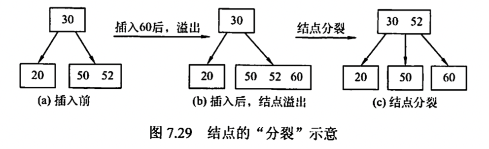

#### 4. B 树的删除

要使得删除后的节点中的关键字个数 $\geqslant \lceil m/2\rceil-1$，因此还会涉及“合并”（下溢）

当被删关键字 $k$ 不在终端节点中，可以用 $k$ 的前驱或后继 $k^{\prime}$ 来替代 $k$。然后在相应的节点中删除 $k^{\prime}$，关键字 $k^{\prime}$ 必定落在某个终端节点中，则转换成了被删关键字在终端节点的中的情形。

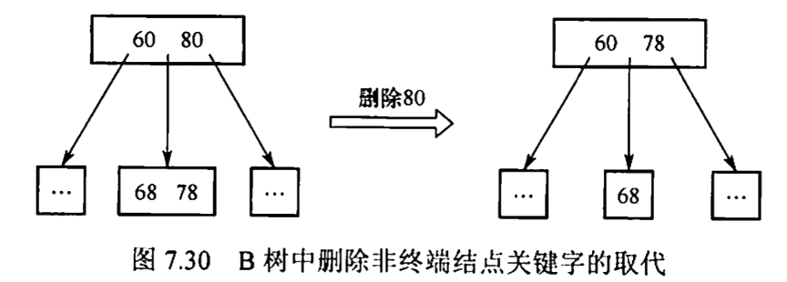

当被删关键字在终端节点中，有 3 种情况

- 直接删除：若被删除关键字所在节点的关键字个数 $\geqslant \lceil m/2\rceil-1$，则可以直接删除
- 兄弟够借：若被删除关键字所在节点的关键字个数 $= \lceil m/2\rceil-1$，且与此节点相邻的右或左兄弟节点的关键字个数 $\geqslant \lceil m/2\rceil$，则需要调整至平衡

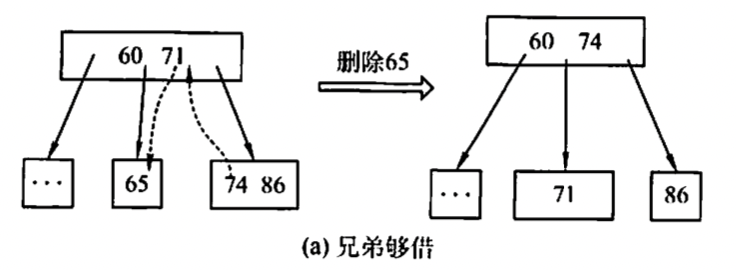

- 兄弟不够借：若被删除关键字所在节点删除前的关键字个数 $= \lceil m/2 \rceil-1$，且此时与该结点相邻的左右兄弟节点的关键字个数均 $= \lceil m/2 \rceil-1$，则将关键字删除后与左或右兄弟节点及双亲节点中的关键字进行合并

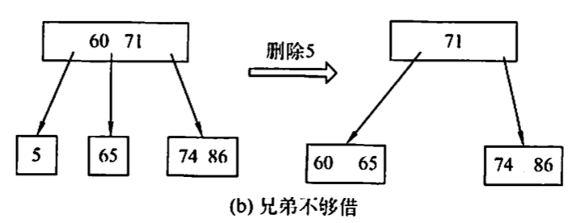

### 7.4.2. B+ 树

B+ 树是应数据库所需而出现的一种 B 树的变形树

每棵 $m$ 阶的 B+ 树需满足下面条件

- 每个分支节点最多有 $m$ 棵子树（孩子节点）
- 非叶根节点至少有两棵子树，其他每个分支节点至少有 $\lceil m/2\rceil$ 棵子树
- 节点的子树个数与关键字个数相等
- 所有叶节点包含全部关键字及指向相应记录的指针，叶节点中将关键字按大小顺序排列，并且相邻叶节点按大小顺序相互链接起来
- 所有分支节点中仅保存它的各个子节点（即下一级的索引块）中关键字的最大值及指向其子节点的指针

> [!tip]
> - B+ 树中，叶节点包含信息，所有非叶节点仅起索引作用，非叶节点中的每个索引项只含有对应子树的最大关键字和指向该子树的指针，不含有该关键字对应记录的存储地址
> - B+ 树中，叶节点包含了全部关键字，即在非叶节点中出现的关键字也会出现在叶节点中；B 树中终端节点包含的关键字和其他节点包含的关键字是不重复的


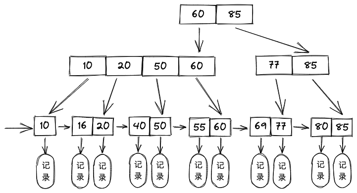


## 归纳总结

- 查找成功的平均查找长度 $=\displaystyle\sum\limits_{i=1}^{n}p_{i}c_{i}$
- 查找失败的平均查找长度 $=\displaystyle\sum\limits_{j=0}^{n}q_{j}c_{j}$

设一个查找集合中已有 $n$ 个数据元素，每个元素的查找概率为 $p_{i}$，查找成功的数据比较次数为 $c_{i}$；不在此集合中的数据元素分布在由这 $n$ 个元素间隔构成的 $n+1$ 个子集合内，每个子集合元素的查找概率为 $q_{j}$，查找不成功的数据比较次数为 $c_{j}$

