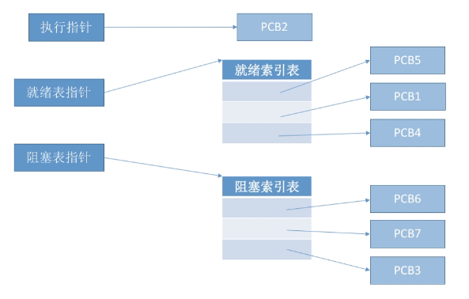
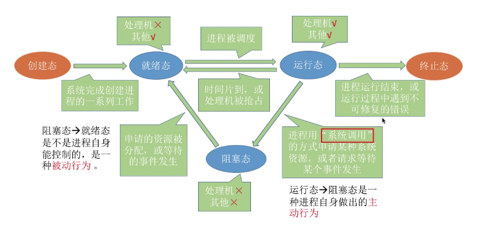
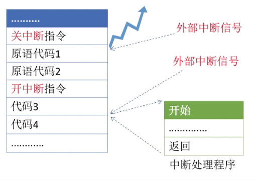

## 2.1.1 进程

### 1. 定义

程序：一个指令序列

进程控制块（PCB）、程序段、数据段三部分构成了==进程实体==（==进程映像==）。一般情况下，我们把进程实体简称为进程，例如，创建进程，实质上是创建进程实体的 PCB；而撤销进程，实质上是撤销进程实体的 PCB。

> [!caution]
> PCB 是进程存在的唯一标志。

从不同的角度，进程可以有不同的定义，比较传统典型的定义有：

1. 进程是程序的一次==执行过程==。
2. 进程是一个程序及其数据在处理机上顺序执行时所==发生的活动==。
3. 进程是具有独立功能的程序在数据集合上==运行的过程==，它是系统进行资源分配和调度的一个独立单位。

> [!note] 引入进程实体的概念后，可以把进程定义为
> 进程是进程实体的==运行过程==，是系统进行==资源分配==和==调度==的一个独立单位。

### 2. 进程的组成

#### 2.1 程序段

程序代码

#### 2.2 数据段

程序运行时使用、产生的运算数据。如全局变量、局部变量、宏定义常量。

#### 2.3 PCB 进程控制块

- 进程描述信息
  - 进程标识符 PID
  - 用户标识符 UID
- 进程控制和管理信息
  - 进程当前状态
  - 进程优先级
- 资源分配清单
  - 程序段指针
  - 数据段指针
  - 键盘 鼠标
- 处理机相关信息
  - 各种寄存器

### 3. 进程的组织

在一个系统中，通常有数十、数百乃至数千个 PCB 。为了能对他们加以有效的管理，应该用适当的方式把这些 PCB 组织起来。

> [!note]
> 进程的==组成==讨论的是一个==进程内部==由哪些部分构成的问题，而进程的==组织==讨论的是==多个进程之间==的组织方式问题

#### 3.1 链接方式

按照进程状态将 PCB 分为多个队列，操作系统持有指向各个队列的指针。

#### 3.2 索引方式

根据进程状态的不同，建立几张索引表，操作系统持有指向各个索引表的指针。

### 4. 进程的特征

#### 4.1 动态性

进程是程序的一次执行过程，是动态的产生、变化和消亡的。

#### 4.2 并发性

内存中有多个进程实体，各进程可并发执行。

#### 4.3 独立性

进程是能独立运行、独立获得资源、独立接受调度的基本单位。

#### 4.4 异步性

各进程按各自独立的、不可预知的速度向前推进，OS 要提供“进程同步机制”来解决异步问题。

#### 4.5 结构性

每个进程都会配置一个 PCB。结构上看，进程由程序段、数据段、PCB 组成。

## 2.1.2 进程的状态与转换

### 1. 进程的状态（三态/五态）

#### 1.1 ==运行态==

占有 CPU，并在 CPU 上运行

> [!note]
> 单核处理机环境下，每个时刻最多只有一个进程处于运行态。双核环境下可以同时有两个进程处于运行态。

#### 1.2 ==就绪态==

已经具备运行条件，但由于没有 CPU，暂时不能运行。

#### 1.3 ==阻塞态（等待态）==

因等待某一时间暂时不能运行。

#### 1.4 创建态（新建态）

进程正在被创建，OS 为进程分配资源、初始化 PCB。

#### 1.5 终止态（结束态）

进程正在从系统中撤销，OS 会回收进程拥有的资源、撤销 PCB。

### 2. 进程状态的转换

> [!caution]
> 注意：不能由阻塞态直接转换为运行态，也不能由就绪态直接转换为阻塞态（因为进入阻塞态是进程主动请求的，必然需要进程在运行时才能发出这种请求）

## 2.1.3 进程控制

### 1. 概念

进程控制的主要功能是对系统中的所有进程实时有效的管理，它具有创建新进程、撤销已有进程、实现进程状态转换等功能。==简言之，实现进程状态的转换。==

### 2. 如何实现

用==原语==实现进程控制。原语的特点是执行期间不允许中断，只能一气呵成，即==原子操作==。原语采用“关中断指令”和“开中断指令”实现。

原语的关/开中断指令权限非常大，是只允许在核心态下执行的特权指令。

### 3. 进程控制相关的原语

#### 3.1 原语所要完成的工作

1. 更新 PCB 中的信息
2. 将 PCB 插入合适的队列
3. 分配/回收资源

#### 3.2 进程的创建

- 创建原语（无 → 创建态 → 就绪态）
  - 申请空白 PCB
  - 为新进程分配所需资源
  - 初始化 PCB
  - 将 PCB 插入就绪队列
- 引起进程创建的事件
  - 用户登录
  - 作业调度
  - 提供服务
  - 应用请求

#### 3.3 进程的终止

- 撤销原语（就绪/等待/运行态 → 终止态 → 无）
  - 从 PCB 集合中找到终止进程的 PCB
  - 若进程正在运行，立即剥夺 CPU，将 CPU 分配给其他进程
  - 终止其所有子进程
  - 将该进程拥有的所有资源归还给父进程或操作系统
  - 删除 PCB
- 引起进程终止的事件
  - 正常结束
  - 异常结束
  - 外界干预

#### 3.4 进程的阻塞和唤醒

阻塞原语和唤醒原语必须成对使用

##### 进程的阻塞

- 阻塞原语
  - 找到要阻塞的进程对应的 PCB
  - 保护进程运行现场，将 PCB 状态信息设置为“阻塞态”，暂停进程运行
  - 将 PCB 插入相应事件的等待队列
- 引起进程阻塞的事件
  - 需要等待系统分配某种资源
  - 需要等待互相合作的其他进程完成工作

##### 进程的唤醒

- 唤醒原语
  - 在事件等待队列中找到 PCB
  - 将 PCB 从等待队列移出，设置进程为就绪态
  - 将 PCB 插入就绪队列，等待被调度
- 引起进程唤醒的事件
  - 等待的事件发生

#### 3.5 进程的切换

- 切换原语
  - 将运行环境存入 PCB
  - PCB 移入相应队列
  - 选择另一个进程执行，并更新其 PCB
  - 根据 PCB 恢复新进程所需的运行环境
- 引起进程切换的事件
  - 当前进程时间片到
  - 有更高优先级的进程到达
  - 当前进程主动阻塞
  - 当前进程终止

## 2.1.4 进程通信

进程通信即进程之间的信息交换。

进程是分配系统资源的单位，因此各进程拥有的==内存地址空间相互独立==。为了保证安全，==一个进程不能直接访问另一个进程的地址空间==。

- 并发进程之间的交互必须满足两个基本要求：==同步和通信==
- 进程之间互相交换信息的工作称为==进程通信==
  - 信号 (signal) 通信机制
  - 管道 (pipeline) 通信机制
  - 消息传递 (message passing) 通信机制
  - 信号量 (semaphore) 通信机制

### 1. 共享存储

在内存中开辟共享空间供不同进程通信。两个进程对共享空间的访问必须是互斥的，进程 1 在访问时进程 2 不能进行访问（互斥访问通过 OS 提供的工具实现）。

#### 1.1 基于数据结构的共享

共享空间内只能放规定数据结构的有限的数据。速度慢，限制多，是一种低级通信方式。

#### 1.2 基于存储区的共享

在内存中画出一块共享存储区，数据的形式、存放位置都由进程控制，而不是 OS。速度更快，是一种高级通信方式。

### 2. 管道通信

管道是指用于连接读写进程的一个共享文件。其实是在内存中开辟一个大小固定的缓冲区。

> [!note]
> 1. 管道只能采取==半双工通信==，某一时间段内只能实现单向传输。
> 2. 各进程要==互斥==地访问管道。
> 3. 数据以字符流的形式写入管道，当管道写满时，写进程的 write() 系统调用将被阻塞，等待都进程将数据取走。当读进程将数据全部取走后，管道变空，此时读进程的 read() 系统调用将被阻塞。
> 4. 如果没有写满，就不允许读。如果没有读空，就不允许写。
> 5. 数据一旦被读出，就从管道中被抛弃，这就意味着==读进程最多只能有一个==。

### 3. 消息传递

进程间的数据交换以格式化的消息为单位。进程通过 OS 提供的“发送消息/接收消息”两个原语进行数据交换。

#### 3.1 直接通信方式

消息直接挂到接收进程的消息缓冲区上。

#### 3.2 间接通信方式

消息要先发送到中间实体（信箱），因此也称“信箱通信方式”。

## 2.1.5 线程

### 1. 概念

#### 1.1 为何引入线程

有的进程可能需要同时做很多事，而传统的进程只能串行的执行一系列程序，为此引入了“线程”，来增加并发度。

可以把线程理解为轻量级进程。线程是一个==基本的 CPU 执行单元==，也是==程序执行流的最小单元==。进程之间可以并发，进程内各线程之间也可以并发。

引入线程后，进程只作为除 CPU 之外的系统资源的分配单元（如打印机、内存地址空间等都是分配给进程的）。

#### 1.2 引入线程机制后的变化

- 资源分配、调度
  - 传统进程机制中，进程是资源分配、调度的基本单位
  - 引入线程后，进程是资源分配的基本单位，线程是调度的基本单位
- 并发性
  - 传统只能进程间并发
  - 引入后各线程间也能并发，提高了并发度
- 系统开销
  - 传统需要切换进程的运行环境，开销大
  - 线程间，如果是同一进程内的线程切换，则不需要切换进程环境，开销小

### 2. 线程的属性

- 线程是处理机调度的单位
- 多 CPU 计算机中，各线程可占用不同的 CPU
- 每个线程偶有一个线程 ID、线程控制块 TCB
- 线程也有就绪、等待、运行三态
- 线程几乎不拥有系统资源
- 同一进程的不同线程间共享进程的资源
- 由于共享内存地址空间，同一进程中的线程间通信甚至无需系统干预
- 同一进程中线程的切换，不会引起进程切换，开销小
- 不同进程中的线程切换，会引起进程切换，开销较大

### 3. 线程的实现方式

#### 3.1 用户级线程

用户级线程由应用程序通过线程库实现。所有的==线程管理工作==都由==应用程序负责==（包括线程切换）

用户级线程中，线程切换可以在用户态下即可完成，无需操作系统干预。

在用户看来，是有多个线程。但是在操作系统内核看来，并意识不到线程的存在。（用户级线程对用户不透明，对操作系统透明）

#### 3.2 内核级线程

内核级==线程的管理工作==由==操作系统内核==完成。线程调度、切换等工作都由内核负责，因此==内核级线程的切换==必然需要在==核心态==下才能完成。

#### 3.3 二者组合

在同时支持用户级、内核级线程的系统中，将 $n$ 个用户级线程映射到 $m$ 个内核级线程上 $(n\geqslant m)$

操作系统只“看得见”内核级线程，因此==只有内核级线程才是处理机分配的单位==。

上面的模型中，该进程由两个内核级线程，三个用户级线程，在用户看来，这个进程中有三个线程。但即使该进程在一个 4 核处理机的计算机上运行，也最多只能被分配到两个核，最多只能有两个用户线程并行执行。

## 2.1.6 多线程模型

### 1. 多对一模型

多个用户级线程映射到一个内核级线程。每个用户进程只对应一个内核级线程。

优点：用户级线程的切换在用户空间即可完成，不需要切换到核心态，线程管理的系统开销小，效率高。

缺点：当一个用户级线程被阻塞后，整个进程都会被阻塞，并发度不高。多个线程不可在多核处理机上并行运行。

### 2. 一对一模型

即变成了纯粹的内核级线程。一个用户及线程映射到一个内核级线程。每个用户进程有与用户级线程同数量的内核级线程。

优点：当一个线程被阻塞后，别的线程还可以继续执行，并发能力强。多线程可在多核处理机上并行执行。

缺点：一个用户进程会占用多个内核级线程，线程切换由操作系统内核完成，需要切换到核心态，因此线程管理的成本高，开销大。

### 3. 多对多模型

将 $n$ 个用户级线程映射到 $m$ 个内核级线程上 $(n\geqslant m)$。每个用户进程对应 $m$ 个内核级线程。

克服了多对一模型并发度不高的缺点，又克服了一对一模型中一个用户进程占用太多内核级线程，开销太大的缺点。

^multi-thread
