## 1. 存储管理基本概念

### 1.1. 内存储器

#### 1.1.1. 分两部分

##### 系统区

用于存放 OS 内核程序和数据结构等

##### 用户区

存放应用程序和数据

#### 1.1.2. 内存管理的主要功能

- 内存空间的分配和回收
- 地址转换（多道程序环境下，程序中的逻辑地址与内存中的物理地址可能不一样，因此存储管理必须提供地址变换功能）
- 内存空间的扩充（利用虚拟存储技术）
- 内存共享（允许多个进程访问内存的同一部分）
- 存储保护（保证各道作业在各自的存储空间内运行，互不干扰）

### 1.2. 外存储器

见第 5 章

### 1.3. 存储管理的功能

#### 1.3.1. 存储分配

为进程分配内存空间以便运行，完成内存区的分配去配工作

#### 1.3.2. 地址映射

内存被抽象成一维地址空间，使得进程认为分配给它的地址空间是一个大且连续地址所形成的数组；或抽象为二维地址空间，以支持模块化程序设计；建立抽象机制支持进程使用逻辑地址来访问物理内存单元

#### 1.3.3. 存储保护

系统负责隔离分配给进程的内存区，使之互不干扰免遭破坏，确保进程对存储单元的独占式使用，防止地址越界或操作越权，即==保护模式==

#### 1.3.4. 存储共享

为节省内存空间和实现进程通信，系统允许多个进程共享内存区。超越隔离机制并授权进程允许共享访问，达到既能共享内存区信息，又能提高内存利用率的目的。

#### 1.3.5. 存储扩充

内存速度快但容量小，外存容量大却速度慢。应用程序的大小不应受到物理内存容量限制。为此操作系统把内存和外存结合起来，形成一个容量近似外层速度近似内存的虚拟存储器。允许用户的逻辑地址空间大于内存物理地址空间，虚存管理自动在内侧和外层之间移动信息。

## 2. 存储器工作原理

### 2.1. 存储器层次

### 2.2. 地址转换与存储保护

程序是按照逻辑地址顺序执行的，但数据、代码、指令等都应在物理内存中存在


#### 2.2.1. 程序编译

源程序经过编译 (compiler)、汇编 (assemlby) 的处理生成目标模块

#### 2.2.2. 程序链接

根据目标模块之间的调用和依赖关系，将主模块、被调用模块以及所用到的库函数装配和链接成一个完整的可装载执行模块。

##### 静态链接

程序装载到内存和运行前，就已经将他所有目标模块及所需要的库函数进行链接和装备成一个完整的可执行程序，且此后不再拆分。重定位目标程序，又称装载代码模块，它存放于磁盘中。由于程序在内存中的位置不可预知，==链接时程序地址空间中的地址总是相对某个基准开始编号的顺序地址，称为逻辑地址或相对地址。==

##### 动态链接

动态链接是指在程序装入内存前，并未事先进行程序个目标模块的链接，而是在程序装载时，一边装载一边链接，生成一个可执行程序。

动态链接方式使得各目标模块相对独立存在，便于个别目标模块的修改或更新，且不影响程序的装载和执行。同时，若发现所需目标模块已在内存，可直接进行链接，而无需再次装载，支持目标模块的共享。

##### 运行时链接

运行时链接是指将某些目标模块或库函数的链接推迟到执行时才进行。

在程序执行过程中，若发现被调用模块或库函数尚未链接，现在内存中进行搜索，以查看是否装入内存，若已装入，则直接将其链接到调用者程序中；否则进行该模块在外存上的搜索，以及装入内存和进行链接，生成一个可执行程序。

这样可避免事先无法知道本次要运行哪些目标模块，避免程序执行过程中不被调用的某些目标模块在执行前进行链接和装载 而引起的开销，提高系统资源利用率和系统效率。

动态链接系统库 DLL 不必将程序所需的外部函数代码从系统库中提取出并列入目标模块中，而仅是在程序调用处登记调用信息，记录函数名及入口号，形成调用链接。

#### 2.2.3. 程序装载

##### 绝对装载

装载模块中的指令地址始终与其内存中的地址相同，即在模块中出现的所有地址都是内存绝对地址。

##### 可重定位装载

根据内存当时使用情况，决定将装载代码模块放入内存的物理位置。模块内使用的地址都是相对地址。

地址变换通常是在进程装入时一次完成的，故称为 **静态重定位**

##### 动态运行时装载

为提高内存利用率，装入内存的程序可换出到磁盘上，适当时候再换入到内存中。对换前后程序在内存的位置可能不同，即允许进程的内存映像在不同时候处于不同位置，此时模块内使用的地址必须为相对地址。

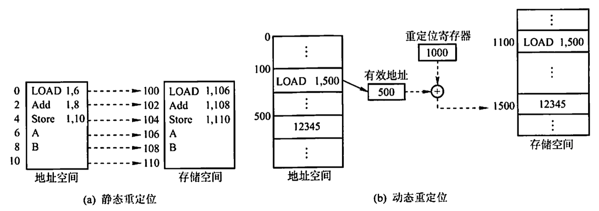

---

磁盘中装载的模块所使用的是逻辑地址，其逻辑地址集合称为进程的逻辑地址空间。进程运行时，其装载代码我块将被装入物理地址空间中，此时，程序和数据的实际地址不可能同原来的逻辑地址一致。

==物理内存从统一的基地址开始，顺序编制的存储单元称为物理地址或绝对地址。物理地址的总体构成物理地址空间。==物理地址空间是由存储器地址总线扫描出来的空间，其大小取决于实际安装的内存容量。

### 2.3. 逻辑地址和物理地址

编译后，每个目标模块都是从 0 号单元开始编址，称为该目标模块的相对地址（逻辑地址）。当链接程序将各个模块链接成一个完整的可执行目标程序时，链接程序顺序依次技各个模块的相对地址构成统一的从 0 号单元开始编址的**逻辑地址空间**（或虚拟地址空间）。

不同进程可以有相同的逻辑地址，因为这些相同的逻辑地址可以映射到主存的不同位置。

物理地址空间是指内存中物理单元的集合，是地址转换的最终地址。逻辑地址转换为物理地址的过程称为地址重定位。

### 2.4. 进程的内存映像

不同于存放在硬盘上的可执行程序文件，当一个程序调入内存运行时，就构成了进程的内存映像。一个进程的内存映像一般有几个要素：

- 代码段
- 数据段
- 进程控制块
- 堆
- 栈

### 2.5. 内存保护

确保每个进程都有一个==单独的内存空间==。内存分配前，需要保护操作系统不受用户进程的影响，同时保护用户进程不受其他用户进程的影响。内存保护可采取两种方法：

1. 在 CPU 中设置一对上、下限寄存器，存放用户作业在主存中的下限和上限地址，每当 CPU 要访问一个地址时，分别和两个寄存器的值相比，判断有无越界。
2. 采用重定位寄存器（基地址寄存器）和界地址寄存器（限长寄存器）。中定位寄存器含最小的物理地址值，界地址寄存器含逻辑地址的最大值。内存管理机构动态地将逻辑地址与界地址寄存器进行比较，若未发生地址越界，则加上重定位寄存器的值后映射成物理地址，再送交内存单元。

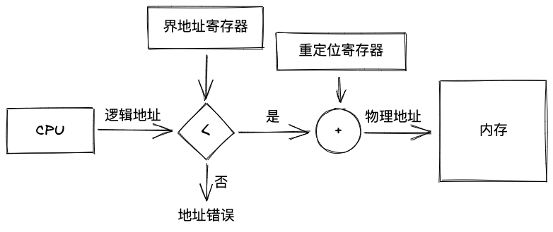

这两个寄存器只允许操作系统内核修改，对用户程序透明。

### 2.6. 内存共享

并不是所有进程的内存空间都适合共享，只有那些只读的区域才可以共享。可重入代码又称为纯代码，是一种允许多个进程同时访问但不允许被任何进程修改的代码。

实际执行时，可以为每个进程配以局部数据区，把在执行过程中可能改变的部分复制到该数据区。这样只需修改私有数据区的内存，不去修改共享的代码。

## 3. 连续存储管理

### 3.1. 固定分区存储管理

内存空间被划分成==数目固定不变的分区，各分区大小不等，每个分区只装入一个作业==，若多个分区中都装有作业，则他们可以并发执行，这是支持多道程序设计最简单的存储管理技术。

- 等大小：浪费空间
- 不等大小：分区过于固定，不易动态管理
- 出现大量的 “内部碎片”，不能很好的利用内存空间
- 无外部碎片，但不能实现多进程共享一个主存区，存储空间利用率低

### 3.2. 可变分区存储管理

#### 3.2.1. 分配和去配

用于管理的数据结构：已分配区表、未分配区表

当装入新作业时，从未分配区表中找到一个足够容纳的空闲区，将其分为两部分，一部分装入作业，成为已分配区；另一部分空闲。

当某个作业结束时，它所占用的内存空间被释放，变成空闲区，为保证存储区域的连续性，==将与其相邻的空闲区域合并==。

##### 分配算法

###### 最先适应分配算法

顺序查找未分配区表，直到找到第一个能满足长度要求的空闲区。未分配区表通常按地址从小到大排列，因此会在高地址保持一个大空闲区，但也造成了利用不均衡，分区回收麻烦。

###### 下次适应分配算法

从未分配区表上次扫描结束处顺序查找下一个。缩短了法一的平均查找时间，资源利用更加均衡。

###### 最优适应分配算法

扫描未分配区表，找到一个满足进程的最小分区进行分配。导致小碎片较多。

###### 最坏适应分配算法

扫描未分配区表，挑选最大的分区进行分配。此方法可以把空闲区按照递减顺序排列，缺点是大内存的作业无法进入。

###### 快速适应分配算法

该算法为那些经常用到的长度的空闲区设立单独的空闲区链表。查找十分快速，但归还内存时，与相邻空闲区的合并复杂费时。

#### 3.2.2. 地址转换与存储保护

C 语言程序被编译成至少三段：代码段、数据段、堆栈段，UNIX 进程模型是在这种模块化基础上形成的。CS 在指令执行期间重定位指令地址，SS 为栈指令的执行重定位地址，DS 在指令执行周期内重定位数据地址。在有 N 个重定位寄存器的机器中，允许每个进程获得 N 个不同的内存段，并在运行时进行动态地址重定位。

提供两对或多对基址/限长寄存器的机器中，允许一个进程占用两个或多个分区，可规定某对基址/限长寄存器的区域共享，用来存放共享的数据和程序。


#### 3.2.3. -内存不足的存储管理技术

##### 移动技术

把内存中的进程搬家，使得空闲区合并。不常用。

##### 对换技术

当前一个或多个驻留进程都处于阻塞态，此时选择其中一个进程，将其暂时移出内存，腾出空间给其他进程使用；同时把磁盘中某个进程换入内存，让其运行。

##### 覆盖技术

程序执行过程中程序的不同模块在内存中互相代替，以达到小内存执行大程序的目的。极少使用。

## 4. 分页存储管理

### 4.1. 基本原理

为消除动态分配内存中的 “内部碎片”，提高内存利用率

> 分页管理不会产生外部碎片。

- 页面：进程逻辑地址空间分为大小相等的区，每个区称为页面
- 页框：把内存物理地址空间分成等大小的区，每区称为页框
- 逻辑地址：`页号:页内位移`
- 内存页框表：表长度取决于内存划分的物理块数，0 为空闲，1 为占用
- 页表：每个页面设立一个重定位寄存器，这些重定位寄存区的集合称为页表

系统中通常设置一个页表寄存器 PTR，存放页表在内存的起始地址 $F$ 和页表长度 $M$

页表是 OS 为进程建立的，使用页表是为了把页面映射为页框，通过页表可以==把逻辑地址中的逻辑页面域替换为物理地址的页面域==。

物理地址=页框号×块长+页内位移


Intel 页表设计：20 位页号，12 位页内偏移。页号范围为 0~1M-1，页表大小为 4 MB，页内地址 12 位。一个进程有一张 4 MB 的页表 。


- 每次访存操作都需要进行逻辑地址到物理地址的转换，地址转换过程必须足够快，否则访存速度会降低
- 每个进程引入页表，用于存储映射机制，页表不能太大，否则内存利用率会降低

### 4.2. 翻译快表

快表中存放十几个页表的项，速度高于内存，属于 cache，能够快速的查找其中缓存的页表项，加快速率。

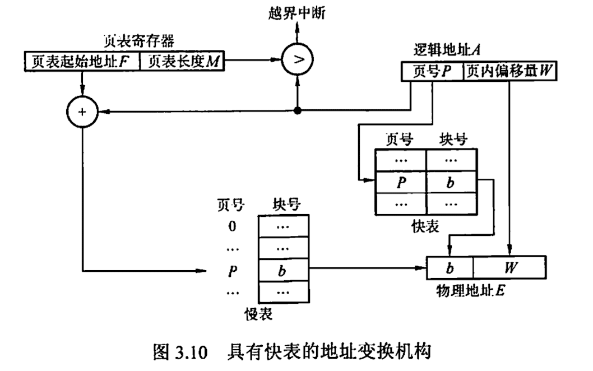

假设快表的命中率为 90%，访问一次快表时间为 20ns，访问一次内存时间为 100ns，那么按逻辑地址进行存取的平均时间为

$$
(100+20)\times 90\%+(100+100+20)\times(1-90\%)=130\,\mathrm{ns}
$$

> [!example]
> 某计算机有缓存内存辅助存储器来实现虚拟存储器。如果数据在缓存中访问数据需要 $A$ ns。如果数据在内存，但不在缓存，需要 $B$ ns 将其装入缓存，然后才能访问。如果数据不在内存，而在外层需要 $C$ ns将其读入内存，最后用碧娜秒再读入缓存。然后才能访问。假设缓存命中率为 $(n-1)/n$，内存命中率为 $(m-1)/m$ ，则数据平均访问时间是多少？
> 
> $$
> t=A\cdot{n-1\over n}+\left[(A+B)\cdot{m-1\over m}+(A+B+C)\cdot {1\over m}\right]\cdot {1\over n}
> $$

### 4.3. 分页存储管空间分配与去配

分页存储管理页框分配算法：

- 进行内存分配时，先检空闲块数能否满足用户进程的要求。若不能，则令进程等待；若能则查==位示图==，找出为零的那些位。占用标志从空闲块数中减去本次占用块数，按找到的位的位置计算所对应页框号，填入此进程的页表。
- 进程执行结束，归还内存时，根据归还的页框号计算出对应位在位是楚图中的位置，将占有标志清零，并将归还块数加入空闲块数中。

### 4.4. 分页存储空间页面共享和保护

#### 4.4.1. 页面共享和保护

在多道程序系统中，编译程序、编辑程序、解释程序、公共子程序、公用数据等都是可共享的。这些共享信息在内存中只需保留一个副本，分页存储管理能实现页面共享，共享页面信息，可大大提高内存空间利用率。

实现程序共享时，由于指令包含指向其他指令或数据的地址，程序依赖于这些地址才能执行。对于采用静态链接的页式存储管理要求，逻辑地址空间必须连续，也就是说，程序中每个逻辑地址的页号也是唯一和确定的，因而==多个进程只能以相同页号来共享程序==。

实现信息共享，必须解决共享信息保护问题。通常的做法是在页表中增加标志位，指出此页的信息只读/读写/只可执行/不可访问等。

#### 4.4.2. 运行时动态链接

运行时，动态链接需使用共享库，它包含共享函数的目标代码模块在运行时刻加载到任意内存区域，并在内存中和一个程序链接起来，这个过程称为动态链接，这是通过动态链接器来执行的。

### 4.5. 多级页表

> 为了压缩页表

把整个页表分割成许多小页表，每个称为页表页。它的大小与页框长度相同，于是每个页表页还有若干个页表表项。

为了找到页表页，应建立地址索引，称为页目录表。其表项指出页表页起始地址。系统为每个进程建一张页目录表，它在每个表项指出一个页表页。而页表页的每个表项给出页面和页框的对应关系。页目录表是一级页表，页表页是二级页表，共同构成两级页表机制。于是逻辑地址结构由 3 部分组成，==页目录位移、页表页位移、页内位移==。


每次访问都需要 3 次访存操作，需要快表加快速度。

### 4.6. 反置页表

原本页表为 `页表项` $\rightarrow$ `页框号` 的映射，反置页表将其反置，即存在 `页框号` $\rightarrow$ `页表项` 的映射。


## 5. 分段存储管理

### 5.1. 程序分段结构

主要目的是满足用户（程序员）编程和使用上的要求。仅仅分页能够达到逻辑地址与物理地址的映射，但页面与源程序不存在逻辑关系，难以对源程序==以模块为单位进行分配、共享和保护==。

应用程序由若干程序段组成，如主程序段、子程序段、数据段、工作区段等，从 0 编址，各有各的功能。

### 5.2. 基本原理

分段存储管理把进程的逻辑地址空间分成多段，提供二维的逻辑地址：

> [!note] 分段系统中的逻辑地址结构
> 
> | 段号 | 段内位移 |
> | ---- | -------- |

分段存储管理的实现基于可变分区存储管理原理。作业在分区内是连续存放的，但独立作业之间不一定连续存放。分段方法是以段为单位来划分和连续存放为作业的各段，分配一个连续内存空间，而各段之间不一定连续。

> [!note] 段表的结构
>
> | 段号 | 段长 | 本段在主存的起始地址 |
> | ---- | ---- | -------------------- |

在进行存储分配时，应为进入内存的作业建立段表，各段在内存中的情况可由段表来记录，它指出内存中各分段的段号、段起始位置、段长度。在撤销进程时，回收所占用的内存空间并清除此进程的段表。

段表用于实现从逻辑地址到物理内存区的映射

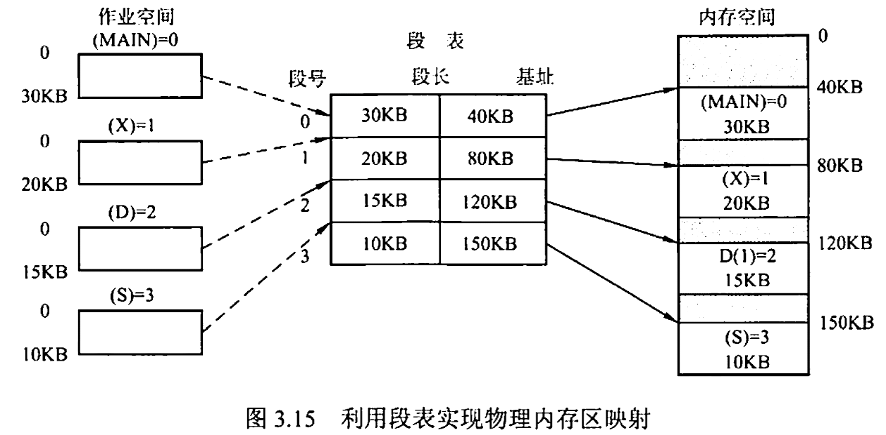

地址变换机构
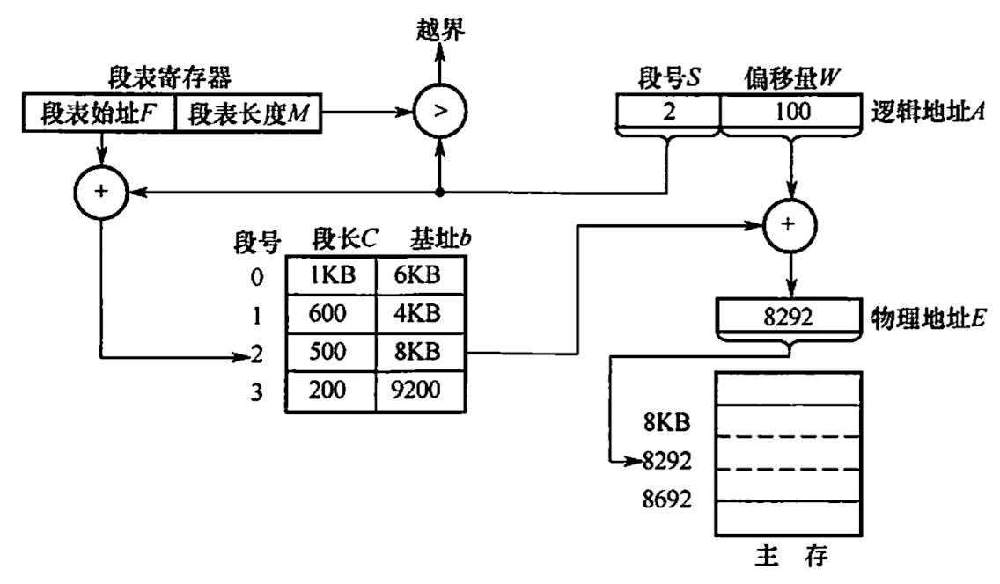

物理地址 = 基址 + 偏移量

### 5.3. 分段存储管理共享和保护

若多个进程段表中的某段指向内存相同地址，内存中以该处为起始地址的某段可以被共享。为了便于共享系统中常见建立一张共享段表用来记录所有共享段，内存包括段名、共享计数、段长、段首址、保护位等。

### 5.4. 分页和分段的比较

分段是信息的逻辑单位，由源程序的逻辑结构及含义所决定，使用户可见的段长，由用户根据需要来确定段起始地址，可从任何内存地址开始。在分段方式中源程序经链接装配后仍保持==二维地址结构==，引入目的是满足用户==模块化程序设计的需要==。

分页是信息的物理单位语言程序的逻辑结构无关，是用户不可见的，页长由系统（硬件）确定，页面只能从页大小的整数倍地址开始。在分页方式中，源程序经链接装配后变成==一维地址结构==。引入目的是实现==离散分配并提高内存利用率==。

分页存储管理能够有效地提高内存利用率，分段存储管理能反映程序的逻辑结构并有利于段的共享和保护。两种方法结合，形成了段页式存储管理方式。

在段页式系统中，作业的地址空间首先被分成若干逻辑段，每段都有自己的段号，然后每段分成若干固定大小的页。

作业的逻辑地址分为三部分

| 段号 $S$ | 页号 $P$ | 页内偏移量 $W$ |
| -------- | -------- | -------------- |

为了实现地址变换，系统为每个进程建立一张段表，每个分段有一张页表。段表表项中至少包括段号、页表长度和页表起始地址，页表表项中至少包括页号和块号。此外，系统中还应有一个段表寄存器，指出作业的段表起始地址和段表长度。

> [!caution] 在一个进程中，段表只有一个，而页表可能有多个。

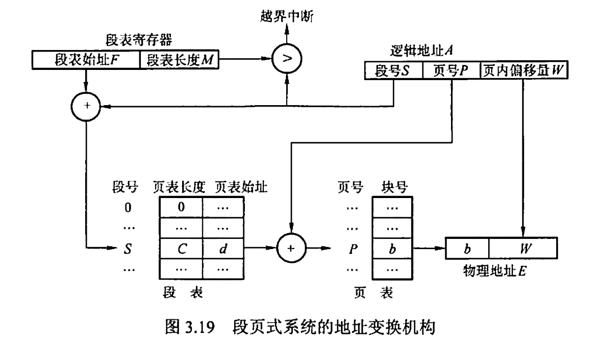

## 6. 虚拟存储管理

### 6.1. 虚拟存储器概念

把物理内存扩大到大容量，磁盘上把磁盘空间当做内存的一部分，进程的程序和数据通常部分放在内存中，部份放在磁盘上。

虚拟存储器的定义：在具有层次结构存储器的计算机系统中，自动实现部分装入和部分替换功能，能从逻辑上为用户提供一个比物理内存容量大的多的可寻址的“内存储器”。

虚存的实质是实现内存资源的==时分复用==，每次把应用程序的一部分装入内存运行，运行结束后被换出，再装入应用程序的另一部分到内存中运行。

### 6.2. 请求分页虚拟存储管理

#### 6.2.1. 请求分页虚存管理的硬件支持

操作系统的存储管理依靠低层硬件支撑来完成任务，此硬件称为存储管理部件 MMU，它提供地址转换和存储保护功能，并支持虚存管理和多任务管理。主要功能：

- 管理硬件页表基址寄存器
- 分解逻辑地址
- 管理快表
- 访问页表
- 发出异常
- 管理特征位

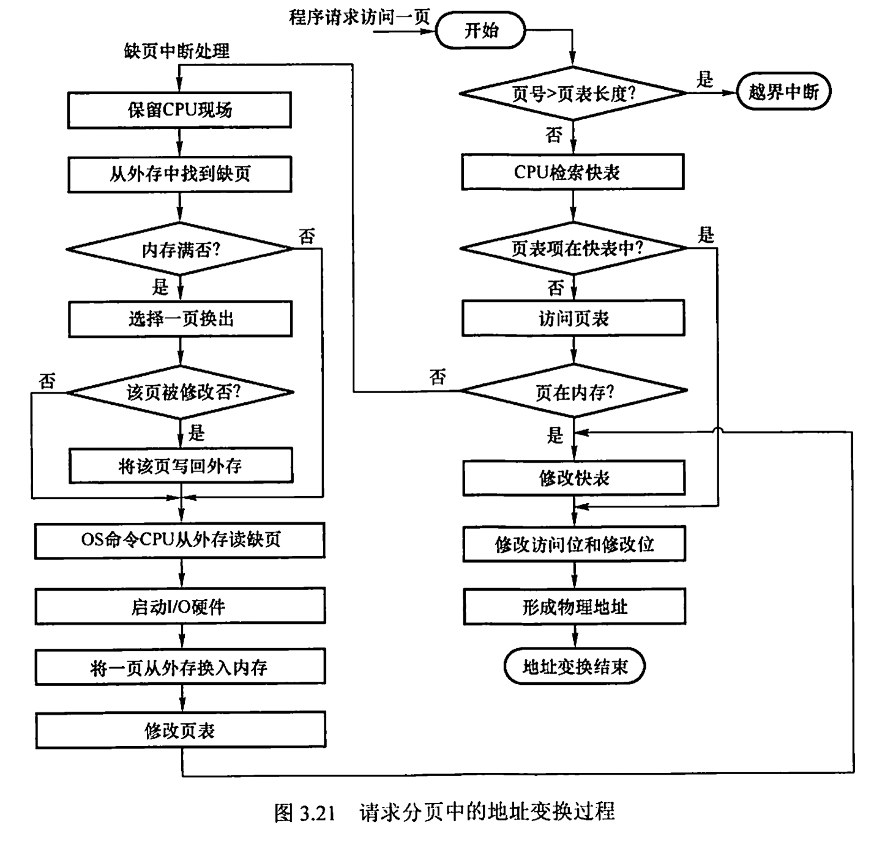

#### 6.2.2. 基本原理

请求分页虚存管理是将进程信息副本存放在外存中，当它被调度投入运行时，程序和数据没有全部装进内存，仅装入当前使用页面。进程执行过程中访问到不在内存的页面时，再由系统自动调入。

- 优点：进程的程序和数据按液分散存放在内存中，既有利于提高内存利用率，又有利于多道程序运行。
- 缺点：要有一定硬件支持，要进行缺页异常处理。机器成本增加，系统开销加大。此外，页面会出现碎片，如果页面较大，则内存仍有一定损失。

> [!tip] 特征
> - 多次性：无须在作业运行时一次性全部装入内存，而允许被分成多次调入内存运行。是虚拟存储器最重要的特征
> - 对换性：无须在作业运行时一直常驻内存，在进程运行期间，允许将那些暂不使用的程序和数据从内存调至外存的对换区（换出），待以后需要时再将它们从外存调至内存（换进）
> - 虚拟性：从逻辑上扩充内存的容量，使用户所看到的内存容量远大于实际内存容量

#### 6.2.3. 交换区

在虚存系统中内存只能为每个进程保存部分页面，当要访问的页面不存在时，就必须将其装入。显然新装入的页面将替换掉原有页面。而这个被替换的页面，有可能将来又要再次换入内存，不能简单地将它丢弃。于是，系统将该页面保存在外存上。

#### 6.2.4. 页面装入策略和清除策略

##### 请页式

当产生缺页异常时调入页面。

- 优点：为确保只有被访问页面才会调入，节省内存空间。
- 缺点：缺页异常处理次数多，调页系统开销大。

##### 预调式

在使用页面前预先调入内存，操作系统依据某种算法动态预测进程最可能访问的页面。尽量做到进程要访问的页面已调入内存且每次调入若干页面，而不是仅调入一页。

- 优点：减少 I/O 启动次数，节省寻道和搜索时间。
- 缺点：如果所调页面大多未被使用，则效率就很低。

#### 6.2.5. 页面分配策略

- 进程生命周期中页框数不变：固定分配
- 进程生命周期中页框数可变：可变分配

- 页面替换策略
    - 局部替换
    - 全局替换

> 在请求分页系统中，页面分配策略和页面置换策略不能组合使用的是固定分配和全局替换。

#### 6.2.6. 缺页中断率

当内存空间已满而又要装入新页时，必须按照预定算法把已在内存中的页面写回，这项工作称为页面替换，用来确定被淘汰页的算法称为淘汰算法。如果选用不时不合适的算法，会出现：刚被淘汰的页面立即又要调用，而调入不久，随即被淘汰。这种现象称为“抖动”。

缺页中断率 $f=F/A$，其中 $F$ 为访问不成功次数，$A$ 为访问总次数。影响 $f$ 的因素：

- 内存页框数
- 页面大小
- 页面替换算法
- 程序特性

#### 6.2.7. 全局页面替换算法

##### 最佳页面替换算法 OPT

根据==将来要访问的==来替换。由于进程调度不可预知，因此无法实际实现。

##### 先进先出 FIFO

最老的淘汰，不调整队列。

##### 最近最少使用 LRU

根据历史，最近最少用的页面淘汰。

###### 引用位法 NRU

通过 R 引用位，将页表分为两类

- 最近访问 1
- 最近未访问 0

经过 $t$ 的时间间隔，将所有 R 位置 0.

###### 多位计数器法

记录页面的访问次数，缺页时清零

###### 多位计时器法

记录访问的时间，经过 $t$ 时间，全部清零；置换时，找最老的页面替换

###### 老化算法

为每个页面设置一个多位寄存器。当页面被访问时，对应寄存器最左边置 1，每隔时间 $t$ 右移一位。发生缺页中断时，找到值最小的页面淘汰。

##### 第二次机会页面替换算法 SCR

把 FIFO 算法与页面中的“引用位”结合。

- 首先检查 FIFO 页面队列中的队首，这是最早进入内存的页面
    - 如果引用位为 `0`，那么长时间未被使用，淘汰
    - 如果引用位为 `1`，那么进入较早，但最近仍被使用，将引用位置 `0`，并放到队尾（即第二次机会）

##### 时钟置换算法 CLOCK

利用标准队列机制构造 FIFO 队列，SRC 算法可能产生频繁的入队和出队。

采用循环队列机制构造页面队列，形成环形表。队列指针相当于钟表指针，指向要淘汰的页面。算法只是 SCR 的改进。

- 一个页面首次被装入，`R=1`
- 内存中任何一个页面被访问，`R=1`
- 淘汰页面时，存储管理从指针当前志向的页面开始扫描循环队列，把所有遇到的 `R==1` 的页面置为 `R=0`，并跳过；如果遇到 `R==0` 那么淘汰，指针++
- 扫描循环队列时，如果遇到所有页面均 `R==1`，指针绕一圈，将遇到的置 `R=0`；指针停在起始位置，并淘汰这一页，指针++

##### 改进型时钟替换算法

考虑两方面：

- 最近被访问
- 最近被修改

因此，设置两个位来判断换出优先级—— `A` 访问位，`M` 修改位。有 4 种优先级

- `A == 0, M == 0` 最近未被访问，且未被修改
- `A == 0, M == 1` 最近未被访问，但被修改
- `A == 1, M == 0` 最近被访问，但未被修改
- `A == 1, M == 1` 最近被访问，而且被修改

换出时，从上到下的优先级换出

#### 6.2.8. 局部页面替换算法

##### 局部最佳页面替换算法 MIN

预知程序的页面引用串 (look forward)，在每一步考虑引用串。给定 $\tau$，间隔 $(t+t+\tau)$ 为滑动窗口，涵盖范围为 $[t,t+\tau]$

> [!example]
> $\tau=3$，4 个页框，求缺页率
> 
> |  时刻  |  0  |  1  |  2  |  3  |  4  |  5  |  6  |  7  |  8  |  9  | 10  | 11  | 12  | 13  |
> |:------:|:---:|:---:|:---:|:---:|:---:|:---:|:---:|:---:|:---:|:---:|:---:|:---:|:---:|:---:|
> | 引用串 |  1  |  2  |  3  |  1  |  4  |  5  |  1  |  2  |  1  |  4  |  5  |  3  |  4  |  5  |
> |   P1   |  A  |  A  |  A  |  A  |  A  |  A  |  A  |  A  |  A  |  A  |  A  |  -  |  -  |  -  |
> |   P2   |     |  A  |  A  |  A  |  A  |  A  |  A  |  A  |  A  |  A  |  A  |  A  |  A  |  A  |
> |   P3   |     |     |  A  |  A  |  A  |  -  |  -  |  -  |  -  |  -  |  -  |  A  |  A  |  A  |
> |   P4   |     |     |     |     |  A  |  A  |  A  |  A  |  A  |  A  |  A  |  A  |  A  |  A  |
> |   P5   |     |     |     |     |     |  A  |  A  |  A  |  A  |  A  |  A  |  A  |  A  |  A  |
> |   In   | P1  | P2  | P3  |     | P4  | P5  |     |     |     |     |     | P3  |     |     |
> |  Out   |     |     |     |     |     | P3  |     |     |     |     |     | P1  |     |     |
> 
> 缺页中断率为 $f=6/14=42.9\%$
> 

##### 工作集模型与工作集置换算法 WS

工作集 WS，使用滑动窗口概念，但并不向前 (look forward) 查看页面引用串，而是基于程序局部性原理向后看 (look back)。

> [!example]
> 
> 给定工作集窗口 $\Delta=3$，以及引用串，页面大小为 4，初始工作集为 (P5, P4, P1)，求工作集序列
> 
> 窗口所涵盖的范围为 $\Delta + 1=4$
> 
> | 时刻 t |  0  |  1  |  2  |  3  |  4  |  5  |  6  |  7  |  8  |  9  | 10  |
> |:------:|:---:|:---:|:---:|:---:|:---:|:---:|:---:|:---:|:---:|:---:|:---:|
> | 引用串 | P1  | P3  | P3  | P4  | P2  | P3  | P5  | P3  | P5  | P1  | P4  |
> |   P1   |  A  |  A  |  A  |  A  |  -  |  -  |  -  |  -  |  -  |  A  |  A  |
> |   P2   |  -  |  -  |  -  |  -  |  A  |  A  |  A  |  A  |  -  |  -  |  -  |
> |   P3   |  -  |  A  |  A  |  A  |  A  |  A  |  A  |  A  |  A  |  A  |  A  |
> |   P4   |  A  |  A  |  A  |  A  |  A  |  A  |  A  |  -  |  -  |  -  |  A  |
> |   P5   |  A  |  A  |  -  |  -  |  -  |  -  |  A  |  A  |  A  |  A  |  A  |
> |   In   |     | P3  |     |     | P2  |     | P5  |     |     | P1  | P4  |
> |  Out   |     |     | P5  |     | P1  |     |     | P4  | P2  |     |     |
> 
> 缺页中断率为 $f=5/11$

