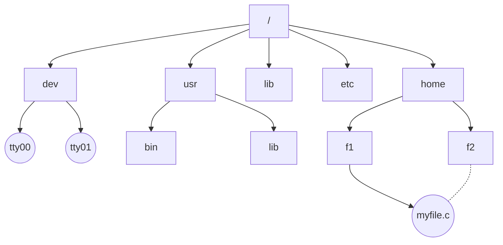

## 0. 文件系统的主要功能

- 文件的按名存取，实现逻辑文件到物理文件的转换
- 文件目录的建立和维护
- 文件的查找和定位
- 文件存储空间的分配和管理
- 提供文件的存取方法和文件存储结构
- 实现文件共享、保护和保密
- 提供一组易用的文件操作和命令
- 提供与设备管理交互的统一接口

## 1. 文件

### 1.1. 文件概念和命名

#### 1.1.1. 文件概念

OS 配备文件系统以适应系统资源管理和用户使用信息的需要。文件系统是由信息按一定结构方式组成，可持久性保存的抽象机制。

#### 1.1.2. 命名

各个操作系统的文件命名规则略有不同。通配符 `?` `*`，最长 255 字符

### 1.2. 文件类型和属性

#### 1.2.1. 文件类型

| 分类依据 |               分类               |
|:--------:|:--------------------------------:|
|   用途   |    系统文件、库文件、用户文件    |
| 保护级别 |        只读、读写、不保护        |
| 信息流向 | 输入文件、输出文件、输入输出文件 |
| 数据类型 |      源程序文件、可执行文件      |
| 设备类型 |   磁盘文件、磁带文件、光盘文件   |

#### 1.2.2. 文件属性

- 基本属性：文件名、扩展名、文件属主 ID、文件所属组 ID
- 类型属性：普通文件、目录文件、系统文件、隐式文件、设备文件
- 保护属性：规定谁能够访问、以何种方式访问
- 管理属性：创建时间、最后访问时间、最后修改时间
- 控制属性：文件逻辑结构信息

### 1.3. 文件存取方法

#### 1.3.1. 顺序存取

e.g. 磁带

需要从头开始扫描直到目标位置。

#### 1.3.2. 直接存取

e.g. 磁盘

可以随机存取。

#### 1.3.3. 索引存取

基于索引文件的存取方法，用户提供记录名或记录键之后，先按名搜索，再查找所需要的记录。

## 2. 文件目录

### 2.1. 文件控制块、文件目录、目录文件

#### 2.1.1. FCB 文件控制块

是操作系统，为每个文件建立的唯一数据结构，其中包含了全部文件属性，其目的是为方便操作系统对文件的管理控制和存取。于是，一个文件由两个部分组成：==FCB 和文件体==。

每创建一个文件，系统都要为其建立一个 FCB，记录文件的属性信息。存取时，先找 FCB，然后再找到文件信息盘块号、首块物理位置或索引表。

为加快文件查找速度，通常把 FCB 汇集和组织在一起形成文件目录。文件目录包含许多目录项，目录项有两种：

- 用于描述子目录
- 用于描述文件

目录项的格式按统一标准定义，全部由目录项所构成的文件称为目录文件，并保存在外存上，查找文件时调入内存工作区。与普通文件不同的是，目录文件永远不会空，它至少包含 2 个目录项：

- 当前目录 `.`
- 父目录项 `..`

文件目录的基本功能是将文件名转换成此文件信息在磁盘上的物理位置。

Linux：FCB 中的文件名和其他管理信息分开，其他信息单独组成一个数据结构，称为==索引节点 inode==，此索引节点的位置由 inode 号标识。于是，目录项中仅剩下文件名和 inode 号，称为基本目录项。因此一个磁盘块可以存放更多基本目录项系统对于由文件目录项组成的目录文件和普通文件同等对待，均存放在磁盘数据区中。文件系统中的每个文件都有一个磁盘 inode 与之对应，这些 inode 被集中存放于磁盘上的 inode 区。

### 2.2. 层次目录结构

根目录唯一，每一级目录可以是下一级目录的说明，也可以是文件的说明，从而形成树状的目录结构。

如果规定每个文件都只有一个父目录，称为纯树型目录结构，其缺点是文件的共享是不对称的，父目录有效的拥有此文件，其他被授权的用户必须经过属主目录才能对文件进行访问。

有向无环图目录尽管允许文件有多个父目录二破坏树状特性，但不同用户可以对称方式实现文件共享。

### 2.3. 文件目录检索

## 3. 文件组织与数据存储

### 3.1. 文件逻辑结构

#### 3.1.1. 文件结构

- 字节序列（流式文件）
- 记录序列（二维表）e.g. 注册表，SQL
- 树状结构（键值对）e.g. MongoDB

#### 3.1.2. 成组与分解

若干逻辑记录合并成一组，写入一块叫做==记录成组==，这时每块中的逻辑记录的个数，称为块因子。

把逻辑记录从块状分离出来的操作叫做记录的分解。

#### 3.1.3. 记录格式

#### 3.1.4. 记录键

### 3.2. 文件物理结构

#### 3.2.1. 顺序文件（连续分配）

将文件中逻辑上连续的信息存放到存储介质的相邻物理块上，形成顺序结构。这是一种逻辑记录顺序和物理块顺序完全一致的文件。（基于 LS）

缺点是建立文件之前需要预先确定文件长度，以便分配存储空间修改插入和添加文件记录有一定难度。对于变长记录的处理很困难，对磁盘做==连续分配会造成空闲块的浪费==。

#### 3.2.2. 连接文件（连接分配）

##### 隐式链接

相当于真正的链表，存储块的最后有一部分存放下一块的地址。缺点是读取文件需要从头部一直扫描到尾部。即链表的下一级指针不能直接看得到。

例如一个存储块为 1KB，则将其分为 1000B+24B，前面为数据部分，后面为下一个块的指针。

##### 显式连接

例如 FAT 表，表中存放了一系列的链表指针。Windows 采用这种方法。

> 0# 为引导块，1#为超级块，不可使用

![[public/os/s6_01.svg]]

#### 3.2.3. 索引文件

系统为每个文件建立索引表，可以有不同的索引形式

- 记录组成文件的磁盘块号
- 索引表项包含记录键及此盘块号

##### 单级索引

一个 1 KB 的块，其中存储了一系列索引。每个索引占 4B，共有 256 条索引，给个索引指向一个 1 KB 的盘块，所以文件最大为 256 KB。

![[public/os/s6_02.svg]]

##### 多级索引（二级为例）

一个 1 KB 的盘块中放了 256 个指针，这些指针指向的盘块中存放了==第二级指针==，第二级指针指向的盘块才指向时机的数据。因此文件最大为 256×256×1 KB=64 MB。

![[public/os/s6_03.svg]]

##### 混合索引

目录表项中共有 13 项。

- 0~9 项为直接地址，即指针直接指向存储数据的盘块号。
- 第 10 项为一级索引，这个指针指向了一个盘块，这个盘块中放了 256 个指针，这些指针指向了存储数据的盘块。
- 第 11 项为二级索引，这一指针指向了一个盘块，这个盘块中方了 256 个指针，每个指针又指向了一个存储指针的盘块，再其中的指针才指向实际存储数据的盘块。
- 第 12 项为三级索引，与上面类似。

因此，该方式的文件最大为

$$
\left(10+256+256^2+256^3\right)\times 1\,\mathrm{KB}\approx 16\,\mathrm{GB}
$$

另外，混合索引方式的特点为：==前面的索引没有用完，就不会开启下一级索引==。

![[public/os/s6_04.svg]]

## 3.3. 虚拟文件系统

VFS 为用户程序提供了文件系统操作的统一接口，屏蔽了不同文件系统的差异和实现细节。

![[public/os/os-vfs.png]]

Linux 中调用 `write()` 操作

![[public/os/os-linux-write-vfs.png]]

为了实现 VFS，Linux 主要抽象了四种对象类型。每个 VFS 对象读存放在一个适当的数据结构中，其中包括对象的属性和指向对象的方法（函数）表的指针

- 超级块对象：一个已安装（或称挂载）的特定文件系统
- 索引节点对象：一个特定的文件
- 目录表对象：一个特定的目录项
- 文件对象：一个与进程相关的已打开文件

![[public/os/os-chaojikuai-vfs.png]]

## 4. 文件系统功能及实现

### 4.3. 文件空间管理

在磁盘等大容量外层空间中用户作业，运行期间经常要建立、扩充和删除文件，文件系统应能自动管理和控制外存文件空间。在创建和扩充文件时，决定分配哪些磁盘块是很重要的，直接会影响到今后的磁盘访问次数。删除文件或缩短其长度时，需回收磁盘块，并把磁盘块移入空闲队列。

#### 4.3.1. 空闲表法

| 起始盘块号 | 块数  |        说明        |
|:----------:|:-----:|:------------------:|
|     0      | 10000 |   0~9999 为空闲    |
|   15000    |  200  | 15000~15199 为空闲 |
|    ...     |  ...  |        ...         |

#### 4.3.2. 空闲链表法

将空闲块组成一个链表，分配时将链表内填入数据，并让下一个节点作为链表头。

#### 4.3.3. 位示图法

用若干字节构成一张位示图，其中每一个字位对应于一个物理块，字位的次序与块的相对次序一致。`0` 表示空闲，`1` 表示占用。

|  7  |  6  |  5  |  4  |  3  |  2  |  1  |  0  |
|:---:|:---:|:---:|:---:|:---:|:---:|:---:|:---:|
|  0  |  0  |  0  |  0  |  0  |  0  |  0  |  1  |
|  0  |  0  |  1  |  1  |  0  |  0  |  0  |  0  |
| ... | ... | ... | ... | ... | ... | ... | ... | 

#### 4.3.4. 成组链表法

假设每个盘块 1 KB。使用一些块作为==栈==，在栈中存储空闲块的指针，栈底存放==下一个栈的地址==，同时带有该栈顶的偏移量（代表着该栈记录的空闲块的个数）。

每次分配时，从第一个栈的栈顶开始分配，同时计数值减一，直至这个栈被分配完，那么这个原本用于存放指针的栈，就变为了纯粹==存放数据的块==。与此同时，下一个栈就成为了新的专用块。

![[public/os/s6_05.svg]]

#### 4.3.5. 文件共享

##### 1. 基于索引节点的共享方式（硬链接）

在树形结构的目录中，当有两个或多个用户要共享一个子目录或文件时，必须将共享文件或子目录链接到两个或多个用户的目录中，才能方便地找到该文件。

![[public/os/os-wenjian-yinglianjie.png]]

这种共享方式中，注入文件的物理地址及其他的文件属性等信息，不再放在目录项中，二放在索引节点中。在文件目录中只设置文件名及指向相应索引节点的指针。在索引节点中应有一个链接计数 `count`，用于表示链接到本索引节点上的用户目录项的数目。

![[public/os/os-yinglianjie2.png]]

##### 2. 利用符号链实现文件共享（软链接）

由系统创建一个 `LINK` 类型的新文件，也取名为 `F`，并将该文件写入用户 B 的目录中，以实现用户 B 的目录与文件 `F` 的链接。在新文件中只包含被链接文件 `F` 的路径名。

当用户 B 要访问被链接的文件 `F` 且正要读 `LINK` 类新文件时，操作系统查看要读的文件是 `LINK` 类型，则根据该文件的路径名去找到文件 `F`，然后对它进行读，从而实现共享。这种链接也被称为==符号链接==。

在利用符号链方式实现文件共享时，只有文件主才有指向其索引节点的指针。共享该文件的其他用户只有该文件的路径名，并不拥有指向其索引节点的指针。

硬链接和软链接都是文件系统中的静态共享方法，在文件系统中还存在着另外的共享需求，即两个进程同时对同一个文件进行操作，这样的共享称为动态共享。

硬链接的查找速度要比软链接快。

### 小结

#### 1. 文件的物理分配方式的比较

|          | 访问第 $n$ 条记录       | 优点                                                                 | 缺点                                                         |
| -------- | ----------------------- | -------------------------------------------------------------------- | ------------------------------------------------------------ |
| 连续分配 | 访问磁盘 1 次           | 顺序存取时速度快，文件定长时可根据文件起始地址及记录长度进行随机访问 | 文件存储要求连续的存储空间，会产生碎片，不利于文件有动态扩充 |
| 链接分配 | 访问磁盘 $n$ 次         | 可解决外存的碎片问题，提高外存空间的利用率，动态增长较方便           | 只能按照文件的指针链接顺序访问，查找效率低                   |
| 索引分配 | $m$ 级访问磁盘 $m+1$ 次 | 可以随机访问，文件易于增删                                           | 索引表增加存储空间的开销，索引表的查找策略对文件系统效率影响较大                                                             |

#### 2. 文件打开过程的描述

1. 检索目录，要求打开的文件应该是已经创建的文件，它应登记在文件目录中，否则会出错。在检索到指定文件后，就将其磁盘 iNode 复制到活动 iNode 表中
2. 把参数 mode 所给出的打开方式与活动 iNode 中在创建文件时所记录的文件访问权限相比较，如果合法，则此次打开操作成功
3. 当打开合法时，为文件分配用户打开文件表表项和系统打开文件表表项，并为后者设置初值，通过指针建立表项与活动 iNode 之间的关系，再把文件描述符 fd 返回给调用者

