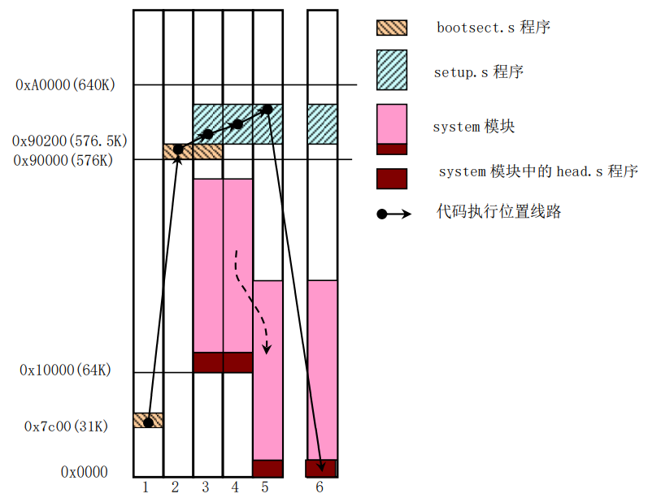
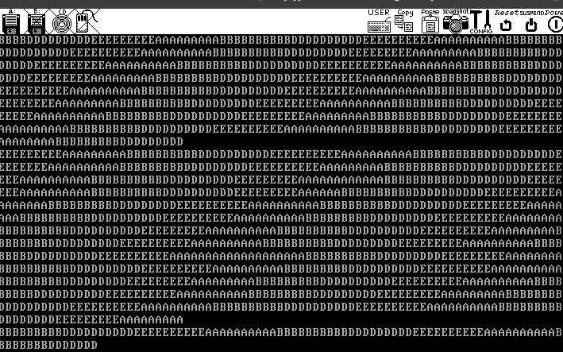
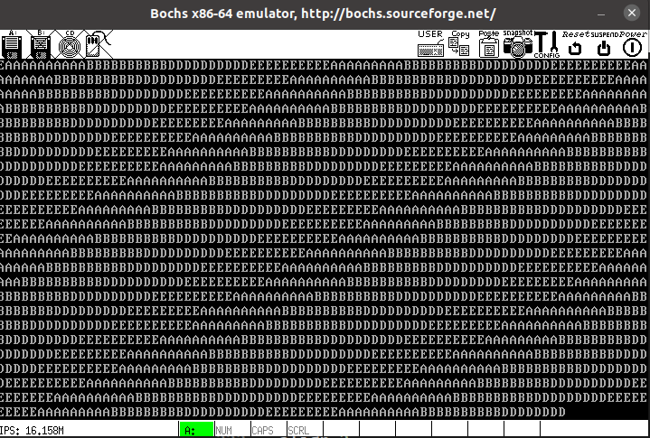
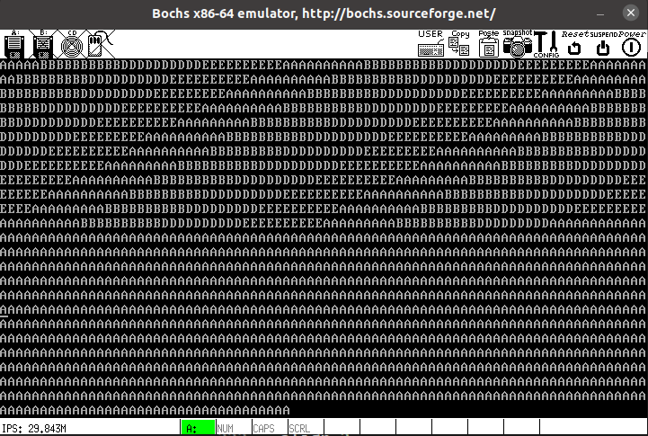
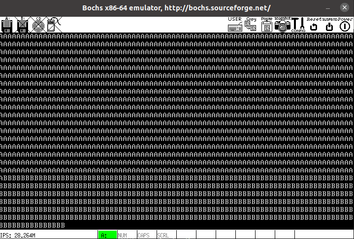
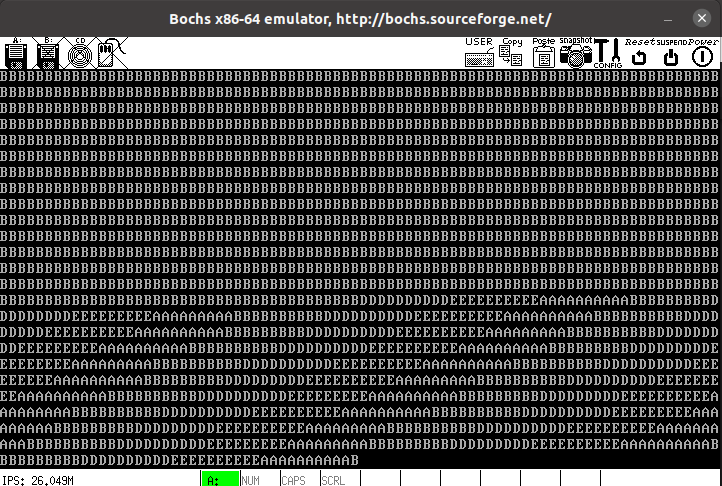

## 1. 实验内容

修改 Linux 0.00 源代码，使得它能够完成下面的功能

1. 增加两个进程，使得整个操作系统有 4 个用户进程
2. 修改 write_char 的功能，使得字符输出模式为滚屏
3. 增加键盘中断，当按下键盘按键时，能够切换到相应的进程

## 2. 实验环境

|项目|详情|
|:---:|:---:|
|实验平台|Ubuntu 20.04|
|开发环境|gcc-3.4, bin86, i386 等 |
|环境参考|https://github.com/Wangzhike/HIT-Linux-0.11.git|
|实验工具|bochs, Linux 0.00 源码|

## 3. 代码分析

### 3.1. BOOT.S

BOOT.S 作为磁盘的引导程序，在 PC  启动，进入实模式后，会进行引导，关闭中断，并使得系统进入保护模式。

```asm
! now we want to move to protected mode ...
ok_load:
    cli         ! no interrupts allowed ! 关中断
    mov ax, #SYSSEG
    mov ds, ax          ! ds = 0x10000
    xor ax, ax
    mov es, ax          ! es = 0x0
    mov cx, #0x2000
    sub si,si           ! ds : si = 0x10000 : 0000
    sub di,di           ! es : di = 0x00000 : 0000
    rep                 ! 移动内存，0x10000 => 0x00000
    movw
    mov ax, #BOOTSEG
    mov ds, ax          ! ds = 0x7c00
    lidt    idt_48      ! load idt with 0,0
    lgdt    gdt_48      ! load gdt with whatever appropriate

! absolute address 0x00000, in 32-bit protected mode.
    mov ax,#0x0001  ! protected mode (PE) bit
    lmsw    ax      ! This is it ! lmsw是加载机器状态字指令，后接16位寄存器或者内存地址
    ! 其功能是用源操作数的低4位加载CR0，也就是说仅会影响CR0的低4位——PE, MP, EM, TS。
    jmpi    0,8     ! jmp offset 0 of segment 8 (cs)
```



在其间，会将 IDT，GDT 加载。GDT 中，第一段不用，规定代码段和数据段。

```asm
gdt:    .word   0,0,0,0     ! dummy
    ! 第1个描述符定义了一个代码段，其基地址为0，界限值是0x7FF(10进制2047)，
    ! 粒度4KB，DPL=0，非一致性，可读可执行。因为粒度是4KB，所以段长度是(2047+1)*4KB=8MB
    .word   0x07FF      ! 8Mb - limit=2047 (2048*4096=8Mb)
    .word   0x0000      ! base address=0x00000
    .word   0x9A00      ! code read/exec 只读
    .word   0x00C0      ! granularity=4096, 386
    ! 第2个描述符定义了一个数据段，其基地址为0，
    ! 界限值是0x7FF(10进制2047)，粒度4KB，DPL=0，向上扩展，可读可写。同上，段长度是8MB
    .word   0x07FF      ! 8Mb - limit=2047 (2048*4096=8Mb)
    .word   0x0000      ! base address=0x00000
    .word   0x9200      ! data read/write 可读可写
    .word   0x00C0      ! granularity=4096, 386
```

### 3.2. HEAD.S

HEAD.S 是运行在保护模式下的代码，它会加载各个数据段寄存器，重新设置 256 项 IDT，指向一个只会输出字符 `C` 的哑中断子程序 `ignore_int`。

```asm
setup_gdt:
    lgdt lgdt_opcode        # 加载 GDT
    ret

setup_idt:
    lea ignore_int,%edx     # 哑中断基址 => %edx
    movl $0x00080000,%eax   # cs = 0x0008
    movw %dx,%ax            # selector = 0x0008 = cs
    movw $0x8E00,%dx        # interrupt gate - dpl=0, present
    lea idt,%edi            # 中断向量表基址 => %edi
    mov $256,%ecx           # 循环次数
rp_sidt:                    # %eax 中放了 cs:哑中断基址
    movl %eax,(%edi)        # 将哑中断门描述符存入表中
    movl %edx,4(%edi)
    addl $8,%edi
    dec %ecx
    jne rp_sidt             # 将 256 个中断全部置为哑中断
    lidt lidt_opcode        # 加载中断描述符表寄存器值
    ret
```

更改 GDT 表，其中需加载进程的 TSS 和 LDT。

```asm
gdt:    .quad 0x0000000000000000    # NULL descriptor           # 第 0 号不用
    .quad 0x00c09a00000007ff        # 8Mb 0x08, base = 0x00000  # 第 1 号只读代码段
    .quad 0x00c09200000007ff        # 8Mb 0x10                  # 第 2 号可读可写数据段
    .quad 0x00c0920b80000002        # screen 0x18 - for display # 第 3 号为显存

    .word 0x0068, tss0, 0xe900, 0x0 # TSS0 descr 0x20
    .word 0x0040, ldt0, 0xe200, 0x0 # LDT0 descr 0x28
    .word 0x0068, tss1, 0xe900, 0x0 # TSS1 descr 0x30
    .word 0x0040, ldt1, 0xe200, 0x0 # LDT1 descr 0x38
```

更改 GDT 后重新加载所有的段寄存器，而后初始化 8253 计数器。

在以上工作完成后，重新更改 **时钟中断（中断向量号 0x08）** 和 **系统中断（中断向量号0x80）**，使得他们能够正常响应。在这一步，其实初始化了内核。

```asm
## setup timer & system call interrupt descriptors.
    movl $0x00080000, %eax          # cs = 0x0008
    movw $timer_interrupt, %ax      # %eax 中放时钟中断基址
    movw $0x8E00, %dx               # (?)
    movl $0x08, %ecx                # 时钟中断向量号为 08H
    lea idt(,%ecx,8), %esi          # 更改第 8 项中断(每个中断占 8 Byte)
    movl %eax,(%esi) 
    movl %edx,4(%esi)
    movw $system_interrupt, %ax     # 系统中断基址
    movw $0xef00, %dx               # 没有做模式切换, 状态没有从 11B 变为 00B (?)
    movl $0x80, %ecx                # 系统中断向量号为 80H
    lea idt(,%ecx,8), %esi          # 更改系统中断
    movl %eax,(%esi)
    movl %edx,4(%esi)
```

最后，为 task0 的启动做一些准备。

```asm
## Move to user mode (task 0)  为启动任务 0 做准备
    pushfl                  # eflags 入栈
    andl $0xffffbfff, (%esp) # 置 flag, 中断位清零
    popfl
    movl $TSS0_SEL, %eax
    ltr %ax                 # 加载 TSS
    movl $LDT0_SEL, %eax
    lldt %ax                # 加载 LDT
    movl $0, current        # 准备启动 0
    sti                     # 开中断
    pushl $0x17             # 压 ss
    pushl $init_stack       # 压用户栈, init_stack 成为 task0 的用户栈
    pushfl                  # 压 eflag
    pushl $0x0f             # 压 cs, cs 末 2 位为 11B, 即进入 11 用户级(00 为内核级)
    pushl $task0            # 压 eip
    iret                    # 返回时自动弹出, 进入 task0, 因此 tss0 表内容得以初始化
```

至此，Linux 0.00 的系统启动完成，task0 开始执行，init_stack 也成为了 task0 的用户栈。在时钟中断发生时，task0 和 task1 会轮流被调度，其过程中会调用系统中断，并输出字符 `A` 或 `B`。

## 4. 具体实现

主要对 HEAD.S 进行修改，实现目标功能。

### 4.1. 增加两个进程

定义 task2 和 task3 的任务状态段和 LDT。

```asm
TSS2_SEL    = 0x40  # 任务状态段 2, 占 8 Byte
LDT2_SEL    = 0x48  # 局部描述符表 2, 占 8 Byte
TSS3_SEL    = 0x50  # 任务状态段 3, 占 8 Byte
LDT3_SEL    = 0x58  # 局部描述符表 3, 占 8 Byte
```

在 LDT 和 GDT 加载时，进程的栈空间得以加载，因此需要在 GDT 中增加进程的 TSS 和 LDT 表项。

```asm
gdt:    .quad 0x0000000000000000    # NULL descriptor           # 第 0 号不用
    # ...
    .word 0x0068, tss2, 0xe900, 0x0 # TSS2 descr 0x40           # 进程 2
    .word 0x0040, ldt2, 0xe200, 0x0 # LDT2 descr 0x48
    .word 0x0068, tss3, 0xe900, 0x0 # TSS2 descr 0x50           # 进程 3
    .word 0x0040, ldt3, 0xe200, 0x0 # LDT2 descr 0x58
```

添加进程段，此处展示进程 2 的表项，进程 3 与之类似。

```asm
.align 8
ldt2:   .quad 0x0000000000000000    # 0 号不用
    .quad 0x00c0fa00000003ff        # 0x0f, base = 0x00000, 1 号只读
    .quad 0x00c0f200000003ff        # 0x17                  2 号可读可写

tss2:   .long 0                         /* back link */
    .long krn_stk2, 0x10                /* esp0, ss0 */
    .long 0, 0, 0, 0, 0                 /* esp1, ss1, esp2, ss2, cr3 */
    .long task2, 0x200                  /* eip, eflags */
    .long 0, 0, 0, 0                    /* eax, ecx, edx, ebx */
    .long usr_stk2, 0, 0, 0             /* esp, ebp, esi, edi */
    .long 0x17,0x0f,0x17,0x17,0x17,0x17 /* es, cs, ss, ds, fs, gs */
    .long LDT2_SEL, 0x8000000           /* ldt 段选择符, trace bitmap */

    .fill 128,4,0
krn_stk2:
```

添加进程 2 和进程 3 的“主代码”，并定义用户栈。

```asm
task2:
    movl $0x17, %eax
    movw %ax, %ds               # 使用 ldt 表的第 2 项
    mov $68, %al                # %al 中放入 D 的 ASCII 码
    int $0x80                   # 调用系统中断, 输出字符
    movl $0xfff, %ecx
1:  loop 1b                     # 延迟
    jmp task2

task3:
    movl $0x17, %eax
    movw %ax, %ds               # 使用 ldt 表的第 2 项
    mov $69, %al                # %al 中放入 E 的 ASCII 码
    int $0x80                   # 调用系统中断, 输出字符
    movl $0xfff, %ecx
1:  loop 1b                     # 延迟
    jmp task3

    .fill 128,4,0 
usr_stk1:
    .fill 128,4,0 
usr_stk2:
    .fill 128,4,0 
usr_stk3:
```

修改时钟中断处理程序，使之能够在任务 0 到 3 之间轮流调度。

```asm
.align 2
timer_interrupt:        # 时钟中断 (TODO)
    push %ds
    pushl %eax          # 保护现场
    movl $0x10, %eax
    mov %ax, %ds        # 使用 gdt 表的第 2 项
    movb $0x20, %al     # 
    outb %al, $0x20     # 8259A 恢复中断

    movl $0, %eax
    cmpl %eax, current  # 判断当前进程是否为 0
    je 1f               # 为 0 则跳到 1 处, 切换为进程 1

    movl $1, %eax
    cmpl %eax, current  # 判断当前进程是否为 1
    je 2f               # 为 1 则跳到 2 处, 切换为进程 2

    movl $2, %eax
    cmpl %eax, current  # 判断当前进程是否为 2
    je 3f               # 为 2 则跳到 3 处, 切换为进程 3

    movl $3, %eax
    cmpl %eax, current  # 判断当前进程是否为 3
    je 4f               # 为 3 则跳到 4 处, 切换为进程 0

1:  
    movl $1, current    # 设置进程为 1
    ljmp $TSS1_SEL, $0  # 跳转到进程 1, 存下当前快照
    jmp 5f
2:  
    movl $2, current    # 设置进程为 2
    ljmp $TSS2_SEL, $0  # 跳转到进程 2, 存下当前快照
    jmp 5f
3:  
    movl $3, current    # 设置进程为 3
    ljmp $TSS3_SEL, $0  # 跳转到进程 3, 存下当前快照
    jmp 5f
4:  
    movl $0, current    # 设置进程为 0
    ljmp $TSS0_SEL, $0  # 跳转到进程 0, 存下当前快照
5:  
    popl %eax           # 恢复现场
    pop %ds
    iret
```

### 4.2. 将字符的显示模式更改为“滚屏”

显存的起始地址为 0xb8000，而显示器为 $80\times 25$ 共 2000 个字，每个字的高字节 放 ASCII 码，低字节放显示的颜色。


此处，主要修改 write_char 子程序的代码，思路如下：

- 当光标移动到最下方时，将这些字符全部向上移动一行，并将最下面一行清空
- 将光标移动到最下面一行的行首

```asm
write_char:
    push %gs                # 保存现场
    pushl %ebx
    mov $SCRN_SEL, %ebx     # 显存的段选择子
    mov %bx, %gs            # 放入 %gs
    mov scr_loc, %bx        # %bx 中放光标位移(其实是偏移)
    shl $1, %ebx            # 左移, 写高字节(高字节表示 ASCII 码值)
    movb %al, %gs:(%ebx)    # 将 %al 的内容写到光标处
    shr $1, %ebx            # 右移恢复
    incl %ebx               # 指针后移
    cmpl $2000, %ebx        # 与 2000 相比
    jb 2f                   # 如果 ebx < 2000, 则跳转到 2f
    call roll_screen        # 大于等于 2000 时，调用 roll_screen
    movl $1920, %ebx        # 最下面一行的行首
2:  movl %ebx, scr_loc      # 直接将 ebx 赋值给 scr_loc, 返回
    popl %ebx               # 恢复现场
    pop %gs
    ret

.align 2
roll_screen:
    # ebx >= 2000 时, 将屏幕上的字符向上滚动
    push %ds
    mov $SCRN_SEL, %ebx     # 获取显存段地址(0xb8000)
    mov %bx, %ds
    mov %bx, %es
    movl $160, %ebx
    movl %ebx, %esi         # DS:esi (源地址)
    movl $0, %ebx
    movl %ebx, %edi         # ES:edi (目的地址)
    movl $1920, %ecx        # 循环次数
    cld                     # 清除增量位(向后移动, 即 si <= si + 2, di <= di + 2)
    rep 
    movsw                   # 使用 rep 指令前缀, 用 movw 搬动字符
    
    movl $80, %ecx          # 将最下面一行清空
    pushl %eax
    movl $0x0700, %eax      # 背景色黑, 前景色白, 字符为 00H
    cld
    rep
    stosw                   # 将 ax 寄存器的内容送到 di 指向的单元中
    popl %eax
    pop %ds
    ret
```

另外，在进程切换的过程中，也会出现一些例如空行的问题。其原因如下：

- 全局变量 `scr_loc` 代表光标的偏移位置，这个变量为所有进程共享
- 在进程调度时，有可能发生下面的情况：进程 A 还未执行结束，进程 B 就已经抢占了 `scr_loc` 这个共享资源，导致进程 A 没有执行结束（即字符未打印完），而 `scr_loc` 的值已经被修改



由于在该系统中还没有涉及到 **互斥信号量** 的概念，因此只能采用屏蔽中断的方法来进行改善。具体实现方法为：在系统中断调用 write_char 方法的前后分别使用 `cli` 和 `sti` 指令关中断和开中断。

### 4.3. 添加键盘中断

在 HEAD.S 程序中，有一个全局的变量 `current`，代表着当前处于哪一个进程。在此处我们需要添加一个与键盘相关的标志 `key_en` 来表示当前处于键盘控制的进程中，不使用时钟中断进行进程的调度。

```asm
key_en:.long 0          # 处于键盘中断对应的进程中
```

因此，需要在时钟中断处理程序中，增加判断，若 `key_en` 为有效值，则直接跳过该处理程序。

```asm
timer_interrupt:
    # ... 保护现场及 8259 恢复中断
    movl $0, %eax       # 将 key_en 与 false 比较
    cmpl %eax, key_en   # 若相等，则使用默认的轮流调度
    jne 5f              # 否则使得某个进程单独被调度（跳出时钟中断处理程序）
    # ... 进程轮流调度程序
5:  popl %eax           # 恢复现场
    pop %ds
    iret
```

键盘中断处理程序中，通过 0x60 端口读取键盘码，进行比较后调用相应的程序 来处理进程的调度。

```asm
.align 2
keyboard_interrupt:
    pushl %edx          # 保护现场
    pushl %ecx
    pushl %ebx
    pushl %eax
    push %ds
    push %es

    movl $0x10, %eax    # 将 ds, es 设置为内核数据段
    mov %ax, %ds
    mov %ax, %es

    movb $0x20, %al     # 发出 8259 中断结束信号
    outb %al, $0x20

    xorb %al, %al       # 清除 al 和标志位
    inb $0x60, %al      # 读取端口
    cmpb $0x1e, %al     # 与 A 的键码比较
    je 1f               # 切换到进程 0
    cmpb $0x30, %al     # 与 B 的键码比较
    je 2f               # 切换到进程 1
    cmpb $0x20, %al     # 与 D 的键码比较
    je 3f               # 切换到进程 2
    cmpb $0x12, %al     # 与 E 的键码比较
    je 4f               # 切换到进程 3
    cmpb $0x2e, %al     # 与 C 的键码比较
    je 5f               # 切换回分时调度
    jmp 6f              # 这句非常迷惑，但相当关键，相当于 switch 中的 default
    # 作用是在默认情况下直接退出键盘中断处理程序，否则会默认继续执行下面的程序
1:
    call set_e0         # 切换到进程 0
    jmp 6f
2:
    call set_e1         # 切换到进程 1
    jmp 6f
3:
    call set_e2         # 切换到进程 2
    jmp 6f
4:
    call set_e3         # 切换到进程 3
    jmp 6f
5:  
    call set_cl         # 切换回分时调度
6:
    pop %es             # 恢复现场
    pop %ds
    popl %eax
    popl %ebx
    popl %ecx
    popl %edx
    iret
```

调度程序中，设置 `current` 的值并使用 `ljmp` 指令跳转到相应的进程中。

注意：当处于进程 A 时，它不能调度到本身所在的进程，否则就会触发一些错误，导致操作系统重新引导。因此，在调度之前，需要进行一个判断。

```asm
.align 8
set_e0:
    movl $1, key_en    # 强制进入键盘中断
    cmpl $0, current    # 判断当前进程是否为 0
    je 1f               # 若是，则无需进行进程调度
    movl $0, current    # 指定当前进程为 0
    ljmp $TSS0_SEL, $0  # 调度到进程 0
1:  ret

.align 8
set_e1:
    movl $1, key_en     # 强制进入键盘中断
    cmpl $1, current    # 判断当前进程是否为 1
    je 1f               # 若是，则无需进行进程调度
    movl $1, current    # 指定当前进程为 1
    ljmp $TSS1_SEL, $0  # 调度到进程 1
1:  ret

.align 8
set_e2:
    movl $1, key_en     # 强制进入键盘中断
    cmpl $2, current    # 判断当前进程是否为 2
    je 1f               # 若是，则无需进行进程调度
    movl $2, current    # 指定当前进程为 2
    ljmp $TSS2_SEL, $0  # 调度到进程 2
1:  ret

.align 8
set_e3:
    movl $1, key_en     # 强制进入键盘中断
    cmpl $3, current    # 判断当前进程是否为 3
    je 1f               # 若是，则无需进行进程调度
    movl $3, current    # 指定当前进程为 3
    ljmp $TSS3_SEL, $0  # 调度到进程 3
1:  ret

.align 8
set_cl:
    movl $0, key_en     # 强制退出键盘中断
    ret
```

## 5. 运行结果

4 个进程轮流调度及滚屏。



按下键盘的 ABDE 键，分别切换到进程 0123.





按下键盘的 C 键，恢复到时钟中断轮流调度。



## 6. 附录：程序代码

### 6.1. boot.s

```asm
!   boot.s
!
! It then loads the system at 0x10000, using BIOS interrupts. Thereafter
! it disables all interrupts, changes to protected mode, and calls the 

BOOTSEG = 0x07c0            ! BOOT 将会被加载到内存的绝对地址 0x7C00 处
SYSSEG  = 0x1000            ! system loaded at 0x10000 (65536).
SYSLEN  = 17                ! sectors occupied.

entry start
start:
    jmpi    go,#BOOTSEG     ! （段间）长跳转到 0x7c00 + go(偏移量) 处
go: mov ax,cs
    mov ds,ax
    mov ss,ax
    mov sp,#0x400           ! arbitrary value >>512

! ok, we've written the message, now
load_system:
    mov dx,#0x0000
    mov cx,#0x0002
    mov ax,#SYSSEG
    mov es,ax
    xor bx,bx
    mov ax,#0x200+SYSLEN
    int     0x13
    jnc ok_load
die:    jmp die

! now we want to move to protected mode ...
ok_load:
    cli         ! no interrupts allowed ! 关中断
    mov ax, #SYSSEG
    mov ds, ax          ! ds = 0x10000
    xor ax, ax
    mov es, ax          ! es = 0x0
    mov cx, #0x2000
    sub si,si           ! ds : si = 0x10000 : 0000
    sub di,di           ! es : di = 0x00000 : 0000
    rep                 ! 移动内存，0x10000 => 0x00000
    movw
    mov ax, #BOOTSEG
    mov ds, ax          ! ds = 0x7c00
    lidt    idt_48      ! load idt with 0,0
    lgdt    gdt_48      ! load gdt with whatever appropriate

! absolute address 0x00000, in 32-bit protected mode.
    mov ax,#0x0001  ! protected mode (PE) bit
    lmsw    ax      ! This is it ! lmsw是加载机器状态字指令，后接16位寄存器或者内存地址
    ! 其功能是用源操作数的低4位加载CR0，也就是说仅会影响CR0的低4位——PE, MP, EM, TS。
    jmpi    0,8     ! jmp offset 0 of segment 8 (cs)


! 定义了三个段描述符，其中第一个段不可用
gdt:    .word   0,0,0,0     ! dummy

    ! 第1个描述符定义了一个代码段，其基地址为0，界限值是0x7FF（10进制2047），
    ! 粒度4KB，DPL=0，非一致性，可读可执行。因为粒度是4KB，所以段长度是(2047+1)*4KB=8MB
    .word   0x07FF      ! 8Mb - limit=2047 (2048*4096=8Mb)
    .word   0x0000      ! base address=0x00000
    .word   0x9A00      ! code read/exec
    .word   0x00C0      ! granularity=4096, 386

    ! 第2个描述符定义了一个数据段，其基地址为0，
    ! 界限值是0x7FF（10进制2047），粒度4KB，DPL=0，向上扩展，可读可写。段长度是8MB
    .word   0x07FF      ! 8Mb - limit=2047 (2048*4096=8Mb)
    .word   0x0000      ! base address=0x00000
    .word   0x9200      ! data read/write
    .word   0x00C0      ! granularity=4096, 386

idt_48: .word   0           ! idt limit=0
    .word   0,0             ! idt base=0L
gdt_48: .word   0x7ff       ! gdt limit=2048, 256 GDT entries
    .word   0x7c00+gdt,0    ! gdt base = 07xxx
.org 510
    .word   0xAA55

```

### 6.2. head.s

```asm
##  head.s contains the 32-bit startup code.
##  Two L3 task multitasking. The code of tasks are in kernel area, 
##  just like the Linux. The kernel code is located at 0x10000. 
SCRN_SEL    = 0x18  # 显存段
TSS0_SEL    = 0x20  # 任务状态段 0, 占 8 Byte
LDT0_SEL    = 0x28  # 局部描述符表 0, 占 8 Byte
TSS1_SEL    = 0x30  # 任务状态段 1, 占 8 Byte
LDT1_SEL    = 0x38  # 局部描述符表 1, 占 8 Byte
TSS2_SEL    = 0x40  # 任务状态段 2, 占 8 Byte
LDT2_SEL    = 0x48  # 局部描述符表 2, 占 8 Byte
TSS3_SEL    = 0x50  # 任务状态段 3, 占 8 Byte
LDT3_SEL    = 0x58  # 局部描述符表 3, 占 8 Byte

.code32
.global startup_32
.text
startup_32:
    movl $0x10,%eax
    mov %ax,%ds
##   mov %ax,%es
    lss init_stack,%esp     # init_stack => ss:%esp

## setup base fields of descriptors.
    call setup_idt          # 建立 ldt 表
    call setup_gdt          # 建立 gdt 表
    movl $0x10,%eax         # reload all the segment registers 
    mov %ax,%ds             # after changing gdt. 
    mov %ax,%es
    mov %ax,%fs
    mov %ax,%gs             # 更改 gdt 表后重载所有段寄存器
    lss init_stack,%esp     # init_stack => ss:%esp

## setup up timer 8253 chip. 初始化 8253
    movb $0x36, %al         # 控制字 36H = 00 11 01 10 B
    movl $0x43, %edx        # 控制端口
    outb %al, %dx           # 通道 0, 16 位, 方式 3(方波), 二进制计数
    movl $11930, %eax       # timer frequency 100 HZ 
    movl $0x40, %edx        # 0 号端口
    outb %al, %dx           # 将计数数字写入 8253 (8253 是 16 位的)
    movb %ah, %al           # 老师所说的10Hz, 似乎是不能只用一个通道实现的
    outb %al, %dx           # 因为 119300 > 2^16-1

## setup timer & system call interrupt descriptors. 初始化时钟中断和系统中断
    movl $0x00080000, %eax          # cs = 0x0008
    movw $timer_interrupt, %ax      # %eax 中放时钟中断基址
    movw $0x8E00, %dx               # (?)
    movl $0x08, %ecx                # The PC default timer int. 时钟中断向量号为 08H
    lea idt(,%ecx,8), %esi          # 更改第 8 项中断(每个中断占 8 Byte)
    movl %eax,(%esi) 
    movl %edx,4(%esi)
    movw $system_interrupt, %ax     # 系统中断基址
    movw $0xef00, %dx               # 没有做模式切换, 状态没有从 11B 变为 00B (?)
    movl $0x80, %ecx                # 系统中断向量号为 80H
    lea idt(,%ecx,8), %esi          # 更改系统中断
    movl %eax,(%esi)
    movl %edx,4(%esi)
    movw $keyboard_interrupt, %ax   # 键盘中断基址
    movw $0x8e00, %dx               
    movl $0x09, %ecx                # 键盘中断向量号为 09H
    lea idt(,%ecx,8), %esi          # 更改键盘中断
    movl %eax,(%esi)
    movl %edx,4(%esi)

## unmask the timer interrupt.
##   movl $0x21, %edx
##   inb %dx, %al
##   andb $0xfe, %al
##   outb %al, %dx

## Move to user mode (task 0)  为启动任务 0 做准备
    pushfl                  # eflags 入栈
    andl $0xffffbfff, (%esp) # 置 flag, 中断位清零
    popfl
    movl $TSS0_SEL, %eax
    ltr %ax                 # 加载 TSS
    movl $LDT0_SEL, %eax
    lldt %ax                # 加载 LDT
    movl $0, current        # 准备启动 0
    sti                     # 开中断
    pushl $0x17             # 压 ss
    pushl $init_stack       # 压用户栈, init_stack 成为 task0 的用户栈
    pushfl                  # 压 eflag
    pushl $0x0f             # 压 cs, cs 末 2 位为 11B, 即进入 11 用户级(00 为内核级)
    pushl $task0            # 压 eip
    iret                    # 返回时自动弹出, 进入 task0, 因此 tss0 表内容得以初始化

/****************************************/
setup_gdt:
    lgdt lgdt_opcode        # 加载 GDT
    ret

setup_idt:
    lea ignore_int,%edx     # 哑中断基址 => %edx
    movl $0x00080000,%eax   # cs = 0x0008
    movw %dx,%ax            # selector = 0x0008 = cs
    movw $0x8E00,%dx        # interrupt gate - dpl=0, present
    lea idt,%edi            # 中断向量表基址 => %edi
    mov $256,%ecx           # 循环次数
rp_sidt:                    # %eax 中放了 cs:哑中断基址
    movl %eax,(%edi)        # 将哑中断门描述符存入表中
    movl %edx,4(%edi)
    addl $8,%edi
    dec %ecx
    jne rp_sidt             # 将 256 个中断全部置为哑中断
    lidt lidt_opcode        # 加载中断描述符表寄存器值
    ret

## -----------------------------------
write_char:
    push %gs                # 保存现场
    pushl %ebx
##   pushl %eax
    mov $SCRN_SEL, %ebx     # 显存的段选择子
    mov %bx, %gs            # 放入 %gs
    mov scr_loc, %bx        # %bx 中放光标位移(其实是偏移)
    shl $1, %ebx            # 左移, 写高字节(高字节表示 ASCII 码值)
    movb %al, %gs:(%ebx)    # 将 %al 的内容写到光标处
    shr $1, %ebx            # 右移恢复
    incl %ebx               # 指针后移
    cmpl $2000, %ebx        # 与 2000 相比
    jb 2f                   # 如果 ebx < 2000, 则跳转到 2f
    call roll_screen
    movl $1920, %ebx        # 最下面一行的行首
2:  movl %ebx, scr_loc      # 直接将 ebx 赋值给 scr_loc, 返回
##   popl %eax
    popl %ebx               # 恢复现场
    pop %gs
    ret

.align 2
roll_screen:
    # ebx >= 2000 时, 将屏幕上的字符向上滚动
    push %ds
    mov $SCRN_SEL, %ebx     # 获取显存段地址(0xb8000)
    mov %bx, %ds
    mov %bx, %es
    movl $160, %ebx
    movl %ebx, %esi         # DS:esi (源地址)
    movl $0, %ebx
    movl %ebx, %edi         # ES:edi (目的地址)
    
    movl $1920, %ecx        # 循环次数
    cld                     # 清除增量位(向后移动, 即 si = si + 2, di = di + 2)
    rep 
    movsw                   # 使用 rep 指令前缀, 用 movw 搬动字符
    # 将最下面一行清空
    movl $80, %ecx
    pushl %eax
    movl $0x0700, %eax      # 背景色黑, 前景色白, 字符为 00H
    cld
    rep
    stosw                   # 将 ax 寄存器的内容送到 di 指向的单元中
    popl %eax
    pop %ds
    ret

/***********************************************/
/* This is the default interrupt "handler" :-) */
.align 2
ignore_int:                 # 哑中断
    push %ds                # 保护现场
    pushl %eax
    movl $0x10, %eax
    mov %ax, %ds            # 使用 gdt 表的第 2 项
    movl $67, %eax          # print 'C'
    call write_char         # 调用 write_char
    popl %eax               # 恢复现场
    pop %ds
    iret

/* Timer interrupt handler */ 
.align 2
timer_interrupt:        # 时钟中断 (TODO)
    push %ds
    pushl %eax          # 保护现场
    movl $0x10, %eax
    mov %ax, %ds        # 使用 gdt 表的第 2 项
    movb $0x20, %al     # 8259A
    outb %al, $0x20     # 恢复中断

    movl $0, %eax       # 将 key_en 与 false 比较
    cmpl %eax, key_en   # 若相等，则使用默认的轮流调度
    jne 5f              # 否则使得某个进程单独被调度（跳出时钟中断处理程序）

    movl $0, %eax
    cmpl %eax, current  # 判断当前进程是否为 0
    je 1f               # 为 0 则跳到 1 处, 切换为进程 1

    movl $1, %eax
    cmpl %eax, current  # 判断当前进程是否为 1
    je 2f               # 为 1 则跳到 2 处, 切换为进程 2

    movl $2, %eax
    cmpl %eax, current  # 判断当前进程是否为 2
    je 3f               # 为 2 则跳到 3 处, 切换为进程 3

    movl $3, %eax
    cmpl %eax, current  # 判断当前进程是否为 3
    je 4f               # 为 3 则跳到 4 处, 切换为进程 0

1:  
    movl $1, current    # 设置进程为 1
    ljmp $TSS1_SEL, $0  # 跳转到进程 1, 存下当前快照
    jmp 5f
2:  
    movl $2, current    # 设置进程为 2
    ljmp $TSS2_SEL, $0  # 跳转到进程 2, 存下当前快照
    jmp 5f
3:  
    movl $3, current    # 设置进程为 3
    ljmp $TSS3_SEL, $0  # 跳转到进程 3, 存下当前快照
    jmp 5f
4:  
    movl $0, current    # 设置进程为 0
    ljmp $TSS0_SEL, $0  # 跳转到进程 0, 存下当前快照
5:  
    popl %eax           # 恢复现场
    pop %ds
    iret

/* system call handler */
.align 2
system_interrupt:       # 系统中断
    push %ds            # 保护现场
    pushl %edx
    pushl %ecx
    pushl %ebx
    pushl %eax
    movl $0x10, %edx
    mov %dx, %ds        # 使用 gdt 表的第 2 项
    cli                 # 关中断
    call write_char     # 写字符
    sti                 # 开中断
    popl %eax           # 恢复现场
    popl %ebx
    popl %ecx
    popl %edx
    pop %ds
    iret

## 键盘中断
.align 2
keyboard_interrupt:
    pushl %edx          # 保护现场
    pushl %ecx
    pushl %ebx
    pushl %eax
    push %ds
    push %es

    movl $0x10, %eax    # 将 ds, es 设置为内核数据段
    mov %ax, %ds
    mov %ax, %es

    movb $0x20, %al     # 发出 8259 中断结束信号
    outb %al, $0x20

    xorb %al, %al       # 清除标志位
    inb $0x60, %al      # 读取端口
    cmpb $0x1e, %al     # 与 A 的键码比较
    je 1f
    cmpb $0x30, %al     # 与 B 的键码比较
    je 2f
    cmpb $0x20, %al     # 与 D 的键码比较
    je 3f
    cmpb $0x12, %al     # 与 E 的键码比较
    je 4f
    cmpb $0x2e, %al     # 与 C 的键码比较
    je 5f
    jmp 6f              # 这句非常迷惑，但相当关键，相当于 switch 中的 default
    # 作用是在默认情况下直接退出键盘中断处理程序，否则会默认继续执行下面的程序
1:
    call set_e0         # 切换到进程 0
    jmp 6f
2:
    call set_e1         # 切换到进程 1
    jmp 6f
3:
    call set_e2         # 切换到进程 2
    jmp 6f
4:
    call set_e3         # 切换到进程 3
    jmp 6f
5:  
    call set_cl         # 切换回分时调度
6:
    pop %es             # 恢复现场
    pop %ds
    popl %eax
    popl %ebx
    popl %ecx
    popl %edx
    iret

## 处理键盘按下后的程序
## 注意：当前的进程为 0 时，不能重新调度为进程 0
## 也就是说，不用 ljmp 指令来使得进程重新跳回自己

.align 8
set_e0:
    movl $1, key_en     # 强制进入键盘中断
    cmpl $0, current    # 判断当前进程是否为 0
    je 1f               # 若是，则无需进行进程调度
    movl $0, current    # 指定当前进程为 0
    ljmp $TSS0_SEL, $0  # 调度到进程 0
1:  ret

.align 8
set_e1:
    movl $1, key_en     # 强制进入键盘中断
    cmpl $1, current    # 判断当前进程是否为 1
    je 1f               # 若是，则无需进行进程调度
    movl $1, current    # 指定当前进程为 1
    ljmp $TSS1_SEL, $0  # 调度到进程 1
1:  ret

.align 8
set_e2:
    movl $1, key_en     # 强制进入键盘中断
    cmpl $2, current    # 判断当前进程是否为 2
    je 1f               # 若是，则无需进行进程调度
    movl $2, current    # 指定当前进程为 2
    ljmp $TSS2_SEL, $0  # 调度到进程 2
1:  ret

.align 8
set_e3:
    movl $1, key_en     # 强制进入键盘中断
    cmpl $3, current    # 判断当前进程是否为 3
    je 1f               # 若是，则无需进行进程调度
    movl $3, current    # 指定当前进程为 3
    ljmp $TSS3_SEL, $0  # 调度到进程 3
1:  ret

.align 8
set_cl:
    movl $0, key_en     # 强制退出键盘中断
    ret

/*********************************************/
current:.long 0         # 当前进程
scr_loc:.long 0         # 光标位置
key_en:.long 0          # 处于键盘中断对应的进程中

.align 2
lidt_opcode:
    .word 256*8-1       # idt contains 256 entries 256 个中断入口
    .long idt       # This will be rewrite by code. 
lgdt_opcode:
    .word (end_gdt-gdt)-1   # so does gdt 
    .long gdt       # This will be rewrite by code.

    .align 8
idt:    .fill 256,8,0       # idt is uninitialized 256 个中断

gdt:    .quad 0x0000000000000000    # NULL descriptor           # 第 0 号不用
    .quad 0x00c09a00000007ff        # 8Mb 0x08, base = 0x00000  # 第 1 号只读代码段
    .quad 0x00c09200000007ff        # 8Mb 0x10                  # 第 2 号可读可写数据段
    .quad 0x00c0920b80000002        # screen 0x18 - for display # 第 3 号为显存

    .word 0x0068, tss0, 0xe900, 0x0 # TSS0 descr 0x20
    .word 0x0040, ldt0, 0xe200, 0x0 # LDT0 descr 0x28
    .word 0x0068, tss1, 0xe900, 0x0 # TSS1 descr 0x30
    .word 0x0040, ldt1, 0xe200, 0x0 # LDT1 descr 0x38
    .word 0x0068, tss2, 0xe900, 0x0 # TSS2 descr 0x40
    .word 0x0040, ldt2, 0xe200, 0x0 # LDT2 descr 0x48
    .word 0x0068, tss3, 0xe900, 0x0 # TSS2 descr 0x50
    .word 0x0040, ldt3, 0xe200, 0x0 # LDT2 descr 0x58
end_gdt:
    .fill 128,4,0
init_stack:                         # Will be used as user stack for task0.
    .long init_stack
    .word 0x10

/*************************************/
.align 8
ldt0:   .quad 0x0000000000000000    # 0 号不用
    .quad 0x00c0fa00000003ff        # 0x0f, base = 0x00000, 1 号只读
    .quad 0x00c0f200000003ff        # 0x17                  2 号可读可写

tss0:   .long 0                 /* back link */
    .long krn_stk0, 0x10        /* esp0, ss0 */
    .long 0, 0, 0, 0, 0         /* esp1, ss1, esp2, ss2, cr3 */
    .long 0, 0, 0, 0, 0         /* eip, eflags, eax, ecx, edx */
    .long 0, 0, 0, 0, 0         /* ebx esp, ebp, esi, edi */
    .long 0, 0, 0, 0, 0, 0      /* es, cs, ss, ds, fs, gs */
    .long LDT0_SEL, 0x8000000   /* ldt 段选择符, trace bitmap */

    .fill 128,4,0
krn_stk0:
##   .long 0

/************************************/
.align 8
ldt1:   .quad 0x0000000000000000    # 0 号不用
    .quad 0x00c0fa00000003ff        # 0x0f, base = 0x00000, 1 号只读
    .quad 0x00c0f200000003ff        # 0x17                  2 号可读可写

tss1:   .long 0                         /* back link */
    .long krn_stk1, 0x10                /* esp0, ss0 */
    .long 0, 0, 0, 0, 0                 /* esp1, ss1, esp2, ss2, cr3 */
    .long task1, 0x200                  /* eip, eflags */
    .long 0, 0, 0, 0                    /* eax, ecx, edx, ebx */
    .long usr_stk1, 0, 0, 0             /* esp, ebp, esi, edi */
    .long 0x17,0x0f,0x17,0x17,0x17,0x17 /* es, cs, ss, ds, fs, gs */
    .long LDT1_SEL, 0x8000000           /* ldt 段选择符, trace bitmap */

    .fill 128,4,0
krn_stk1:

/************************************/
.align 8
ldt2:   .quad 0x0000000000000000    # 0 号不用
    .quad 0x00c0fa00000003ff        # 0x0f, base = 0x00000, 1 号只读
    .quad 0x00c0f200000003ff        # 0x17                  2 号可读可写

tss2:   .long 0                         /* back link */
    .long krn_stk2, 0x10                /* esp0, ss0 */
    .long 0, 0, 0, 0, 0                 /* esp1, ss1, esp2, ss2, cr3 */
    .long task2, 0x200                  /* eip, eflags */
    .long 0, 0, 0, 0                    /* eax, ecx, edx, ebx */
    .long usr_stk2, 0, 0, 0             /* esp, ebp, esi, edi */
    .long 0x17,0x0f,0x17,0x17,0x17,0x17 /* es, cs, ss, ds, fs, gs */
    .long LDT2_SEL, 0x8000000           /* ldt 段选择符, trace bitmap */

    .fill 128,4,0
krn_stk2:

/************************************/
.align 8
ldt3:   .quad 0x0000000000000000    # 0 号不用
    .quad 0x00c0fa00000003ff        # 0x0f, base = 0x00000, 1 号只读
    .quad 0x00c0f200000003ff        # 0x17                  2 号可读可写

tss3:   .long 0                         /* back link */
    .long krn_stk3, 0x10                /* esp0, ss0 */
    .long 0, 0, 0, 0, 0                 /* esp1, ss1, esp2, ss2, cr3 */
    .long task3, 0x200                  /* eip, eflags */
    .long 0, 0, 0, 0                    /* eax, ecx, edx, ebx */
    .long usr_stk3, 0, 0, 0             /* esp, ebp, esi, edi */
    .long 0x17,0x0f,0x17,0x17,0x17,0x17 /* es, cs, ss, ds, fs, gs */
    .long LDT3_SEL, 0x8000000           /* ldt 段选择符, trace bitmap */

    .fill 128,4,0
krn_stk3:

/************************************/
task0:
    movl $0x17, %eax
    movw %ax, %ds               # 使用 ldt 表的第 2 项
    mov $65, %al                # %al 中放入 A 的 ASCII 码
    int $0x80                   # 调用系统中断, 输出字符
    movl $0xfff, %ecx
1:  loop 1b                     # 延迟
    jmp task0 

task1:
    movl $0x17, %eax
    movw %ax, %ds               # 使用 ldt 表的第 2 项
    mov $66, %al                # %al 中放入 B 的 ASCII 码
    int $0x80                   # 调用系统中断, 输出字符
    movl $0xfff, %ecx
1:  loop 1b                     # 延迟
    jmp task1

task2:
    movl $0x17, %eax
    movw %ax, %ds               # 使用 ldt 表的第 2 项
    mov $68, %al                # %al 中放入 D 的 ASCII 码
    int $0x80                   # 调用系统中断, 输出字符
    movl $0xfff, %ecx
1:  loop 1b                     # 延迟
    jmp task2

task3:
    movl $0x17, %eax
    movw %ax, %ds               # 使用 ldt 表的第 2 项
    mov $69, %al                # %al 中放入 E 的 ASCII 码
    int $0x80                   # 调用系统中断, 输出字符
    movl $0xfff, %ecx
1:  loop 1b                     # 延迟
    jmp task3

    .fill 128,4,0 
usr_stk1:
    .fill 128,4,0 
usr_stk2:
    .fill 128,4,0 
usr_stk3:

```

### 6.3. makefile

```makefile
## Makefile for the simple example kernel.
AS86	=as86 -0 -a
LD86	=ld86 -0
AS	=as --32
LD	=ld
LDFLAGS =-m elf_i386 -Ttext 0 -e startup_32 -s -x -M  

all:	Image

Image: boot system
	dd bs=32 if=boot of=Image skip=1
	objcopy -O binary system head
	cat head >> Image

disk: Image
	dd bs=8192 if=Image of=/dev/fd0
	sync;sync;sync

head.o: head.s

system:	head.o 
	$(LD) $(LDFLAGS) head.o  -o system > System.map

boot:	boot.s
	$(AS86) -o boot.o boot.s
	$(LD86) -s -o boot boot.o

clean:
	rm -f  System.map core boot head *.o system
```

### 6.4. bochs_linux00.bxrc

```bash
romimage: file=$BXSHARE/BIOS-bochs-latest
vgaromimage: file=$BXSHARE/VGABIOS-lgpl-latest
megs: 16
floppya: 1_44="Image", status=inserted
boot: a
log: bochsout.txt
```