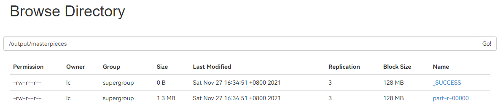

## 1. MapReduce 预备知识

### 1.1. 工作过程

MapReduce 程序的工作分两个阶段进行：Map 阶段、Reduce 阶段


- Map 阶段：将每个分割的数据传递给映射函数来产生输出值。
- Reduce 阶段：对重排阶段输出值进行汇总。这个阶段结合来自重排阶段值，并返回一个输出值。

## 2. 示例代码

### 2.1. 在 `pom.xml` 中添加依赖

```xml
<dependency>  
  <groupId>org.apache.hadoop</groupId>  
  <artifactId>hadoop-mapreduce-client-core</artifactId>  
  <version>${hadoop.version}</version>  
</dependency>
```

### 2.2. 创建 `Mapper<KEYIN, VALUEIN, KEYOUT, VALUEOUT>` 子类

| template   | 作用                                                                      |
| ---------- | ----------------------------------------------------------------------- |
| `KEYIN`    | mapreduce 所读取到的一行文本的起始偏移量，`Long` 类型，在 hadoop 中有其自己的序列化类 `LongWriteable` |
| `VALUEIN`  | mapreduce 所读取到的一行文本的内容，hadoop 中的序列化类型为 `Text`                           |
| `KEYOUT`   | 是用户自定义逻辑处理完成后输出的 `KEY`，在此处是单词，`Text` 类型                                 |
| `VALUEOUT` | 是用户自定义逻辑输出的 `value`，这里是单词出现的次数， `LongWriteable` 类型                      |

### 2.3. 重写 `map` 方法

```java
package cn.edu.nnu.mr;

import org.apache.hadoop.io.LongWritable;
import org.apache.hadoop.io.Text;
import org.apache.hadoop.mapreduce.Mapper;

import java.io.IOException;

public class WordCountMapper extends Mapper<LongWritable, Text, Text, LongWritable> {
    @Override
    protected void map(
            LongWritable key,  // 读到内容的位置
            Text value,        // 读到的内容
            Mapper<LongWritable, Text, Text, LongWritable>.Context context  // 输出
    ) throws IOException, InterruptedException {
        String[] ss = value.toString().split("[^A-Za-z]");  // 按照非英文字符进行分割
        LongWritable one = new LongWritable(1);
        for (String s : ss) {
            if (!s.trim().equals("")) {  // 输出非空的字符串
                context.write(
					new Text(s.trim()),  // KEYOUT
					one					 // VALUEOUT
				);
            }
        }
    }
}
```

### 2.4. 创建 `Reducer<KEYIN, VALUEIN, KEYOUT, VALUEOUT>` 子类

| template   | 作用                                          |
| ---------- | ------------------------------------------- |
| `KEYIN`    | mapper 传入的数据，本例中是单词，`Text` 类型               |
| `VALUEIN`  | mapper 传入的数据，本例中是单词出现的次数，`LongWriteable` 类型 |
| `KEYOUT`   | 输出结果，在此处是单词，`Text` 类型                       |
| `VALUEOUT` | 输出结果，这里是合并后单词出现的次数，`LongWriteable` 类型       |

### 2.5. 重写 `reduce` 方法

```java
package cn.edu.nnu.mr;

import org.apache.hadoop.io.LongWritable;
import org.apache.hadoop.io.Text;
import org.apache.hadoop.mapreduce.Reducer;

import java.io.IOException;

public class WordCountReducer extends Reducer<Text, LongWritable, Text, LongWritable> {
    @Override
    protected void reduce(
            Text key,  // 参数
            Iterable<LongWritable> values,  // 迭代器
            Reducer<Text, LongWritable, Text, LongWritable>.Context context  // 输出
    ) throws IOException, InterruptedException {
        long sum = 0L;
        for (LongWritable lw : values) {
            sum += lw.get();
        }
        context.write(
                key,  // KEYOUT
                new LongWritable(sum)  // VALUEOUT
        );
    }
}
```

### 2.6. 主程序

```java
package cn.edu.nnu.mr;

import org.apache.hadoop.conf.Configuration;
import org.apache.hadoop.fs.Path;
import org.apache.hadoop.io.LongWritable;
import org.apache.hadoop.io.Text;
import org.apache.hadoop.mapreduce.Job;
import org.apache.hadoop.mapreduce.lib.input.FileInputFormat;
import org.apache.hadoop.mapreduce.lib.output.FileOutputFormat;

import java.io.IOException;

public class WordCountApp {
    public static void main(String[] args) throws IOException {
        Configuration conf = new Configuration();
        // 创建任务
        Job job = Job.getInstance(conf);
        // 设置任务的主程序、Mapper 类、Reducer 类
        job.setJarByClass(WordCountApp.class);
        job.setMapperClass(WordCountMapper.class);
        job.setReducerClass(WordCountReducer.class);
        // 设置输出数据的键、值类型
        job.setMapOutputKeyClass(Text.class);
        job.setMapOutputValueClass(LongWritable.class);
        job.setOutputKeyClass(Text.class);
        job.setOutputValueClass(LongWritable.class);
        // 设置任务的输入、输出目录
        FileInputFormat.setInputPaths(job, new Path(args[0]));
        FileOutputFormat.setOutputPath(job, new Path(args[1]));
        // 执行任务
        try {
            job.waitForCompletion(true);
        } catch (Exception ex) {
            System.out.println(ex);
        }
    }
}
```

### 2.7. 生成 jar 包

#### 2.7.1. 如果项目中已经打过包，那么需要先清理项目：`maven -> clean`


#### 2.7.2. 双击 `package` 生成 jar 包


#### 2.7.3. 将 jar 包上传至虚拟机


#### 2.7.4. 使用命令运行刚刚写的程序

命令中 `/test1127` 和 `/output` 分别对应代码中的 `args[0]` 和 `args[1]`，运行后会将 `/test1127` 目录下的所有文件进行词频统计。

```shell
hadoop jar bd-1.0-SNAPSHOT.jar cn.edu.nnu.mr.WordCountApp /test1127 /output
```


#### 2.7.5. 查看结果

成功后查看`  /output ` 目录，其中 `_SUCCESS` 表示操作成功，`part-r-00000` 文件中存放的是最终结果，通过命令查看统计结果

```shell
hadoop fs -cat /output/part-r-00000
```


## 3. 示例：统计天气

### 3.1. 数据文件

| DATE     | HOUR | COND | PRES | HUM | TMP | AQI | PM2.5 | PM10 |
| -------- | ---- | ---- | ---- | --- | --- | --- | ----- | ---- |
| 20160101 | 00   | 霾    | 1024 | 67  | -2  | 212 | 168   | 158  |
| 20160101 | 01   | 霾    | 1024 | 70  | -3  | 209 | 164   | 132  |

数据文件以 `,` 为分隔符，为 `csv` 格式文件，在读取后需要通过 `.split(",")` 来进行分割。同时，温度值有些可能会有无效数据 `N/A`，因此需要将这些无效数据跳过。

### 3.2. 将数据文件上传到 hadoop 系统中

将本地文件上传到系统中。

```java
// 该部分为封装过的方法
mkdir("/test1127");  // 创建目录
put("D:\\iso\\data\\weather.txt", "/test1127/weather.txt");  // 上传文件
```

### 3.3. 修改代码 并执行数据统计

#### 3.3.1. 修改代码

```java
/* File: WeatherMapper */
package cn.edu.nnu.mr;

import ...

public class WeatherMapper extends Mapper<LongWritable, Text, Text, LongWritable> {
    @Override
    protected void map(
            LongWritable key,  // 读到内容的位置
            Text value,        // 读到的内容
            Mapper<LongWritable, Text, Text, LongWritable>.Context context  // 输出
    ) throws IOException, InterruptedException {
        String[] ss = value.toString().split(",");  // 按照 "," 拆分
        if (ss[0].equals("DATE")) {
            return;
        }
        // 日期作为 key，温度为 value
        try {
            context.write(
                    new Text(ss[0]),
                    new LongWritable(Long.parseLong(ss[5]))
            );
        } catch (Exception ex) {
        }
    }
}
```

```java
/* File: WeatherReducer */
package cn.edu.nnu.mr;

import ...

public class WeatherReducer extends Reducer<Text, LongWritable, Text, DoubleWritable> {
    @Override
    protected void reduce(
            Text key,  // 参数
            Iterable<LongWritable> values,  // 迭代器
            Reducer<Text, LongWritable, Text, DoubleWritable>.Context context  // 输出
    ) throws IOException, InterruptedException {
        long sum = 0L;
        long cnt = 0L;
        for (LongWritable lw : values) {
            cnt++;
            sum += lw.get();
        }
        context.write(
                key,  // KEYOUT
                new DoubleWritable(sum * 1.0 / cnt)  // VALUEOUT
        );
    }
}
```

```java
package cn.edu.nnu.mr;

import ...

public class WeatherApp {
    public static void main(String[] args) throws IOException {
        Configuration conf = new Configuration();
        // 创建任务
        Job job = Job.getInstance(conf);
        // 设置任务的主程序、Mapper 类、Reducer 类
        job.setJarByClass(WeatherApp.class);
        job.setMapperClass(WeatherMapper.class);
        job.setReducerClass(WeatherReducer.class);
        // 设置输出数据的键、值类型
        job.setMapOutputKeyClass(Text.class);
        job.setMapOutputValueClass(LongWritable.class);
        job.setOutputKeyClass(Text.class);
        job.setOutputValueClass(DoubleWritable.class);
        // 设置任务的输入、输出目录
        FileInputFormat.setInputPaths(job, new Path(args[0]));
        FileOutputFormat.setOutputPath(job, new Path(args[1]));
        // 执行任务
        try {
            job.waitForCompletion(true);
        } catch (Exception ex) {
            System.out.println(ex);
        }
    }
}
```

#### 3.3.2. 打包后上传到 master 主机运行

```shell
hadoop jar bd-1.0-SNAPSHOT.jar cn.edu.nnu.mr.WeatherApp /test1127/weather.txt /output/weather
hadoop fs -cat /output/weather/part-r-00000
```


## 4. 作业 1：每个月的平均温度

### 4.1. 代码

```java
/* File: MonthWeatherMapper */
package cn.edu.nnu.mr;

import org.apache.hadoop.io.LongWritable;
import org.apache.hadoop.io.Text;
import org.apache.hadoop.mapreduce.Mapper;

import java.io.IOException;

public class MonthWeatherMapper extends Mapper<LongWritable, Text, Text, LongWritable> {
    @Override
    protected void map(
            LongWritable key,  // 读到内容的位置
            Text value,        // 读到的内容
            Mapper<LongWritable, Text, Text, LongWritable>.Context context  // 输出
    ) throws IOException, InterruptedException {
        String[] ss = value.toString().split(",");  // 按照 "," 拆分
        if (ss[0].equals("DATE")) {
            return;
        }
        // 月份作为 key，温度为 value
        String yymm = ss[0].substring(0, 6);  // 取前 6 位字串
        try {
            context.write(
                    new Text(yymm),  // 年月 201601
                    new LongWritable(Long.parseLong(ss[5]))  // 温度
            );
        } catch (Exception ex) {
        }
    }
}
```

```java
/* File: MonthWeatherReducer */
package cn.edu.nnu.mr;

import org.apache.hadoop.io.DoubleWritable;
import org.apache.hadoop.io.LongWritable;
import org.apache.hadoop.io.Text;
import org.apache.hadoop.mapreduce.Reducer;

import java.io.IOException;

public class MonthWeatherReducer extends Reducer<Text, LongWritable, Text, DoubleWritable> {
    @Override
    protected void reduce(
            Text key,  // 参数
            Iterable<LongWritable> values,  // 迭代器
            Reducer<Text, LongWritable, Text, DoubleWritable>.Context context  // 输出
    ) throws IOException, InterruptedException {
        long sum = 0L;
        long cnt = 0L;
        for (LongWritable lw : values) {
            cnt++;
            sum += lw.get();
        }
        context.write(
                key,  // KEYOUT
                new DoubleWritable(sum * 1.0 / cnt)  // VALUEOUT
        );
    }
}
```

```java
/* File: MonthWeatherApp */
package cn.edu.nnu.mr;

import org.apache.hadoop.conf.Configuration;
import org.apache.hadoop.fs.Path;
import org.apache.hadoop.io.DoubleWritable;
import org.apache.hadoop.io.LongWritable;
import org.apache.hadoop.io.Text;
import org.apache.hadoop.mapreduce.Job;
import org.apache.hadoop.mapreduce.lib.input.FileInputFormat;
import org.apache.hadoop.mapreduce.lib.output.FileOutputFormat;

import java.io.IOException;

public class MonthWeatherApp {
    public static void main(String[] args) throws IOException {
        Configuration conf = new Configuration();
        // 创建任务
        Job job = Job.getInstance(conf);
        // 设置任务的主程序、Mapper 类、Reducer 类
        job.setJarByClass(MonthWeatherApp.class);  // 修改类名
        job.setMapperClass(MonthWeatherMapper.class);
        job.setReducerClass(MonthWeatherReducer.class);
        // 设置输出数据的键、值类型
        job.setMapOutputKeyClass(Text.class);
        job.setMapOutputValueClass(LongWritable.class);
        job.setOutputKeyClass(Text.class);
        job.setOutputValueClass(DoubleWritable.class);
        // 设置任务的输入、输出目录
        FileInputFormat.setInputPaths(job, new Path(args[0]));
        FileOutputFormat.setOutputPath(job, new Path(args[1]));
        // 执行任务
        try {
            job.waitForCompletion(true);
        } catch (Exception ex) {
            System.out.println(ex);
        }
    }
}
```

### 4.2. 上传 jar 包


### 4.3. 运行

```shell
hadoop jar bd-1.0-SNAPSHOT.jar cn.edu.nnu.mr.MonthWeatherApp /test1127/weather.txt /output/monthweather
hadoop fs -cat /output/monthweather/part-r-00000
```


每个月的平均温度结果如下

| 年月     | 平均温度               |
| ------ | ------------------ |
| 201601 | -3.808199121522694 |
| 201602 | 1.680161943319838  |
| 201603 | 9.741197183098592  |
| 201604 | 16.772661870503597 |
| 201605 | 21.534170153417016 |
| 201606 | 25.697014925373136 |

## 5. 中文统计

### 5.1. 安装 `Jieba` 依赖

#### 5.1.1. 在 `pom.xml` 中添加依赖

```xml
<dependency>  
  <groupId>com.huaban</groupId>  
  <artifactId>jieba-analysis</artifactId>  
  <version>1.0.2</version>  
</dependency>
```

重新加载 Maven 项目，此时能够自动安装 `Jieba`

#### 5.1.2. 尝试使用 Jieba 分词

```java
package demo;

import com.huaban.analysis.jieba.JiebaSegmenter;
import com.huaban.analysis.jieba.SegToken;

import java.util.List;

public class Test3 {
    public static void main(String[] args) {
        String str = "老师好我叫何同学";
        JiebaSegmenter jieba = new JiebaSegmenter();
        List<SegToken> tokens = jieba.process(str, JiebaSegmenter.SegMode.INDEX);
        for (SegToken st: tokens) {
            System.out.println(st.word);
        }
    }
}
```

### 5.2. 尝试处理中文文件

#### 5.2.1. 将 maven 自动下载的 Jieba 包上传到 master 主机上的以下目录

```
/home/lc/hadoop/share/hadoop/common/lib/
```


#### 5.2.2. 将本地一个中文文本文件上传到 hdfs

```java
put("D:\\iso\\data\\chinese.txt", "/test1127/chinese.txt");
```

#### 5.2.3. 重写 `CnWordCountMapper` `CnWordCountReducer` `CnWordCountApp`

```java
/* File: CnWordCountMapper */
package cn.edu.nnu.mr;

import ...

public class CnWordCountMapper extends Mapper<LongWritable, Text, Text, LongWritable> {
    @Override
    protected void map(
            LongWritable key,  // 读到内容的位置
            Text value,        // 读到的内容
            Mapper<LongWritable, Text, Text, LongWritable>.Context context  // 输出
    ) throws IOException, InterruptedException {
        JiebaSegmenter jieba = new JiebaSegmenter();
        List<SegToken> tokens = jieba.process(value.toString(), JiebaSegmenter.SegMode.INDEX);
        LongWritable one = new LongWritable(1);
        for (SegToken st: tokens) {
            if (st.word.matches("[\u4e00-\u9fa5]{2,}")) {  // 匹配中文词语
                context.write(new Text(st.word), one);
            }
        }
    }
}
```

#### 5.2.4. 打包 上传 运行


#### 5.2.5. 下载到本地

```java
get(false, "/output/cnwordcount/part-r-00000", "D:\\iso\\data\\cnword.txt", true);
```

| 词语   | 频数  |
| ---- | --- |
| 一个   | 12  |
| 一些   | 3   |
| 一切   | 3   |
| 一切都是 | 1   |
| 一块   | 2   |
| ...  | ... |

#### 5.2.6. 对统计结果进行排序

```java
/* File: Test4 */
package demo;

import ...

public class Test4 {
    public static void main(String[] args) {
        InputStream is = null;
        InputStreamReader isr = null;
        BufferedReader br = null;

        try {
            is = new FileInputStream("D:\\iso\\data\\cnword.txt");
            isr = new InputStreamReader(is, StandardCharsets.UTF_8);
            br = new BufferedReader(isr);
            List<Word> words = new ArrayList<>();
            String line = null;
            while ((line = br.readLine()) != null) {
                Word wd = new Word();
                String[] ss = line.split("\\s+");
                wd.key = ss[0];
                wd.value = Integer.parseInt(ss[1]);
                words.add(wd);
            }
            words.sort(new Comparator<Word>() {
                @Override
                public int compare(Word o1, Word o2) {
                    return o2.value - o1.value;  // 从大到小，降序排序
                }
            });
            for (int i = 0; i < words.size() && i < 10; i++) {  // 输出前 10 个词语
                System.out.println(words.get(i).key + " " + words.get(i).value);
            }
        } catch (Exception ex) {
        } finally {  // 关闭输入流
            try {
                br.close();
            } catch (Exception ex) {
                ex.printStackTrace();
            }
            try {
                isr.close();
            } catch (Exception ex) {
                ex.printStackTrace();
            }
            try {
                is.close();
            } catch (Exception ex) {
                ex.printStackTrace();
            }
        }
    }
}
```

| 词语  | 频数 |
| --- | -- |
| 康德  | 40 |
| 哲学  | 24 |
| 一种  | 22 |
| 能动  | 22 |
| 科学  | 17 |
| 能动性 | 16 |
| 主义  | 15 |
| 可以  | 14 |
| 思维  | 14 |
| 我们  | 14 |

## 6. 作业 2：找出所有四大名著中的 20 个热词

> [!hint] 数据清洗
> 
> 如果某一行以中文字符结尾，而不是以标点为结尾，那么有可能这一行刚好被分开，此时词语可能会是断开的。因此，我们需要加上判断，先进行数据清洗，再将文件上传到 hdfs 中。
> 
> 使用 concat 先将 4 个文件拼接起来，字节流 → 字符流 → 缓冲流

### 6.1. 编写方法处理字符文件

```java
/* File: ConcateText */
package cn.edu.nnu.homework;

import ...

public class ConcateText {

    private static Configuration cong = null;
    private static FileSystem fs = null;

    public static void main(String[] args) throws URISyntaxException, IOException {
        System.setProperty("HADOOP_USER_NAME", "lc");
        cong = new Configuration();
        fs = FileSystem.get(new URI("hdfs://master:8020"), cong);
        concat();
    }

    public static void concat() throws IOException {
        // 名著列表
        String[] files = {"hongloumeng-utf8.txt", "sanguoyanyi-utf8.txt", 
						  "shuihu-utf8.txt", "xiyouji-utf8.txt"};
        // 获取文件路径
        File path = new File("D:\\iso\\data");
        // 创建 hdfs 文件
        FSDataOutputStream out = fs.create(new Path("/test1127/masterpieces.txt"));
		// 输入流
        InputStream is = null;
        InputStreamReader isr = null;
        BufferedReader br = null;
        // 遍历四大名著
        for (String file : files) {
            try {
                is = new FileInputStream(new File(path, file));
                isr = new InputStreamReader(is, StandardCharsets.UTF_8);
                br = new BufferedReader(isr);
                String line = null;
                while ((line = br.readLine()) != null) {
                    if (line.trim().equals("")) continue;
                    while (true) {
                        // 取出最后一个字符
                        char lastChar = line.charAt(line.length() - 1);
                        // 如果是汉字，那么再读取一行，加到 line 上
                        if (lastChar >= 0x4e00 && lastChar <= 0x9fa5) {
                            String newline = br.readLine();
                            // 如果新的一行存在并且不为空
                            if (newline != null) {
                                if (!newline.trim().equals("")) {
                                    // 就拼上这一行
                                    line += newline.trim();
                                }
                            } else {
                                break;
                            }
                        } else {
                            break;  // 空则退出
                        }
                    }
					// 写入流
                    out.write(line.getBytes(StandardCharsets.UTF_8));
                }
            } catch (Exception ex) {
                ex.printStackTrace();
            } finally {
                try {
                    br.close();
                } catch (Exception ex) {
                    ex.printStackTrace();
                }
                try {
                    isr.close();
                } catch (Exception ex) {
                    ex.printStackTrace();
                }
                try {
                    is.close();
                } catch (Exception ex) {
                    ex.printStackTrace();
                }
            }
        }
        // 关闭输出流
        out.close();
    }
}
```

运行后可以在 hdfs 看到处理后的文件，大致为 8.5 MB


### 6.2. 统计词频

使用 jar 包的方法，统计词频

```shell
hadoop jar bd-1.0-SNAPSHOT.jar cn.edu.nnu.mr.CnWordCountApp /test1127/masterpieces.txt 
/output/masterpieces
```


处理完成后可以看到处理后的文件大约为 1.3 MB



### 6.3. 下载文件 排序统计

文件下载


排序统计结果

```java
package demo;

import java.io.BufferedReader;
import java.io.FileInputStream;
import java.io.InputStream;
import java.io.InputStreamReader;
import java.nio.charset.StandardCharsets;
import java.util.ArrayList;
import java.util.Comparator;
import java.util.List;

public class Test4 {
    public static void main(String[] args) {
        InputStream is = null;
        InputStreamReader isr = null;
        BufferedReader br = null;

        try {
            is = new FileInputStream("D:\\iso\\data\\mastercount.txt");
            isr = new InputStreamReader(is, StandardCharsets.UTF_8);
            br = new BufferedReader(isr);
            List<Word> words = new ArrayList<>();
            String line = null;
            while ((line = br.readLine()) != null) {
                Word wd = new Word();
                String[] ss = line.split("\\s+");
                wd.key = ss[0];
                wd.value = Integer.parseInt(ss[1]);
                words.add(wd);
            }
            words.sort(new Comparator<Word>() {
                @Override
                public int compare(Word o1, Word o2) {
                    return o2.value - o1.value;  // 从大到小，降序排序
                }
            });
            for (int i = 0; i < words.size() && i < 20; i++) {
                System.out.println(words.get(i).key + "=" + words.get(i).value);
            }
        } catch (Exception ex) {
        } finally {
            try {
                br.close();
            } catch (Exception ex) {
                ex.printStackTrace();
            }
            try {
                isr.close();
            } catch (Exception ex) {
                ex.printStackTrace();
            }
            try {
                is.close();
            } catch (Exception ex) {
                ex.printStackTrace();
            }
        }
    }
}
```


| 词语 | 频数   |
| -- | ---- |
| 行者 | 4468 |
| 一个 | 4268 |
| 宝玉 | 3755 |
| 宋江 | 3696 |
| 两个 | 3128 |
| 那里 | 2791 |
| 只见 | 2352 |
| 我们 | 2276 |
| 不知 | 2139 |
| 如何 | 1912 |
| 出来 | 1907 |
| 太太 | 1848 |
| 不得 | 1826 |
| 师父 | 1822 |
| 这里 | 1822 |
| 八戒 | 1808 |
| 怎么 | 1764 |
| 不是 | 1760 |
| 孔明 | 1748 |
| 夫人 | 1746 |
