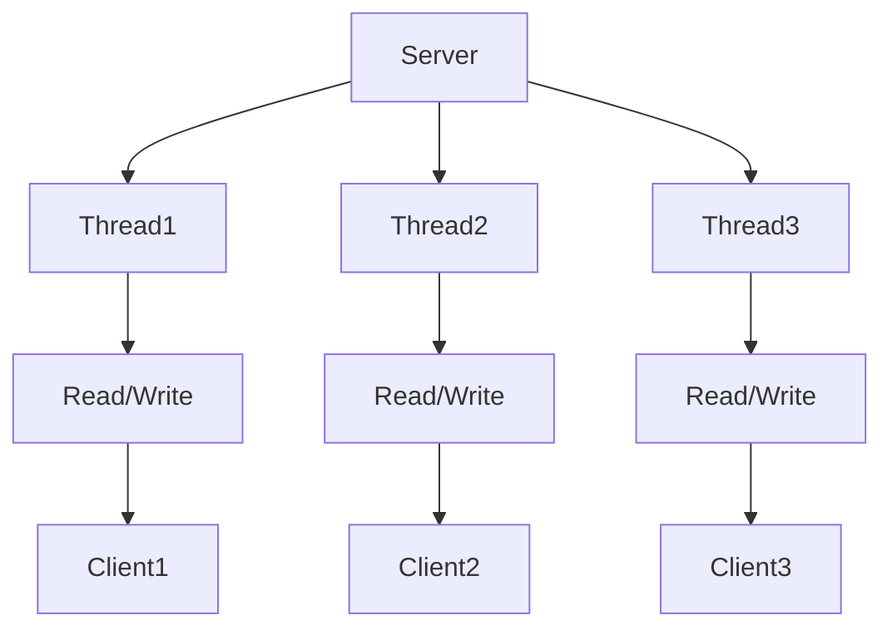

## 基本介绍

- Java BIO 就是传统 Java IO 编程。
- BIO 即 blocking io 同步阻塞，一个连接一个线程，当有一个客户端加入时服务器需要启动一个线程进行处理。
- 适用于连接数目较小且比较固定的架构，不适合高并发

## 编程简单流程

1. 服务端启动一个 ServerSocket
2. 客户端启动 Socket 对服务器进行通信，默认情况下服务器端需要==对每个客户建立一个线程==与之通信
3. 客户端发出请求后，先咨询服务器是否有线程响应，如果没有则会等待，或者遭到拒绝
4. 如果有响应，客户端会等待请求结束后，再继续执行

## 示意图



## 程序实例

```java
package com.example.chatnetty.bio;

import java.io.IOException;
import java.io.InputStream;
import java.net.ServerSocket;
import java.net.Socket;
import java.util.concurrent.ExecutorService;
import java.util.concurrent.Executors;

public class BIOServer {
    /**
     * BIO 模型中，每当一个客户端连接时，都会创建一个线程，并且在线程中与客户端通信
     * BIO 适用于较少，较短的连接，不适合高并发
     */
    public static void main(String[] args) throws IOException {
        // 创建一个线程池
        // 如果有客户端连接，就创建一个线程，与之通信
        ExecutorService pool = Executors.newCachedThreadPool();

        ServerSocket serverSocket = new ServerSocket(6666);

        System.out.println("服务器启动了");

        while (true) {
            // 监听，等待客户端连接
            final Socket socket = serverSocket.accept();
            System.out.println("连接到一个客户端");

            // 创建一个线程，与之通信
            pool.execute(new Runnable() {
                @Override
                public void run() {
                    handler(socket);
                }
            });
        }
    }

    public static void handler(Socket socket) {
        try {
            // 与客户端通信
            // 创建一个缓冲区
            byte[] bytes = new byte[1024];
            // 读取客户端发送的数据
            InputStream is = socket.getInputStream();

            while (true) {
                // 读取数据
                int len = is.read(bytes); // 在 read 时会阻塞
                if (len == -1) {
                    break;
                }
                System.out.println("当前线程：" + Thread.currentThread().getName() + 
                                   "，收到数据：" + new String(bytes, 0, len));
            }
        } catch (IOException e) {
            e.printStackTrace();
        } finally {
            try {
                System.out.println("关闭client连接");
                socket.close();
            } catch (IOException e) {
                e.printStackTrace();
            }
        }
    }
}
```
