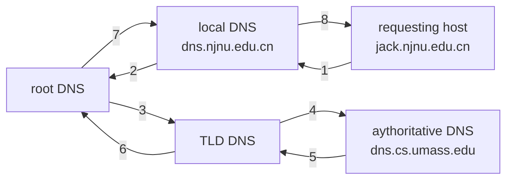
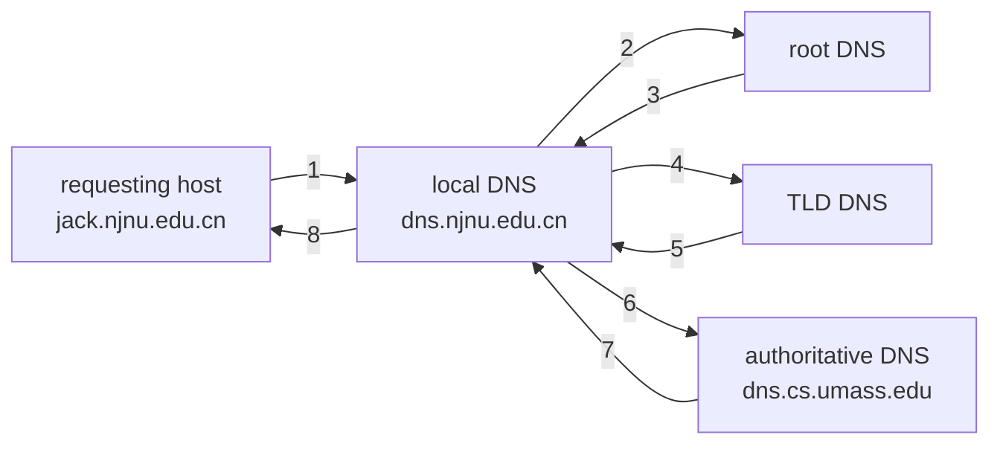

> [!info] 内容
> 1. 网络应用模型
> 	1. 客户/服务器模型
> 	2. P2P 模型
> 2. 域名系统 DNS
> 	1. 层次域名空间
> 	2. 域名服务器
> 	3. 域名解析过程
> 3. 文件传输协议 FTP
> 	1. FTP 工作原理
> 	2. 控制连接与数据连接
> 4. 电子邮件
> 	1. 电子邮件系统的组成结构
> 	2. 电子邮件格式与 MIME
> 	3. SMTP 与 POP3
> 5. 万维网
> 	1. WWW 的概念与组成结构
> 	2. HTTP

## 6.1. 网络应用模型

### 6.1.1. C/S 模型

有一个总是打开的主机称为服务器，它服务于许多来自其他称为客户机的主机请求。工作流程如下：

1. 服务器处于接收请求状态
2. 客户机发出服务请求，并等待接收结果
3. 服务器收到请求后，分析请求，进行必要的处理，得到结果并发送给客户机

客户程序必须知道服务器程序的地址，客户机上一般不需要特殊的硬件和复杂的操作系统。而服务器上运行的软件是专门用来提供某种服务的程序，可同时处理多个远程或本地客户的要求。系统启动后即自动调用并一直不断运行，被动地等待并接收来自各地客户的请求。服务器程序不需要知道客户机的地址。

> [!tip] 特征
> - 客户是服务请求方，服务器是服务提供方。
> - 网络中各计算机地位不平等，服务器可以通过对用户权限的限制来达到管理客户机的目的，使它们不能随意存储/删除数据，或进行其他受限的网络活动。整个网络的管理工作由少数服务器担当，因此网络的管理非常集中方便
> - 客户机相互之间不直接通信
> - 可扩展性不佳。受服务器硬件和网络带宽的限制。服务器支持的客户机有限

服务器性能的好坏决定了整个系统的性能。

### 6.1.2. P2P 模型

整个网络中的传输内容不再被保存在中心服务器上，每个结点都同时具有下载、上传的功能，其权利和义务都是大体对等的。

![[public/network/jwp2p.png]]

在 P2P 模型中，各计算机没有固定的客户和服务器划分，任意一对计算机——称为对等方，直接相互通信。  每个节点既作为客户访问其他节点的资源，也作为服务器提供资源给其他节点访问。

> [!hint] P2P 相比与 C/S
> 1. 减轻了服务器的计算压力，消除了对某个服务器的完全依赖，可以将任务分配到各个节点上，因此大大提高了系统效率和资源利用率
> 2. 多个客户机之间可以直接共享文档
> 3. 可扩展性好，传统服务器有响应和带宽限制，因此只能接受一定量的请求
> 4. 网络健壮性强，单个节点的失效不会影响其他部分的节点

P2P 缺点：在获取服务的同时，还要给其他节点提供服务，因此会占用较多的内存，影响整机速度。

## 6.2. 域名系统 DNS

域名系统是因特网使用的命名系统，用来便于人们记忆的==具有特定含义的主机名==（如 www.baidu.com ）转换为便于计算机处理的 IP 地址。

DNS 采用 C/S 模型，其协议运行在 UDP 之上，使用 53 号端口。

- IP 地址是数字型的，难于记忆与理解；域名是字符型的，直观，便于记忆与理解；
- IP 地址用于网络层；域名用于应用层；
- IP 地址与域名都是唯一的，并且它们之间具有对应关系。
    - 域名与IP地址不一定一一对应：一台只有一个 IP 地址的计算机可以有多个域名
- 因特网是 TCP/IP 网络，所以网络中的每一台网络设备都使用IP地址，因此需要在使用域名时，必须要==将其转换为 IP 地址（域名解析）==才能进行通信，因此产生了域名解析服务。

### 6.2.1. 层次域名空间

因特网采用层次树状结构命名法。采用这种命名方法，任何一个连接到因特网的主机或路由器，都有一个唯一的层次结构名称，即==域名==。域是名字空间中一个可被管理的划分。域可以分为子域，而后可以继续划分，这样形成了顶级域、二级域、三级域等。

例如下面的域名就是由三个标号组成

| 三级域名 | 二级域名 | 顶级域名 |
|:--------:|:--------:|:--------:|
|   www    |  baidu   |   com    |

> [!tip]
> 1. 标号中的英文不区分大小写
> 2. 标号中除连字符 (-) 外不能使用其他的标点符号
> 3. 每个标号不超过 63 个字符，多标号组成的完整域名最长不超过 255 个字符
> 4. 顶级域名写在最右边，级别最低写在最左边

顶级域名分为三大类

1. 国家（地区）顶级域名。`.cn` 表示中国，`.us` 表示美国
2. 通用顶级域名。常见有 `.com` 公司，`.net` 网络服务机构，`.org` 非营利组织，`.gov` 国家或政府部门
3. 基础结构域名。这种顶级域名只有一个，即 arpa，用于反向域名解析

在域名系统中，每个域分别由不同的组织进行管理，每个组织都可以将它的域再分成一定数目的子域，并将这些子域委托给其他组织去管理。例如，管理 cn 域的中国将 edu.cn 子域授权给中国教育和科研计算机网来管理。

### 6.2.2. 域名服务器

所有的域名存放在==分布式==、==分层结构==的数据库中。运行这些数据库的服务器就称为域名==服务器DNS==（Domain Name Server）

大多数具有 Internet 连接的组织都设置了域名服务器，每个服务器包含连向其他域名服务器的信息，这些服务器形成了一个大的协同工作的域名数据库

#### 根域名服务器

全球 13 个根服务器

#### 顶级域名服务器

- 负责所有的 com, org, net, edu 等, 以及所有的顶级国家域 uk, fr, ca, jp.
- Network Solutions 维护 com 顶级域名服务器
- Educause 维护 edu 顶级域名服务器

#### 权限域名服务器

- 机构的 DNS 服务器，提供==机构内部服务器==解析服务，即主机名到 IP 地址的权威映射信息
- 可以由==机构==或==服务提供商==维护

#### 本地域名服务器

- 并不严格属于层次结构
- 每个 ISP (本地 ISP, 公司, 大学) 有一个
    - 也被称作“默认名字服务器”
- 当主机产生 DNS 查询时，查询被发往本地 DNS 服务器
    - 作为一个代理，将查询请求转发到（层次化的）域名解析服务器系统

### 6.2.3. 域名解析

==域名解析==是指将域名转换为 IP 地址的过程，完成该功能的软件称为域名解析器。

域名解析是以==客户/服务器方式==进行工作的

- 当应用程序需要进行域名解析时（从域名到 IP 地址），它称为域名系统的一个客户。它向其默认域名服务器发出域名解析的请求，该域名服务器如找到对应的 IP 地址后，给出响应。
- 当这个域名服务器无法完成域名解析，它临时变成其上层域名服务器的客户，进行==递归解析==或==反复(迭代)解析==，直到该域名解析完成。

#### 递归解析

如果主机所询问的本地域名服务器不知道被查询域名的 IP 地址，那么本地域名服务器就以 DNS 客户的身份，向其他域名服务器继续发出查询请求报文。域名解析任务则由其他域名服务器完成。

问题：会造成 root DNS 在内的服务器高负载

#### 反复（迭代）解析

当其他域名服务器收到本地域名服务器的域名解析请求报文时，要么给出所要查询域名的 IP 地址，要么告诉本地域名服务器：“你下一步应当向哪一个域名服务器进行查询”。然后让本地域名服务器进行后续的查询。

### 6.2.4. 域名系统的性能优化

#### 配置根服务器表

- 当一个新的网络加入 Internet 时，其本地域名服务器中都会配置一个根域名服务器列表。
- 本地的 DNS 服务器可以为用户选择==响应最快的根服务器==。

#### 域名缓存

- 每个域名服务器和主机都维护一个高速域名缓存，存放==最近解析过的域名==以及从何处获得域名映射信息的记录。
- 域名缓存可大大==减轻根域名服务器的负荷==，使因特网上的 DNS 查询请求和回答报文的数量大为减少。

##### DNS 记录

本质上是存储资源记录 (RR:Resource Record) 的分布式数据库，格式为

|name|value|type|ttl|
|:---:|:---:|:---:|:---:|

##### 如何注册域名

在 DNS 注册机构 (e.g. ICANN) 注册域名

- 提供权威名字服务器(主、备两个)的名字和IP地址
- 注册机构向 com 顶级域名服务器中插入两条资源记录
    - `(networkutopia.com, dns1.networkutopia.com, NS)`
    - `(dns1.networkutopia.com, 212.212.212.1, A)`
- 在权威服务器上为主机 www.networkuptopia.com 创建一条A记录; 为 networkutopia.com 创建一条 MX 记录

##### DNS 的其它服务

- 主机的别名
    - 规范名字, 别名
    - 邮件服务器别名
- 负载均衡
    - 镜像 Web 服务器: 一个规范名字对应一组 IP 地址

## 6.3. 文件传输协议 FTP

### 6.3.1. 工作原理

FTP 提供交互式访问，允许客户指明文件的类型和格式，并允许文件具有存取权限。屏蔽了各计算机系统的细节，因而适合于在异构网络中的任意计算机之间传输文件。

> [!info] 功能
> 1. 提供不同种类主机系统（硬件、软件体系等都可以不同）之间的文件传输能力
> 2. 以用户权限管理方式提供用户对远程 FTP 服务器上的文件管理能力
> 3. 以匿名FTP 的方式提供公用文件共享的能力

FTP 采用 C/S 模式，使用 TCP 可靠传输服务。一个 FTP 服务器进程可同时为多个客户进程提供服务。FTP 的服务器进程由两大部分组成：一个主进程，负责接受新的请求；另外有若干从属进程，负责处理单个请求

> [!tip] 工作步骤
> 1. 打开熟知端口 21，使客户进程可以连接
> 2. 等待客户进程发连接请求
> 3. 启动从属进程来处理客户进程发来的请求。主进程与从属进程并发执行，从属进程对客户进程的请求处理完毕后即终止
> 4. 回到等待状态，继续接收其他客户进程的请求

FTP 在工作时使用两个并行的 TCP 链接：一个是控制连接 (port = 21)，一个是数据连接 (port = 20)，使用两个不同的端口号可使协议更加简单和容易实现。

![[public/network/jw24.png]]

#### 1. 控制连接

服务器监听 21 号端口，等待客户连接，建立在这个端口上的连接称为控制连接，控制连接用来传输控制信息（如连接请求，传送请求等），并且控制信息都以 7 位 ASCII 格式传送。控制连接不用来传送文件。

#### 2. 数据连接

服务器端的控制进程在接收到 FTP 客户发来的文件传输请求后，就创建 “数据传送进程” 和 “数据连接”。数据连接用来链接客户端和服务器端的数据传送进程，数据传送进程实际完成文件的传送，在传送完毕后关闭 “数据传送连接” 并结束进程。

数据连接有两种传输模式：主动模式 PORT 和被动模式 PASV。

- 主动模式：客户请求，服务器的 20 端口连接到客户端的对应端口
- 被动模式：客户请求，服务器告知客户端，客户端再连到服务器开放的端口

## 6.4. 电子邮件

### 6.4.1. 电子邮件系统的组成结构

电子邮件是一种异步通信方式，通信时不需要双方同时在场。电子邮件把邮件发送到收件人使用的邮件服务器，并放在邮箱中，收件人可以随时上网到自己使用的邮件服务器进行读取。

三个最主要的组成构建：用户代理、邮件服务器、电子邮件使用的协议（SMTP、POP3 或 IMAP 等）

![[public/network/jwemail.png]]

- 用户代理：用户与电子邮件系统的接口。用户代理向用户提供一个友好的接口来发送和接收邮件，用户代理至少应当具有撰写、显示、邮件处理功能
- 邮件服务器：功能是发送和接收邮件，同时还要向发信人报告邮件传送情况。邮件服务器采用 C/S 模型，但它必须能够充当客户和服务器。
- 邮件发送协议和读取协议：
	- 邮件发送协议用于用户代理向邮件服务器发送邮件或在邮件服务器之间发送邮件，如 SMTP
	- 邮件读取系诶用于用户代理从邮件服务器读取邮件，如 POP3

![[public/network/jwemail43.png]]
> [!info] 收发过程
> 1. 发信人调用用户代理来撰写和编辑要发送的邮件。用户代理用 SMTP 把邮件传送给发送端邮件服务器
> 2. 发送端邮件服务器将邮件放入邮件缓存队列中，等待发送
> 3. 运行在发送端邮件服务器的 SMTP 客户进程，发现邮件缓存中有待发送的邮件，就向运行在接收端邮件服务器的 SMTP 服务器进程发起建立 TCP 连接
> 4. TCP 连接建立后，SMTP 客户进程开始向远程 SMTP 服务器进程发送邮件。当所有待发送邮件发完后，SMTP 就关闭所建立的 TCP 连接
> 5. 运行在接收端邮件服务器中的 SMTP 服务器进程收到邮件后，将邮件放入收信人的用户邮箱，等待收信人方便时进行读取
> 6. 收信人打算收信时，调用用户代理，使用 POP3 或 IMAP 协议将自己的邮件从接收端邮件服务器的用户邮箱中取回

### 6.4.2. 电子邮件格式与 MIME

#### 1. 电子邮件格式

邮件内容分为首部和主体。首部最重要的关键字是 To 和 Subject。电子邮件地址格式 abc@example.com

Subject 可选

#### 2. 多用途网际邮件扩充 MIME

由于 SMTP 只能传送一定长度的 ASCII 码邮件，非英文字符无法传送，且不能传送二进制对象，因此需要扩充。

MIME 并未改动 SMTP 或取代它，意图是继续使用目前格式，但增加了邮件主体的结构，并定义了传送非 ASCII 码的编码规则。

### 6.4.3. SMTP 和 POP3

#### 1. SMTP

使用 C/S 模式，负责发送邮件的是 SMTP 客户，负责接收邮件的是 SMTP 服务器。使用 TCP 连接，端口号为 25. 分三个阶段（连接建立、邮件发送、连接释放）

#### 2. POP3 与 IMAP

邮局协议 POP 是简单但功能有限的邮件读取协议，当用户读取邮件时，用户代理向邮件服务器发出拉请求。

POP 使用 C/S 服务方式，在传输层使用 TCP，端口号 110. 接收方的用户代理上必须运行 POP 客户程序，而接收方的邮件服务器上运行 POP 服务器程序。

IMAP 因特网报文存取协议为用户提供了创建文件夹、在不同文件夹之间移动邮件、在远程文件夹中查询邮件等联机命令，相比 POP 复杂得多。

## 6.5. 万维网（WWW）

### 6.5.1. WWW 的概念与组成结构

WWW 是一个分布式、联机式的信息存储空间，在这个空间中：一样有用的事物称为一样“资源”，并由一个全域 “统一资源定位符 URL” 标识。这些资源通过超文本传输协议 HTTP 传送给使用者，而后者通过单击链接来获取资源。

万维网使用链接的方法能非常方便的从因特网上的一个站点访问另一个站点，从而主动的按需获取丰富的信息。超文本标记语言 HTML 使得万维网页面的设计者可以很方便地用一个超链接从本页面的某处链接到因特网上的任何一个万维网页面，并能够在自己的计算机屏幕上显示这些页面。

> [!tip] WWW 的内核部分是三个标准构成的
> 1. 统一资源定位符 URL <协议>://<主机>:<端口>/<路径>
> 2. 超文本传输协议 HTTP
> 3. 超文本标记语言 HTML

### 6.5.2. 超文本传输协议 HTTP

HTTP 定义了浏览器（万维网客户进程）怎样向万维网服务器请求万维网文档，以及服务器怎样把文档传送给浏览器。从层次的角度看，HTTP 是面向事务的应用层协议，它规定了在浏览器和服务器之间的请求和响应的格式与规则，是万维网上能够可靠交换文件的重要基础。

#### 1. HTTP 的操作过程

浏览器访问 WWW 服务 >> 对 WWW 服务器进行域名解析 >> 获得服务器 IP 地址 >> 浏览器通过 TCP 向服务器发送连接请求

- 每个万维网站点都有一个服务器进程，不断地监听 TCP 的端口 80，当监听到连接请求后便与浏览器建立 TCP 连接。
- 而后，浏览器就向服务器发送请求获取某个 Web 页面的 HTTP 请求。
- 服务器收到请求后，将构建所请求 Web 页的必需信息，并通过 HTTP 响应返回给浏览器。
- 浏览器再将信息进行解释，将 Web 页面显示给用户。
- 最后， TCP 释放。

![[public/network/jwhttpdfsgv.png]]

HTTP 有两类报文：请求报文（从 Web 客户端向 Web 服务器发送服务请求）和响应报文（从 Web 服务器对 Web 客户端请求的回答）

用户单击鼠标后所发生的事件按顺序如下

1. 浏览器分析链接指向页面的 URL (http://www.tsinghua.edu.cn/chn/index.html)
2. 浏览器向 DNS 请求解析 `www.tsinghua.edu.cn` 的 IP 地址
3. 域名系统 DNS 解析出清华大学服务器 IP 地址
4. 浏览器与该服务器建立 TCP 连接
5. 浏览器发出 HTTP 请求 `GET /chn/index.html`
6. 服务器通过 HTTP 响应把文件 index.html 发送给浏览器
7. 释放 TCP 连接
8. 浏览器解析 index.html，并将 Web 页面显示给用户

#### 2. HTTP 的特点

- 使用 TCP 作为传输层协议，保证数据可靠传输
- HHTP 本身是无连接的
- HTTP 本身是无状态的（服务器并不记得曾经访问过的用户）
- 可以使用非持久连接，也可使用持久连接 (HTTP/1.1 支持)

![[public/network/jwhttpfdsgbvdt34.png]]

持久链接分为非流水线和流水线两种方式。

- 非流水线方式：客户在收到前一个响应后才能发出下一个请求，服务器发送完一个对象后，其 TCP 连接就处于空闲状态
- HTTP/1.1 默认方式是使用流水线的持久连接，客户每遇到一个对象就立即发出一个请求，因而客户可以逐个连续发出对各个引用对象的请求。这样减少了 TCP 连接中的空闲时间。

#### 3. HTTP 报文结构

HTTP 是面向文本的，因此报文中每个字段都是一些 ASCII 码串，并且每个字段的长度都是不确定的。有两类 HTTP 报文

- 请求报文
- 响应报文

![[public/network/jwhttpmessage.png]]

HTTP 两类报文都由 3 个部分组成。

请求方法：GET, HEAD, POST, CONNECT ...

## 6.6. 小结

#### 如何理解客户进程端口号与服务器进程端口号？

熟知端口号是指引用层协议在服务器端的默认端口号，而客户端进程的端口号是由客户端进程任意指定的（临时的）。

当课程进程向服务器进程发出建立连接请求时，要寻找链接服务器进程的熟知端口号，同时还要告诉服务器进程自己的临时端口号。接着，服务器进程就用自己的熟知端口号与客户进程所提供的端口号建立连接。

#### 互联网、因特网、万维网的区别？

- 互联网 internet 泛指由多个计算机网络按照一定的通信协议相互连接而成的一个大型计算机网络。
- 因特网 Internet 是指在 ARPA 网基础上发展而来的世界上最大的全球性互联网。因特网和其他类似的由计算机相互连接而成的大型网络系统，都可算是 “互联网”，因特网只是互联网中最大的一个。
- 万维网是无数个网络站点和网页的集合，它们一起构成了因特网最主要的部分（因特网也包括电子邮件、Usenet 和新闻组）。

