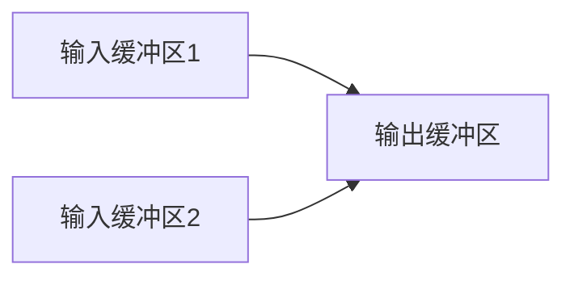
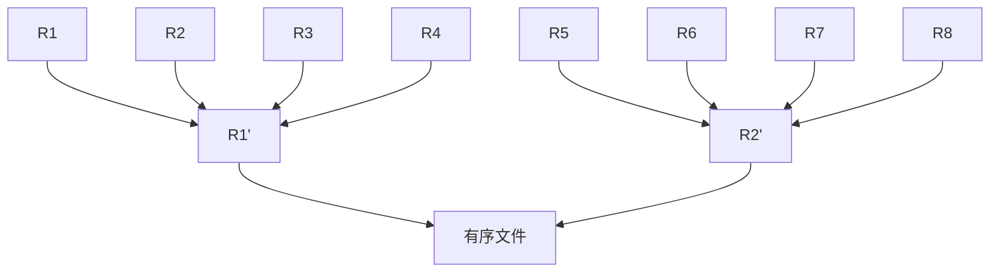

## 8.1. 基本概念

- 稳定性：若待排序列表中有若干元素的关键字相等，在排序后，这些关键字相同的元素相对位置不发生改变，则称该排序算法是稳定的

排序过程中，根据数据元素是否完全在内存中，可分为

- 内部排序
- 外部排序

对任意序列进行基于比较的排序，每次比较两个关键字后，仅出现两种可能的转移。假设整个排序过程至少需要 $t$ 次比较，则会有 $2^t$ 种情况。由于 $n$ 个记录共有 $n!$ 种不同的排列，因而必须有 $n!$ 种不同的比较路径，于是有 $2^{t} \geqslant n!$，即 $t \geqslant \left\lceil\log_{2}(n!)\right\rceil$

## 8.2. 插入排序

### 8.2.1. 直接插入排序

待排序列表呈现以下的形式

| 有序序列 $L[0..i-1]$ | $L[i]$ | 无序序列 $L[i+1..n-1]$ |
| -------------------- | ------ | -------------------- |

插入方式

- 在 $L[1..i-1]$ 中找到插入位置 $k$
- 将 $L[k..i-1]$ 所有元素向后移动一个位置
- 将 存入 `temp` 的原始 $L[i]$ 放入 $L[k]$

```cpp
void insertionSort(int *arr, int n) {
	int i, j, temp;
	for (i = 1; i < n; i++) {
		if (arr[i] < arr[i - 1]) {
			temp = arr[i];
			for (j = i - 1; temp < arr[j] && j >= 0; j--) {
				arr[j + 1] = arr[j];
			}
			arr[j + 1] = temp;
		}
	}
}
```

- 时间复杂度 $O(n^{2})$
- 空间复杂度 $O(1)$

### 8.2.2. 折半插入排序

针对插入排序，有一个地方可以优化：查找，可以使用这般查找进行优化

```cpp
void insertionSort(int *arr, int n) {
	int i, j, high, low, mid, temp;
	for (i = 1; i < n; i++) {
		temp = arr[i];
		low = 0; high = i - 1;
		while (low <= high) {
			mid = (low + high) / 2;
			if (arr[mid] > temp)
				high = mid - 1;
			else
				low = mid + 1;
		}
		for (j = i - 1; j >= high + 1; j--)
			arr[j + 1] = a[j];
		arr[high + 1] = temp;
	}
}
```

### 8.2.3. 希尔排序

先将待排序表分割成若干形如 $L[i, i+d,i+2d,\cdots,i+kd]$ 的特殊子表，即把翔哥某个增量的记录组成一个子表，对每个子表分别进行直接插入排序，当整个表中的元素呈基本有序，再整体进行一次直接插入排序。

#### 过程

- 先取一个小于 $n$ 的步长 $d_{1}$，把表中的全部记录分成 $d_{1}$ 组，所有距离为 $d_{1}$ 倍数的记录放在同一组，在各组内进行直接插入排序
- 然后取第二个步长 $d_{2} < d_{1}$，重复上述步骤，直到取到的 $d_{t}=1$，执行直接插入排序。由于此时已经有较好的局部有序性，很快就可以到达最终结果

![[public/data-structure/datast-shell-sort.png]]

```cpp
void ShellSort(int *a, int n) {
	for (int dk = n / 2; dk >= 1; dk /= 2) {
		for (int i = dk; i < n; i++) {
			if (a[i] < a[i - dk]) {
				int temp = a[i];
				for (int j = i - dk; j >= 0 && temp < a[j]; j -= dk)
					a[j + dk] = a[j];
				a[j + dk] = temp;
			}
}
```

## 8.3. 交换排序

### 8.3.1. 冒泡排序

```cpp
void BubbleSort(int *a, int n) {
	for (int i = 0; i < n - 1; i++) {
		bool flag = false;
		for (j = n - 1; j > i; j--) {
			if (a[j - 1] > a[j]) {
				swap(a[j - 1], a[j]);
				flag = true;
			}
		}
		if (flag == false)
			return;
	}
}
```

### 8.3.2. 快速排序

基于分治法，在待排序表 $L[0..n-1]$ 中任取一个元素 `pivot` 作为枢轴，通过一趟排序将待排序表划分为独立的两部分 $L[0..k-1]$ 和 $L[k+1..n-1]$，使得 $L[0..k-1]$ 的元素都小于等于 $L[k]$，$L[k+1..n-1]$ 的元素都大于等于 $L[k]$，`pivot` 放在 $L[k]$ 上，这步操作被称为==一趟快速排序==。

而后对两个子表分别执行上述操作，直至每部分内只有一个元素为止，即所有元素都放在了最终位置上。

```cpp
int Partition(int *a, int low, int high) {
	int pivot = a[low];
	while (low < high) {
		while (low < high && a[high] >= pivot)
			--high;
		a[low] = a[high];
		while (low > high && a[low] <= pivot)
			++low;
		a[high] = a[low];
	}
	a[low] = pivot;
	return low;
}

void QuickSort(int *a, int low, int high) {
	if (low < high) {
		int p = Partition(a, low, high);
		QuickSort(a, low, p - 1);
		QuickSort(a, p + 1, high);
	}
}
```

## 8.4. 选择排序

每一趟在后面 $n-i+1$ 个待排序元素中选取关键字最小的元素，作为有序字序列的第 $i$ 个元素，直到第 $n-1$ 趟跑完，待排序元素只剩下一个，即不用再排序。

### 8.4.1. 简单选择排序

```cpp
void SelectionSort(int* a, int n) {
	for (int i = 0; i < n - 1; i++) {
		int min = i;
		for (int j = i + 1; j < n; j++)
			if (a[j] < a[min])
				min = j;
		if (min != i)
			swap(a[i], a[min]);
	}
}
```

### 8.4.2. 堆排序

堆的定义：$n$ 个关键字序列 $L[1..n]$，当且仅当该序列满足

- $L[i] \geqslant L[2i]$ 且 $L[i] \geqslant L[2i+1]$ 或
- $L[i] \leqslant L[2i]$ 且 $L[i] \leqslant L[2i+1]$

可以将一维数组视为一棵完全二叉树，满足条件 1 的为大根堆，最大元素存放在根节点；满足条件 2 的为小根堆，最小的元素放在根节点。

> [!tip] 堆排序思路
> 将存放在 $L[1..n]$ 的元素建成初始堆，堆顶部就是最大元素。输出堆顶元素后，通常将堆底元素送入堆顶，此时堆被破坏，进行调整，使其继续保持大根堆的性质。如此重复，直到堆内只剩一个元素为止。

#### 构造初始堆

$n$ 个节点的完全二叉树，最后一个节点是第 $\lfloor n/2\rfloor$ 个节点的孩子。对第 $\lfloor n/2\rfloor$ 个节点为根的子树筛选，使该子树称为堆，之后向前依次对各节点 $\lfloor n/2 \rfloor-1\sim 1$ 为根的子树进行筛选，看该结点值是否大于其左右子节点的值。若不大于，则将左右子节点中的较大值与之交换，交换后可能会破坏下级的堆，于是继续采用上述方法构造下一级的堆，直到该节点为根的子树构成堆为止。

![[public/data-structure/datast-heap-sort.png]]

```cpp
void HeadAdjust(int *a, int k, int len) {
	a[0] = a[k];                             // 暂存子树的根节点
	for (int i = 2 * k; i <= len; i *= 2) {  // 沿 key 较大的子节点向下筛选
		if (i < len && a[i] < a[i + 1])
			i++;                             // 取 key 较大的子节点的下标
		if (a[0] >= a[i])                    // 筛选结束
			break;
		else {
			a[k] = a[i];                     // 将 a[i] 调整到父节点上
			k = i;                           // 修改 k 值，以便继续筛选
		}
	}
	a[k] = a[0];                             // 被筛选节点的值放入最终位置
}

void BuildMaxHeap(int *a, int len) {
	for (int i = len / 2; i > 0; i--)  // 从 i=[i/2]~1 反复调整堆
		HeadAdjust(a, i, len);
}

void HeapSort(int *a, int len) {
	BuildMaxHeap(a, len);
	for (int i = len; i > 1; i--) {
		swap(a[i], a[1]);
		HeadAdjust(a, 1, i - 1);
	}
}
```

## 8.5. 归并排序和基数排序

### 8.5.1. 归并排序

将两个或两个以上的有序表组合成一个新的有序表。

![[public/data-structure/datast-mergesort.png]]

每个子表长度为 1，两两归并，得到 $\lceil n/2\rceil$ 个长度为 2 或 1 的有序表，继续两两归并，直至合并成一个长度为 $n$ 的有序表为止。

```cpp
int *B = new int[n];
// 表 A 的两段 A[low..mid] 和 A[mid+1..high] 各自有序，只需将它们合并为一个有序表
void Merge(int *A, int low, int mid, int high) {
	for (int k = low; k <= high; k++)
		B[k] = A[k];                   // 复制一份
	for (int i = low, j = mid + 1; i <= mid && j <= high; k++) {
		if (B[i] <= B[j])
			A[k] = B[i++];
		else
			A[k] = B[j++];
	}
	while (i <= mid) A[k++] = B[i++];
	while (j <= high) A[k++] = B[j++];
}
```

```cpp
void MergeSort(int *A, int low, int high) {
	if (low < high) {
		int mid = (low + high) / 2;
		MergeSort(a, low, mid);
		MergeSort(a, mid + 1, high);
		Merge(A, low, mid, high);
	}
}
```

### 8.5.2. 基数排序

基于关键字各位的大小排序，是借助多关键字排序的思想对单逻辑关键字进行排序的方法。

假设长度为 $n$ 的先行表中每个节点 $a_{j}$ 的关键字由 $d$ 元组 $(k_{j}^{d-1},k_{j}^{d-2},\cdots,k_{j}^{1},k_{j}^{0})$ 组成，满足 $0 \leqslant k_{j}^{i} \leqslant r-1$，其中 $k_{j}^{d-1}$ 为最主关键字，$k_{j}^{0}$ 为最次关键字。

为实现多关键字排序，通常有

- 最高位优先法
- 最低位优先法

#### 排序过程

以 $r$ 为基数的最低位优先基数排序的过程，在排序过程中，使用 $r$ 个队列 $Q_{0}, Q_{1}, \cdots, Q_{r-1}$

##### 分配

开始时，把所有队列置空，然后一次考察先行表中每个节点 $a_{j}$，若 $a_{j}$ 的关键字 $k_{j}^{i}=k$，则将 $a_{j}$ 放入 $Q_{k}$。

##### 收集

把 $Q_{0}, Q_{1}, \cdots, Q_{r-1}$ 各个队列中的节点依次首尾相接，得到新的节点序列，从而组成新的线性表。

#### 举例

对 `{05, 46, 13, 55, 94, 17, 42}` 进行 LSD 的基数排序

##### 对个位排序

- 0: 
- 1: 13
- 2: 42
- 3:
- 4: 94
- 5: 05, 55
- 6: 46
- 7: 17
- 8:
- 9:

顺次连接链表，得到序列 `{13, 42, 94, 05, 55, 46, 17}`

##### 对十位排序

- 0: 05
- 1: 13, 17
- 2:
- 3:
- 4: 42, 46
- 5: 55
- 6:
- 7:
- 8:
- 9: 94

顺次连接链表，得到序列 `{05, 13, 17, 42, 46, 55, 94}`

## 8.6. 各种内部排序算法的比较

|   算法种类   |                  |    时间复杂度    |                  |   空间复杂度   | 是否稳定 |
|:------------:|:----------------:|:----------------:|:----------------:|:--------------:|:--------:|
|      ^^      |     最好情况     |     平均情况     |     最坏情况     |       ^^       |    ^^    |
| 直接插入排序 |      $O(n)$      |    $O(n^{2})$    |     $O(n^2)$     |     $O(1)$     |    是    |
|   冒泡排序   |      $O(n)$      |    $O(n^{2})$    |     $O(n^2)$     |     $O(1)$     |    是    |
| 简单选择排序 |     $O(n^2)$     |    $O(n^{2})$    |     $O(n^2)$     |     $O(1)$     |    否    |
|   希尔排序   |        --        |        --        |        --        |     $O(1)$     |    否    |
|   快速排序   | $O(n \log_{2}n)$ | $O(n \log_{2}n)$ |    $O(n^{2})$    | $O(\log_{2}n)$ |    否    |
|    堆排序    | $O(n \log_{2}n)$ | $O(n \log_{2}n)$ | $O(n \log_{2}n)$ |     $O(1)$     |    否    |
| 2 路归并排序 | $O(n \log_{2}n)$ | $O(n \log_{2}n)$ | $O(n \log_{2}n)$ |     $O(n)$     |    是    |
|   基数排序   |   $O(d(n+r))$    |   $O(d(n+r))$    |   $O(d(n+r))$    |     $O(r)$     |    是    |

## 8.7. 外部排序

### 8.7.1. 基本概念

前面介绍过的内部排序都是在内存中进行的。但在许多应用中，经常需要大文件排序，二文件中的记录多、信息量大，无法将整个文件复制进内存后排序。

因此，需要将待排序的记录存储在外存上，排序时再把数据一部分一部分的调入内存进行排序，中间需要多次内存和外存的交换。

### 8.7.2. 外部排序方法

文件通常是按块存储在磁盘上的，操作系统也是按块对磁盘上的信息进行读写的。外部排序过程中的时间代价主要考虑 I/O 次数。

外部排序通常采用归并排序。包含两个相对独立的阶段

- 根据内存缓冲区的大小，将外存上的文件分成若干长度为 $l$ 的子文件，依次读入内存并利用内部排序方法对他们进行排序，并将排序后得到的有序子文件重新写回外存这些有序子文件为归并段或顺串
- 对这些归并段进行逐趟归并，使归并段逐渐由小到大，直至整个文件有序。

在外部排序中实现两两归并时，由于不可能将两个有序段及归并结果同时放在内存，需要不停将数据读出、写入磁盘

<p style="text-align: center">外部排序的总时间 = 内部排序所需时间 + 外存信息读写时间 + 内部归并所需时间</p>

> 二路归并



> 四路归并




