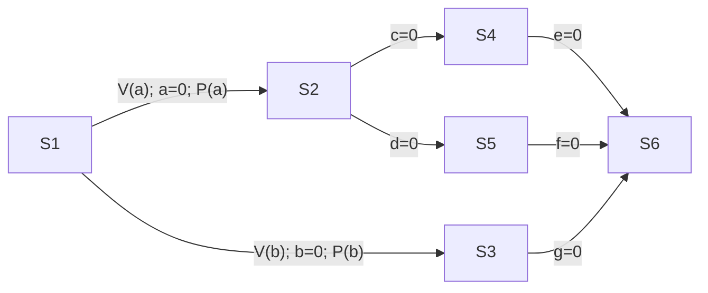

## 2.3.1 进程同步与进程互斥

### 1.1 进程同步

> [!quote] 进程的异步性
> 各并发执行的进程以各自独立、不可知的速度向前推进

> [!quote] 进程的管道通信
> 读进程和写进程并发运行，由于并发必然导致异步性，因此“写”与“读”的顺序不确定。实际应用中，又必须按照“先写后读”的顺序来执行。
> 如何解决这种==异步问题==，就是==进程同步==所讨论的内容。

==同步==亦称==直接制约关系==，指为完成某种任务而建立两个或多个进程，这些进程因为需要在某些位置上==协调它们的工作次序==而产生的制约关系。

### 1.2 进程互斥

进程的“并发”需要“共享”的支持，各个并发执行的进程不可避免地共享一些系统资源。

#### 两种资源共享方式

- 互斥共享方式
  - 一个时间段内只允许一个进程访问该资源（==临界资源==）
- 同时共享方式
  - 一个时间段内允许多个进程 “同时” 访问该资源

#### 对临界资源的互斥访问，可在逻辑上分成四部分

- 进入区
  - 正在访问临界资源的标志 “上锁”
- 临界区
  - 访问临界资源的代码
- 退出区
  - 解除正在访问临界资源的标志 “解锁”
- 剩余区
  - 做其他处理

#### 为实现对临界资源的互斥访问，同时保证系统整体性能，遵循以下原则：

- 空闲让进。临界区空闲时，可允许一个请求进入临界区的进程立即进入临界区。
- 忙则等待。临界区被占用，其他试图进入的必须等待。
- 有限等待。对请求访问的进程，应保证在有限的时间内进入临界区。
- 让权等待。当进程不能进入临界区时，应立即释放处理机，防止进程忙等待。

## 2.3.2 进程互斥的软件实现

### 1. 单标志法

#### 算法思想

两个进程在==访问完临界区后==会把使用临界区的权限交给另一个进程。即==每个进程进入临界区的权限只能被另一个进程赋予==。

```cpp
int turn = 0;  // 表示当前允许进入临界区的进程号
// P0 进程				P1 进程
while (turn != 0);		while (turn != 1); 	// 进入区
critical section;		critical section;  	// 临界区
turn = 1;				turn = 0;			// 退出区
remainder section;		remainder section;	// 剩余区
```

如果 P0 不进入临界区，P1 就一直不会进入。违背了“空闲让进”原则。

### 2. 双标志先检查法

#### 算法思想

设置一个 bool 型数组 flag[]，数组中各个元素用来标记各进程想进入临界区的意愿。

```cpp
bool flag[2];
flag[0] = false; flag[1] = false;
// P0 进程				P1 进程
while (flag[1]);		while (flag[0]);  	// 进入区
flag[0] = true;			flag[1] = true;		// 标记某一进程想要进入临界区
critical section;		critical section;  	// 临界区
flag[0] = false;		flag[1] = false;	// 退出区
remainder section;		remainder section;	// 剩余区
```

如果两个进程同时发出，违反了“==忙则等待==”原则。原因在于进入区的检查和上锁不是原子操作。检查后，上锁前可能发生进程切换。

### 3. 双标志后检查法

#### 算法思想

先“上锁”，后“检查”避免上述算法的问题。

```cpp
bool flag[2];
flag[0] = false; flag[1] = false;
// P0 进程				P1 进程
flag[0] = true;			flag[1] = true;		// 标记某一进程想要进入临界区
while (flag[1]);		while (flag[0]);  	// 进入区
critical section;		critical section;  	// 临界区
flag[0] = false;		flag[1] = false;	// 退出区
remainder section;		remainder section;	// 剩余区
```

如果两个进程同时发出，两个进程都无法进入临界区。虽然解决了“忙则等待”的问题，但违背了“==空闲让进==”和“==有限等待==”的原则，会产生“饥饿”现象。

### 4. Peterson 算法

#### 算法思想

如果两个进程争相进入临界区，两者都无法进入。尝试让进程“孔融让梨”，主动让对方先使用临界区。

```cpp
bool flag[2];
int turn = 0;
// P0 进程
flag[0] = true;					// }
turn = 1;						// }进入区
while (flag[1] && turn == 1);	// }
critical section;
flag[0] = false;
remainder section;
// P1 进程
flag[1] = true;					// 表示自己想进入临界区
turn = 0;						// 可以考虑让对方先进入
while (flag[0] && turn == 0);	// 对方想进，且最后一次是自己“让梨”，那就自己等待
critical section;
flag[1] = false;
remainder section;
```

遵循了空闲让进，忙则等待，有限等待原则，但依然未解决==让权等待==的问题。

## 2.3.3 进程互斥的硬件实现

### 1. 中断屏蔽方法

利用“开/关中断指令”实现。

```cpp
...
关中断;  // 不允许当前进程被中断
临界区;
开中断;  // 当前进程访问完临界区
...
```

- 简单高效
- 不适用于多处理机；只适用于 OS 内核进程，不适用于用户进程。

### 2. TestAndSet 指令

简称 TS 指令，或称 TSL 指令。

TSL 指令用硬件实现，执行过程不能被中断。

```cpp
// bool 型共享变量 lock 表示当前临界区是否被上锁
bool TestAndSet(bool *lock) {
	bool old;
	old = *lock;	// old 用来存放 lock 原来的值
	*lock = true;	// 无论之前是否上锁，都被上锁
	return old;		// 返回 lock 旧值
}
// 使用 TSL 指令实现互斥的算法逻辑
while (TestAndSet(&lock));	// 上锁并检查
critical section;
lock = false;		// 解锁
remainder section;
```

- TSL 指令将上锁和检查用硬件的方式变成了原子操作。实现简单，适用于多处理机环境。
- 不满足“让权等待”的原则。

### 3. Swap 指令

用硬件实现，执行过程具有原子性。

```cpp
void Swap(bool *a, bool* b) {
	bool temp = *a;
	*a = *b;
	*b = temp;
}
// bool 型共享变量 lock 表示当前临界区是否被上锁
bool old = true;
while (old == true)
	Swap(&lock, &old);
critical section;
lock = false;		// 解锁
remainder section;
```

- 实现简单，适合多处理机环境
- 不满足“让权等待”的原则。

## 2.3.4 信号量机制

> [!quote]
> 四种软件实现方式、三种硬件实现方式都无法实现“让权等待”。
> 
> 用户进程可以通过 OS 提供的==一对原语==来对信号量进行操作，实现进程互斥和进程同步。
> 信号量其实就是一个变量（整数、记录型变量等），可以用一个信号量来表示==系统中某种资源的数量==。
> 
> 一对原语：wait(S) 和 signal(S)
> wait 和 signal 原语常简称 PV 操作，简写操作为 P(S), V(S)

### 1. 整型信号量

```c
int S = 1;
// wait 原语，相当于“进入区”
void wait(int S) {
	while (S <= 0);  // 如果资源数不够，则循环等待
	S = S - 1;       // 如果够用，则占用一个
}
// signal 原语，相当于“”
void signal(int S) {
	S = S + 1;		 // 使用完后释放
}
// 进程 P0            // 进程 P1
wait(S);			 wait(S);
使用资源... /*临界区*/ 使用资源...
signal(S);           signal(S);
```

不满足“让权等待”，会发生“忙等”。

### 2. 记录型信号量

```c
typedef struct {		// 记录型信号量的定义
	int value;			// 剩余资源数
	struct process *L;  // 等待队列
} semaphore;
// 某进程需要使用资源时，通过 wait 申请
void wait(semaphore S) {
	S.value--;
	if (S.value < 0)	// 使用 block 原语使进程进入阻塞态
		block(S.L);  	// 并挂到信号量 S 的等待队列中
}
// 进程使用完后通过 signal 释放
void signal(semaphore S) {
	S.value++;
	if (S.value <= 0)	// 释放后若还有别的进程在等待这种资源
		wakeup(S.L);	// 用 wakeup 原语唤醒等待队列中的一个进程，变为就绪态
}
```



```mermaid
gantt
title 2 台打印机负责 4 个进程
dateFormat HH:mm
axisFormat %H:%M

section CPU
process1:		cpup1, 10:00, 5m
process2:		cpup2, after cpup1, 5m
process3:		cpup3, after cpup2, 5m
process4:		cpup4, after cpup3, 5m
process5:		cpup5, after cpup4, 5m
process6:		cpup6, after cpup5, 5m
process7:		cpup7, after cpup6, 5m
process8:		cpup8, after cpup7, 5m

section PrinterA

P0-25m:			pap0, 10:00,20m
P2-15m:			pap2, after wlp2, 15m

section PrinterB
P1-25m:			pbp1, after cpup1, 25m
P3-10m: 		pbp3, after wlp3, 10m

section WaitList
P2:			wlp2, after cpup2, 10m
P3:			wlp3, after cpup3, 15m
```

```wavedrom
{signal: [
	{name: "CPU", wave: "222222222", node: "abcdefghi"},
	{name: "PrinterA", wave: "03...4..0.", data: ["P0", "P2"], node: ".j...k..l", phase:0.75},
	{name: "PrinterB", wave: "0.5....6.0", data: ["P1", "P3"], node: "..m....n.o", phase:0.75},
	{name: "WaitList", wave: "0..476.0..", data: ["P2", "P2P3", "P3"], node: "...pqr.s", phase:0.75}
],
head: {
	tick: 0,
	every: 1,
	text: "2 台打印机负责 4 个进程"
},
edge: [
	"a~-j", "b~-m", "e~-k", "c~-p", "d~-q", "e~-r", "g~-n", "g~-s", "h~-l", "i~-o"
]}
```

遵循“让权等待”。

## 2.3.5 用信号量机制实现进程互斥、同步

### 1. 实现进程互斥

1. 分析并发进程的关键活动，划定临界区
2. 设置互斥信号量 mutex，初值为 1
3. 在临界区之前执行 `P(mutex)`
4. 在临界区之后执行 `V(mutex)`

注意：对==不同的临界资源==需要设置==不同的互斥信号==。P、V 操作必须成对出现。

```c
semaphore mutex = 1;  // 初始化信号量
P1() {
	// ...
	P(mutex);   // 上锁
	// 临界区
	V(mutex);   // 解锁
	// ...
}
P2() {
	// ...
	P(mutex);
	// 临界区
	V(mutex);
	// ...
}
```

### 2. 实现进程同步

```c
P1() {
	// 代码 1
	// 代码 2
	// 代码 3
}
P2() {
	// 代码 4
	// 代码 5
	// 代码 6
}
```

P1 与 P2 并发执行，存在==异步性==，代码执行次序不一定。

1. 分析什么地方需要实现“同步关系”，必须保证一前一后地执行两个操作
2. 设置同步信号 S，初始化为 0
3. 在“前操作”之后执行 `V(S)`
4. 在“后操作”之前执行 `P(S)`

```c
semaphore S = 0;
P1() {
	// 代码 1
	// 代码 2
	V(S);
	// 代码 3
}
P2() {
	P(S);
	// 代码 4
	// 代码 5
	// 代码 6
}
```

- 若先执行到 `V(S)`，`S++`得到 S=1。之后执行到 `P(S)`，由于 S=1，有可用资源，执行 `S--`，S 的值变回 0，P2 进程不会执行 block 原语，而是继续向下执行`代码 4`
- 若先执行到 `P(S)`，由于 S=0，`S--`后得到 S=-1，没有可用资源，因此 P 操作会执行 `block` 原语，主动请求阻塞，当执行完`代码 2`，继而执行 `V(S)`，`S++`，S 变回 0，此时有进程在该信号量对应的阻塞队列，会在 V 操作中执行 `wakeup` 原语，唤醒 P2 进程，执行`代码 4`

### 3. 实现前驱关系



1. 要为每一对前驱关系各设置一个同步变量
2. 在“前操作”之后对相对应的同步变量执行 V 操作
3. 在“后操作”之前对相对应的同步变量执行 P 操作

## 管程

在信号量机制中，每个要访问临界资源的进程都必须自备同步的 PV 操作，大量分散的同步操作给系统管理带来了麻烦，且容易因同步操作不当导致系统死锁。

管程的特征保证了进程互斥，无须程序员自己实现互斥，从而降低了死锁发生的可能性。同时管程提供了条件变量，可以让程序员灵活的实现进程同步。

### 1. 定义

系统中的各种硬件资源和软件资源，均可用数据结构抽象地描述其资源特性，即用少量信息和对资源所执行的操作来表征该资源，而忽略它们的内部结构和实现细节。

利用共享数据结构抽象地表示系统中的共享资源，而把对该数据结构实施的操作定义为一组过程。进程对共享资源的申请、释放等操作，都通过这组过程来实现，这组过程还可以根据资源情况，或接受或阻塞进程的访问，确保每次仅有一个进程使用共享资源，这样就可以统一管理对共享资源的所有访问，实现进程互斥。这个代表共享资源的数据结构，以及又对该共享数据结构实施操作的一组过程所组成的资源管理程序，称为管程。

管程定义了一个数据结构和能为并发进程所执行的一组操作，这组操作能同步进程和改变管程中的数据。

管程由 4 部分组成：

- 管程的名称
- 局部于管程内部的共享数据结构说明
- 对该数据结构进行操作的一组过程（或函数）
- 对局部于管程内部的共享数据设置初始值的语句

```c
monitor Demo {  // 定义一个名称为 Demo 的管程
	// 定义共享数据结构，对应某种共享资源
	struct S;
	// 对共享数据结构初始化的语句
	init_code() {
		S = 5;
	}
	// 过程 1: 申请一个资源
	take_away() {
		S--;
	}
	// 过程 2: 归还一个资源
	give_back() {
		S++;
	}
}
```

管程把对共享资源的操作封装起来，管程内的共享数据结构只能被管程内的过程所访问。一个进程只有通过调用管程内的过程才能进入管程访问共享资源。

每次允许一个进程进入管程，从而实现进程互斥。若多个进程同时调用 `take_away()` 或 `give_back()`，则只有某个进程运行完它条用的过程后，下个进程才能运行它调用的过程。即各个进程只能串行执行管程内的过程，这一特性保证了进程“互斥”访问共享数据结构 S。

### 2. 条件变量

当一个进程进入管程后被阻塞，知道阻塞的原因解除时，在此期间，如果该进程不释放管程，那么其他进程无法进入管程。为此将阻塞原因定义为条件变量 condition。通常，一个进程被阻塞的原因可以有很多个，因此在管程中设置多个条件变量。每个条件变量保存了一个等待队列，用于记录因该条件变量而阻塞的所有进程，对条件变量只能进行两种操作：wait 和 signal。

- x.wait：当 x 对应的条件不满足时，正在调用管程的进程调用 x.wait 将自己插入 x 条件的等待队列，并释放管程。此时其他进程可以使用该管程。
- x.signal：x 对应的条件发生了变化，则调用 x.signal，唤醒一个因 x 条件而阻塞的进程。

```js
monitor Demo {
	struct S;  // 共享数据变量
	condition x;  // 定义一个条件变量
	init_code() { /* ... */}
	take_away() {
		if (S <= 0) 
			x.wait()  // 资源不够，在条件变量 x 上阻塞等待
			
		// 资源足够，分配资源，做一系列相应处理
	}
	give_back() {
		// 归还资源，做一系列相应的处理
	if (waitingQueue.length > 0)  // 有进程在等待
		x.signal()  // 唤醒一个阻塞的进程
	}
}
```

条件变量和信号量的比较

- 相似点：条件变量的 wait/signal 相当于信号量的 P/V 操作，可以实现进程的阻塞/唤醒
- 不同点：条件变量是 “没有值” 的，仅实现了 “排队等待” 功能；而信号量是 “有值” 的，信号量的值反映了剩余的资源数，而在管程中，剩余资源数用贡献昂数据结构记录。


